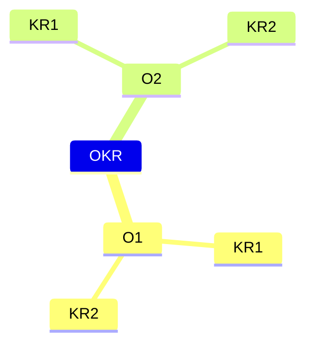

# OKR

> OKR = Objective + Key Results
>         目标        关键结果

对于 O：

1. 方向明确：目标不能太抽象，也不能含混不清，要让每个人都能看得懂
2. 目标对齐：下级要对齐上级的目标，即向上对齐，平级还要相互对齐，即水平对齐
3. 时间限制：目标需要有时间边界，不能遥遥无期，而且时间边界要恰到好处

对于 KR：

1. 有挑战性：关键结果要有挑战性，要做到“跳一跳，就能够得着”
2. 容易度量
3. 不是任务：关键结果需要对目标产生直接影响，它不是日常任务，也不是行动计划

