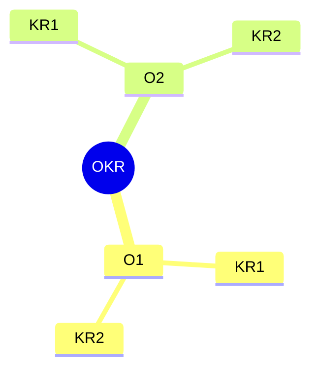

# OKR

> OKR = Objective + Key Results
>         目标        关键结果

对于 O：

1. 方向明确：目标不能太抽象，也不能含混不清，要让每个人都能看得懂
2. 目标对齐：下级要对齐上级的目标，即向上对齐，平级还要相互对齐，即水平对齐
3. 时间限制：目标需要有时间边界，不能遥遥无期，而且时间边界要恰到好处

对于 KR：

1. 支撑目标：需要与 O 直接关联
2. 有挑战性：关键结果要有挑战性，要做到“跳一跳，就能够得着”
3. 容易度量
4. 不是任务：关键结果需要对目标产生直接影响，它不是日常任务，也不是行动计划，KR 是完成一系列任务后才能得到的结果

- 承诺型 OKR： 适合于保证日常工作按计划进行，是必须完成的任务，和日常绩效紧密相关。
- 愿景型 OKR： 更多地激发创新和成长潜力，尽管不强制要求完全达成，但其意义在于推动更高层次的突破和进步

## 执行

1. 定期刷新和同步 OKR：OKR 需要不断更新，包括目标（O）和关键结果（KR）的内容、进度、以及信心指数等。每次更新后，要及时将变更信息同步给相关团队成员，避免信息不对称导致的执行问题
2. 固定的执行周期：OKR 应该定期进行回顾和优化，比如每天更新进度、每周回顾、每月优化、每季复盘，以确保目标的持续推进
3. 与日常工作任务关联：通过任务驱动 KR，KR 驱动 O 的二级驱动关系。这有助于将 OKR 执行融入到日常工作中，提高执行效率

## 评估

1. 自我评估为主：OKR 的评估最好由个人自己完成。这是因为每个人最了解自己的目标设定及其完成情况。评估过程应当体现在自我层面，避免复杂的评分流程和他人打分带来的主观偏差。
2. 简化评分标准：将评分标准简化为四个选项：0（肯定能做到但没做到），0.3（肯定能做到并做到了），0.7（希望能做到并做到了），1.0（不可能做到但做到了）。这种方式使评分更具可操作性，并鼓励个人设置具有挑战性的目标。
3. 避免外部激励：在评估过程中，避免用金钱或其他外部奖励作为激励手段，因为这可能导致员工为了得到奖励而降低目标的挑战性，从而违背了 OKR 激发自我驱动和挑战极限的初衷。
4. 持续优化和复盘：评估后要及时进行复盘，找出评估过程中的问题并加以改进。评估的目的是为了自我提升和找到更好的方法，而不是给自己或他人打分

## 复盘

1. 审视目标：反思当初设定目标的原因，思考目标的达成情况，并明确现实与预期的差距。
2. 回顾过程：分析目标执行的整个过程，分阶段回顾每个重要事件。回顾自己在目标执行过程中的具体经历。
3. 分析得失：分析在本次 OKR 周期中做得好的和不足之处，并探讨原因。
4. 总结规律：思考如果再次执行类似目标，会如何改进。提炼出能够指导未来工作的规律、原则和方法。
