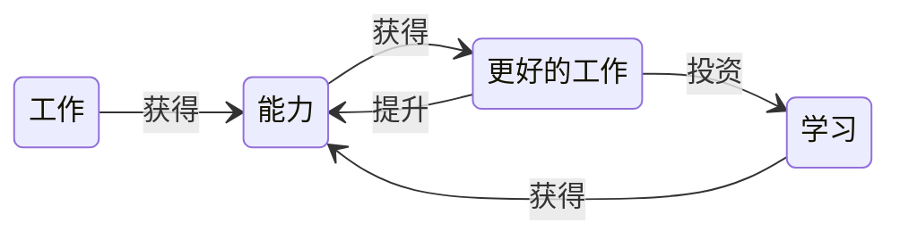

# 个人成长

## 能力

一种能力模型：

能应用越复杂的复杂度，代表能力越高

1. 规模复杂度：事情的规模越大越复杂
2. 时间复杂度：时间跨度越长，变化的因素和可能方向越多，越难判断准确，跨度越长，复杂度越高
3. 环境复杂度：环境不确定性越高，复杂度越高
4. 创新复杂度：理论创新 > 思想创新 > 技巧创新

## 业务

理解业务：

分析功能需求（什么角色在什么时间在什么地方使用什么功能解决什么问题，系统如何处理业务需求）+ 分析质量需求（性能、可靠性、成本、安全性、交付时间、技术平台、合规性、兼容性） + 总结上线效果（业务指标、技术指标）

战略即选择，想做什么，能做什么，要做什么，不做什么

宝洁战略模型：

- 愿景&使命：企业要做的事情的范围和目标
- 定位：决定进军哪类市场
- 策略：使用什么手段赢得竞争
- 能力：是否有能力将策略落地并取得结果
- 组织：决定了企业的各个团队能否协同一致高效的落地策略

## 能力管理

## 目标管理