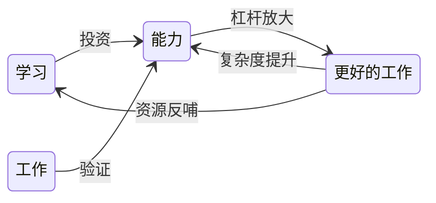

# 个人成长

## 一、总纲定义（第一性原理）

**个人成长的本质**，不是努力程度的线性叠加，也不是技巧数量的堆砌，而是：

> **一个人在不确定环境中，持续投资、验证、升级自身“能力资产”，以获取更大行动自由度和长期回报的过程。**

在这个定义下：

* **能力**是核心资产
* **学习**是投资行为
* **工作**是现金流与验证场
* **战略**是能力资产的配置逻辑
* **目标**是能力投资方向的约束条件

个人成长因此可以被视为一个**长期运行的能力资产运营系统**。

---

## 二、成长系统的基本闭环

个人成长不是线性路径，而是一个持续自强化的反馈系统：

### 闭环解读

* **学习**：以时间、注意力、机会成本换取能力增量
* **工作**：能力的真实压力测试场
* **能力**：可迁移、可复用、可复利的中间资产
* **更好的工作**：更高复杂度、更大不确定性的验证环境

该系统是否健康，取决于：

> 能力是否在每一次循环中，被成功推向更高复杂度层级。

---

## 三、能力的本质：复杂度驾驭能力

### 3.1 能力的统一抽象

**能力不是“会做什么”，而是“能在多大复杂度下稳定地产生结果”。**

因此，能力可以被抽象为：

> **个体对复杂系统的理解、决策与执行能力。**

### 3.2 四维复杂度坐标系

能力提升，表现为对以下复杂度维度的驾驭上限提升：

| 复杂度维度     | 低阶   | 中阶      | 高阶          |
| --------- | ---- | ------- | ----------- |
| **规模复杂度** | 单点任务 | 系统模块    | 跨系统 / 跨组织   |
| **时间复杂度** | 即时反馈 | 月 / 年周期 | 多年演进、不确定路径  |
| **环境复杂度** | 稳定规则 | 半不确定    | 高不确定 / 模糊环境 |
| **创新复杂度** | 技巧应用 | 方法迁移    | 范式 / 理论创新   |

> 能力等级，本质上是一个人在这四个维度上的**联合上限**。

### 3.3 能力跃迁的判据

真正的能力提升，必须满足至少一项：

* 能处理**更大规模**的问题
* 能承受**更长时间**的不确定性
* 能在**更混乱环境**中稳定决策
* 能创造**新方法或新问题定义方式**

否则，只是熟练度提升，而非能力跃迁。

---

## 四、业务：能力的现实映射与验证场

### 4.1 理解业务的三层结构

业务不是“需求列表”，而是能力验证系统，其分析应包含三层：

1. **功能需求**（显性）

   * 什么角色
   * 在什么场景
   * 使用什么功能
   * 解决什么问题

2. **质量需求**（隐性）

   * 性能、可靠性、成本
   * 安全、合规、交付周期
   * 技术平台与演进约束

3. **上线反馈**（结果层）

   * 业务指标
   * 技术指标
   * 组织协作与系统瓶颈

> 业务的价值，不在于完成需求，而在于**暴露能力边界**。

---

## 五、战略：个人能力资产的配置逻辑

### 5.1 战略的本质

> **战略即选择。**

* 想做什么
* 能做什么
* 要做什么
* 坚决不做什么

对个人而言，战略不是宏大叙事，而是：

> **在有限精力下，选择投资哪一类能力复杂度。**

### 5.2 企业战略模型的个人映射

| 企业战略要素  | 个人成长映射         |
| ------- | -------------- |
| 愿景 & 使命 | 长期想解决哪一类问题     |
| 定位      | 在什么环境中具备比较优势   |
| 策略      | 当前阶段优先放大的能力类型  |
| 能力      | 已被反复验证的复杂度驾驭能力 |
| 组织      | 可调动的他人、工具与系统   |

> 一个好的个人战略，允许阶段性失败，但必须持续沉淀能力资产。

---

## 六、能力管理：能力资产的治理系统

能力管理不是口号，而是一套**持续运行的治理机制**。

### 6.1 能力识别

* 我当前在哪些复杂度维度上具备优势？
* 哪些能力已经被多次环境变化验证？

### 6.2 能力投资

* 学习什么、不学什么
* 选什么项目、不选什么机会
* 本质都是能力资产配置决策

### 6.3 能力验证

* 是否在更高复杂度环境中复现成功？
* 是否脱离原场景仍然有效？

### 6.4 能力淘汰

* 哪些能力边际收益持续下降？
* 哪些能力正在被环境结构性淘汰？

> 不淘汰能力，系统必然臃肿。

---

## 七、目标管理：约束方向，而非压榨结果

### 7.1 目标的本质定义

> **目标的唯一价值，是约束能力投资方向。**

* 好目标：指向能力复杂度跃迁
* 坏目标：只消耗能力，不沉淀资产

### 7.2 判断目标好坏的标准

一个目标是否值得追求，应回答：

* 是否推动我进入更高复杂度环境？
* 是否逼迫我发展新的能力维度？
* 即使失败，是否仍然获得能力增量？

若答案是否定的，该目标应被重新设计或放弃。

---

## 八、总结：个人成长的系统视角

个人成长不是自律问题，也不是方法问题，而是一个系统问题。

* 能力是资产
* 学习是投资
* 工作是验证
* 战略是配置
* 目标是方向约束

## 关联内容（自动生成）

- [/个人成长/思维.md](/个人成长/思维.md) 思维方法论是个人成长的基础，提供了认知模型和思考框架，帮助提升复杂度驾驭能力
- [/个人成长/方法论.md](/个人成长/方法论.md) 方法论提供了结构化思维和反馈机制，是个人成长系统运行的具体实践指南
- [/个人成长/学习方法论.md](/个人成长/学习方法论.md) 学习方法论是个人成长的重要组成部分，提供了系统化的知识获取、处理和应用框架
- [/个人成长/职场/职场.md](/个人成长/职场/职场.md) 职场经验是个人成长的重要验证场，提供了能力实践和发展的具体场景
- [/个人成长/职场/职业素养.md](/个人成长/职场/职业素养.md) 职业素养体现了个人成长在专业领域的具体表现，是能力资产的重要组成部分
- [/个人成长/职场/技术管理.md](/个人成长/职场/技术管理.md) 技术管理角色的转变是个人成长路径中的重要节点，涉及从专业能力到领导力的拓展
- [/个人成长/OKR.md](/个人成长/OKR.md) OKR目标管理方法与个人成长的目标管理理念相呼应，提供了目标设定和执行的具体框架
- [/个人成长/复盘.md](/个人成长/复盘.md) 复盘是个人成长系统中的重要反馈机制，帮助验证能力提升效果并指导下一步投资方向

