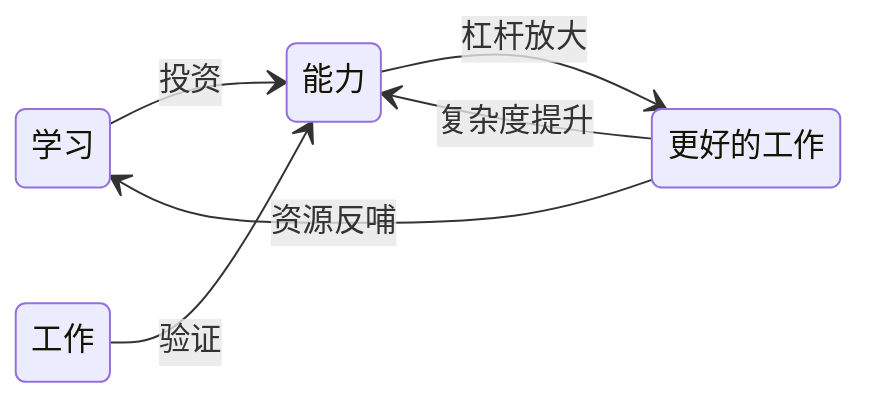

# 个人成长

## 总纲定义（第一性原理）

**个人成长的本质**，不是努力程度的线性叠加，也不是技巧数量的堆砌，而是：

> **一个人在不确定环境中，持续投资、验证、升级自身"能力资产"，以获取更大行动自由度和长期回报的过程。**

在这个定义下：

* **能力**是核心资产
* **学习**是投资行为
* **工作**是现金流与验证场
* **战略**是能力资产的配置逻辑
* **目标**是能力投资方向的约束条件

个人成长因此可以被视为一个**长期运行的能力资产运营系统**。

## 成长系统的基本闭环

个人成长不是线性路径，而是一个持续自强化的反馈系统：

```mermaid
stateDiagram-v2
direction LR
学习 --> 能力: 投资
工作 --> 能力: 验证
能力 --> 更好的工作: 杠杆放大
更好的工作 --> 学习: 资源反哺
更好的工作 --> 能力: 复杂度提升
```

### 闭环解读

* **学习**：以时间、注意力、机会成本换取能力增量
* **工作**：能力的真实压力测试场
* **能力**：可迁移、可复用、可复利的中间资产
* **更好的工作**：更高复杂度、更大不确定性的验证环境

该系统是否健康，取决于：

> 能力是否在每一次循环中，被成功推向更高复杂度层级。更高的复杂度意味着能觉察、理解和处理的事物边界在扩大

## 能力的本质：复杂度驾驭能力

### 能力的统一抽象

**能力不是"会做什么"，而是"能在多大复杂度下稳定地产生结果"。**

因此，能力可以被抽象为：

> **个体对复杂系统的理解、决策与执行能力。**

### 四维复杂度坐标系

能力提升，表现为对以下复杂度维度的驾驭上限提升：

| 复杂度维度     | 低阶   | 中阶      | 高阶          |
| --------- | ---- | ------- | ----------- |
| **规模复杂度** | 单点任务 | 系统模块    | 跨系统 / 跨组织   |
| **时间复杂度** | 即时反馈 | 月 / 年周期 | 多年演进、不确定路径  |
| **环境复杂度** | 稳定规则 | 半不确定    | 高不确定 / 模糊环境 |
| **创新复杂度** | 技巧应用 | 方法迁移    | 范式 / 理论创新   |

规模与时间是空间-时间轴，环境与创新是外部约束-内部创造轴

> 能力等级，本质上是一个人在这四个维度上的**联合上限**。

### 能力跃迁的判据

真正的能力提升，应该是：

* 能处理**更大规模**的问题
* 能承受**更长时间**的不确定性
* 能在**更混乱环境**中稳定决策
* 能创造**新方法或新问题定义方式**

否则，只是熟练度提升，而非能力跃迁。

## 业务：能力的现实映射与验证场

### 理解业务的三层结构

业务不是"需求列表"，而是能力验证系统，其分析应包含三层：

1. **功能需求**（显性）

   * 什么角色
   * 在什么场景
   * 使用什么功能
   * 解决什么问题

2. **质量需求**（隐性）

   * 性能、可靠性、成本
   * 安全、合规、交付周期
   * 技术平台与演进约束

3. **上线反馈**（结果层）

   * 业务指标
   * 技术指标
   * 组织协作与系统瓶颈

> 业务对于个人的价值，在于可以**暴露能力边界**。

## 战略：个人能力资产的配置逻辑

### 战略的本质

> **战略即选择。**

* 想做什么
* 能做什么
* 要做什么
* 坚决不做什么

> **在有限精力下，选择投资哪一类能力复杂度。**

战略的最终目的是扩大生存适应性和自主性，两者互为因果——适应性是前提，自主性是目的，而能力是连接两者的核心资产

- 适应性：不把命运押注在单一系统上
- 自主性："有底气拒绝"的资格

### 企业战略模型的个人映射

| 企业战略要素  | 个人成长映射         |
| ------- | -------------- |
| 愿景 & 使命 | 长期想解决哪一类问题     |
| 定位      | 在什么环境中具备比较优势   |
| 策略      | 当前阶段优先放大的能力类型  |
| 能力      | 已被反复验证的复杂度驾驭能力 |
| 组织      | 可调动的他人、工具与系统   |

> 一个好的个人战略，允许阶段性失败，但必须持续沉淀能力资产。

## 能力管理：能力资产的治理系统

### 能力生命周期：四阶段模型

| 阶段 | 特征 | 管理重点 |
|------|------|---------|
| **构建期** | 快速学习，错误率高 | 刻意练习 + 即时反馈 |
| **成熟期** | 稳定输出，效率高 | 维持 + 寻找新边界 |
| **衰减期** | 边际收益下降 | 判断是否续命 |
| **淘汰期** | 被技术/环境结构性替代 | 果断转移 |

### 能力构建：刻意练习

在能力边缘持续拉伸，而非舒适区内的重复。

核心：**清晰目标 + 即时反馈 + 专注 + 持续突破边界**

### 能力识别：三层筛选

- **已验证的能力**：被业务反复验证，陌生环境下可复现
- **有天赋承接的**：学得快、理解深、有正反馈
- **环境需要的**：行业/技术演进方向上的稀缺能力

三者交集是最优投资区域。

### 能力投资：决策四问

| 问题 | 维度 |
|------|------|
| 能复用到多少场景？ | 复利性 |
| 需求周期有多长？ | 时间窗口 |
| 能撬动多少其他能力？ | 杠杆率 |
| 离开当前环境还能用吗？ | 迁移性 |

### 能力验证：三层验证

- **跨场景验证**：换了环境、换了团队还能输出吗？
- **复杂度提升验证**：更高规模、更高不确定性下稳定吗？
- **去杠杆验证**：没有资源背书时还能站立吗？

### 能力淘汰：判断标准

**信号**：边际收益持续下降 / 被结构性替代 / 与战略路径分离

**时机**：宁可早，不要晚。资源永远是稀缺的。

> 不淘汰能力，系统必然臃肿。

### 能力资产观

能力是资本，不是技能点——有折旧率、需维护、有风险、需要流动性。

## 目标管理：约束方向，而非压榨结果

### 目标的本质定义

> **目标的唯一价值，是约束能力投资方向。**

* 好目标：指向能力复杂度跃迁
* 坏目标：投入资源但不积累增量，在环境变化中相对贬值

### 判断目标好坏的标准

一个目标是否值得追求，应回答：能力边界是否被拓展

若答案是否定的，该目标应被重新设计或放弃。

## 边界与误区

### 认知偏差

- **达克效应**：能力低者无法自知其低，不会主动寻求改变。应对：外部验证优先于自我评估。
- **确认偏误**：选择性收集支持证据。应对：每形成一个判断，追问"什么情况下会失效"。
- **虚假勤奋**：忙事务性工作逃避方向思考。应对：时间分配必须服务于能力跃迁。
- **消费型幻觉**：误以为消费内容等于成长。真相：世界奖励生产者。应对：每个周期必须有可展示产出。

### 边界条件

框架失效前提：环境无真实反馈、复杂度空间不足、缺乏自主决策空间、目标与能力方向相悖。

### 成长陷阱

#### 能力资产层面

| 失败模式 | 机制 | 识别信号 | 应对 |
|---------|------|---------|------|
| **伪跃迁** | 在更熟悉环境中重复任务，熟练度提升但复杂度维度未突破 | 绩效来自环境熟悉度而非能力、换环境后绩效下降 | 用四维复杂度坐标检验：规模/时间/环境/创新是否扩展 |
| **舒适区锁定** | 熵增定律驱使人倾向低能耗状态，重复已掌握任务 | 长时间无不适感、回避挑战、重复做擅长的事 | 主动制造"不舒服"：每季度进入一个不擅长领域 |
| **点状努力** | 各环节缺乏协同，单点突破后系统坍塌 | 某项能力突出但整体效能不彰、无法组合发力 | 用闭环视角审视：学习→能力→工作→更好的工作是否贯通 |

#### 系统运作层面

| 失败模式 | 机制 | 识别信号 | 应对 |
|---------|------|---------|------|
| **恶性循环** | 能力不足→选择受限→验证机会少→能力停滞 | 低复杂度任务堆积、无力承担更高复杂度 | 强制升级：主动承接略超能力边界的任务 |
| **死锁状态** | 能力需要机会验证，但机会需要能力获取 | 等待状态、"等我有经验了再说" | 最小可行性验证：用现有能力的小规模实践替代等待 |
| **反馈失真** | 环境无真实反馈或反馈被扭曲 | 只收到正面评价、无人指出问题 | 主动寻找"镜子人物"、进入更高复杂度环境获取真实信号 |

#### 战略决策层面

| 失败模式 | 机制 | 识别信号 | 应对 |
|---------|------|---------|------|
| **方向性错误** | 在错误方向上持续投入，复杂度维度不升级 | 努力但无进展、重复相同错误 | 每半年用四维复杂度坐标检验：哪个维度在进步？ |
| **资源错配** | 精力/时间/金钱配置与战略目标脱节 | 忙但无产出、感觉被掏空 | 审计时间分配：多少时间用于能力升级 vs 消耗性工作 |
| **目标空心化** | 目标只消耗能力不沉淀资产 | 目标实现但无能力增量 | 用"能力跃迁检验"替代"目标完成检验" |

#### 执行层面

| 失败模式 | 机制 | 识别信号 | 应对 |
|---------|------|---------|------|
| **准备完美主义** | 准备只是恐惧的外衣，延迟行动 | 永远在准备、永不开始 | 设定最小行动单元：先完成再完美 |
| **情绪替代生产** | 被驯化为情绪反应集合，深度思考能力退化 | 遇到问题先有情绪、后有行动 | 建立"情绪-行动"缓冲：情绪来时先问"事实是什么" |
| **认知固化** | 拒绝新观点，陷入已有框架 | 觉得不需要学习新东西、对新事物排斥 | 强制输入：每季度必须学习一个与已有认知冲突的概念 |

#### 高阶失败模式

| 失败模式 | 机制 | 识别信号 | 应对 |
|---------|------|---------|------|
| **系统性崩溃** | 多重失败叠加，系统整体失效 | 多个维度同时出现问题、相互强化负向循环 | 建立底线机制：保住能量系统、认知系统的基础运转 |
| **环境依赖性成功** | 成功依赖特定环境，环境变化后失效 | 换环境后绩效显著下降 | 刻意在不同环境中验证能力、构建可迁移的通用框架 |

> **失败模式的核心洞察**：大多数失败不是"不够努力"，而是"系统设计问题"。点状努力、资源错配、反馈失真相互强化，最终导致系统崩溃。避免失败的关键是识别早期信号并修复系统，而非在单点上加倍努力。

### 反直觉

**方向比效率重要**：在错误的方向上努力，越勤奋坍塌越快。努力必须服务于四维复杂度的某个维度跃迁，否则效率越高离目标越远。

**经验≠能力**：经验是在特定环境中的重复执行，能力是可迁移到更高复杂度环境的通用框架。用过去方法解决新问题，是最常见的伪成长。

**慢变量决定性**：真正的能力积累是缓慢的、渐进的。快速成功大多是幸存者偏差。日复一日的微小正确选择叠加互锁，才能构建系统。

**线性思维是陷阱**：成长从来不是匀速直线运动，而是螺旋式上升、波浪式前进。有时付出很多却无反馈，有时轻微努力就迎来质变。短期内无反馈不等于方向错误。

**信息≠认知**：知识获取不等于认知升级。认知是对知识的重组与迁移，能指导决策的知识才是有效认知。

**知道≠做到**：知道正确的原则，与能够在实际决策中应用，是两回事。知行之间有巨大的执行鸿沟，需要刻意训练才能跨越。

### 验证标准

能力跃迁四问：能处理更大规模？能承受更长周期？在更混乱环境稳定决策？能定义新问题或创造新方法？

自我评估与外部反馈分歧时优先相信外部，寻找敢于指出缺点的镜子人物。

### 元认知审查

判断依赖感觉还是数据？寻找支持证据还是反例？思考"怎么做"还是"做什么"？成长有外部验证标志？时间给生产者还是消费者？哪个维度已很久未进步？

## 关联内容（自动生成）

- [/个人成长/思维.md](/个人成长/思维.md) 思维方法论是个人成长的基础，提供了认知模型和思考框架，帮助提升复杂度驾驭能力
- [/个人成长/学习方法论.md](/个人成长/学习方法论.md) 学习方法论是个人成长的重要组成部分，提供了系统化的知识获取、处理和应用框架
- [/个人成长/职场/职场.md](/个人成长/职场/职场.md) 职场经验是个人成长的重要验证场，提供了能力实践和发展的具体场景
- [/个人成长/职场/职业素养.md](/个人成长/职场/职业素养.md) 职业素养体现了个人成长在专业领域的具体表现，是能力资产的重要组成部分
- [/个人成长/职场/技术管理.md](/个人成长/职场/技术管理.md) 技术管理角色的转变是个人成长路径中的重要节点，涉及从专业能力到领导力的拓展
- [/个人成长/OKR.md](/个人成长/OKR.md) OKR目标管理方法与个人成长的目标管理理念相呼应，提供了目标设定和执行的具体框架
- [/个人成长/复盘.md](/个人成长/复盘.md) 复盘是个人成长系统中的重要反馈机制，帮助验证能力提升效果并指导下一步投资方向
