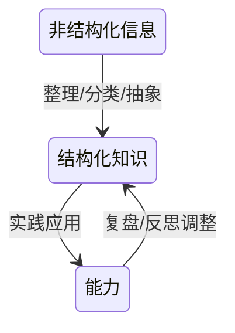
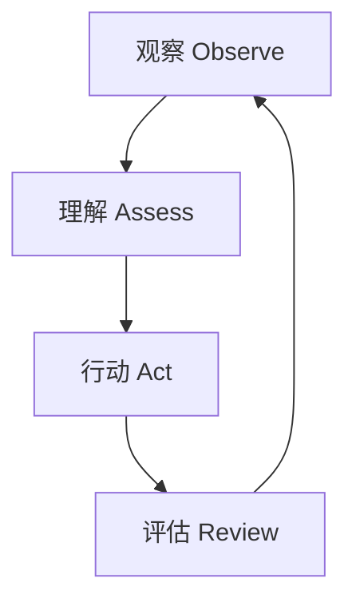

# 学习方法论

学习方法论是一套用于高效获取、整理、内化并应用知识的系统框架，其目标是帮助个体构建可持续运作的学习系统，实现能力的持续提升。
学习不等于信息摄入，而是一个完整的系统：

**目标 → 输入 → 结构化 → 输出应用 → 反馈 → 调整**

这一循环不断运行，通过反馈识别认知与现实的偏差，再通过调整消除偏差，使认知模型逐渐精炼、能力不断增强。

认知模型是"知"的结构化存储，能力是"知"在行动层面的兑现。

## 学习的本质

学习的本质可被压缩为：**学习是通过在神经元间创建和强化连接，将外部信息整合进内部认知模型，以降低生存不确定性的自适应过程。**

信息是认知模型的原材料，信息的价值在于：

* 是否进入模型
* 是否改变对世界的理解
* 是否增强解决问题的能力

更本质地说：

> **人作为学习的主体，学习是一个利用人性 → 超越人性 → 回馈人性的螺旋过程。**

### AI时代的变与不变

学习的基本框架在AI时代并未改变，但人对这一框架的理解、工具、执行方式正在经历根本性重构。

| 维度 | 不变 | 改变 |
|------|------|------|
| **学习目标** | 认知模型构建与精炼 | 问题定义权更稀缺 |
| **学习循环** | 目标→输入→结构→输出→反馈→调整 | 工具智能化 |
| **认知本质** | 外部信息整合进内部模型 | 可借助AI加速，但无法替代 |
| **反馈价值** | 驱动认知优化 | AI反馈≠实践反馈，需保持真实世界验证 |
| **核心能力** | 元认知、结构化、问题解决 | 增加AI策展、批判性思维 |
| **人机关系** | — | 从"人操作工具"到"人机协同系统" |

**核心转变**：
- 知识价值从"拥有"转向"调用效率"
- 人类角色从"知识拥有者"转向"知识策展人"
- 认知边界从"人脑生理限制"扩展到"人机系统边界"

**最终结论**：人的核心竞争力瓶颈从"知识记忆"转向**"认知框架 + 问题定义 + 批判性思维 + 人机协作能力"**。

### 1. 神经生物学基础

学习的物理本质是**突触可塑性**。长时程增强（LTP）使高频激活的突触连接变强，长时程抑制（LTD）使低频激活的变弱。赫布原则：**共同激活的神经元会结成新的联结**。

**核心应用：**
- **间隔重复**优于集中学习——高频触发才能稳定强化
- **必要难度**：提取越费力的记忆，固化越深
- **测试效应**：主动检索比再读更能强化连接
- **交错学习**：不同主题交替学，建立跨域联结
- **睡眠整合**：睡眠期间突触巩固是记忆固化的必要环节

### 2. 进化驱动力

自然选择塑造了大脑的学习机制——好奇心本身就是内在奖励，多巴胺系统对**新信息获取**产生愉悦反应，使探索行为自我强化。

### 3. 认知本质：创建连接

学习的认知本质是**在已有知识间创建新的关联**。学习的本质不是"增加信息"，而是**更新认知模型**。专家与新手的核心差异在于心理表征的精炼程度。

1. **学习不是为了"知道更多"**
   学习=更新认知模型，而非记住新东西。如果新信息没有改变你的认知模型，它是无效输入。真正有效的学习是让认知框架本身发生变化。

2. **存量知识是学习的基础，不是学习的终点**
   已有知识越丰富，建立新关联的可能性越高。学习的效率取决于已有知识的质量和密度——"先验知识"是学习效果最强的预测因子。

3. **专家不是"知道更多"，而是"模型更优"**
   差距不在于信息量，而在于：更深的抽象层级、更丰富的关联、更短的调用路径。同样的信息，新手放进孤立角落，专家融入已有网络。

4. **学习效果的衡量标准变了**
   | 旧标准 | 新标准 |
   |--------|--------|
   | 记住了多少 | 改变了多少认知关联 |
   | 回忆准确率 | 调用效率+解决问题的能力 |
   | 积累知识 | 优化认知模型 |

### 4. 动机燃料

**自我决定理论（Deci & Ryan）**指出三种基本心理需求支撑内在动机：**自主性**（自我选择）、**胜任感**（应对挑战）、**归属感**（被认可）。

**德西效应**警示：过多外部奖励会削弱内在动机。

### 5. 信息论视角

学习是**降低认知熵的过程**。无目标的学习是低效的，因为缺乏明确的"需要降低哪种不确定性"。

### 6. 人性螺旋

利用人性（好奇、省力、即时反馈）
    ↓
产生学习动力
    ↓
通过学习突破舒适区、克服拖延
    ↓
能力提升
    ↓
打开新选择空间 → 新好奇心产生
    ↓
螺旋上升，继续循环


## 总模型（核心框架）

循环：目标 → 输入 → 结构化 → 输出应用 → 反馈 → 调整

1. **目标（Goal）**
   决定学习方向、优先级与深度。
   - 核心概念：**认知模型**——对世界的理解框架，决定判断、决策、学习的效率。目标设定依赖认知模型的当前状态。

2. **输入（Input）**
   从外界获取信息。包括书籍、课程、技术文档、论文、经验、讨论等。
   - 核心概念：**知识输入**——外界信息的摄入，是学习的源头。

3. **结构化处理（Process / Structure）**
   让信息从”外部内容”变成”内部知识”。
   涉及分类、模型化、归纳、抽象、关联化。
   - 核心概念：**知识结构化**——将信息组织成可用结构，提升理解速度与深度。

4. **输出应用（Output / Action）**
   包括动手实践、解决问题、教学、笔记、项目。
   - 核心概念：**输出应用**——在实践中使用知识，实现巩固、验证、深化。

5. **反馈（Feedback）**
   外部反馈（实践结果）、内部反馈（反思、复盘）、同伴反馈。
   - 核心概念：**反馈机制**——获取真实结果与误差，驱动认知优化。

6. **调整（Adjust）**
   通过不断迭代实现螺旋上升。
   - 核心概念：**认知模型精炼**——通过反馈识别偏差，调整认知模型，使其逐渐逼近现实。

```
这轮的目标 = 上轮的反馈 + 调整后的认知
这轮的输入 = 为达成这轮目标而精选的资源
...
```

## 输入模型（通用 + 技术领域）

### 通用学习输入分层模型

按照信息密度、准确性与权威性，可以分为：

| 等级 | 信息密度 | 准确性 | 权威性 | 典型来源 |
|------|---------|--------|--------|---------|
| **一级** | 高 | 高 | 高 | 教科书、标准规范、论文、学术研究 |
| **二级** | 中高 | 中高 | 中高 | 系统课程、专栏、高质量培训 |
| **三级** | 中 | 中 | 中低 | 博客文章、经验分享、行业报告 |
| **四级** | 低 | 低 | 低 | 社交内容、零散信息源、视频（偏入门） |

权威性 → 降低筛选成本
准确性 → 降低认知风险
信息密度 → 最大化时间效率

**原则：越进阶的学习，越依赖更高等级输入。**

## 结构化模型

结构化是学习的关键，因为**非结构化内容无法直接进入认知模型**。

### 知识结构化流程


```mermaid
stateDiagram-v2
  raw: 非结构化信息
  structured: 结构化知识
  integrated: 能力

  raw --> structured: 整理/分类/抽象
  structured --> integrated: 实践应用
  integrated --> structured: 复盘/反思调整
```

- 实践应用：把结构化知识转化为可调用能力，在真实场景中验证认知与现实的吻合度。
- 复盘反思：从实践结果中识别偏差，调整认知模型，使下一次调用更准确。

### 常见结构化方法

结构化方法是对信息进行**组织、归类、抽象、建立关系**的框架，使零散内容转化为可被认知模型接纳的形式。核心特征：信息从无序→有序、孤立→关联、表面→抽象。

| 方法      | 特点           | 适用场景    |
| ------- | ------------ | ------- |
| 脑图      | 树结构          | 入门、梳理框架 |
| 关系图谱    | 图结构          | 展示知识关联  |
| 三层结构法   | 概念 - 原理 - 案例 | 技术理解    |
| 费曼笔记    | 以教促学         | 深度理解    |
| 问题驱动组织法 | 围绕问题组织知识     | 解决实际问题  |

### 深度理解策略

超越"知道"、达到"能用"。本质：**主动检索 > 被动接收**——通过检索（生成）来强化认知连接，而非被动地让信息流过。

#### 费曼学习法

费曼学习法是一种高效的学习策略，通过"以教促学"来深化理解。包含以下步骤：

1. **确立学习目标**：明确要学习的知识点
2. **理解知识**：深入学习相关概念
3. **以教代学**：用简单语言向他人解释所学内容
4. **回顾反思**：识别理解中的漏洞和不足
5. **简化优化**：将复杂概念用最简洁的语言表达

#### 主动回忆（Active Recall）

主动回忆是一种基于认知科学的学习策略，通过主动提取记忆中的信息来加强学习效果，而不是被动地重新阅读材料。与传统的重复阅读相比，主动回忆能显著提高长期记忆效果。

**实践方法**：
- 学习后尝试回忆关键内容
- 使用闪卡进行自测
- 定期进行无提示的知识复述

#### 间隔重复（Spaced Repetition）

基于艾宾浩斯遗忘曲线的科学学习方法，通过在不同时间间隔重复学习内容，以最大化记忆保持率。

**最佳复习时间点**：
- 学习后 24 小时内进行首次复习
- 之后按一定间隔（先快后慢）进行重复
- 根据记忆牢固程度调整间隔时间

**提高效率**：与一次性大量学习后立即复习相比，间隔重复能用更少的时间达到更持久的记忆效果。它避免了过度学习已经熟练的内容，将精力集中在那些即将遗忘或需要加强的知识点上。

### 记忆策略

将信息从短时记忆转入长时记忆，并通过结构化方式使其可检索、可复用。

#### 记忆分类与管理

根据认知科学，记忆按时间可分为：

1. **瞬时记忆**：信息的短暂存储，持续时间约 0.25-2 秒
2. **短时记忆**：信息的临时存储，持续时间约 15-30 秒
3. **长时记忆**：信息的长期存储，理论上可永久保存

#### 记忆巩固策略

1. **联想记忆法**：将新知识与已有知识建立联系
2. **故事记忆法**：将信息编成故事便于记忆
3. **记忆宫殿法**：利用空间位置记忆信息
4. **多感官记忆**：调动视觉、听觉、触觉等多种感官参与记忆

## 输出模型

输出迫使大脑完成从「被动接收」到「主动检索-重组-表达」的转变，是学习真正开始发生的阶段。

### 输出的三种类型

1. **实践应用（Action）**

   * 写代码
   * 做项目
   * 解题
   * 复现实验

2. **知识表达（Expression）**

   * 教别人
   * 写笔记
   * 制作教程
   * 公开演讲

3. **推演验证（Reasoning Test）**

   * 反推实现
   * 构建简化模型
   * 与实际对比验证

规律是：

> **输入越精准，结构化越清晰，输出就越扎实。**

三者的共性：**主动重构**。都要求大脑从记忆库中检索信息，并将其转化为可验证的实体——代码、作品、讲解、模型。检索与重构过程本身才是记忆巩固与理解深化的核心。

## 学习反馈机制

学习中真正重要的是反馈闭环。没有反馈，则无法识别认知与现实的偏差，反馈是认知模型修正的唯一信号源，是学习循环得以螺旋上升的关键

### 通用反馈循环


```mermaid
graph TD
    A[观察 Observe] --> B[理解 Assess]
    B --> C[行动 Act]
    C --> D[评估 Review]
    D --> A
```

简化解释：

* **观察（Observe）**：收集学习表现与难点
* **理解（Assess）**：判断差距与根因
* **行动（Act）**：实施改进策略
* **评估（Review）**：评估结果，进入下一轮

### 反馈质量评估

高质量的反馈应具备以下特征：

- **及时性**：反馈应在学习行为后尽快提供（延迟过久→行动与修正脱节，神经通路连接减弱）
- **具体性**：明确指出具体的行为和结果（模糊评价→大脑无可操作修正信号）
- **建设性**：提供改进的方向和方法（仅指出问题而无方向→制造焦虑而非改进）
- **可操作性**：反馈内容应能指导具体行动（方向正确但无法落地→反馈沦为无效批评）

## 能力体系（三层模型）

学习能力的评判不能只看输入量（读了多少）或存储量（知道多少），必须看**系统能否持续运转**。

| 层次 | 能力角色 | 若缺失 |
|------|---------|-------|
| 认知基础层 | 燃料供给 | 学习无法启动 |
| 结构能力层 | 转化机制 | 信息无法内化 |
| 应用能力层 | 兑现出口 | 学习无法验证闭环 |

三层的关系：认知基础层提供运行条件，结构能力层将信息转化为可调用的认知资产，应用能力层将认知资产兑现为可见成果，并通过反馈反哺基础层。三层并存形成自我强化的循环，使系统具备**自循环能力**。

### 认知基础层

为上层能力提供运行燃料。三者是学习启动的**必要条件**：注意力解决"能否摄入"，认知负荷解决"能否加工"，动机解决"是否愿意学"。任一缺失，学习即无法启动。

#### 注意力管理

注意力是学习的入口，高效的学习需要良好的注意力管理。人的注意力有以下特点：

1. **选择性注意力**：在复杂环境中选择关注特定信息的能力
2. **持续性注意力**：维持注意力在特定任务上的能力
3. **分配性注意力**：同时处理多个任务的能力，但人无法真正并行处理多个任务

**注意力管理策略**：
- 减少流失：去除干扰、噪音、非目标刺激，避免注意力被无效消耗
- 维持集中：时间分块、单一任务、休息调节，保持注意力在目标上的持续性

#### 认知负荷管理

认知负荷是指完成学习任务时对大脑处理能力的需求。有效管理认知负荷能提升学习效率：

1. **内在认知负荷**：由学习内容本身复杂性决定
2. **外在认知负荷**：由学习材料呈现方式造成
3. **相关认知负荷**：用于构建和自动化心理模型

**降低认知负荷的策略**：核心是**将认知负荷控制在工作记忆容量范围内**：
- 降需求：拆分任务、减少干扰、避免并行——降低单次处理的信息量
- 补容量：可视化、图表、模型——将外部存储作为工作记忆的延伸

#### 动机管理

学习的持续性依赖于动机系统的稳定。动机崩溃是学习中断的核心原因。

**自我决定理论**

三种基本心理需求构成内在动机的燃料：

| 需求 | 定义 | 破坏因素 |
|-----|------|---------|
| 自主性 | 自我选择，而非被迫执行 | 过度控制、强制deadline |
| 胜任感 | 能应对挑战，而非无力感 | 过高难度、持续失败 |
| 归属感 | 被认可接纳，而非孤立 | 缺乏社群、比较压力 |

**德西效应**：外部奖励（如金钱、评分）可能挤出内在动机——当任务本身有趣时，额外奖励反而降低持续意愿。

**成就目标理论**

能力观决定动机模式：

- **能力增长观**：能力可发展 → 掌握目标 → 拥抱挑战 → 持久坚持
- **能力实体观**：能力固定 → 表现目标 → 回避失败 → 容易放弃

从"我不够聪明"转向"我还没掌握"，是动机转变的关键。

动机衰减的本质是**期望值管理失败**——初期期望过高，现实无法兑现，动机系统自动收缩。

| 触发点 | 预期 vs 现实 | 核心落差 |
|--------|------------|---------|
| 初期新鲜感消退 | 高期待 → 平淡现实 | 刺激感消失 |
| 难度骤升触发挫败感 | 轻松成功 → 需要挣扎 | 胜任感受到威胁 |
| 缺乏可见进步 | 快速提升 → 进展缓慢 | 胜任感无确认 |
| 过度比较产生焦虑 | 我还行 → 我不如人 | 归属感受到威胁 |
| 疲劳累积未及时恢复 | 持续投入 → 资源耗尽 | 生理基础崩塌 |


**动机维持策略**，本质是让认知系统感知到进展与认可，维持动机所需的"自主、胜任、归属"三元素平衡

- 设定最小行动量（如每天5分钟），降低启动阻力
- 进度可视化，看到积累而非只盯差距
- 主动管理难度：保持在"踮脚够到"区间
- 定期回顾成就，而非只关注未完成
- 建立学习社群，获得归属感支撑

### 结构能力层（核心）

* 抽象能力
* 结构化思维
* 问题拆解
* 模型化能力

### 应用能力层

* 实践转化能力
* 知识表达能力
* 反思复盘能力

## 学习治理系统

学习治理是对学习系统的运维管理，确保高效方法论在执行层面不会逐渐失效——不治理，再好的方法也会在资源竞争、噪音干扰、知识腐烂中崩溃。

治理缺失的后果：

| 治理缺失 | 后果 |
|---------|------|
| 无时间治理 | 学习时间被挤压，记忆巩固被跳过，循环断裂 |
| 无环境治理 | 干扰消耗注意力，深度学习无法发生 |
| 无内容治理 | 知识腐烂、过时、冗余，认知模型被污染 |
| 无风险治理 | 信息焦虑、过度输入、学习疲劳累积 |
| 无效果治理 | 学了无输出，输出无反馈，反馈无调整 |

### 时间治理

时间治理的本质是**将有限时间资源按认知规律分配，最大化学习效率**。

* 依据记忆规律安排复习（趁记忆未消退时巩固，时间节点匹配认知规律）
* 给不同层级输入分配权重（时间按价值密度分配，高价值内容配更多时间）
* 设定专注时间段（时间块匹配注意力周期，7-10分钟一个专注单位）
* 合理安排学习与休息节奏（时间穿插恢复，防止认知资源耗尽）

核心：**让每段时间都匹配其最佳用途**，在认知负荷最低时处理简单内容，在精力最充沛时处理核心挑战。

### 环境治理

环境治理的本质是**防止注意力被环境因素无效消耗**。

两者共同目标：**让注意力保持在学习目标上，而非被环境牵引走**。物理环境解决"身体舒适度"，数字环境解决"信息清洁度"——都是消除"被干扰"的可能性。

#### 物理环境
* **学习空间**：创造专门的学习空间，减少干扰因素
* **工具准备**：准备好学习所需的工具和材料
* **舒适度**：确保光线、温度、座椅等符合人体工学

#### 数字环境
* **信息过滤**：使用工具过滤无关信息，减少信息噪音
* **专注模式**：设置设备专注模式，关闭非必要通知
* **知识管理工具**：使用笔记、脑图等工具辅助学习

### 内容治理

内容治理的本质是**确保已有的知识资产始终可信、可用、与现实同步**。

* 定期清除过期知识（防止知识腐烂导致认知模型被错误信息污染）
* 维护知识体系的结构完整性（防止体系碎片化导致知识无法被有效调用）
* 建立知识分类和标签体系（防止知识混沌导致信息检索效率归零）
* 定期更新和迭代已有知识（防止知识陈旧导致认知与现实脱节）

### 风险治理

风险治理的本质是**保护学习系统不被内外部风险因素击穿，维持系统的存活性**。

* 避免错误知识（防范输入层污染，防止认知模型建立于错误前提上）
* 避免偏差认知（防范处理层失效，防止判断系统性偏离现实）
* 管控过度输入（防范资源耗尽，防止信息焦虑和决策瘫痪）
* 防止学习疲劳（防范系统关闭，防止动机归零和循环终止）

### 效果治理

效果治理的本质是**验证学习系统是否产出真实成果，确保学习循环完整闭合**。

* 建立输出机制（确保学习有可检验的产出，而非学了无输出）
* 定期进行学习评估（识别学习效果与预期的差距）
* 设定可衡量的学习目标（为效果验证提供基准）
* 跟踪学习进度和效果（持续监控，避免学了却不知道效果如何）

## 反模式（易踩坑）

* 只输入不输出
* 不做结构化处理
* 没目标，纯刷内容
* 没有反馈机制
* 工具依赖或形式主义
* 情绪波动影响学习连续性
* 工具堆砌而不持续使用

**为什么是反模式**：因为它们违反了学习方法论的核心原则：学习是循环，不是线性的输入积累。任一环节断裂，循环即失效

## AI时代的特有风险：思考外包

AI带来的核心风险是**"旁观者效应"**——用户不再参与思考过程，将认知责任外包给AI。

### 典型症状

| 风险 | 表现 |
|------|------|
| **旁观者效应** | 面对问题时等待AI给答案，不参与思考 |
| **AI脑雾** | 跳过思考直接获得答案后反而感到困惑 |
| **神经弱化** | 长期依赖AI导致独立问题解决能力下降 |

### 应对策略

| 策略 | 具体做法 | 原理 |
|------|---------|------|
| **AI缓冲区** | 先独立思考，再使用AI | 保护认知参与 |
| **对抗生成** | 让AI反驳自己的结论 | 激活批判性思维 |
| **验证机制** | 所有AI结论必须交叉核实 | 防止AI幻觉 |
| **人类主导** | AI只做低层任务，综合判断由人 | 保持认知主体性 |

认知主体性不能被出让——AI可以加速、执行、辅助，但判断、综合、决策必须由人完成。否则人机协作变成人被机牵引，学习系统名存实亡。

### AI时代的结构化工具

| 方法 | 核心理念 | AI增强潜力 | 适用场景 |
|------|---------|-----------|---------|
| **Zettelkasten** | 原子化+双向链接 | 高（自动连接发现） | 长期思想生成 |
| **PARA** | 项目-领域-资源-归档 | 中 | 职场专业环境 |
| **常青笔记** | 持续演化概念体系 | 中 | 构建深度知识 |

## 元认知与学习策略

元认知是学习系统的自省机制，没有它，学习循环无法自我优化。

### 元认知能力

元认知是指对认知的认知，即对自己思考过程的觉察和调控能力。在学习中，元认知能力体现在：

1. **计划策略**：学习前对学习任务的分析和规划

   现实实践：设置学习目标、浏览阅读材料、产生待回答的问题、分析完成学习任务的方法

2. **监控策略**：学习过程中对理解程度的自我监控

   现实实践：自我提问、阅读时跟踪注意力、考试时监视速度和时间、匹配度检查

3. **调节策略**：根据监控结果调整学习方法和策略

   现实实践：补救措施、修正错误、总结经验教训、调整学习路径、时间再分配

三者构成元认知的完整控制闭环，对应学习过程的三个关键时点：

| 时点 | 策略 | 功能 |
|------|------|------|
| 学习前 | 计划策略 | 确定方向与路径，避免无目标行动 |
| 学习中 | 监控策略 | 实时追踪理解程度，识别卡点 |
| 识别偏差后 | 调节策略 | 调整方法或路径，修补漏洞 |

### AI时代的元学习能力

**元学习（Meta-Learning）** = "学习如何学习"，是AI时代最重要的核心能力。

| 能力 | 定义 | AI时代价值 |
|------|------|-----------|
| **元认知** | 对思考过程的监控与调节 | 防止"思考外包"，保持认知主体性 |
| **元情感** | 对学习情绪的管理 | 人机交互引入了新的情绪变量（被替代感、依赖感、比较压力） |
| **适应能力** | 快速获取新领域知识 | 跟上技术迭代节奏 |
| **问题定义** | 精准提问、辨别真伪 | 人机协作的核心接口 |

## 关联内容

- [/个人成长/复盘.md](/个人成长/复盘.md) 复盘是学习方法论中**反馈机制的具体实践**，CLAP等复盘模型实现了"反馈→认知修正→调整"的闭环，与总模型中的反馈调整环节直接对应
- [/个人成长/思维.md](/个人成长/思维.md) 元认知能力是学习方法论的底层支撑，思维方法论第一层（元认知层）提供抽象、第一性原理、模型思维等工具，支撑认知模型的构建与精炼
- [/个人成长/OKR.md](/个人成长/OKR.md) 学习目标的设定与管理可参考OKR方法，两者都强调目标导向和持续反馈，OKR的"O→KR→任务"结构与学习总模型的目标→输入→结构→输出→反馈→调整循环存在映射关系
- [/个人成长/个人成长.md](/个人成长/个人成长.md) 学习方法论是个人成长的重要组成部分，为个人持续提升提供系统框架
- [/软件工程/架构/架构思维.md](/软件工程/架构/架构思维.md) 认知模型的构建与架构思维中的系统性思维、分治思维存在深层联系——两者都追求从具体问题中抽象出稳定结构，学习的结构化处理与架构设计的信息组织逻辑同构
- [/软件工程/软件工程.md](/软件工程/软件工程.md) 工程方法论与学习方法论在循环结构上同构：目标设定→执行→验证→反馈→调整，工程中的PDCA循环与学习中的总模型循环本质相同

