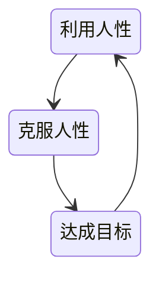
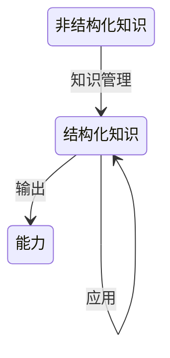
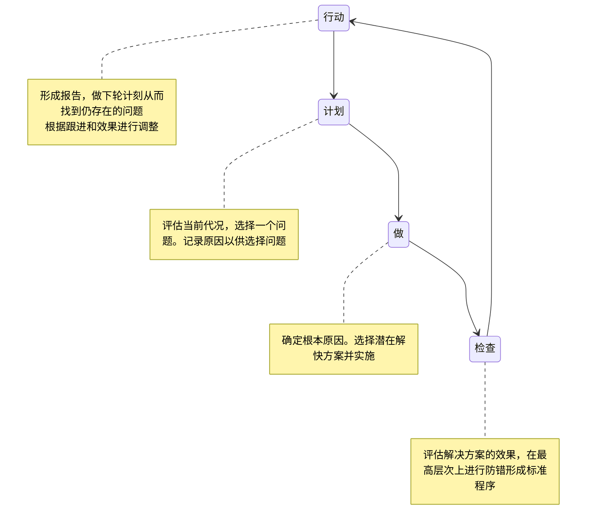

# 学习方法论

## 输入

### 文档/书籍

- 博客/公众号
- 框架使用图书
- 语言核心图书
- 框架源码文档
- 语言规范、语言源码
- 计算机专业基础

越往底层信息密度越大，准确性越高，参考价值越大

### 视频

视频对初学者来说帮助挺大的。

但到了一些阶段，视频讲解速度对于有基础的人来说过慢，而且进阶的免费视频也较少

到这个时候，看视频就不能再只关注视频本身的知识点，而是多关注诸如作者的编码，作者的思想等内容

### 源码

以思考为主，从设计者的角度来读源码

#### 目的

读源码之前要确定目的，不然就是走马观花，没有收获

#### 思路

- 从设计者的角度来读源码
- 先整体后局部
- 先手册后源码
  - 如果连使用都不会就直接去学习源码，是一种非常不理智的行为
- 由易到难
- 带着问题读源码
  - 了解项目的背景，项目的功能
  - 写代码时遇到问题进行读源码
  - 看issue
  - 看错误堆栈信息
- 通过源码的单测来学习
- 通过demo

#### 技巧

- 自己实现一个简易版的框架，跟着问题去探索源码
- 寻找源码的入口
- 阅读时重视变量、函数的命名
- 阅读时参考源码里的注释
- 关注类层次结构

### 专栏

专栏相对于博客公众号的好处在于知识的系统性较强

### 公众号/博客

选择公众号或者博客需要注意甄别，抱着怀疑的态度

### 线下大会

这种大会一般不会涉及到太过技术细节的内容，通过在这种大会上，可以去了解对于一些新技术，大公司们是怎么落地的，以及大公司们遇到的一些技术挑战及他们现在的系统架构，对于开拓眼界，还是挺有帮助的

## 知识管理

### 脑图

一种树形结构图，可以层层深入，不断递归，能以结构化的方式从整体到部分表达知识

### 知识关系图

一种图数据结构，重点表示不同知识点之间的关联

### 根据遗忘曲线复习

除了根据知识的最后更新时间，要定时复习知识外

还要即使淘汰掉过期的知识

## 输出

一昧的输入，时间久了，没有输出只会造成知识不断衰减

输出是巩固记忆、形成体系的一种手段

### 推演验证

根据文档、使用体验来反推实现方式，然后与实际实现作对比

### 教

费曼学习法，以教促学

### PDAC循环

很多人学习时更喜欢做更多试卷给自己带来的虚假成就感，而不是珍惜错题给自己带来的价值

