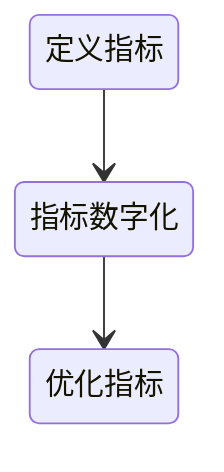

---
tags: ['思维', '认知', '个人成长']
---

# 思维

## 基础思维

### 抽象思维

抽象的过程就是通过归纳概括、分析综合来寻找共性、提炼相关概念的过程

- 抽象的概念只有通用语言才能表达出来
- 抽象具有层次性，抽象层次越高，内涵越小，外延越大，扩展性越好；反之，抽象层次越低，内涵越大，外延越小，扩展性越差，但语义表达能力越强
- 抽象层次要保持一致性，一致性可以减少混乱和降低理解成本
- 提升抽象能力的练习：阅读、总结、命名、建模

### 逻辑思维

逻辑三要素：

1. 概念：人类通过思维所赋予的事物含义，语言是概念的外显形式
2. 判断：一个判断就是真或假，判断是概念的展开，没有判断，就不能揭示和说明概念。同时，判断也是推理的前提，是正确运用各种推理的必要条件
3. 推理
   1. 演绎推理：旨在阐明前提和结论之间的关系。因为人会死，苏格拉底是人，所以苏格拉底会死。
   2. 归纳推理：以一类事物中的若干个别对象的具体知识为前提，得出有关该类事物的普遍性知识的结论的过程。猫 A 喜欢吃鱼，猫 B 喜欢吃鱼，猫 C 喜欢吃鱼，所以猫喜欢吃鱼。
   3. 溯因推理：先知道答案，再去追溯原因。即大胆假设，小心求证。

逻辑链：

- 5 Why 思考法：对一个问题连续多次追问为什么，直到找出问题的根本原因
- 5 So 思考法：对一个现象连续追问其产生的结果，以探求它对未来可能造成的深远影响

逻辑谬误：

1. 偷换概念：当看到一个关键词在论证中不止一次地出现时，就要注意其意义有没有发生改变，如果意思发生改变，那么要警惕偷换概念的谬误
2. 错误假设：在逻辑推理或论证过程中，基于一个不正确或未经验证的前提来得出结论。这种谬论会导致推理结果不可靠，甚至完全错误
3. 循环论证：指一个结论会自己证明自己。如“世上没有什么是绝对的这句话本身就会绝对“
4. 滑坡谬误：指不合理地使用一串因果关系。一个起因A引发多米诺效应，带来一系列负面事情。A并不是很糟糕，但是A导致B，B导致C，C导致D，D简直糟糕透顶。滑坡谬误没有逻辑链中严谨的论证过程

### 结构化思维

金字塔结构：

- 纵向关系：上一层思想是对其下一层思想的概括，下一层是对上一层的解释和支持
  - 自上而下：结论先行，通过演绎推理从结论推至原因
  - 自下而上：通过归纳推理，由下往上归纳，得出一般性的结论
  - 上下结合：事物的发展总是螺旋上升的，自上而下可以为自下而上服务，自下而上也可以为自上而下服务
- 横向关系：每组中的思想必须属于同一逻辑范畴，并按照逻辑顺序组织，可以通过时间、空间、重要程度等来描述事物与事物之间的演进或者逻辑关系
  - 归类分组
  - 逻辑递进

### 批判思维

### 维度思维

当面对多个维度，多个维度都可能影响最终结果时，有一种称之为分析矩阵的方式，能清晰列出维度之间组合的可能，让隐性的思维显性化

| Recency (最近消费) | Frequency (消费频率) | Monetary (消费金额) | 客户类型       | 营销策略                         |
|--------------------|----------------------|----------------------|----------------|----------------------------------|
| 高                 | 高                   | 高                   | 忠实客户       | 加强关系，提供专属折扣和奖励     |
| 高                 | 高                   | 低                   | 潜在忠实客户   | 提升消费金额，推荐高附加值商品   |
| 高                 | 低                   | 高                   | 可能流失客户   | 召回策略，提供折扣或优惠券       |

### 分类思维

分类是指将有共性的事物放在一起，共性主要体现在对象的属性上

寻找事物的共同属性：

1. 特有属性和共有属性：对象的特有属性是指为一类对象所独有而其他类对象所不具有的属性
2. 本质属性和非本质属性：本质属性是决定某个事物之所以成为该事物而区别于其他事物的属性

分类的方法：

1. 古典分类：所有具有某一个或某一组共同属性的实体构成了一个分类，而这个属性对于定义这个分类是必要且充分的
2. 概念聚集分类：先定义一个概念，再围绕这个概念给事物分类

### 分治思维


核心原则：
- 分而治之（Divide and Conquer）
- 各部分独立
- 汇总时保持一致性

### 简单思维

简化是一个熵减的过程，一些简化的手段：

1. 压缩、隐藏与赋予：隐藏复杂可以让用户管理自身的期望，因此需要通过强制性手段把复杂隐藏起来
2. 减少选择
3. 奥卡姆剃刀原理

### 成长型思维

固定型思维关注结果，成长型思维关注过程与可塑性。

相信能力可通过努力与反馈提升；

从错误中学习，而非惧怕失败；

用“尚未完成”取代“我不会”。

> “失败不是终点，而是学习的输入。”

## 专业思维

### 解耦思维

让一个系统中的各个部分之间正交的关键性在于解耦，解耦的关键在于：

1. 抽象
2. 中间层
3. 高内聚、低耦合

### 契约思维

契约是连接双方的约束与信任机制。

明确权责边界：输入、输出、约束条件；

通过协议实现可验证的信任；

稳定契约、可演化实现。

> 在系统设计中，API 是契约；在团队协作中，OKR 也是契约。

### 模型思维

简单来说，模型就是对客观世界的简化抽象，运用思维模型来将现实世界的客观事物转化为模型就是建模的过程，一些常见的模型：

1. 物理模型：根据相似性理论制造的按原系统比例缩小（也可以是放大或与原系统尺寸一样）的实物
2. 数学模型：用数学语言描述的一类模型，可以是一个或一组代数方程、微分方程、差分方程、积分方程或统计学方程，也可以是某种适当的组合数学模型。这些方程可以定量或定性地描述系统各变量之间的相互关系或因果关系
3. 概念模型：将现实世界抽象为信息世界，把现实世界中的客观对象抽象为某一种信息结构，这种信息结构并不依赖于具体的计算机系统

模型会随着对客观世界的理解而发生变化

### 工具化思维

- 自动化：重复劳动工具化
- 可视化：让抽象显性化
- 模板化：沉淀经验复用

### 量化思维

> 能测量的才能改进。



- 指标的核心是“可比较”
- 数据需具备可复现性与上下文

### 数据思维

> 用事实驱动判断，用数据验证假设。

- 观察数据（What happened?）
- 解释原因（Why happened?）
- 预测未来（What will happen?）
- 优化决策（What should we do?）

数据 ≠ 真相

### 产品思维

核心逻辑：

- 价值发现：谁有痛点？
- 价值创造：提供解决方案；
- 价值验证：用数据和反馈评估效果；
- 价值迭代：持续改进。

### 系统性思维

> 系统性思维是看清“部分与整体、结构与动态”的思维方式。

核心观点：

* **整体性**：系统不是部件的相加，而是部件间关系的网络；
* **动态性**：关注时间维度上的反馈、延迟与演化；
* **关联性**：问题往往是结构性原因，而非孤立事件；
* **反馈回路**：正反馈放大变化，负反馈维持稳定。

常用方法：

1. **因果环图（Causal Loop Diagram）**：展示因果关系与循环；
2. **冰山模型（Iceberg Model）**：

   ```
   事件（表层）
   模式（规律）
   结构（机制）
   心智（认知）
   ```

   —— 真正决定系统行为的是最底层的“心智模型”。

> 系统性思维能让人从“修补问题”转向“重构系统”。

### 战略性思维

> 战略性思维是“看见长期结构、在不确定中创造确定”的能力。

关键特征：

1. **目标导向**：明确长期愿景与核心目标；
2. **路径规划**：识别阶段性目标与关键杠杆；
3. **资源配置**：在有限资源下做出最大化选择；
4. **动态调整**：在环境变化中保持方向稳定；
5. **延迟满足**：放弃短期收益，追求复利增长。

思维模型：

* **OODA 回路（Observe-Orient-Decide-Act）**：快速观察、判断、行动、迭代；
* **杠杆点思维**：找出系统中能以最小代价撬动最大变化的关键点；
* **反脆弱原则**：利用波动与不确定性获得长期优势。

> 战略性思维的本质，是在复杂与不确定的世界中，构建“可持续的优势结构”。
