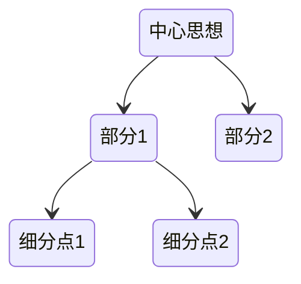
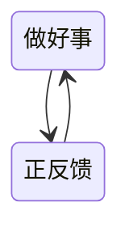
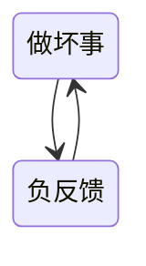

# 方法论

## 结构化思维

在表达、写作时，一种常见的思维结构：

```mermaid
stateDiagram-v2
  中心思想 --> 部分1
  中心思想 --> 部分2
  部分1 --> 细分点1
  部分1 --> 细分点2
```

## 反馈飞轮

人的行为都是有动机或者是被反馈所驱动的

- 正反馈

```mermaid
stateDiagram-v2
  做好事 --> 正反馈
  正反馈 --> 做好事
```

- 负反馈

```mermaid
stateDiagram-v2
  做坏事 --> 负反馈
  负反馈 --> 做坏事
```

## 主次矛盾

能影响一个系统中的因素，一般都是极为少数，称之为主要矛盾。这也被称之为二八定律

分析问题时，应该去找主要矛盾，从第一性原理出发，不要被次要矛盾所迷惑

## 第一性原理

## 奥卡姆剃刀

