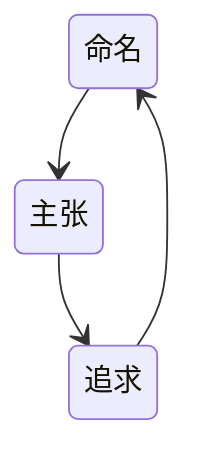

# 技术管理

管理是技术人的必经之路？

做管理的内在动力与真正诉求：

- 认同管理的价值
- 对管理充满热情，并享受这些工作
- 看重在管理方面的成长

## 角色认知

管理隐喻：

- 带兵打仗
- 指导球队比赛
- 指挥乐队演奏

管理做什么：带人、做事、看方向

维度   | 工程师              | 管理者
---- | ---------------- | -----------------
职责使命 | 拉好车-做好自己手头的工作就无咎 | 驾好车-引领整个团队往前走
负责对象 | 对自己负责，"管好自己就可以了" | 对公司(上级)和团队(下级)都负责
关注焦点 | 过程导向:脚下的路        | 目标和结果导向:是否达成目标
工作内容 | 内容单纯,主要靠专业能力     | 多维立体,所需能力维度大幅增加
任务来源 | 上级安排             | 自己主动规划&向上沟通
实施手段 | 主要靠自己            | 主要靠团队
合作维度 | 平级合作为主,维度单一      | 360度合作,维度立体
合作关系 | 和团队成员是平级竞合关系     | 和团队成员是全面合作关系
思维方式 | 执行思维,习惯关注确定性风险   | 规划思维,习惯关注可能性收益
技术视角 | 技术实施视角           | 技术评估视角

从研发到管理，从关注事到关注人过程的转变，通过培养人来做成事

## 领导力

影响他人的能力

- 技术上的广度或深度
- 对于业务领域极深的理解
- 管理资源、统筹规划

领导力的高低层次模型：

- 5巅峰:时代楷模
- 4立人:跟着你能提升个人综合能力
- 3生产:跟着你能出成绩
- 2认同:认同你的观点
- 1职位:不得不听你的

层次最低的领导力或者叫做经理权，你是拥有拍板做决定的权力的，这种权利每用一次就是一次消耗，说白了就是独裁，除非万不得已，没有时间做民主决定时，才行驶这个拍板的权力

## 技术判断力

不写代码并非放弃了技术，尝试学会从更高的视角看待技术，尝试从使用代码解决问题到使用人来解决问题

- 结果评估：以始为终，从哪几个维度去衡量结果，从哪几个技术指标去验收成果
- 可行性评估：能不能做、值不值得做
- 风险评估：考虑技术方案带来最大损失的可能性和边界

学技术并非一定要亲身亲为，借助别人的力量：

1. 建立技术学习机制，让团队对各个方向的技术保持敏感，要求定期做交流和分享
2. 求项目负责人对专项技术并汇报
3. 与大牛交流
4. 听取工作汇报

## 技术决策

做出一项技术决策，最主要的当然就是为了实现业务价值，在风险可用的范围内，使用有助于提升团队成员个人市场竞争力的技术，也就是什么热门，什么新潮用什么，这点似乎跟我之前受过的一项简单技术也能做到极致的说道抵触，实际上如果一项技术的实施，不能帮助个人提升自己的价值，他们的执行积极性就不会很高，同时只有热门新潮的技术才可以吸引到优秀的人才

## 风格

1. 指令式管理：关注目标和结果，发号施令但不亲力亲为
2. 支持式管理：带头冲锋亲力亲为，替团队成员分担工作
3. 教练式管理：关注全局和方向，在做事上给予教练式辅导和启发
4. 授权式管理：关注目标和结果，不关心过程和人员发展

## 管理规划

### 职能：干什么

- 基本的职责：下限
- 升华的使命：上限

职能发现：

1. 收集信息：向上向下沟通由上级直接给定，探讨大家对业务的看法，加上自己的理解
2. 提炼升华：以始为终，基于结果的职责使命，传递衡量维度，让大家明确什么是最重要的
3. 确认主张

### 目标：想要什么

- Specific:目标是明确具体的吗?
- Measurable:目标的实现是否可测?
- Attainable:目标描述是可达的吗?
- Relevant:目标和总目标是否相关?
- Time-bound:目标是否是有时间限制的?

目标的描述形式：

- KPI：到某时间点，什么指标达到什么数字
- KRA/OKR：到某时间点，完成什么工作，该工作实现了哪些功能或达到了哪些效果

业务目标来自外部要求相对应，专业目标来自团队的内在要求，内在的专业目标属于重要的事情，而外部压过来的业务目标，属于紧急的事情

专业目标参考来源：

1. 紧急业务交付遗留的技术债务处理 
2. 重大技术难题公关项目 
3. 未来半年到一年的新技术储备 
4. 历史经验教训的总结和分享

### 团队：靠谁

视角1：根据团队目标的设定去梳理团队，团队的规模、团队内部成员的分工、团队人才梯队

视角2：成本意识，考虑投入的资源和成本是否值得，是否合理

视角3：培养人才梯队，鉴于团队现实的梯队情况和新人导师的精力问题，一个团队能够良性吸纳的新人是有限的，称为团队消化力

### 资源：投入什么

- 人力：招聘作为一种迟缓的解决问题的手段，更多地是看长线是否需要，因为一件急事紧急招人是不明智的
- 时间：预算多少人和预算多少时间是分不开的
- 信息
- 权限

## 团队建设

### 个体

- 能力培养与激励

注重个体能力的丰富性，不同的人能力是有差异性的，成员之间优势互补，推拉结合，逼着他们、给他们引导，放手让他们自主学习

直接给答案还是指引：对于小白来说，没有任何经验，当然是直接给答案，当对方已经有一定的积累和经验后，就可以让他自己去探求解决方案了，要通过正确的问题去引导他们进行深入思考

物质上的激励：奖金、晋升、罚款（反向激励），追责的意义在于做好善后，反复问为什么，从根本上发现问题，以后如何避免，但不是惩罚，才能建立一个不断反思、不断学习、不断进步的良性循环

更高程度的激励：给员工一定程度的自主掌控感，让员工持续有成长，赋予其使命与意义，作为管理者，应该持续思考如何能让员工成长：

1. 挖掘潜力，在实战中积累经验
2. 改善周围环境，更有机会发挥长处，给员工提供专注的方向，哪里缺人就往哪里调真的很烦人
3. 帮助他认识和改进错误
4. 逐步提升难度，增强其信心
5. ...

激励体系搭建于平时，不要指望临时性方案能做好激励，每个团队不同，所以要根据自己团队特质来设计激励体系

裁员的目标：

1. 要提升组织的整体效率
2. 对于被裁的员工，也许是一件好事

裁员准备：

1. 提前传达绩效差的信息
2. 评估：被裁的人手上负责的事，要怎么处理烂摊子
3. 谈赔偿！谈赔偿！谈赔偿！

### 个体间

- 分工与协作

分工的目的：规模化、协作和专精

分工边界不清晰无法让员工清楚和认同自己的本职职责，产生归属感，并愿意主动付出多做一些，至于分工的稳定性一般取决于外部环境，也有一些主动求变的做法，进行轮岗，以提升能力与全局观

凝聚力 = 共同愿景 + 归属感 + 相互了解

### 团队

- 梯队与文化

核心人物的培养：

1. 一致：与团队、与业务、与文化是否匹配
2. 互补：和自己、已有人员的风格，思维方式互补

培养方式：

1. 建立个人发展计划
2. 提供机会和发展空间，提供授权
3. 周期性沟通、重复审视，建立反馈机制

文化能带来什么？

打造自己的文化：



谈绩效：只是绩效管理的一环，告知绩效不仅是一种评判，也是一种辅导和支持，告知的同时，也是承上启下的新起点

团建如果没有目的，增加员工的负担，只会起反作用，成功的团建活动背后都是精心设计，不过能借团建的接口吃喝玩乐也挺好

## 任务执行

事前分清优先级，事中有效执行，事后总结复盘

- 横轴：损失（从小到大）
- 纵轴：收益（从小到大）

```mermaid
                ↑ 收益（重要）
                │
                │
     ┌──────────┬──────────┐
     │ 做：收益很大        │ 做：收益很大        │
     │ 不做：损失不大      │ 不做：损失很大      │
     │                    │                    │
收益大 │   【高收益 × 低紧急】   │   【高收益 × 高紧急】   │
     └──────────┼──────────┘
     │ 做：收益不大        │ 做：收益不大        │
     │ 不做：损失不大      │ 不做：损失很大      │
     │                    │                    │
收益小 │   【低收益 × 低紧急】   │   【低收益 × 高紧急】   │
     └──────────┴──────────┘
                │
                └────────────→ 损失（紧急）

```

1. 目标清晰到可以执行
2. 责任明确，有人对整个项目结果负责
3. 机制健全，靠机制推进，不能完全依赖人的主动性
4. 沟通，共识传递及进展通报

安心地让员工分担工作：

1. 靠梯队：有人完全能胜任
2. 靠流程：沉淀成熟工作经验，建立必要卡点，间歇性检查工作成果，流程有很好的迁移性和传承性，可以保证做事的下限

### 任务分配

建立信任，重要的任务分配给信任度高的人

对于初期还未建立信任关系的双方，可以从其历史表现洞悉其能力、执行力，在分配任务上也要注意因人而异，有些人天生适合干一些开拓性的工作，而有人更适合循规蹈矩地做一些业务开发，最后可以从其负责的模块的后期维护意愿看出其能否承担重要任务

下级对你的信任，就是你的一种天生领导力

### 管理粒度

除了上面提到的因人而异，不同人要管理的粒度不同，有人需要定时跟进，有人可以完全放手，也可以根据事情的优先级选择不同的粒度，低优先级的事就可以放手，在跟进的过程中，起步要确保目标的传达，多给指导，在过程中进行必要的主动询问保持跟进，遇到难点可以给出建议进行交流

## 沟通

目的：信息同步、表达情感、输出影响

沟通工具：3F（FACT事实、FEELING感受、FOCUS意图）

### 情绪化沟通

情绪有两面性，想要跳出到情绪之外，需要建立觉察，并强化这个觉察，让我们越来越容易从情绪中抽离出来

### 向上沟通

管理者默认是需要主动向上级沟通和反馈，根据事务特点（紧急、敏感）确定沟通的方式和频次

对于默契度很高的上级，能有效降低沟通成本，并且有效降低沟通的噪音

想要影响上级，沟通技巧是一方面，更重要的是个人的影响力，给出论据，反馈问题的同时给出解决方案

### 横向沟通

- 对于没有汇报关系的合作者之间的沟通

这种沟通更多的，需要依靠非职权影响力：

1. 人品
2. 历史表现：去承诺，然后去兑现承诺，即承诺一致性
3. 能力：权威度，逻辑性
4. 情绪：情绪可以影响其他人
5. 互惠：满足对方，提供帮助也能提升影响力，这点可以回答大部分这样做对我们有什么好处的问题

### 向下沟通

要明确沟通的目的，有些看似是沟通的问题，沟通并无法解决，明确目的后，完全可以采取其他方式去解决
