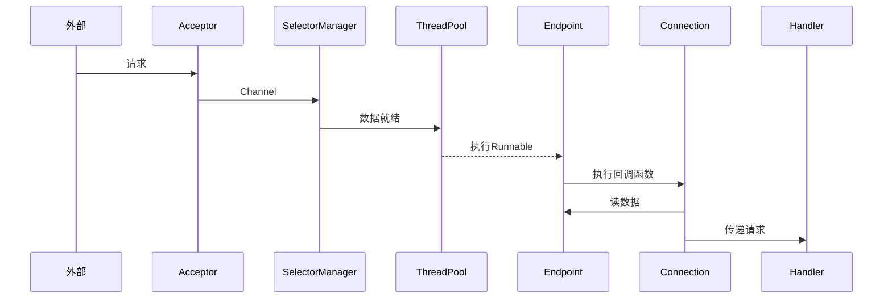
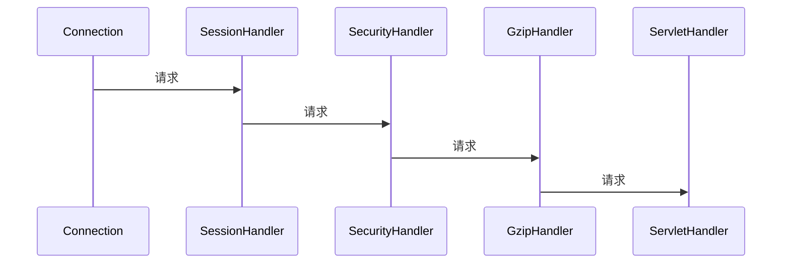

# Jetty

## 整体架构

Jetty Server 可以有多个 Connector 在不同的端口上监听客户请求，而对于请求处理的 Handler 组件，也可以根据具体场景使用不同的 Handler

Jetty 的 Handler 分成三种类型：

- 协调 Handler，这种 Handler 负责将请求路由到一组 Handler 中去，如 HandlerCollection，它内部持有一个 Handler 数组，当请求到来时，它负责将请求转发到数组中的某一个 Handler
- 过滤器 Handler，这种 Handler 自己会处理请求，处理完了后再把请求转发到下一个 Handler，如 HandlerWrapper，它内部持有下一个 Handler 的引用。需要注意的是，所有继承了 HandlerWrapper 的 Handler 都具有了过滤器 Handler 的特征，比如 ContextHandler、SessionHandler 和 WebAppContext 等
- 内容 Handler，真正调用 Servlet 来处理请求，生成响应的内容，比如 ServletHandler。如果器请求的是一个静态资源，也有相应的 ResourceHandler 来处理这个请求，返回静态页面。

