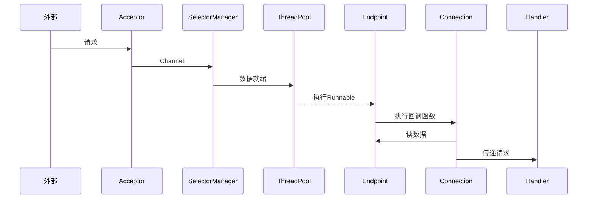

# Jetty

## 整体架构

Jetty Server 可以有多个 Connector 在不同的端口上监听客户请求，而对于请求处理的 Handler 组件，也可以根据具体场景使用不同的 Handler

```mermaid
sequenceDiagram
    外部 ->> Acceptor: 请求
    Acceptor ->> SelectorManager: Channel
    SelectorManager ->> ThreadPool: 数据就绪
    ThreadPool -->> Endpoint: 执行Runnable
    Endpoint ->> Connection: 执行回调函数
    Connection ->> Endpoint: 读数据
    Connection ->> Handler: 传递请求
```
