# Tomcat

## 目录结构

目录及文件|说明
-|-
bin|用于存放Tomeat的启动、停止等批处理脚本和Shelll脚本
bin/startup.bat|用于在Vindows下启动Tomeat
bin/startup.sh|用于在Linux下启动Tomcat
bin/shutdown.bat|用于在Windows下停止Tomcat
bin/shutdown.sh|用于在Linux下停止Tomcat
conf|用于存放Tomeat的相关配置文件
conf/Catalina|用于存储针对每个虚拟机的Context配置
conf/context.xml|用于定义所有Wcb应用均需要加载的Context配置，如果Web应用指定了自己的context..xml,那么该文件的配置将被覆盖
conf/catalina.properties|Tomcat环境变量配置
conf/catalina.policy|当Tomeat在安全模式下运行时，此文件为默认的安全策略配置
conf/logging.properties|Tomcat日志配置文件，可通过该文件修改Tomcat日志级别以及日志路径等
conf/server.xml|Tomcat服务器核心配置文件，用于配置Tomcat的链接器、监听端口、处理请求的虚拟主机等。可以说，Tomcat主要根据该文件的配置信息创建服务器实例
conf/tomcat-users.xml|用于定义Tomcat默认用户及角色映射信息，Tomcat的Manager模块即用该文件中定义的用户进行安全认证
conf/web.xml|Tomcat中所有应用默认的部署描述文件，主要定义了基础Servlet和MME映射。如果应用中不包含web.xml,那么Tomcat将使用此文件初始化部署描述，反之，Tomcat会在启动时将默认部署描述与自定义配置进行合并
lib|Tomcat服务器依赖库目录，包含Tomeat服务器运行环境依赖Jar包
logs|Tomcat默认的日志存放路径
webapps|Tomcat默认的Web应用部署目录
work|web应用JSP代码生成和编译临时目录

## 部署方式

- 直接将项目放到webapps目录下
- 配置conf/server.xml文件

  ```
  在<Host>标签体中配置
                    <Context docBase="D:\hello" path="/hehe" />
                     docBase:项目存放的路径
                     path：虚拟目录
  ```

- 在conf\Catalina\localhost创建任意名称的xml文件。在文件中编写

  ```
  <Context docBase="D:\hello" />
  ```

  - 虚拟目录：xml文件的名称

**JAVA WEB项目目录结构**

- 项目的根目录
  - WEB-INF目录：
    - web.xml：web项目的核心配置文件
    - classes目录：放置字节码文件的目录
    - lib目录：放置依赖的jar包

## 架构

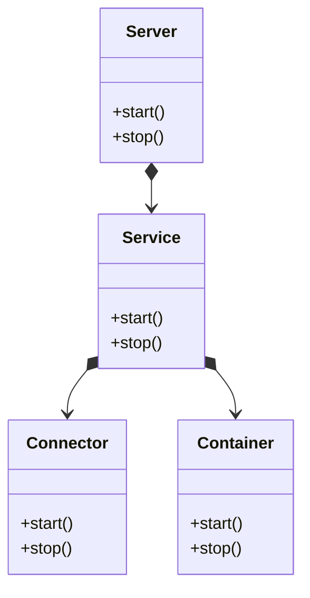

- Connector负责连接的建立以及数据返回
- Container(Engine)负责请求的具体处理
- Service 负责维护Conenctor与Container之间的映射关系

### Connector

连接器需要完成 3 个的功能：网络通信、应用层协议解析、Tomcat Request/Response 与 ServletRequest/ServletResponse 的转化分别由 Endpoint、Processor 和 Adapter 完成

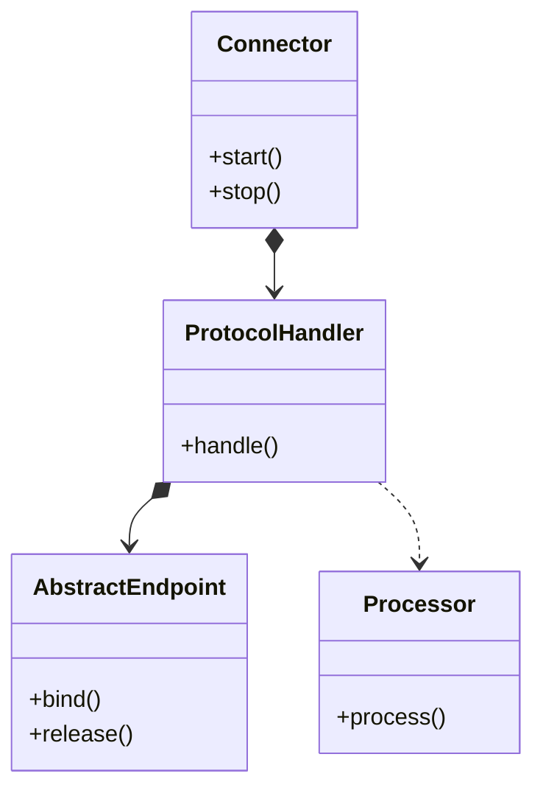

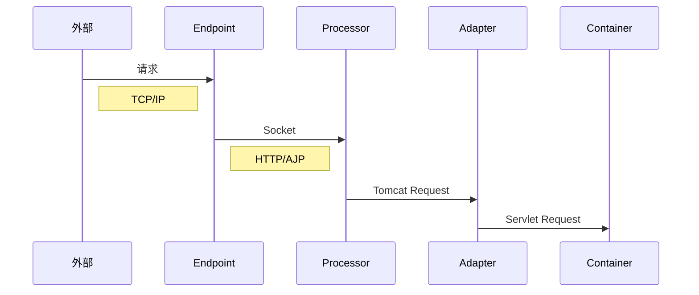

### Container

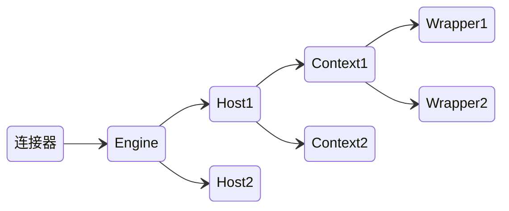

- Engine：Container的具体实现
- Host：以域名为主的一个虚拟主机
- Wrapper：代表Servlet实例
- Context：代表一个独立的web应用
- PipeLine：各个组件之间传递消息的管道

所有的容器组件都实现了 Container 接口，因此组合模式可以使得用户对单容器对象和组合容器对象的使用具有一致性。

Tomcat 通过 Mapper 组件保存了 Web 应用的配置信息，其实就是容器组件与访问路径的映射关系，当一个请求到来时，Mapper 组件通过解析请求 URL 里的域名和路径，就能定位到一个 Servlet。

一个请求流经 Engine -> Host -> Context -> Wrapper，每个节点都会对请求做一些处理

### LifeCycle

容器相关的组件都实现了 LifeCycle 接口，父组件以此管理子组件的启动与停止

### Executor

在 Endpoint 与 Processor 之间有个线程池来处理请求，共享线程池由Service维护

### Bootstrap和Catalina

Bootstrap 是用来初始化类加载器的

通过 Bootstrap 启动 Cataina， Catalina启动Server 实现了Bootstrap 与 Server进行解耦

### 启动流程

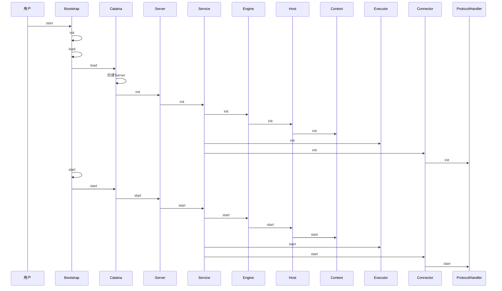

### 请求处理

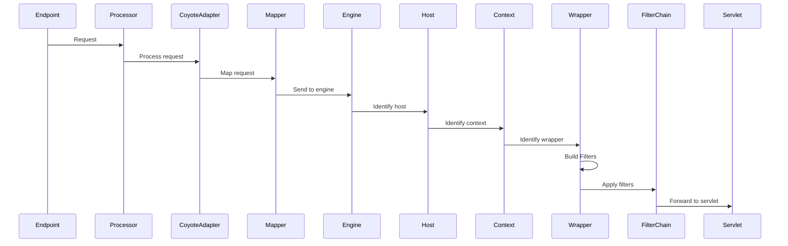

### 类加载器

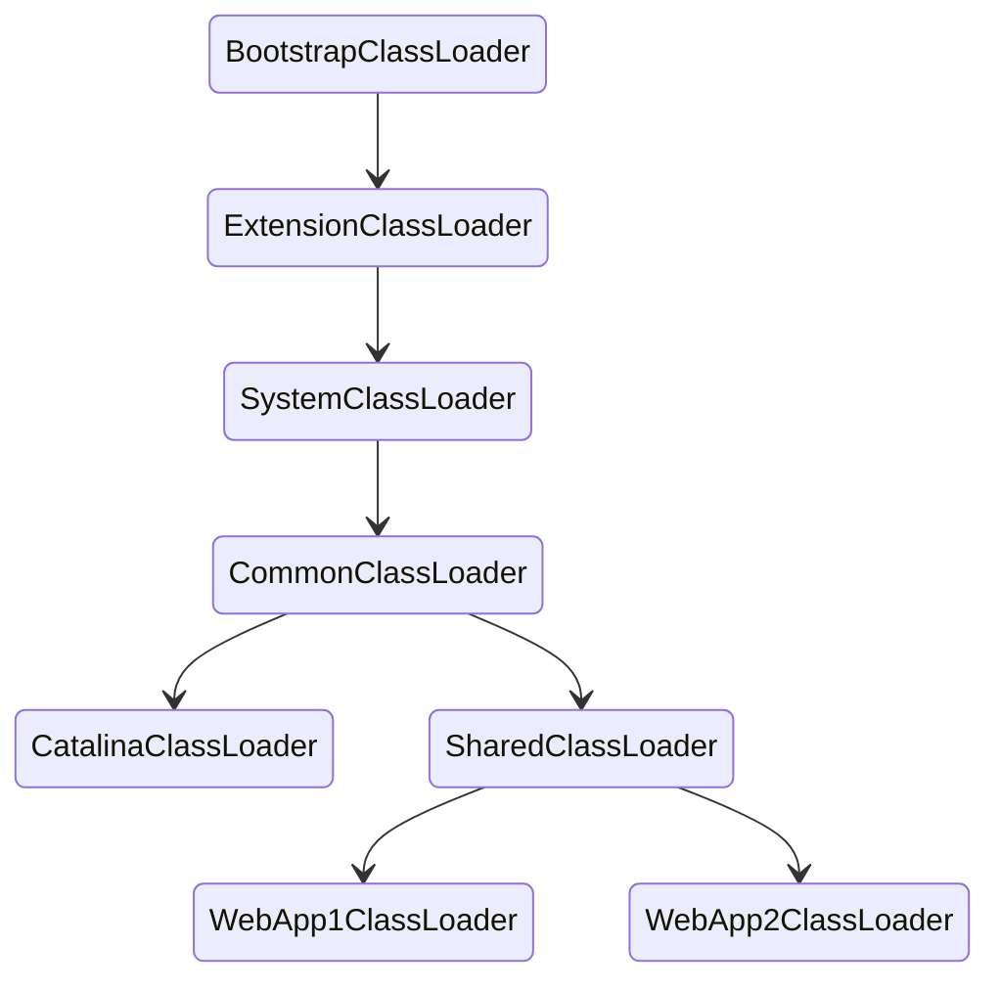

- SharedClassLoader：专门来加载 Web 应用之间共享的类
- CatalinaClassLoader：专门来加载 Tomcat 自身的类
- CommonClassLoader：用来共享 Tomcat 和各 Web 应用之间的类

通过每个app使用自己的类加载器来达到：

- 隔离：不同的app依赖类库不会相互影响
- 灵活：重新部署时的问题

对于Web 应用类加载器，它的加载顺序：

- 从缓存加载
- 如果缓存没有 从JVM的Bootstrap类加载器加载 （防止JAVA SE核心类被覆盖）
- 如果还是没有 从当前类加载器加载 （如果开启委托 则会遵循JVM双亲委托模型）
- 还没有 再从父类加载器加载

线程上下文加载器：这个类加载器保存在线程私有数据里，只要是同一个线程，一旦设置了线程上下文加载器，在线程后续执行过程中就能把这个类加载器取出来用

### 热加载与热部署

周期性检测资源文件变化，热加载主要完成了下面这些任务：

1. 停止和销毁 Context 容器及其所有子容器，子容器其实就是 Wrapper，也就是说 Wrapper 里面 Servlet 实例也被销毁了
2. 停止和销毁 Context 容器关联的 Listener 和 Filter
3. 停止和销毁 Context 下的 Pipeline 和各种 Valve
4. 停止和销毁 Context 的类加载器，以及类加载器加载的类文件资源
5. 启动 Context 容器，在这个过程中会重新创建前面四步被销毁的资源

当监听到webapps 目录变化，Host 会创新创建相对应的 Context 并启动

### Context的命名与请求路径映射

基础文件名称|Name|Path|Version|部署文件名称
-|-|-|-|-
foo|/foo|/foo||foo.xml、foo.war、foo
foo#bar|/foo/bar|/foo/bar||foo#bar.xml、foo#bar.war、foo#bar
foo##2|/foo##2|/foo|2|foo##2.xml、foo#+2.war、foo#2
foo#bar##2|/foo/bar##2|/foo/bar|2|foo#bar##2.xml、foo#bar##2.war、foo#bar##2
ROOT||||ROOT.xml、ROOT.war、ROOT
ROOT##2|##2||2|ROOT##2.xml、ROOT##2.war、ROOT##2

### Catalina 自带的 Servlet

- DefaultServlet：处理静态资源 处理目录请求
  - 可配参数：<https://tomcat.apache.org/tomcat-7.0-doc/default-servlet.html>
- JspServlet:编译jsp文件 处理jsp请求

## Coyote

- 请求连接器的实现

支持的传输协议：

- HTTP1.1
- HTTP2.0
- AJP1.3

支持的IO方案：

- NIO
- NIO2
- APR

HTTP 配置：

```xml
<!-- server.xml -->
<Connector executor="tomcatThreadPool"
               port="8080" protocol="HTTP/1.1"
               connectionTimeout="20000"
               redirectPort="8443" />

<!-- 使用NIO方式处理HTTP1.1 -->
<Connector port="8443" protocol="org.apache.coyote.http11.Http11NioProtocol"
               maxThreads="150" SSLEnabled="true">
<!-- 
  maxThreads:指定Connector创建请求处理线程的最大数
  maxSpareThreads：允许空闲线程的最大数
  minSpareThreads
  tcpNoDelay：禁止TCP通过批量发送数据来提高网络利用率
  maxKeepAliveRequest: 最大keepalive的连接数
  socketBuffer
  enableLookups：是否开启request.getRemoteHost() DNS查询
 -->
```

### 概念

- Endpoint 通信端点 负责Socekt接收处理
- Porcessor 负责创建请求和响应 将请求转发到Catalina
- ProtocolHandler 封装Endpoint Processor
- UpgradeProtocol 处理HTTP协议的升级协议

### AJP

```xml
<!-- server.xml -->
<Connector protocol="AJP/1.3"
               address="::1"
               port="8009"
               redirectPort="8443" />
```

>AJP（Apache JServ Protocol）是定向包协议。因为性能原因，使用二进制格式来传输可读性文本。WEB服务器通过 TCP连接 和 SERVLET容器连接

包结构：

```
字节位置 0     1      2 3           4-(n+3)
内容     0x12 0x34 数据长度(n)       数据
```

有效载荷的前一个字节代表类型

序号|	类型|	描述
-|-|-
2|Forward Request|使用接下来的数据开始请求处理周期
7|Shutdown|Web服务器请求Servlet容器关闭自己
8|Ping|Web服务器请求Servlet容器采取控制（安全登录阶段）
10|CPing|Web服务器请求Servlet容器通过一个CPong快速响应
空|Data|主体数据及其大小
3|Send Body Chunk|Servlet?容器向Web服务器发送一个主体数据块
4|Send Headers|Servlet?容器向Web服务器发送响应头信息
5|End Response|用于标记响应结束
6|Get Body Chunk|如果请求数据未传输完，用于得到更多的请求数据
9|CPong Reply|CPingi请求应答

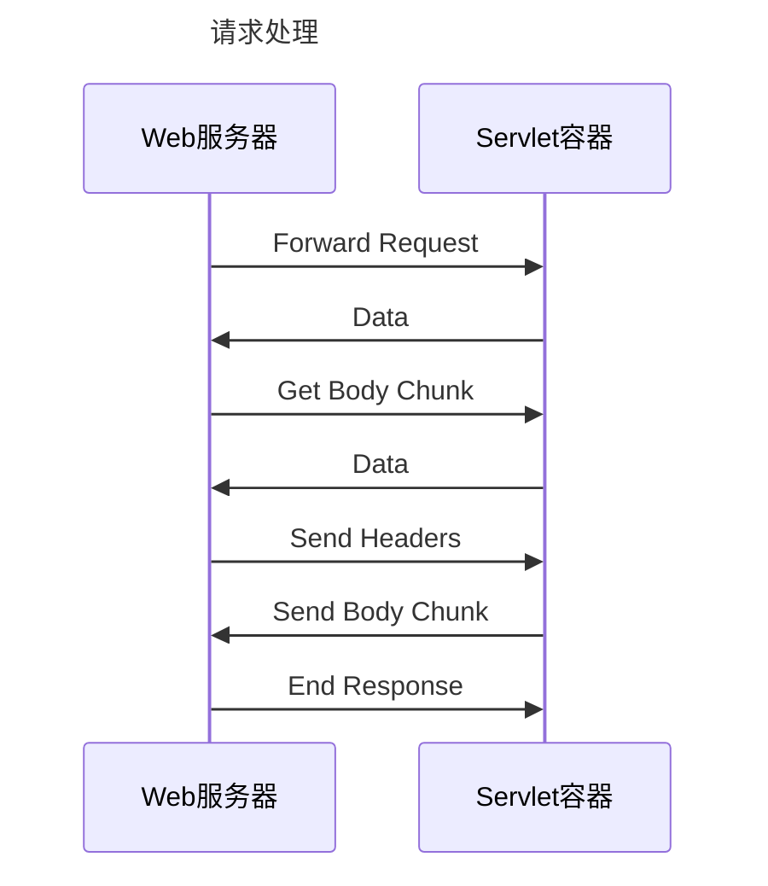

## Jasper

使用单独的类加载器

### 编译方式


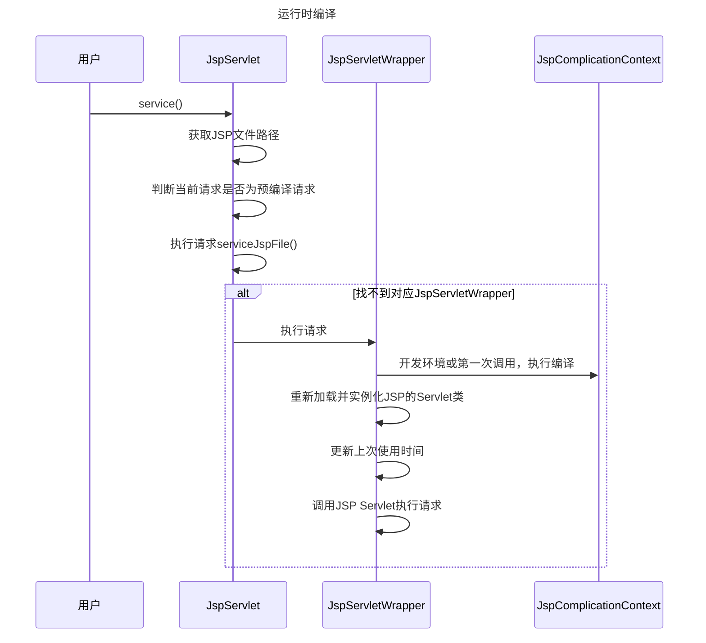

编译结果：

- 首选存放在 context-param 的scratchdir
- 否则是 $CATALINA_BASE/work/Engine名称/Host名称/Context名称
- 再否则在系统临时文件目录下

预编译：

jspc

### 编译原理

```java
// 继承该类
class index_jsp extends HttpJspBase
```

```java
private static final JspFactory _jspxFactory = JspFactory.getDefaultFactory();
private static Map<String, Long> _jspx_dependants; // 依赖的外部资源
private static final Set<String> _jspx_imports_packages = new HashSet(); // 导入的包
private static final Set<String> _jspx_imports_classes; // 导入的类
```

`_jspService` 处理请求：

- 定义了out pageContext session application config page 等局部变量
- 对于静态内容调用out.write
- 处理jsp标签

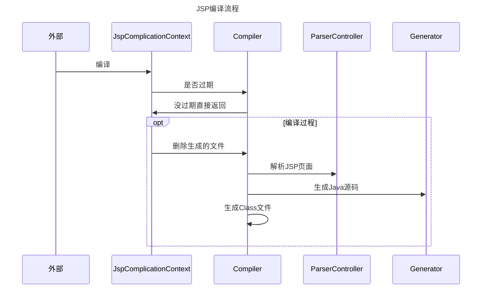

## Session机制

主要由每个 Context 容器内的一个 Manager 对象来管理 Session，默认为 StandardManager。通过 Request 获取 Session 会执行创建 Session，Session 存放在个 ConcurrentHashMap 中。

StandardContext 会有个定时扫描的线程去清理过期的 Session，Session 创建事件的监听则是通过 StandardContext 将 HttpSessionListener 类型的 Listener 取出，然后依次调用它们的 sessionCreated 方法。

## 配置管理

### JVM配置

```bat
:: JVM启动参数
set "JAVA_OPTS=%JAVA_OPTS% %JSSE_OPTS%"
```

系统属性：略

### 服务器配置

catalina.properties: 容器启动阶段的配置

server.xml: 服务器核心配置

- Server
- Service
- Executor 线程池配置 默认其他组件会创建自己的线程池

  ```xml
  <Executor name="tomcatThreadPool" namePrefix="catalina-exec-"
          maxThreads="150" minSpareThreads="4"/>
  ```
- Connector 默认配置了两个 HTTP 和 AJP
  ```xml
  <Connector port="8080" -- 监听端口
  executor="sharedThreadPool" -- 线程池
  enableLookups="false" -- 调用request.getRemoteHost 是否调用DNS解析获取主机名
  redirectPort="8443" -- SSL 转发端口
  acceptCount="100"  -- 控制 socket 排队连接的最大数
  connectionTimeout="2000o" -- Connector 接收连接处理的超时时间
  URIEncoding="UTF-8" -- 解码URI的编码
  compression="on" -- 开启压缩
  compressionMinSize="2048" -- 最小压缩尺寸
  noCompressionUserAgents="gozilla,traviata" -- 符合表达式的UA头不压缩
  compressableMimeType="text/html,text/xml,text/javascript,text/css,text/plain" />
  ```
- Engine 可以指定虚拟主机
- Host
  - name 域名
  - appBase 存放应用的目录
  - unpackWARs 是否解压war包
  - autoDeploy 定期检测 自动部署
  - Alias 可以配置新的域名
- Context
  - docBase 具体应用的目录
  - path Context路径
- CookieProcessor 指定cookie处理器
- Loader 用于管理 web 应用的类加载器
  - delegate 属性可以打破双亲委派模型
  - reloadable 属性会监控资源变化后重新加载应用
  - loaderClass 指定类加载器的具体实现
- Manger 会话管理器
  - Standard和Presistent
- Resources 资源共享
  ```xml
  <Context docBase="myApp" path=" /myApp">
    <Resources>
      <PreResources
      className='org.apache.catalina.webresources.FileResourceSet'
      base=" /Users/liuguangrui/Documents/sample/app.jsp"
      webAppMount=" /app/app.jsp"/>
    </Resources>
  </Context>
  ```
- JarScanner
- content.xml

### Web 应用配置

- context-param: ServerContext.getInitParameter() 可以获取到的参数
- session-config 会话配置
  - 三种追踪模式 COOKIE URL SSL
- servlet 声明servlet及其映射
- listener
- filter
- mime-mapping 映射文件类型与对应的content-type
- welcome-file-list
- error-page
- locale-encoding-mapping-list 本地化与响应编码的关系
- 安全配置
- jndi配置

### 内置的 Filter

- CorsFilter：解决跨域问题
- CsrfPreventionFilter：防止CSRF攻击
- ExpiresFilter：控制缓存过期与否
- FailedRequestFilter：解析参数失败就返回错误
- RemoteAddrFilter：只放行符合特定表达式的IP地址
- RemoteHostFilter：只放行符合特定表达式的主机
- RemoteIpFilter：前方有负载均衡器的情况下 将getRemoteAddr()替换为 X-Forwarded-For 中的IP
- RequestDumperFilter：以日志形式输出请求和响应对象 主要用于调试
- SetCharacterEncodingFilter：设置请求编码

### Tomcat 管理

`/host-manager/html`

## 集群

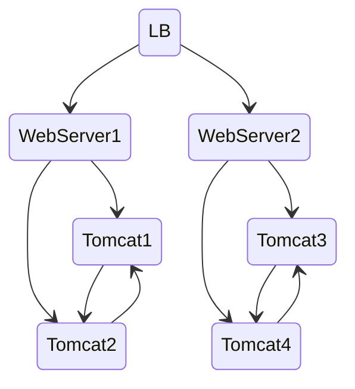

Tomcat 集群实现的原理就是在节点之间同步 Session

Tomcat 本身就不适合配置集群 一种通用的解决方案是 接入层为 Nginx

Nginx 对后端的Tomcat进行负载均衡 

Tomcat上的Web应用最好是设计成无状态的 如果仍然需要保持会话 最好使用一台独立的服务器来存储会话 比如 Redis 

而不要使用Tomcat的会话同步功能

## 安全

安装部署：下载安全 移除自带的几个Web应用

server.xml: 

- 删除不必要的连接器
- 删除UserDatabase
- 修改关键配置：8005管理端口
- 避免恶意web应用的自动启动：autoDeploy
- 允许有限的客户端访问
- 避免将异常堆栈打印到客户端
- listing会导致目录泄漏以及DoS攻击

应用安全

传输安全(SSL)

JAVA安全策略

## 优化

### JVM 优化

### Tomcat 配置优化

server.xml:

- 链接器maxConnections 属性：超过该属性的连接会被阻塞
- tcpNoDelay：禁止TCP缓存并发送
- maxKeepAliveRequest
- socketBuffer
- enableLookups

网络传输优化：

- 静态文件压缩
- 高性能链接器(NIO NIO2)
- 禁用自动部署

JSP页面配置(web.xml):

- development 设置为false 不自动检测JSP页面变动
- ...

继承 web 服务器：

- 动静分离
- 负载均衡

### 应用优化

- 减少通信次数
- 减少通信数据流
- 推迟会话创建
- 不在会话存储大对象
- 合理定义对象作用域
- 使用连接池提高性能
- 使用缓存提高性能
- 最小化日志

## 附加功能

- 嵌入式启动
- websocket