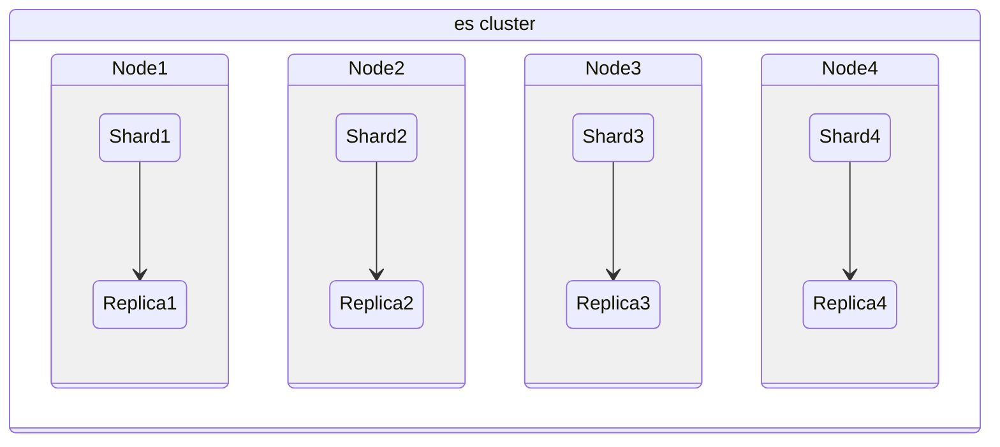
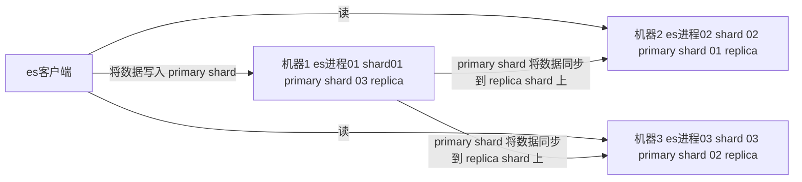
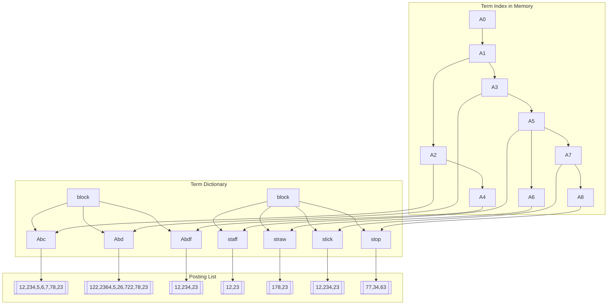
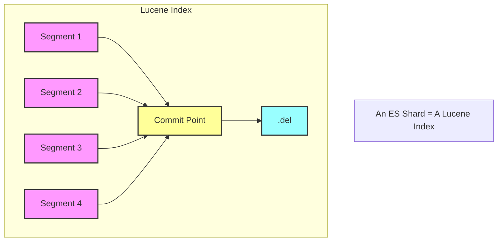
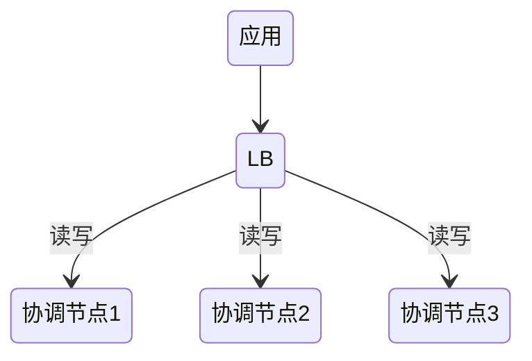
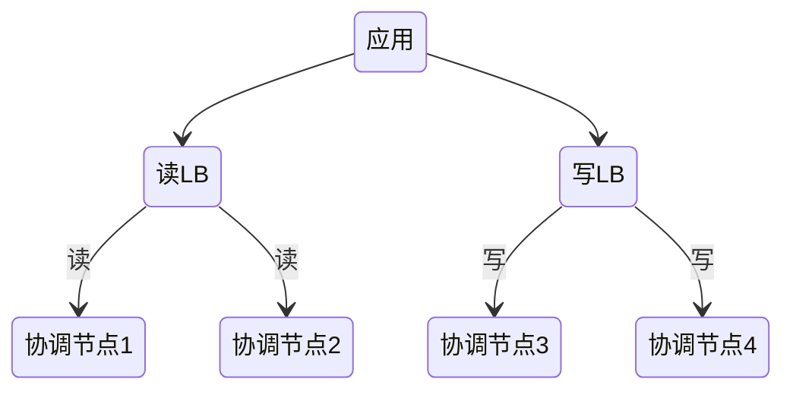
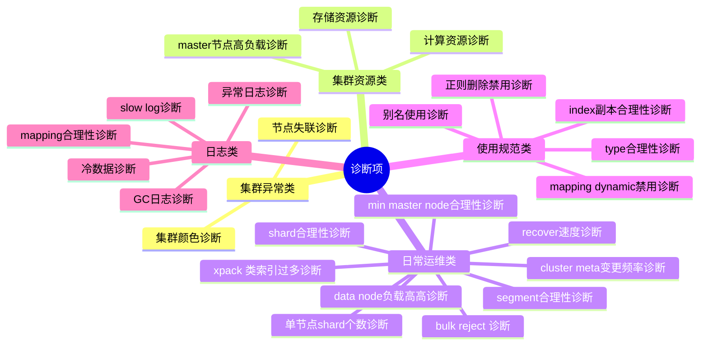

# ElasticSearch

> ElasticSearch是一个基于Lucene的搜索服务器。它提供了一个分布式多用户能力的全文搜索引擎，基于RESTful web接口

- Near Realtime
  - 从写入数据到数据可以被搜索到有一个小延迟，大概是 1s
  - 基于 es 执行搜索和分析可以达到秒级

## 优势

- 横向可扩展
- 分片机制提供更好的分布性
- 高可用

## 安装

> 使用 docker

```shell
docker run elasticsearch:7.3.1
```

```shell
docker network create somenetwork;
docker run -d --name elasticsearch --net somenetwork -p 9200:9200 -p 9300:9300 -e "discovery.type=single-node" elasticsearch:7.3.1
```

9300端口： ES节点之间通讯使用

9200端口： ES节点 和 外部 通讯使用

## 概念

- 集群(cluster)
  - 多个节点组成
- 节点(node)
  - 服务器实例
- 索引（index）
  - Databases 数据库
- ​文档（Document）
  - Row 行
- ​字段（Field）
  - Columns 列
- primary shard
  - es 可以将一个索引中的数据切分为多个 primary shard，分布在多台服务器上存储，以此解决水平扩展问题
- replica shard
  - 任何一个服务器随时可能故障或宕机，此时 primary shard 可能就会丢失，因此可以为每个 primary shard 创建多个 replica shard。replica 可以在 primary shard 故障时提供备用服务，所以同一片 primary shard 跟 replica primary 不能存放在同一节点
- 映射 mapping：类似于 schema



## 数据类型

- text：该类型被用来索引长文本，在创建索引前会将这些文本进行分词，转化为词的组合，建立索引；允许es来检索这些词，text类型不能用来排序和聚合。
- keyword：该类型不需要进行分词，可以被用来检索过滤、排序和聚合，keyword类型自读那只能用本身来进行检索（不可用text分词后的模糊检索）
- 数值型：long、integer、short、byte、double、float
- 日期型：date
- 布尔型：boolean
- 二进制型：binary

## CRUD

- create 操作：如果 ID 不存在，则新增，如果 ID 存在，则更新
- index 操作：如果 ID 不存在，则新增，如果 ID 存在，则删除后新增，版本号会增加
- update 操作：文档必须已存在，更新只会对相应的字段做增量修改

## 批量API

- bulk 操作：批量操作，一次请求可以执行多个操作，包括索引、更新、删除等操作
- mget
- msearch

## 查询

### 指定查询索引

语法|范围
-|-
/_search|集群上所有的索引
/index1/_search|index1
/index1,index-2/_search|index1和index2
/index*/_search|以index开头的索引

### 基本查询

```json
GET /索引库名/_search
{
    "query":{
        "查询类型":{
            "查询条件":"查询条件值"
        }
    }
}
```

- 根据ID查询

`GET http://my-pc:9200/blog/hello/1`

- 根据字段查询

>Term Query为精确查询，在搜索时会整体匹配关键字，不再将关键字分词。 

```json
GET /shop/_search
{
  "_source": ["title","price"],
  "query": {
    "term": {
      "price": 2699
    }
  }
}
```

- queryString查询

```json
{
    "query":{
        "query_string":{
            "default_field":"content",
            "query":"内容"
        }
    }
}
```

**过滤**

- includes：来指定想要显示的字段
- excludes：来指定不想要显示的字段

```json
GET /shop/_search
{
  "_source": {
    "includes":["title","price"]
  },
  "query": {
    "term": {
      "price": 2699
    }
  }
}
```

**排序**

```json
GET /shop/_search
{
  ...
  "sort": [
    {
      "price": {
        "order": "desc"
      }
    }
  ]
}
```

**模糊查询**

```json
GET /heima/_search
{
  "query": {
    "fuzzy": {
        "title": {
            "value":"appla",
            "fuzziness":1
        }
    }
  }
}
```

### term查询与全文查询

- term查询包括 Term Query / Range Query / Exists Query / Prefix Query /Wildcard Query。 是精确查询，用于查找字段中完全匹配指定值的文档。它不进行分词，也就是说，它不会将搜索的词拆分成更小的部分，而是将整个词作为一个单元进行匹配
- 全文查询包括 Match Query / Match Phrase Query / Query String Query / Simple Query String Query。 索引跟查询的时候都会进行分词，查询是根据分词的词项进行底层查询并进行合并，为每个文档生成一个分数

### Function Score Query

可以在查询结束后，对每一个匹配的文档进行一系列的重新算分，根据新生成的分数进行排序。

- Weight：为每一个文档设置一个简单而不被规范化的权重
- Field Value Factor:使用该数值来修改_score
- Random Score:为每一个用户使用一个不同的，随机算分结果
- 衰减函数：以某个字段的值为标准，距离某个值越近，得分越高
- Script Score：自定义脚本完全控制所需逻辑

### Suggester

### 分页

> 深度分页问题：对于大分页或者一次查询大量文档，ES 需要计算所有之前页的数据，这会导致大量的内存和CPU使用

为了解决这个问题，可以使用 search_after ，其可以通过指定 id 参数，实现类似于 where id > ? limit xx 的功能

另外还有一个 scroll api，其可以创建一个数据的快照，实现类似于 resultset.next() 的功能。适用于需要遍历大量文档的场景

## 分词

分词器是专门处理分词的组件，Analyzer由三部分组成：

- Character Filters(针对原始文本处理，例如去除html)
- Tokenizer(按照规则切分为单词)
- Token Filter(将切分的的单词进行加工，小写，删除stopwords,增加同义词)

### 内置的分词器

- Standard Analyzer 默认分词器，按词切分，小写处理
- Simple Analyzer 按照非字母切分（符号被过滤），小写处理
- Stop Analyzer 小写处理，停用词过滤(the,a,is)
- Whitespace Analyzer 按照空格切分，不转小写
- Keyword Analyzer 不分词，直接将输入当作输出
- Patter Analyzer 正则表达式，默认\W+(非字符分隔)
- Language Analyzers 内置 30 种语言的分词器
- Fingerprint Analyzer

### 测试分词

`GET /_analyze`

```json
{
  "analyzer": "standard",
  "text": "中文测试分词"
}
```

### 中文分词器

[下载](https://github.com/medcl/elasticsearch-analysis-ik)

```shell
docker run --name elasticsearch --net somenetwork -v /root/plugin:/usr/share/elasticsearch/plugins -p 9200:9200 -p 9300:9300 -e "discovery.type=single-node" elasticsearch:7.3.1
```

`GET http://my-pc:9200/_analyze`

```json
{
  "analyzer": "ik_max_word",
  "text": "中文测试分词"
}
```

ik 的两种模式：

- max：会将文本做最细粒度的拆分 会穷尽所有的可能
- smart：最最粗粒度的划分

### 自定义分词器

```json
{
  "settings": {
    "analysis": {
      "char_filter": {
        "my_char_filter": {
          "type": "html_strip"
        }
      },
      "tokenizer": {
        "my_tokenizer": {
          "type": "standard"
        }
      },
      "filter": {
        "my_lowercase_filter": {
          "type": "lowercase"
        },
        "my_stop_filter": {
          "type": "stop",
          "stopwords": "_english_"
        }
      },
      "analyzer": {
        "my_custom_analyzer": {
          "type": "custom",
          "char_filter": [
            "my_char_filter"
          ],
          "tokenizer": "my_tokenizer",
          "filter": [
            "my_lowercase_filter",
            "my_stop_filter"
          ]
        }
      }
    }
  },
  "mappings": {
    "properties": {
      "content": {
        "type": "text",
        "analyzer": "my_custom_analyzer"
      }
    }
  }
}
```

## Mapping

Mapping 类似数据库中的schema的定义，作用：

1. 定义索引中的字段的名称
2. 定义字段的数据类型
3. 进行字段，倒排索引的相关配置，(Analyzed or Not Analyzed,Analyzer)

### Dynamic Mapping

当向 Elasticsearch 插入一个新文档时，且文档包含的字段在索引中尚未定义时，Elasticsearch 会自动推断这些字段的数据类型，并在索引中创建相应的映射

新增加字段：

- Dynamic设为true：当有新增字段的文档写入时，Elasticsearch 会自动更新映射（Mapping）。
- Dynamic设为false：映射不会更新，新增加的字段数据无法被索引，但信息会出现在 _source 字段中。
- Dynamic设置为strict：文档写入会失败。

已有字段：

- 一旦已有字段的数据写入后，不再支持修改字段定义。Lucene实现的倒排索引一旦生成后，就不允许修改。
- 如果希望改变字段类型，必须使用 Reindex API 重建索

### Mapping 配置

- index：是否索引，默认为true。如果设置为 false，该字段不可被搜索
- index_options：控制倒排索引记录的内容
  - docs：只记录文档的编号
  - freqs：记录文档编号和词频
  - positions：记录文档编号、词频和词的位置
  - offsets：记录文档编号、词频、词的位置和词的偏移量
- null_value：只有 keyword 类型才支持
- copy_to：将字段值复制到其他字段中
- fielddata：将倒排索引转换为顺序结构，主要用于 text 类型字段，且数据载入内存
- doc_values：以列存储形式保存在磁盘上，主要用于数值、日期和 keyword 类型字段(2.x 之后默认启用)

## template

### Index Template

Index Templates 可以帮助设定 Mappings 和 Settings,并按照一定的规则，自动匹配到新创建的索引之上，可以通过设定多个 template，这些设置会被合并在一起，通过指定 order 的数值，来控制合并的过程

### Dynamic Template

用于在索引新文档时，自动根据字段名或字段类型来应用特定的映射规则。它可以在动态映射的基础上提供更细粒度的控制，使得可以指定某些字段的映射类型和其他属性，而不需要事先知道这些字段的名字或类型

```json
{
  "mappings": {
    "dynamic_templates": [
      {
        "date_fields": {
          "match": "date_*",
          "mapping": {
            "type": "date",
            "format": "yyyy-MM-dd"
          }
        }
      }
    ]
  }
}
```

### Search Template

允许预定义查询，并在执行时注入参数。这可以帮助简化复杂查询的重用，并提高性能和可维护性

```json
POST _scripts/my_search_template
{
  "script": {
    "lang": "mustache",
    "source": {
      "query": {
        "bool": {
          "must": [
            {
              "match": {
                "title": "{{title}}"
              }
            },
            {
              "range": {
                "release_date": {
                  "gte": "{{start_date}}",
                  "lte": "{{end_date}}"
                }
              }
            }
          ]
        }
      }
    }
  }
}

```

```json
POST _search/template
{
  "id": "my_search_template",
  "params": {
    "title": "Inception",
    "start_date": "2010-01-01",
    "end_date": "2010-12-31"
  }
}
```

### Index Alias

索引别名可以通过别名实现不停机的索引切换与重建、管理索引的视图与读写权限等

```json
POST /_alias
{
  "actions": [
    {
      "add": {
        "index": "`screen_recorder_log_202406`",
        "alias": "screen_log_now"
      }
    }
  ]
}
```

## 聚合

- Matrix Aggregration 支持对多个字段的操作并提供一个结果矩阵

### Bucket Aggregation

一些列满足特定条件的文档的集合(group by)

```json
{
  "size": 0, 
  "aggs": {
      "group": {
          "terms": {
            "field": "sales_person.keyword"
          }
      }
  }
}
```

### Metric Aggregation

一些数学运算，可以对文档字段进行统计分析(count、avg、sum)

```json
{
  "size": 0, 
  "aggs": {
      "avg_amount": {
          "avg": {
            "field": "amount"
          }
      }
  }
}
```

### Pipeline Aggregation

对其他的聚合结果进行二次聚合

```json
POST /sales/_search
{
  "size": 0,
  "aggs": {
    "monthly_sales": {
      "date_histogram": {
        "field": "date",
        "calendar_interval": "month"
      },
      "aggs": {
        "total_sales": {
          "sum": {
            "field": "sales_amount"
          }
        }
      }
    },
    "avg_monthly_sales": {
      "avg_bucket": {
        "buckets_path": "monthly_sales>total_sales" # 对 monthly_sales 聚合结果再进行平均
      }
    }
  }
}
```

### 作用范围

- query和filter，是先选定数据范围，再聚合桶
- post_filter对聚合桶没影响，桶是全部返回，只对查询结果进行过滤返回，类似于 having
- global的作用是覆盖掉query的查询作用

### 精准度问题

Elasticsearch 是一个分布式搜索引擎，其数据分布在多个分片上。当执行聚合操作时，Elasticsearch 会在每个分片上单独计算聚合结果，然后将这些结果合并。在某些情况下（特别是对于 terms 聚合），为了减少内存消耗和提高查询性能，Elasticsearch 不会从每个分片返回所有的桶，而是仅返回前 N 个桶。这可能导致最终结果中的文档计数存在一些误差

doc_count_error_upper_bound 表示返回的结果中每个桶的文档计数可能偏差的最大值。具体来说，它是一个上限值，表明在分布式聚合过程中，由于只返回部分桶可能导致的最大文档计数误差

可以通过调整 shard_size 的方式减少误差

## ES集群

采用ES集群，将单个索引的分片到多个不同分布式物理机器上存储，从而可以实现高可用、容错性

- Master-eligible Node 是指具有成为主节点资格的节点，Master Node 是当前已经被选举为主节点并执行主节点职责的节点，默认情况下，所有节点都是 Master-eligible node
- Data Node 负责存储数据并执行数据相关操作，通过增加 Data Node 可以解决数据水平扩展和数据单点问题
- Coordinating Node 处理来自客户端的请求，分发请求到相关的数据节点，并在所有数据节点上汇总结果后返回给客户端，默认情况下，所有节点都是协调节点

### 架构

es 集群多个节点，会自动选举一个节点为 master 节点。master 节点宕机了，那么会重新选举一个节点为 master 节点

非 master 节点宕机了，那么会由 master 节点，让那个宕机节点上的 primary shard 的身份转移到其他机器上的 replica shard



可以使用三个节点，将索引分成三份，每个节点存放一份primary shard，两份replica，这样就算只剩下一台节点，也能保证服务可用

#### 分片路由

读写文档时会根据 hash 计算出文档所属的分片所在的机器，由接入节点将请求转发到分片所在的机器

#### 索引结构

一个 Lucene 索引文件内部存放的内容：





单个倒排索引文件被称为 Segment Segment是自包含的，不可变更的。多个Segments汇总在一起，称为Lucene的
Index,其对应的就是ES中的Shard

当有新文档写入时，会生成新Segment,查询时会同时查询所有Segments,并且对结果汇总。Lucene中有一个文件，用来记录所有Segments信息，叫做Commit Point

删除的文档信息，保存在“.del”文件中

### 部署架构

不同节点类型所需资源：

- master eligible nodes: 负责集群状态(cluster state)的管理，使用低配置的CPU,RAM和磁盘
- data nodes:负责数据存储及处理客户端请求，使用高配置的CPU,RAM和磁盘
- ingest nodes:负责数据处理，使用高配置CPU;中等配置的RAM;低配置的磁盘
- coordination only node：这种节点是专门负责搜索结果的 gather/reduce，对于大集群，可以配置专门的这种节点，防止大量占用内存的聚合操作导致 OOM 影响集群稳定

从高可用的角度，要避免 master 与其他的节点混部

#### 水平扩展



#### 读写分离



#### 冷热分离

存放热数据的节点一般会有持续的文档写入更新，通常使用 SSD 加上较高性能的 CPU。冷数据节点使用大容量的 HDD 。

ES 可以通过 nodeattrs 标记节点类型，通过设置不同的 nodeattrs，将节点分为不同的角色，比如：

- warm
- hot

在创建或更新索引时，可以通过 settings 指定索引创建在什么节点类型上，来实现冷热分离

使用这个 nodeattr 还可以实现强制要求 shard 分布在不同的节点类型上，类似于 k8s 的节点污点

### 分片设计与管理

7.0 之后，默认只有一个主分片，1 个主分片可以解决算法、聚合不准的问题，但单个主分片无法实现水平扩展

理想情况，主分片数应该大于节点数，当集群增加新节点后，ES 会自动进行 rebalancing 操作。多分片如果分布在不同的节点，读写可以并行扩展，但过多的分片会带来额外的性能开销，除了每次读写要扩散到每个分片上进行读写，还有大量分片元数据给 master 带来的开销。

### 容量规划

核心问题：一个集群总共需要多少个节点？一个索引需要设置几个分片？规划上需要保持一定的余量，当负载出现波动，节点出现丢失时，还能正常运行

做容量规划时，一些需要考虑的因素：
- 机器的软硬件配置
- 单条文档的尺寸/文档的总数据量/索引的总数据量(Time base数据保留的时间)/副本分片数
- 文档是如何写入的(Bulk的尺寸)
- 文档的复杂度，文档是如何进行读取的（怎么样的查询和聚合）

数据吞吐及性能需求：

- 写入吞吐量
- 查询吞吐量
- 单条查询可接受的最大返回时间

了解数据：

- 数据格式与数据的 mapping
- 实际的查询与聚合是怎么样的

硬件配置：

- 数据节点尽可能使用 SSD
- 搜索性能要求高的场景，建议使用 SSD，内存与硬盘的比例 1: 10
- 日志类和查询并发低的可以使用 HDD，内存与硬盘比例 1:50
- 单节点数据控制在 2TB 内
- JVM 内存配置为物理机器一半，不超过 32 G

索引拆分：

- 非日志类型的日数据，特点是总量很大，但增长相对较慢，更关心搜索与聚合的性能，关注搜索相关度，可以通过业务维度对索引进行分区，启用 routing 降低查询时相关的 shard
- 日志类型的数据，特点是每天的增长量多，按时间维度进行分区，对写入性能要求高，可以利用日期对索引分区，做冷热分离，同时每个分区较小，备份及删除的效率高

### 跨集群搜索

### 分布式查询

Elasticsearch 将索引的数据分成多个分片（shard），每个分片可以分布在不同的节点上。查询时，这些分片会独立计算相关性评分（score），然后再合并结果。这会导致评分计算时使用的信息不全，从而导致算分不准

解决这个问题的方式是将主分片设置为 1，或者使用 dfs_query_then_fetch 模式

## 并发控制

在更新文档时，可以通过 if_seq_no 与 if_primary_term 选项实现预期版本号与主分片的判断，实现乐观锁

## 数据建模

类型选择：

- 优先考虑反范式化压平字段
- 当数据包含多数值对象，同时有查询需求，使用nested
- 关联文档更新非常频繁时，使用父子文档

避免过多字段：过多的字段数不容易维护，mapping 信息保存在Cluster State中，数据量过大，对集群性能会有影响(Cluster State信息需要和所有的节点同步),删除或者修改数据需要reindex，默认最大字段数是1000，可以设置index.mapping.total_fields.limt限定最大字段数。

避免正则查询

避免字段控制导致聚合查询不准

对 mapping 进行管理，禁止更新删除字段，可以对 mapping 写入 meta 信息方便管理

### 字段设置

如不需要检索，排序和聚合分析，source的enable设置成false

如不需要检索 index设置成false

对需要检索的字段，可以通过如下配置，设定存诸粒度
  - index_options / norms：不需要归一化数据时，可以关闭

如不需要排序或者聚合分析：docvalues / fielddata 设置为false

更新频繁、聚合查询频繁的 keyword 字段，尅将 eager_global_ordinals 设置为 true

### 嵌套对象

嵌套对象类型用于存储嵌套文档。与标准对象类型不同，嵌套对象类型的每个嵌套文档在内部都会被独立索引，从而允许进行更精确的查询，通过在创建 mapping 时指定 type 为 nested 来定义嵌套对象

嵌套查询：

```json
GET /my_index/_search
{
  "query": {
    "nested": {
      "path": "user",
      "query": {
        "bool": {
          "must": [
            { "match": { "user.first": "Alice" }},
            { "match": { "user.last": "Smith" }}
          ]
        }
      }
    }
  }
}
```

### 父子文档

### reindex

支持把文档从一个索引复制到另一个索引，使用场景：

1. 修改主分片数
2. 改变 mapping 的字段类型
3. 集群内数据迁移 / 跨集群数据迁移

## 数据处理

### ingest pipeline

可以添加一些简单的 processor 来处理数据

### painless

可以通过脚本对文档字段进行加工处理、在pipeline 中执行脚本、在reindex、update by query 中对数据进行处理

## 监控

ES 暴露了诸如 /_cluster/stats /_nodes/stats /{index}/_stats 等接口获取集群、索引内部的状态信息

### 诊断项



### 健康度

- 红：至少有一个主分片没有分配
- 黄：至少有一个副本没有分配
- 绿：主副本分片全部正常分配

索引健康：最差的分片的状态

集群健康：最差的索引的状态

分片没有被分配的原因：

1. INDEX CREATE:创建索引导致。在索引的全部分片分配完成之前，会有短暂的red,不一定代表有问题
2. CLUSTER RECOVER:集群重启阶段，会有这个问题
3. INDEX_REOPEN:Open一个之前Close的索引，资源不足导致无法分配成功
4. DANGLING INDEX IMPORTED:一个节点离开集群期间，有索引被删除。这个节点重新返回时，会导致Dangling的问题

解决无法分配的整体思路就是让无法分配的分片能被分配，如看看是不是有节点离线，或者设置了错误的副本数、以及磁盘资源不足等问题

## 缓存

Node Query Cache:

该节点所有 shard 共享，只缓存 filter context 的数据，使用 lru 算法，在 segement 被合并时失效

Shard Query Cache:

使用整个 JSON 查询串 作为 key，缓存每个分片的查询结果，只会缓存设置了 size = 0 的聚合查询与 suggestions 的查询结果，分片 refresh 时失效

Fielddata Cache:

缓存的是字段数据，特别是用于排序、聚合和脚本的字段数据。它通常用于 text 字段在执行这些操作时的内存中数据表示，在 segement 被合并时失效

## 索引管理

- open/close：关闭索引后，除了磁盘外，集群的相关开销基本为0，无法被搜索和读取，需要时可以重新 open
- shrink：会使用和源索引的相同配置创建一个新索引，仅仅降低主分片数
- split：可以扩大主分片个数
- rollover：该机制允许在满足特定条件时，自动创建新的索引，并将新数据写入新索引中，从而使得单个索引不会变得过大或难以管理

### 生命周期管理

hot -> warm -> cold -> delete

- hot:索引还存在着大量的读写操作
- warm:索引不存在写操作，还有被查询的需要
- cold:数据不存在写操作，读操作也不多
- delete:索引不再需要，可以被安全删除

index lifecycle management：

```json
PUT _ilm/policy/my_policy
{
  "policy": {
    "phases": {
      "hot": {
        "actions": {
          "rollover": {
            "max_size": "50gb",
            "max_age": "7d"
          }
        }
      },
      "warm": {
        "min_age": "7d",
        "actions": {
          "shrink": {
            "number_of_shards": 1
          },
          "allocate": {
            "number_of_replicas": 1
          }
        }
      },
      "cold": {
        "min_age": "30d",
        "actions": {
          "freeze": {}
        }
      },
      "delete": {
        "min_age": "90d",
        "actions": {
          "delete": {}
        }
      }
    }
  }
}

```

## es操作过程

### 写过程

客户端选择一个协调节点（coordinating node）发送请求，协调节点将请求转发给对应的node
对应的node在primary shard上处理请求，并同步到replica shard上


#### 写过程原理


1. 写入缓存：数据首先被写入内存缓冲区（buffer）和 translog 日志文件(page cache)，这时索引尚未生成 Segment，且缓存中的数据不可被查询
2. refresh 操作：将数据从内存缓冲区写入操作系统缓存（os cache），生成一个Segment文件并清空缓冲区。同时建立倒排索引，使数据可以被客户端访问。默认每秒执行一次refresh操作。当缓冲区占满时，也会触发refresh操作
3. translog 刷盘：在写缓存的时候，为了避免数据丢失，还会写入到translog中，translog会定时刷盘
4. flush 操作：每隔一段时间或数据量达到一定值会将os cache中的数据以Segment文件形式持久化到磁盘
5. merge 操作：随着时间推移，磁盘上的Segment数量增加，需要定期进行合并

### 读过程

客户端选择一个协调节点（coordinating node）发送根据ID查询请求，协调节点会根据id进行哈希，得到doc所在的分片，将请求转发到对应的node

这个node然后会在primary shard与replica中使用随机轮询，进行负载均衡，返回document给协调节点

协调节点再把document返回给客户端

### 搜索过程

客户端发送搜索请求给协调节点，协调节点将这个请求发送给所有的shard

每个shard将自己的搜索结果返回给协调节点

由协调节点进行数据的合并、排序、分页等操作，产出最终结果

接着协调节点根据id再去查询对应的document的数据，返回给客户端

### 删除/更新过程

删除操作，会生成一个对应document id的.del文件，标识这个document被删除

如果是更新操作，就是将原来的 doc 标识为 deleted 状态，然后新写入一条数据

每refresh一次，会生成一个segment file，系统会定期合并这些文件，合并这些文件的时候，会物理删除标记.del的document

## 性能优化

### 写入性能

增大写吞吐量：

- 客户端：多线程、批量写
- 服务端：减少 IO、降低 CPU 与存储开销、分片分布均衡、减少线程调度开销

关闭无关的功能：

如不需要算分，norms 可以设置为 false，关闭 dynamic mapping、关闭 _source 操作减少 IO 操作，不需要搜索 index 设置成 false 等

牺牲可靠性：

减少副本数量为 0，只写主分片，可以减少 IO

牺牲搜索实时性：

增加写入时的 refresh 间隔，避免每次写入都刷缓存到 os cache

牺牲可靠性：

避免同步地、每次写请求去写 translog

```json
PUT myindex
{
  "settings": {
    "index": {
      "refresh_interval": "30s",
      "number_of_shards": "2"
    },
    "routing": {
      "allocation": {
        "total_shards_per_node": "3"
      }
    },
    "translog": {
      "sync_interval": "30s",
      "durability": "async"
    },
    "number_of_replicas": 0
  },
  "mappings": {
    "dynamic": false,
    "properties": {}
  }
}
```

### 读取性能

#### 杀手锏：filesystem cache


在es中，doc的字段尽量只存储要被搜索的字段，这样可以节省内存，存放更多数据，做缓存效果更好

#### 数据预热

对于一些热点数据，也要通过一些方式让它在缓存中

#### 冷热分离

保证热点数据都在缓存里，提高系统性能

#### 数据建模

对于一些复杂的关联，最好在应用层面就做好，对于一些太复杂的操作，比如 join/nested/parent-child 搜索都要尽量避免，性能都很差的

避免 script、避免通配符查询，使用 filter，减少不必要的算分

#### 聚合性能优化

利用 filter 减少聚合的数据量

#### 分片优化

一个查询需要访问所有分片，过多的分片会增加开销

#### 分页性能优化

由于分页操作是由协调节点来完成的，所以翻页越深，性能越差
解决：

- 不允许深度翻页
- 将翻页设计成不允许跳页，只能一页一页翻

### 合并性能优化

1. 通过提高 refresh 来减少产生的分段数量
2. 通过 segements_per_tier 、max_merged_segement 降低最大分段的大小，提升合并性能
3. 使用 fore merge 降低分段数量，这个操作很耗费性能，应在没有写入、资源低峰期操作，理想情况下合成 1 个分段最好

## kibana

Kibana是一个基于Node.js的Elasticsearch索引库数据统计工具，可以利用Elasticsearch的聚合功能，生成各种图表，如柱形图，线状图，饼图等。

而且还提供了操作Elasticsearch索引数据的控制台，并且提供了一定的API提示，非常有利于我们学习Elasticsearch的语法。

- docker

```shell
docker pull kibana:5.6.8 # 拉取镜像
docker run -d --name kibana --net somenetwork -p 5601:5601 kibana:5.6.8 # 启动
```
