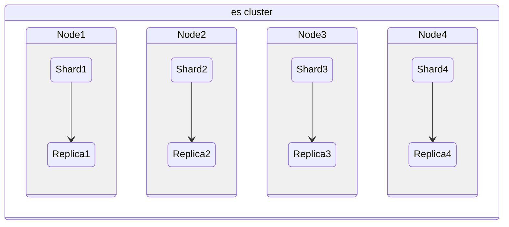
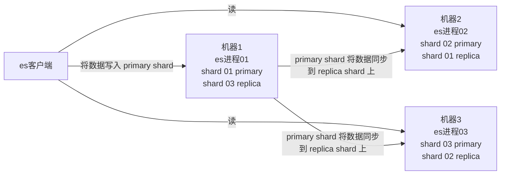
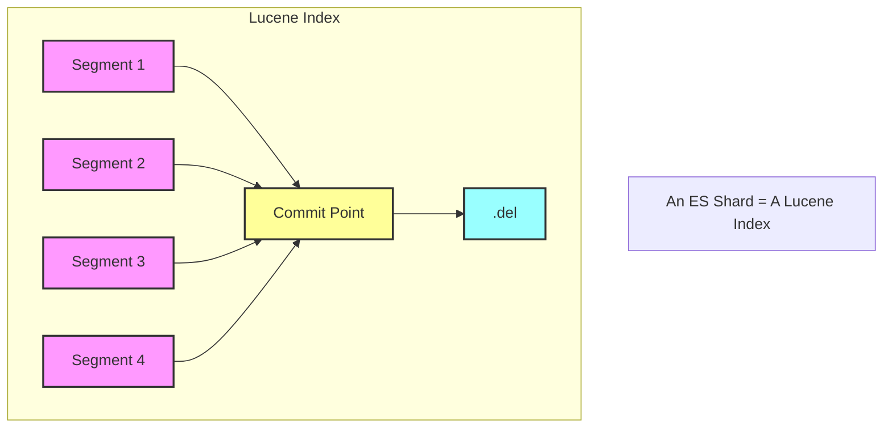

# ElasticSearch

> ElasticSearch是一个基于Lucene的搜索服务器。它提供了一个分布式多用户能力的全文搜索引擎，基于RESTful web接口

- Near Realtime
  - 从写入数据到数据可以被搜索到有一个小延迟，大概是 1s
  - 基于 es 执行搜索和分析可以达到秒级

## 优势

- 横向可扩展
- 分片机制提供更好的分布性
- 高可用

## 安装

> 使用 docker

```shell
docker run elasticsearch:7.3.1
```

```shell
docker network create somenetwork;
docker run -d --name elasticsearch --net somenetwork -p 9200:9200 -p 9300:9300 -e "discovery.type=single-node" elasticsearch:7.3.1
```

9300端口： ES节点之间通讯使用

9200端口： ES节点 和 外部 通讯使用

## 概念

- 集群(cluster)
  - 多个节点组成
- 节点(node)
  - 服务器实例
- 索引（index）
  - Databases 数据库
- ​文档（Document）
  - Row 行
- ​字段（Field）
  - Columns 列
- primary shard
  - es 可以将一个索引中的数据切分为多个 primary shard，分布在多台服务器上存储，以此解决水平扩展问题
- replica shard
  - 任何一个服务器随时可能故障或宕机，此时 primary shard 可能就会丢失，因此可以为每个 primary shard 创建多个 replica shard。replica 可以在 primary shard 故障时提供备用服务，所以同一片 primary shard 跟 replica primary 不能存放在同一节点
- 映射 mapping：类似于 schema



## 数据类型

- text：该类型被用来索引长文本，在创建索引前会将这些文本进行分词，转化为词的组合，建立索引；允许es来检索这些词，text类型不能用来排序和聚合。
- keyword：该类型不需要进行分词，可以被用来检索过滤、排序和聚合，keyword类型自读那只能用本身来进行检索（不可用text分词后的模糊检索）
- 数值型：long、integer、short、byte、double、float
- 日期型：date
- 布尔型：boolean
- 二进制型：binary

## CRUD

- create 操作：如果 ID 不存在，则新增，如果 ID 存在，则更新
- index 操作：如果 ID 不存在，则新增，如果 ID 存在，则删除后新增，版本号会增加
- update 操作：文档必须已存在，更新只会对相应的字段做增量修改

## 批量API

- bulk 操作：批量操作，一次请求可以执行多个操作，包括索引、更新、删除等操作
- mget
- msearch

## 查询

### 指定查询索引

语法|范围
-|-
/_search|集群上所有的索引
/index1/_search|index1
/index1,index-2/_search|index1和index2
/index*/_search|以index开头的索引

### 基本查询

```json
GET /索引库名/_search
{
    "query":{
        "查询类型":{
            "查询条件":"查询条件值"
        }
    }
}
```

- 根据ID查询

`GET http://my-pc:9200/blog/hello/1`

- 根据字段查询

>Term Query为精确查询，在搜索时会整体匹配关键字，不再将关键字分词。 

```json
GET /shop/_search
{
  "_source": ["title","price"],
  "query": {
    "term": {
      "price": 2699
    }
  }
}
```

- queryString查询

```json
{
    "query":{
        "query_string":{
            "default_field":"content",
            "query":"内容"
        }
    }
}
```

**过滤**

- includes：来指定想要显示的字段
- excludes：来指定不想要显示的字段

```json
GET /shop/_search
{
  "_source": {
    "includes":["title","price"]
  },
  "query": {
    "term": {
      "price": 2699
    }
  }
}
```

**排序**

```json
GET /shop/_search
{
  ...
  "sort": [
    {
      "price": {
        "order": "desc"
      }
    }
  ]
}
```

**模糊查询**

```json
GET /heima/_search
{
  "query": {
    "fuzzy": {
        "title": {
            "value":"appla",
            "fuzziness":1
        }
    }
  }
}
```

### term查询与全文查询

- term查询包括 Term Query / Range Query / Exists Query / Prefix Query /Wildcard Query。 是精确查询，用于查找字段中完全匹配指定值的文档。它不进行分词，也就是说，它不会将搜索的词拆分成更小的部分，而是将整个词作为一个单元进行匹配
- 全文查询包括 Match Query / Match Phrase Query / Query String Query / Simple Query String Query。 索引跟查询的时候都会进行分词，查询是根据分词的词项进行底层查询并进行合并，为每个文档生成一个分数

### Function Score Query

可以在查询结束后，对每一个匹配的文档进行一系列的重新算分，根据新生成的分数进行排序。

- Weight：为每一个文档设置一个简单而不被规范化的权重
- Field Value Factor:使用该数值来修改_score
- Random Score:为每一个用户使用一个不同的，随机算分结果
- 衰减函数：以某个字段的值为标准，距离某个值越近，得分越高
- Script Score：自定义脚本完全控制所需逻辑

### Suggester

## 分词

分词器是专门处理分词的组件，Analyzer由三部分组成：

- Character Filters(针对原始文本处理，例如去除html)
- Tokenizer(按照规则切分为单词)
- Token Filter(将切分的的单词进行加工，小写，删除stopwords,增加同义词)

### 内置的分词器

- Standard Analyzer 默认分词器，按词切分，小写处理
- Simple Analyzer 按照非字母切分（符号被过滤），小写处理
- Stop Analyzer 小写处理，停用词过滤(the,a,is)
- Vhitespace Analyzer 按照空格切分，不转小写
- Keyword Analyzer 不分词，直接将输入当作输出
- Patter Analyzer 正则表达式，默认\W+(非字符分隔)
- Language Analyzers 内置 30 种语言的分词器
- Fingerprint Analyzer

### 测试分词

`GET /_analyze`

```json
{
  "analyzer": "standard",
  "text": "中文测试分词"
}
```

### 中文分词器

[下载](https://github.com/medcl/elasticsearch-analysis-ik)

```shell
docker run --name elasticsearch --net somenetwork -v /root/plugin:/usr/share/elasticsearch/plugins -p 9200:9200 -p 9300:9300 -e "discovery.type=single-node" elasticsearch:7.3.1
```

`GET http://my-pc:9200/_analyze`

```json
{
  "analyzer": "ik_max_word",
  "text": "中文测试分词"
}
```

ik 的两种模式：

- max：会将文本做最细粒度的拆分 会穷尽所有的可能
- smart：最最粗粒度的划分

### 自定义分词器

```json
{
  "settings": {
    "analysis": {
      "char_filter": {
        "my_char_filter": {
          "type": "html_strip"
        }
      },
      "tokenizer": {
        "my_tokenizer": {
          "type": "standard"
        }
      },
      "filter": {
        "my_lowercase_filter": {
          "type": "lowercase"
        },
        "my_stop_filter": {
          "type": "stop",
          "stopwords": "_english_"
        }
      },
      "analyzer": {
        "my_custom_analyzer": {
          "type": "custom",
          "char_filter": [
            "my_char_filter"
          ],
          "tokenizer": "my_tokenizer",
          "filter": [
            "my_lowercase_filter",
            "my_stop_filter"
          ]
        }
      }
    }
  },
  "mappings": {
    "properties": {
      "content": {
        "type": "text",
        "analyzer": "my_custom_analyzer"
      }
    }
  }
}
```

## Mapping

Mapping 类似数据库中的schema的定义，作用：

1. 定义索引中的字段的名称
2. 定义字段的数据类型
3. 进行字段，倒排索引的相关配置，(Analyzed or Not Analyzed,Analyzer)

### Dymaic Mapping

当向 Elasticsearch 插入一个新文档时，且文档包含的字段在索引中尚未定义时，Elasticsearch 会自动推断这些字段的数据类型，并在索引中创建相应的映射

新增加字段：

- Dynamic设为true：当有新增字段的文档写入时，Elasticsearch 会自动更新映射（Mapping）。
- Dynamic设为false：映射不会更新，新增加的字段数据无法被索引，但信息会出现在 _source 字段中。
- Dynamic设置为strict：文档写入会失败。

已有字段：

- 一旦已有字段的数据写入后，不再支持修改字段定义。Lucene实现的倒排索引一旦生成后，就不允许修改。
- 如果希望改变字段类型，必须使用 Reindex API 重建索

### Mapping 配置

- index：是否索引，默认为true。如果设置为 false，该字段不可被搜索
- index_options：控制倒排索引记录的内容
  - docs：只记录文档的编号
  - freqs：记录文档编号和词频
  - positions：记录文档编号、词频和词的位置
  - offsets：记录文档编号、词频、词的位置和词的偏移量
- null_value：只有 keyword 类型才支持
- copy_to：将字段值复制到其他字段中

## template

### Index Template

Index Templates 可以帮助设定 Mappings 和 Settings,并按照一定的规则，自动匹配到新创建的索引之上，可以通过设定多个 template，这些设置会被合并在一起，通过指定 order 的数值，来控制合并的过程

### Dymaic Template

用于在索引新文档时，自动根据字段名或字段类型来应用特定的映射规则。它可以在动态映射的基础上提供更细粒度的控制，使得可以指定某些字段的映射类型和其他属性，而不需要事先知道这些字段的名字或类型

```json
{
  "mappings": {
    "dynamic_templates": [
      {
        "date_fields": {
          "match": "date_*",
          "mapping": {
            "type": "date",
            "format": "yyyy-MM-dd"
          }
        }
      }
    ]
  }
}
```

### Search Template

允许预定义查询，并在执行时注入参数。这可以帮助简化复杂查询的重用，并提高性能和可维护性

```json
POST _scripts/my_search_template
{
  "script": {
    "lang": "mustache",
    "source": {
      "query": {
        "bool": {
          "must": [
            {
              "match": {
                "title": "{{title}}"
              }
            },
            {
              "range": {
                "release_date": {
                  "gte": "{{start_date}}",
                  "lte": "{{end_date}}"
                }
              }
            }
          ]
        }
      }
    }
  }
}

```

```json
POST _search/template
{
  "id": "my_search_template",
  "params": {
    "title": "Inception",
    "start_date": "2010-01-01",
    "end_date": "2010-12-31"
  }
}
```

### Index Alias

索引别名可以通过别名实现不停机的索引切换与重建、管理索引的视图与读写权限等

```json
POST /_alias
{
  "actions": [
    {
      "add": {
        "index": "`screen_recorder_log_202406`",
        "alias": "screen_log_now"
      }
    }
  ]
}
```

## 聚合

- Pipeline Aggregation 对其他的聚合结果进行二次聚合
- Matrix Aggregration 支持对多个字段的操作并提供一个结果矩阵

### Bucket Aggregation

一些列满足特定条件的文档的集合(group by)

```json
{
  "size": 0, 
  "aggs": {
      "group": {
          "terms": {
            "field": "sales_person.keyword"
          }
      }
  }
}
```

### Metric Aggregation

一些数学运算，可以对文档字段进行统计分析(count、avg、sum)

```json
{
  "size": 0, 
  "aggs": {
      "avg_amount": {
          "avg": {
            "field": "amount"
          }
      }
  }
}
```

## ES集群

采用ES集群，将单个索引的分片到多个不同分布式物理机器上存储，从而可以实现高可用、容错性

- Master-eligible Node 是指具有成为主节点资格的节点，Master Node 是当前已经被选举为主节点并执行主节点职责的节点，默认情况下，所有节点都是 Master-eligible node
- Data Node 负责存储数据并执行数据相关操作，通过增加 Data Node 可以解决数据水平扩展和数据单点问题
- Coordinating Node 处理来自客户端的请求，分发请求到相关的数据节点，并在所有数据节点上汇总结果后返回给客户端，默认情况下，所有节点都是协调节点

### 架构

es 集群多个节点，会自动选举一个节点为 master 节点。master 节点宕机了，那么会重新选举一个节点为 master 节点

非 master 节点宕机了，那么会由 master 节点，让那个宕机节点上的 primary shard 的身份转移到其他机器上的 replica shard



可以使用三个节点，将索引分成三份，每个节点存放一份primary shard，两份replica，这样就算只剩下一台节点，也能保证服务可用

#### 分片路由

读写文档时会根据 hash 计算出文档所属的分片所在的机器，由接入节点将请求转发到分片所在的机器

#### 索引结构




单个倒排索引文件被称为 Segment Segment是自包含的，不可变更的。多个Segments汇总在一起，称为Lucene的
Index,其对应的就是ES中的Shard

当有新文档写入时，会生成新Segment,查询时会同时查询所有Segments,并且对结果汇总。Lucene中有一个文件，用来记录所有Segments信息，叫做Commit Point

删除的文档信息，保存在“.del”文件中

索引的写入过程：

1. 写入缓存：数据首先被写入内存缓冲区（buffer）和translog日志文件，这时索引尚未生成Segment，且缓存中的数据不可被查询
2. refresh 操作：将数据从内存缓冲区写入操作系统缓存（os cache），生成一个Segment文件并清空缓冲区。同时建立倒排索引，使数据可以被客户端访问。默认每秒执行一次refresh操作。当缓冲区占满时，也会触发refresh操作
3. translog 刷盘：在写缓存的时候，为了避免数据丢失，还会写入到translog中，translog会定时刷盘
4. flush 操作：每隔一段时间或数据量达到一定值会将os cache中的数据以Segment文件形式持久化到磁盘
5. merge 操作：随着时间推移，磁盘上的Segment数量增加，需要定期进行合并

### 搭建

- 配置

```yml
# 集群名称，必须保持一致
cluster.name:  elasticsearch
# 节点的名称
node.name: node-1
# 监听网段
network.host: 0.0.0.0
# 本节点rest服务端口
http.port: 9201
# 本节点数据传输端口
transport.tcp.port: 9301
# 集群节点信息
discovery.seed_hosts: ["127.0.0.1:9301","127.0.0.1:9302","127.0.0.1:9303"]
cluster.initial_master_nodes: ["node-1","node-2","node-3"]
```

另外两个节点配置省略...

### 跨集群搜索

# JAVA客户端

- 依赖

```xml
<dependency>
    <groupId>org.elasticsearch</groupId>
    <artifactId>elasticsearch</artifactId>
    <version>7.3.1</version>
</dependency>

<dependency>
    <groupId>org.elasticsearch.client</groupId>
    <artifactId>transport</artifactId>
    <version>7.3.1</version>
</dependency>
```

- 连接

```java
Settings settings = Settings.builder()
                .put("cluster.name","docker-cluster")
                .build();

TransportClient client = new PreBuiltTransportClient(settings);
client.addTransportAddress(
            new TransportAddress(InetAddress.getByName("my-pc"),9300));
```

- 创建索引

```java
client.admin().indices().prepareCreate("index").get();
```

- 设置映射

```java
XContentBuilder builder = XContentFactory.jsonBuilder()
                .startObject()
                .startObject("article")
                .startObject("properties")
                .startObject("id")
                .field("type", "long")
                .field("store", true)
                .endObject()
                .startObject("title")
                .field("type", "text")
                .field("store", true)
                .field("analyzer", "ik_smart")
                .endObject()
                .startObject("content")
                .field("type", "text")
                .field("store", true)
                .field("analyzer", "ik_smart")
                .endObject()
                .endObject()
                .endObject()
                .endObject();
  client.admin().indices().preparePutMapping("index")
          .setType("article")
          .setSource(builder)
          .get();
```

- 添加文档

```java
XContentBuilder builder = XContentFactory.jsonBuilder()
                .startObject()
                    .field("id",1L)
                    .field("title","央视快评：勇做敢于斗争善于斗争的战士")
                    .field("content","9月3日，习近平总书记在中央党校（国家行政学院）中青年干部培训班开班式上发表重要讲话强调，广大干部特别是年轻干部要经受严格的思想淬炼、政治历练、实践锻炼，发扬斗争精神，增强斗争本领，为实现“两个一百年”奋斗目标、实现中华民族伟大复兴的中国梦而顽强奋斗。")
                .endObject();
client.prepareIndex("index","article","1")
        .setSource(builder)
        .get();
```

- POJO添加文档

```java
Article article = new Article();
        article.setId(3L);
        article.setTitle("3央视快评：勇做敢于斗争善于斗争的战士");
        article.setContent("9月3日3333，（国家行政学院）中青年干部培训班开班式上发表重要讲话强调，广大干部特别是年");
        String json = new ObjectMapper().writeValueAsString(article);

client.prepareIndex("index","article","3")
        .setSource(json, XContentType.JSON)
        .get();
```

## 查询

- 根据ID

```java
QueryBuilder queryBuilder = QueryBuilders.idsQuery().addIds("1","2");
SearchResponse response = client.prepareSearch("index")
        .setTypes("article")
        .setQuery(queryBuilder)
        .get();
SearchHits hits = response.getHits();

System.out.println("总记录:"+hits);
SearchHit[] ret = hits.getHits();

for (SearchHit documentFields : ret) {
    Map<String, Object> map = documentFields.getSourceAsMap();
    System.out.println("id:"+map.get("id"));
    System.out.println("title:"+map.get("title"));
    System.out.println("content:"+map.get("content"));
    System.out.println("-------------------");
}
```

- 根据term

```java
QueryBuilder queryBuilder = QueryBuilders.termQuery("title","斗争");
```

- 根据queryString

```java
QueryBuilder queryBuilder = QueryBuilders.queryStringQuery("青年强调")
                .defaultField("content");
```

- 分页查询

```java
SearchResponse response = client.prepareSearch("index")
                .setTypes("article")
                .setQuery(queryBuilder)
                .setFrom(10)
                .setSize(5)
                .get();
```

- 高亮显示结果

```java
HighlightBuilder highlightBuilder = new HighlightBuilder();
highlightBuilder.field(highlight);
highlightBuilder.preTags("<em>");
highlightBuilder.postTags("</em>");

SearchResponse response = client.prepareSearch("index")
        .setTypes("article")
        .setQuery(queryBuilder)
        .highlighter(highlightBuilder)
        .get();
SearchHits hits = response.getHits();

System.out.println("总记录:"+hits.getTotalHits());
SearchHit[] ret = hits.getHits();

for (SearchHit documentFields : ret) {
    Map<String, Object> map = documentFields.getSourceAsMap();

    System.out.println("id:"+map.get("id"));
    System.out.println("content:"+map.get("content"));
    Map<String, HighlightField> highlightFields = documentFields.getHighlightFields();
    System.out.println(highlightFields.get(highlight).getFragments()[0]);
    System.out.println("-------------------");

}
```

## es操作过程

### 写过程

客户端选择一个协调节点（coordinating node）发送请求，协调节点将请求转发给对应的node
对应的node在primary shard上处理请求，并同步到replica shard上


#### 写过程原理


数据先写入内存 buffer，然后每隔 1s，将数据 refresh 到 os cache，到了 os cache 数据就能被搜索到

每隔 5s，将数据写入 translog 文件（这样如果机器宕机，内存数据全没，最多会有 5s 的数据丢失），translog 大到一定程度，或者默认每隔 30mins，会触发 commit 操作，将缓冲区的数据都 flush 到 segment file 磁盘文件中

### 读过程

客户端选择一个协调节点（coordinating node）发送根据ID查询请求，协调节点会根据id进行哈希，得到doc所在的分片，将请求转发到对应的node
这个node然后会在primary shard与replica中使用随机轮询，进行负载均衡，返回document给协调节点
协调节点再把document返回给客户端

### 搜索过程

客户端发送搜索请求给协调节点，协调节点将这个请求发送给所有的shard
每个shard将自己的搜索结构返回给协调节点
由协调节点进行数据的合并、排序、分页等操作，产出最终结果
接着协调节点根据id再去查询对应的document的数据，返回给客户端

### 删除/更新过程

删除操作，会生成一个对应document id的.del文件，标识这个document被删除
如果是更新操作，就是将原来的 doc 标识为 deleted 状态，然后新写入一条数据

每refresh一次，会生成一个segment file，系统会定期合并这些文件，合并这些文件的时候，会物理删除标记.del的document

## 性能优化

### 杀手锏：filesystem cache


在es中，doc的字段尽量只存储要被搜索的字段，这样可以节省内存，存放更多数据，做缓存效果更好

### 数据预热

对于一些热点数据，也要通过一些方式让它在缓存中

### 冷热分离

保证热点数据都在缓存里，提高系统性能

### doc模型设计

对于一些复杂的关联，最好在应用层面就做好，对于一些太复杂的操作，比如 join/nested/parent-child 搜索都要尽量避免，性能都很差的

### 分页性能优化

由于分页操作是由协调节点来完成的，所以翻页越深，性能越差
解决：

- 不允许深度翻页
- 将翻页设计成不允许跳页，只能一页一页翻

## kibana

Kibana是一个基于Node.js的Elasticsearch索引库数据统计工具，可以利用Elasticsearch的聚合功能，生成各种图表，如柱形图，线状图，饼图等。

而且还提供了操作Elasticsearch索引数据的控制台，并且提供了一定的API提示，非常有利于我们学习Elasticsearch的语法。

- docker

```shell
docker pull kibana:5.6.8 # 拉取镜像
docker run -d --name kibana --net somenetwork -p 5601:5601 kibana:5.6.8 # 启动
```

## SpringDataElasticSearch

### 配置

```xml
<?xml version="1.0" encoding="UTF-8"?>
<beans xmlns="http://www.springframework.org/schema/beans"
       xmlns:xsi="http://www.w3.org/2001/XMLSchema-instance"
       xmlns:jpa="http://www.springframework.org/schema/data/jpa"
       xmlns:elasticsearch="http://www.springframework.org/schema/data/elasticsearch"
       xsi:schemaLocation="http://www.springframework.org/schema/beans
     https://www.springframework.org/schema/beans/spring-beans.xsd
     http://www.springframework.org/schema/data/jpa
     https://www.springframework.org/schema/data/jpa/spring-jpa.xsd http://www.springframework.org/schema/data/elasticsearch http://www.springframework.org/schema/data/elasticsearch/spring-elasticsearch.xsd">

    <elasticsearch:transport-client id="esClient" cluster-name="docker-elasticsearch"
                                    cluster-nodes="my-pc:9300"/>
    <elasticsearch:repositories base-package="wang.ismy.es"/>
    <bean id="elasticsearchTemplate" class="org.springframework.data.elasticsearch.core.ElasticsearchTemplate">
        <constructor-arg name="client" ref="esClient"/>
    </bean>

</beans>
```

```java
@Document(indexName = "index1",type = "article")
@Data
public class Article {

    @Id
    @Field(type = FieldType.Long,store = true)
    private long id;

    @Field(type = FieldType.Text,store = true)
    private String title;

    @Field(type = FieldType.Text,store = true)
    private String content;

}
```

```java
@Repository
public interface ArticleDao extends ElasticsearchRepository<Article,Long> { }
```

### 创建索引

```java
ElasticsearchTemplate template = context.getBean(ElasticsearchTemplate.class);
template.createIndex(Article.class);
```

### 添加文档

```java
Article article = new Article();
article.setId(1L);
article.setTitle("【中国稳健前行】“中国之治”的政治保证");
article.setContent("新中国成立70年来，在中国共产党的坚强领导下，...");
articleDao.save(article);
```

### 删除文档

```java
articleDao.deleteById(1L);
articleDao.deleteAll(); // 全部删除
```

### 修改文档

同添加文档

### 查询

- 查询全部

```java
articleDao.findAll().forEach(System.out::println);
```

- 根据ID

```java
System.out.println(articleDao.findById(2L).get());
```

### 自定义查询

```java
@Repository
public interface ArticleDao extends ElasticsearchRepository<Article,Long> {

    List<Article> findAllByTitle(String title);
}
```

- 分页查询

```java
List<Article> findAllByTitle(String title, Pageable pageable);
articleDao.findAllByTitle("中", PageRequest.of(0,5)).forEach(System.out::println);
```

- 原生查询

```java
NativeSearchQuery query = new NativeSearchQueryBuilder()
        .withQuery(QueryBuilders.queryStringQuery("中国").defaultField("title"))
        .withPageable(PageRequest.of(0,5))
        .build();
template.queryForList(query,Article.class).forEach(System.out::println);
```
