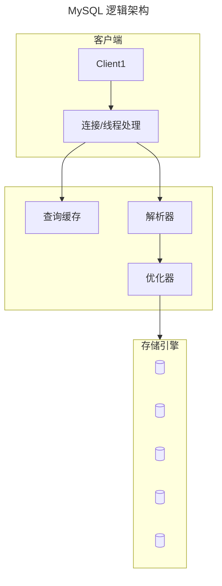

# MYSQL

## 逻辑架构



取数据和发数据的流程：

1. 获取一行，写到 net_buffer 中。这块内存的大小是由参数 net_buffer_length 定义的，默认是 16k
2. 重复获取行，直到 net_buffer 写满，调用网络接口发出去
3. 如果发送成功，就清空 net_buffer，然后继续取下一行，并写入 net_buffer
4. 如果发送函数返回 EAGAIN 或 WSAEWOULDBLOCK，就表示本地网络栈（socket send buffer）写满了，进入等待。直到网络栈重新可写，再继续发送

## 日志机制

在数据更新写日志的时候，是先预提交写 redolog 和写 binlog，提交事务后再把redolog 改成提交状态。要两阶段提交写的原因就是为了避免极端情况下两个日志的数据不一致

### redo log

- innodb 的日志
- 记录的是修改后的值 无论是否提交都会被记录
- 先写日志 再刷磁盘


作用是在数据库崩溃时，用来恢复事务提交之前的数据修改，是一个循环写的日志文件，不断地被填写，当写满时，重新从开头开始覆盖。write pos 是当前记录的位置，一边写一边后移，写到第 3 号文件末尾后就回到 0 号文件开头。checkpoint 是当前要擦除的位置，也是往后推移并且循环的，擦除记录前要把记录更新到数据文件

InnoDB 有一个后台线程，每隔 1 秒，就会把 redo log buffer 中的日志，调用 write 写到文件系统的 page cache，然后调用 fsync 持久化到磁盘，除此之外，redo log buffer 占用的空间即将达到 innodb_log_buffer_size 一半的时候，后台线程会主动写盘，另一种是，并行的事务提交的时候，顺带将这个事务的 redo log buffer 持久化到磁盘

控制 redo log 的写入策略（innodb_flush_log_at_trx_commit 参数）：

- 设置为 0 的时候，表示每次事务提交时都只是把 redo log 留在 redo log buffer 中 
- 设置为 1 的时候，表示每次事务提交时都将 redo log 直接持久化到磁盘
- 设置为 2 的时候，表示每次事务提交时都只是把 redo log 写到 page cache

组提交：

日志逻辑序列号（log sequence number，LSN），单调递增的，用来对应 redo log 的一个个写入点。每次写入长度为 length 的 redo log， LSN 的值就会加上 length

通过一次性写入多个事务的 redo log，来提升写入效率

### undo log

- innodb 的日志
- 事务发生前的数据版本
- 用于回滚
- 提供MVVC下的读 即非锁定读

作用是在事务回滚时，用来撤销已经提交的事务所做的数据修改。undo log是在内存中缓存的

### bin log

- 可用于主从复制
- 二进制形式记录所有修改数据库的操作
- 可用于数据快照还原
- 提交事务记录binlog 定时刷磁盘

事务执行时，binlog 是先写入到线程自己的 binlog cache 中，事务提交的时候，执行器把 binlog cache 里的完整事务写入到 binlog 中（先 write 到操作系统的 page cache，后再 fsync 到磁盘上）

- sync_binlog=0 的时候，表示每次提交事务都只 write，不 fsync
- sync_binlog=1 的时候，表示每次提交事务都会执行 fsync
- sync_binlog=N(N>1) 的时候，表示每次提交事务都 write，但累积 N 个事务后才 fsync

## 锁机制

- MyISAM采用表级锁(table-level locking)。
- InnoDB支持行级锁(row-level locking)和表级锁,默认为行级锁

对比

- 表级锁： MySQL中锁定粒度最大的一种锁，对当前操作的整张表加锁，实现简单，资源消耗也比较少，加锁快，不会出现死锁。其锁定粒度最大，触发锁冲突的概率最高，并发度最低，MyISAM和 InnoDB引擎都支持表级锁。
- 行级锁： MySQL中锁定 粒度最小的一种锁，只针对当前操作的行进行加锁。 行级锁能大大减少数据库操作的冲突。其加锁粒度最小，并发度高，但加锁的开销也最大，加锁慢，会出现死锁。

MySQL的锁释放是在COMMIT或者ROLLBACK时释放的。隐式锁定是存储引擎根据隔离级别自动进行，但也可以进行显式锁定：

```sql
SELECT ... LOCK IN SHARE MODE; -- 任何时候都不要手动加锁
```

### 全局锁

MySQL 提供了一个加全局读锁的方法，命令是 Flush tables with read lock (FTWRL)，锁了之后整个数据库全局就是只读

mysqldump 在备份时使用参数–single-transaction 的时候，导数据之前就会启动一个事务，来确保拿到一致性视图，但只有支持事务的引擎才能用这个参数

### 表级锁

- lock tables … read/write：使用了之后在本线程之内只能操作这条语句指定的表及读写类型
- 元数据锁（MDL）：主要防止修改表结构的同时其他事务修改数据，事务中的 MDL 锁，在语句执行开始时申请，但是语句结束后并不会马上释放，而会等到整个事务提交后再释放

为了防止拿不到元数据锁一直等待：一些 MySQL 的分支支持NOWAIT/WAIT n 这个语法，等待一段时间拿不到锁就终止 DDL 语句

MySQL 5.6 后支持了 online ddl 可以不阻塞读写：

1. 拿MDL写锁
2. 降级成MDL读锁
3. 真正做DDL
4. 升级成MDL写锁
5. 释放MDL锁

#### DDL 机制

在使用 alter table 语句时，可以通过关键字 algorithm 来指定使用什么类型的 DDL：

- DEFAULT：默认方式，不同的 DDL 类型，默认的执行方式可能不一样。MySQL 会以该 DDL 开销最低的方式来选择默认的执行方式。
- INSTANT：MySQL 8.0 新加的执行方式，使用这种执行方式时，添加字段和删除字段时不需要重建表。ALGORITHM 指定为 INSTANT 时，不能再指定 LOCK 关键字。
- INPLACE：Online DDL。使用 INPLACE 时，默认不锁表。这里的不锁表，是指重建表时复制数据的过程中，或创建二级索引时读取全表数据进行排序、生成索引的过程中不锁表。但是在复制数据或生成索引的过程中，表上会有新的 DML 修改数据，这些修改会记录到一个在线的变更日志中。InnoDB 需要将变更日志中的内容更新到新的表或索引中，而这个过程中是会锁表的。
- COPY：传统的 DDL 执行方式，执行过程中会锁表，默认锁模式为 SHARED，应用程序可以读取表中的数据，但是不能写入数据。如果 LOCK 指定为 EXCLUSIVE，那么读操作也会被阻塞

关键字 LOCK 可以指定为 NONE、SHARED 或 EXCLUSIVE，如果不指定，就会根据具体的 DDL 语句、指定的 ALGORITHM 来确定一个默认的锁级别

Instant DDL：

Instant DDL 操作通过直接修改表的元数据，而不改变实际数据存储。这意味着无需重建表，因此操作非常快速。如果添加列或者删除列，不会影响到实际的数据存储格式，就能通过 Instant DDL 完成。每次使用 Instant DDL 操作时，表的行版本会增加。当行版本数达到 64 时，无法再执行 Instant DDL，需要使用其他方式（如 INPLACE 或 COPY）来执行操作。Instant DDL 也需要获取表的元数据锁（MDL）

### 行锁

InnoDB 事务中，行锁是在需要的时候才加上，要等到事务结束时才释放

为了解决死锁，有两种策略：

1. 获取锁时直接进入等待，直到超时，使用参数innodb_lock_wait_timeout，但是这个时间很难控制
2. 检测到死锁时，自动中断，每次获取一个行锁都要判断会不会因为自己的加入而导致死锁，如果有热点数据，每个线程都要去检测一下，这容易导致CPU飙高

所以死锁最好的解决方案应该是从业务上来解决，保证业务操作不会产生死锁，另外一个较次一点的方案是控制并发度，这样也不会导致CPU飙高

### 间隙锁

锁定一个范围，不包括记录本身 防止这个区间的数据插入 通过锁定一个范围来避免其他并发事务的修改，从而解决[幻读](/中间件/数据库/数据库系统/事务管理/事务.md#幻读)问题

间隙锁是在可重复读隔离级别下才会生效的。间隙锁的引入，可能会导致同样的语句锁住更大的范围，这其实是影响了并发度的

### Next-key lock

行锁 + 间隙锁 = 锁定一个范围，包含记录本身

### Insert Intention Locks

插入意向锁 insert前执行，也是一种间隙锁

### AUTO-INC Locks

一种特殊的表级锁，如果一个事务正在将值插入表中，则任何其他事务都必须等待才能向该表中执行自己的插入操作

### Predicate Locks 

在空间索引中被使用

### 锁相关统计信息

```sql
show status like '%innodb_row_lock%';
```

- Innodb_row_lock_current_waits：当前正在等待锁的事务数量
- Innodb_row_lock_time：从系统启动到现在发生锁定的总时间
- Innodb_row_lock_time_avg：从系统启动到现在发生锁等待的平均时间
- Innodb_row_lock_time_max：从系统启动到现在发生锁等待的最大时间
- Innodb_row_lock_waits：从系统启动到现在发生等待的次数

```sql
SHOW ENGINE INNODB STATUS; -- 关注结果中 TRANSACTIONS 段落
```

### 锁、事务相关的表

当前事务执行情况：

- [INFORMATION_SCHEMA.INNODB_TRX](https://dev.mysql.com/doc/refman/8.0/en/information-schema-innodb-trx-table.html)

锁信息：

- [PERFORMANCE.DATA_LOCKS](https://dev.mysql.com/doc/refman/8.0/en/performance-schema-data-locks-table.html)

锁等待信息：

- [PERFORMANCE.DATA_LOCKS_WAITS](https://dev.mysql.com/doc/refman/8.0/en/performance-schema-data-lock-waits-table.html)

#### 事务与锁情况分析

```sql
SELECT
  waiting_trx_id,
  waiting_pid,
  waiting_query,
  blocking_trx_id,
  blocking_pid,
  blocking_query
FROM sys.innodb_lock_waits;
```

### insert 相关的锁

- insert … select 在可重复读隔离级别下，这个语句会给 select 的表里扫描到的记录和间隙加读锁
- insert 语句如果出现唯一键冲突，会在冲突的唯一值上加共享的 next-key lock(S 锁)
- insert 和 select 的对象是同一个表，则有可能会造成循环写入，所以这种语句在执行会创建一个临时表

## [MVCC](/中间件/数据库/数据库系统/事务管理/事务.md#多版本并发控制)

## 用户及权限管理

- 创建一个能在主机登录的用户
  
```sql
create user 'user2'@'%' identified by '123';
```

- 授予权限

```sql
grant all on *.* to 'user2'@'%';
```

grant 语句会同时修改数据表和内存，判断权限的时候使用的是内存数据，如果直接操作了系统权限表，此时数据表和内存的数据就会不一致，此时就需要 flush privileges

## 事务

MySQL使用一个变量控制是否采用自动提交：

```sql
SHOW VARIABLES LIKE 'AUTOCOMMIT';
```

但对于不支持事务的引擎，如MyISAM或者内存表，或者执行DDL等操作，默认也会自动提交。

MySQL设置隔离级别：

```sql
SET SESSION TRANSACTION ISOLATION LEVEL READ COMMITTED;
```

### 问题

#### Lock wait timeout exceeded

该问题是由于某个事务执行时间过长，而导致其他事务无法获取相对应的锁，其他事务在等待一定时间后，则会出现这个问题。

可通过调高 innodb_lock_wait_timeout 变量来增加超时时间。

但为了解决根本问题，还是要避免长事务的出现，可以考虑通过缩小事务的粒度以及减少事务的执行时间来解决，尽量避免在事务里执行耗时的操作，如大量调用远程接口。

一个远程接口调用过长导致的长事务超时案例：

预警在落库时，会经过一连串数据处理流程，这个流程就包括调用其他系统的资源对数据进行清洗完善，大部分接口返回响应很快，但唯独有一个接口等待响应的时长要几十秒，由于外部系统的不稳定，这就可能导致一下子出现大量事务超时的线程，为了能让流程正常地走下去，我们对外部接口做了发生超时时自动熔断并降级的功能，也就是这个接口不去调用了，当然是会影响数据的清洗，但相比实时的预警没法被民警处理，这种信息的缺失是可以接受的。同时后台也会开个异步的任务去刷这个数据。

#### Spring的事务与MySQL的事务

Spring所表达的含义就是根据规则来决定要不要事务，怎么创建事务。

1、spring里面，方法嵌套调用外层读取数据和内层读取数据效果与数据库隔离级别的关系。

## 高可用性

### 影响可用性的原因

- 运行环境
  - 磁盘耗尽..
- 开发问题
  - 糟糕的SQL、Schema、索引
- 主备复制不一致
- 人工对数据的变更

### 实现高可用

- 规范、监控人为的错误
- 快速恢复

### 复制

- 共享存储设备([SAN](https://zh.wikipedia.org/wiki/%E5%AD%98%E5%82%A8%E5%8C%BA%E5%9F%9F%E7%BD%91%E7%BB%9C))
- 磁盘复制技术
- MySQL自带的同步复制

### 故障转移与恢复

- 提升备库为主库
- 虚拟IP转移
- 引入新的中间件，但又同时引入了单点隐患
- 在客户端进行转移

### 健康检测

- select 1：这种只能探测数据库实例是否正常，当 InnoDB 并发线程数过多导致的系统不可用，这种方式没法判断
- 为了检测存储引擎可用状况，可以放入一张表，定时往这张表写数据来判断健康状态，为了避免主从同时更新数据造成冲突，一台数据库实例独占自己的一行
- 第三种方式是使用 performance_schema 库，通过里面的指标来判断

## 相关文件说明

文件名                | 类型  | 说明
------------------ | --- | --------------------------------------------------------------------
performance_schema | 文件夹 | 数据库， MySQL 的数据字典
mysql              | 文件夹 | 数据库，MySQL 的数据字典
sys                | 文件夹 | 数据库， SQL 数据字典
my.cnf             | 文件  | 参数文件，默认是从/etc/my.cnf中读取 也可自定义
auto.cnf           | 文件  | MySQL 启动时如果没有UUID就会生成这个文件
binlog.00000x      | 文件  | 二进制日志，即binlog ，数据变化都会在里面记录。如果是在从库，还会有相应的relay log
binlog.index       | 文件  | binlog的索引文件，里面记录相应的bin log名称
mysqld.pid         | 文件  | MySQL服务的进程号
mysqld.log         | 文件  | MySQL日志，记录数据库启动日志、服务端日志，有的公司会将其命名为error.log
Ibtmpx             | 文件  | 临时表的表空间，由innodb_temp_data_file_path变量控制
ibdata1            | 文件  | 系统表空间，由innodb_data_file_path变量控制
undo_00x           | 文件  | undo表空间
mysql.ibd          | 文件  | mysql库中系统表与数据字典的表空间
ib_logfilex        | 文件  | InnoDB特有，redo文件
ib_buffer_pool     | 文件  | 关闭MySQL时，会把内存中的热数据保存在该文件中，从而提高使用率和性能
slow.log           | 文件  | 慢查询日志
xxx.pem            | 文件  | SSL相关文件
mysql.sock         | 文件  | 本地服务器的套接字文件使用UNIX domain socket作为通讯协议的载体，比TCP更快 用于从客户端到本地服务器来进行交换数据。
ib_16384_x.dblwr   | 文件  | doublewrite 文件，格式为#ib_page_size_file_number.dblwr

## 内存结构

[MySQL内存结构](https://www.cnblogs.com/kissdb/p/4009614.html)

## 参数设置

### general

- datadir=/var/lib/mysql
	- 数据文件存放的目录
- socket=/var/lib/mysql/mysql.sock
	- mysql.socket表示server和client在同一台服务器，并且使用localhost进行连接，就会使用socket进行连接
- pid_file=/var/lib/mysql/mysql.pid
	- 存储mysql的pid
- port=3306
	- mysql服务的端口号
- default_storage_engine=InnoDB
	- mysql存储引擎
- skip-grant-tables
	- 当忘记mysql的用户名密码的时候，可以在mysql配置文件中配置该参数，跳过权限表验证，不需要密码即可登录mysql

### character

- character_set_client
	- 客户端数据的字符集
- character_set_connection
	- mysql处理客户端发来的信息时，会把这些数据转换成连接的字符集格式
- character_set_results
	- mysql发送给客户端的结果集所用的字符集
- character_set_database
	- 数据库默认的字符集
- character_set_server
	- mysql server的默认字符集

### connection

- max_connections
	- mysql的最大连接数，如果数据库的并发连接请求比较大，应该调高该值
- max_user_connections
	- 限制每个用户的连接个数
- back_log
	- mysql能够暂存的连接数量，当mysql的线程在一个很短时间内得到非常多的连接请求时，就会起作用，如果mysql的连接数量达到max_connections时，新的请求会被存储在堆栈中，以等待某一个连接释放资源，如果等待连接的数量超过back_log,则不再接受连接资源
- wait_timeout
	- mysql在关闭一个非交互的连接之前需要等待的时长
- interactive_timeout
	- 关闭一个交互连接之前需要等待的秒数

### log

- log_error
	指定错误日志文件名称，用于记录当mysqld启动和停止时，以及服务器在运行中发生任何严重错误时的相关信息
- log_bin
	指定二进制日志文件名称，用于记录对数据造成更改的所有查询语句
- binlog_do_db
	指定将更新记录到二进制日志的数据库，其他所有没有显式指定的数据库更新将忽略，不记录在日志中
- binlog_ignore_db
	指定不将更新记录到二进制日志的数据库
- sync_binlog
	指定多少次写日志后同步磁盘
- general_log
	是否开启查询日志记录
- general_log_file
	指定查询日志文件名，用于记录所有的查询语句
- slow_query_log
	是否开启慢查询日志记录
- slow_query_log_file
	指定慢查询日志文件名称，用于记录耗时比较长的查询语句
- long_query_time
	设置慢查询的时间，超过这个时间的查询语句才会记录日志
- log_slow_admin_statements
	是否将管理语句写入慢查询日志

### cache

- key_buffer_size
	索引缓存区的大小（只对myisam表起作用）
- sort_buffer_size
	每个需要排序的线程分派该大小的缓冲区
- max_allowed_packet=32M
	限制server接受的数据包大小
- join_buffer_size=2M
	表示关联缓存的大小
- thread_cache_size
	- Threads_cached：代表当前此时此刻线程缓存中有多少空闲线程
	- Threads_connected：代表当前已建立连接的数量
	- Threads_created：代表最近一次服务启动，已创建现成的数量，如果该值比较大，那么服务器会一直再创建线程
	- Threads_running：代表当前激活的线程数

### innodb

- innodb_buffer_pool_size=
	该参数指定大小的内存来缓冲数据和索引，最大可以设置为物理内存的80%
- innodb_flush_log_at_trx_commit
	主要控制innodb将log buffer中的数据写入日志文件并flush磁盘的时间点，值分别为0，1，2
- innodb_thread_concurrency
	设置innodb线程的并发数，默认为0表示不受限制，如果要设置建议跟服务器的cpu核心数一致或者是cpu核心数的两倍
- innodb_log_buffer_size
	此参数确定日志文件所用的内存大小，以M为单位
- innodb_log_file_size
	此参数确定数据日志文件的大小，以M为单位
- innodb_log_files_in_group
	以循环方式将日志文件写到多个文件中
- read_buffer_size
	mysql读入缓冲区大小，对表进行顺序扫描的请求将分配到一个读入缓冲区
- read_rnd_buffer_size
	mysql随机读的缓冲区大小
- innodb_file_per_table
	此参数确定为每张表分配一个新的文件

