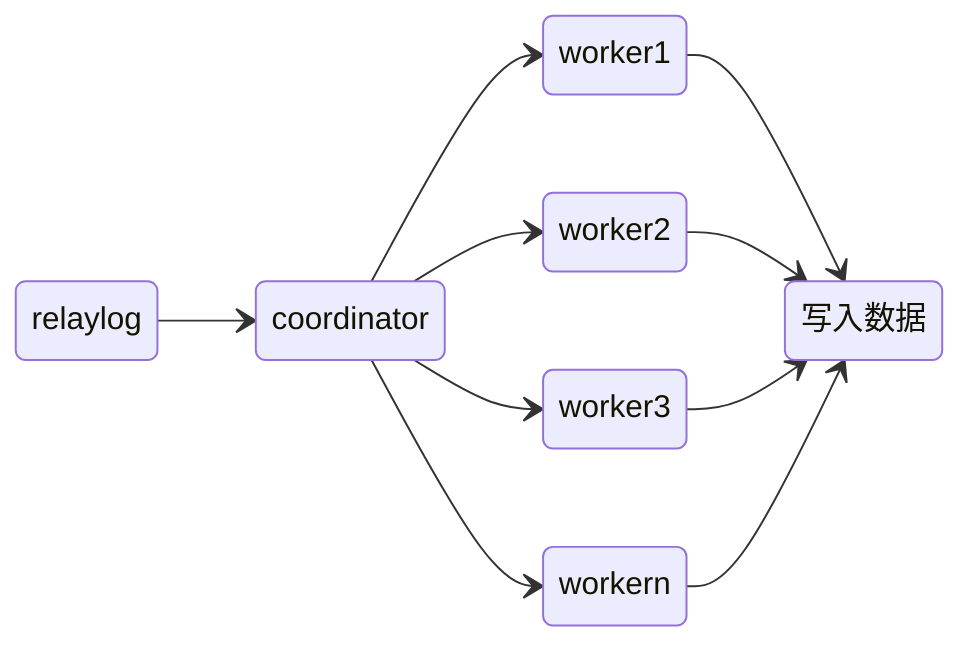
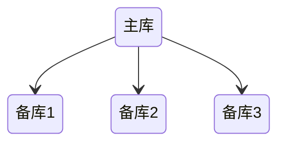
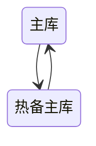
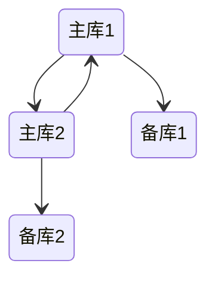
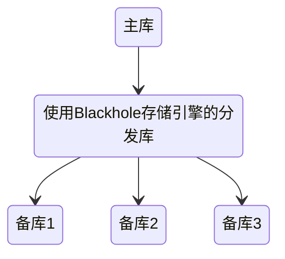
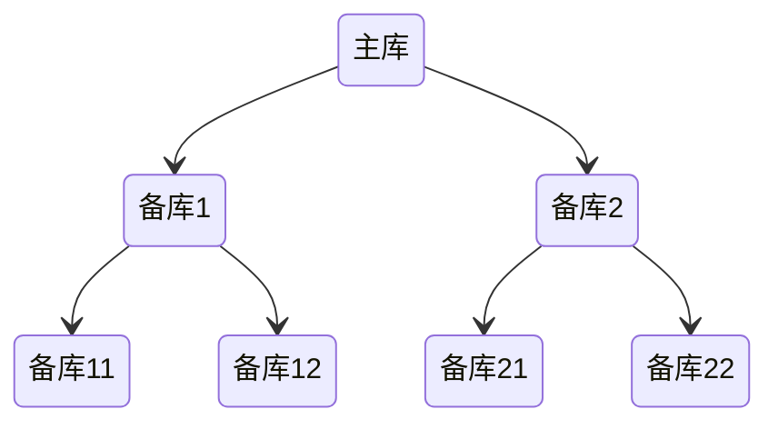

# 复制

解决的问题：

- 分布式数据
- 负载均衡压力
- 对于备份的补充
- 故障切换

## 主从复制


- binlog线程：将master服务器上的数据写入binlog
- io线程：读取master的binlog到replica的relay log（中继日志）
- sql线程：读取中继日志，将数据写入到replica

这种架构实现了获取与重放的解耦 但代价是主库上并行的操作，在从库上会串行执行，所以从库会有一定的数据延迟

### 复制方式

#### 基于语句

这种方式只要把造成数据变化的SQL发送到从库执行即可，实现简单，但有一些限制，如依赖于触发器、当前时间等的语句执行

#### 基于行

重放的是修改后的数据，某些情况下比基于语句高效，同时几乎可以处理所有的复制场景

这种方式的优点在于可以回滚掉更新，缺点就是需要占用较大的空间

#### mixed

MySQL 自己会判断 SQL 语句是否可能引起主备不一致，如果有可能，就用基于行的格式，否则就用基于语句的格式

### 半同步复制与并行复制

- 半同步复制是主库接收到一个写命令会将这个写命令同步给从库，只有当收到至少一个从库的ack确认，才会认为写操作完成 使用`rpl_semi_sync_master_wait_slave_count`参数指定需要收到多少从库的确认才认为写操作完成。`rpl_semi_sync_master_wait_point`参数控制主库执行事务的线程，是在提交事务之前（AFTER_SYNC）等待复制，还是在提交事务之后（AFTER_COMMIT）等待复制
- 并行复制，指的是从库开启多个线程，并行读取 relay log 中不同库的日志，然后并行重放不同库的日志



由于这个特性，所以做主从分离写代码可能需要注意插入的数据，可能不一定能马上查到

为了保证一致性，coordinator 在分发的时候，需要满足以下这两个基本要求：

1. 不能造成更新覆盖。这就要求更新同一行的两个事务，必须被分发到同一个 worker 中
2. 同一个事务不能被拆开，必须放到同一个 worker 中

MySQL 的并行复制策略，由参数 slave-parallel-type 来控制：

- 配置为 DATABASE：根据库名的哈希结果分配 worker，如果主库中的表都放在同一个库中，或者不同库的热点不同，这种策略就会退化成跟单线程差不多
- 配置为 LOGICAL_CLOCK：根据事务所处的状态，来决定是否可以提交给 worker 并行处理

另外一个参数是 binlog-transaction-dependency-tracking，控制的是基于 WRITESET 的并行复制策略：

- COMMIT_ORDER：根据事务所处的状态判断要不要并行
- WRITESET：表示的是对于事务涉及更新的每一行，计算出这一行的 hash 值，组成集合 writeset。如果两个事务没有操作相同的行，也就是说它们的 writeset 没有交集，就可以并行
- WRITESET_SESSION，是在 WRITESET 的基础上多了一个约束，即在主库上同一个线程先后执行的两个事务，在备库执行的时候，要保证相同的先后顺序

### 复制配置

- master配置

```conf
server_id=177  ###服务器id
log-bin=mysql-bin   ###开启日志文件
```

```sh
show master status; # 查看master日志与当前日志位置
```

- slave配置

```conf
server_id=178  ###从服务器server_id
log-bin=mysql-bin  ###日志文件同步方式
binlog_do_db=test   ###同步数据库
```

为了防止自己复制自己 这个server_id 会起标识作用 MySQL会忽略来源于id与本身id相同的事件

```sh
show slave status;
```

- 从服务器执行

```sh
change master to master_host='192.168.182.131',master_user='root',master_password='123',   master_log_file='mysql-bin.000002',master_log_pos=0;
```

```sh
start slave
```

### 复制文件

- mysql-bin.index MySQL依赖这个文件识别二进制日志
- mysql-relay-bin-index 中继日志的索引文件
- master.info 备库所保存的主库信息
- relay-log.info 日志坐标

### 复制过滤


### 复制拓扑

基本原则：

- 每个备库只能有一个主库
- 每个备库都需要有唯一的server_id
- 备库可以作为主库

#### 一主多备



- 简单

#### 主主复制

##### 主动-主动


- 若是对同一份数据 两边写入肯定会出现冲突
- 更多地 这种方式要求两个主库负责不同部分的数据写入
- 总体而言 坏处大于好处

##### 主动-被动

使用被动主库来完成热备、故障转移的功能



##### 加上备库



#### 环形复制

- 失效风险大大提高

为了避免无限复制，在传递数据的时候也要传递数据的所属源服务器ID，这样在进行数据写入时，如果发现这个源ID跟自身ID一样，可以通过ignore server ids过滤掉

#### 分发库

- 在备库较多时降低主库压力



Blackhole存储会接收数据，但不会存储数据



### 容量规划

备库的增加并不能线性增加读操作，同时增加了备库，也会加重主库的写负载

#### 延迟计算

停掉备库一小时的数据同步，看其能在多久的时间追赶上

#### 冗余容量规划

预备一些多余的处理能力 以备负载尖峰

### 复制治理

#### 监控

```sql
SHOW MASTER LOGS; -- 查看二进制记录及其位置
SHOW BINLOG EVENTS IN 'mysql-bin.000134' FROM 950567650; -- 查看指定日志指定偏移量后的内容
```

#### 主从延迟

延迟的监控：

```sql
SHOW SLAVE STATUS; -- Seconds_behind_master：表示当前备库延迟了多少秒
```

另外一种方式是通过在主库每秒更新一个时间戳 在备库上使用当前时间减去这个时间戳来得到延迟了多久

主从延迟的原因：

1. 备库所在机器的性能要比主库所在的机器性能差
2. 备库的压力大
3. 主库大事务执行时间过长导致传递到备库花的时间更多

前两种本质上都是备库的能力跟不上，导致数据积压

#### 主从一致性检测

- pt-table-checksum

#### 重新同步

- pt-table-sync

#### 备库提升为主库

可靠性优先策略：

- 停止对主库写入
- 等备库追上主库
- 将备库设置为其他库的主库
- 开启写入

可用性优先策略，可能出现数据不一致：不等主备数据同步，直接把连接切到备库，并且让备库直接可以读写

两种策略本质上还是CAP的取舍

主备切换的操作有两种方式：

1. 基于位点：通过备库指定要同步的binlog的绝对位置来进行，但可能由于日志重复，会发生错误，此时通过参数 sql_slave_skip_counter 来跳过错误的事务，或者通过 slave_skip_errors 参数跳过指定类型的错误
2. 基于 GTID：GTID 是一个事务在提交的时候生成的，是这个事务的唯一标识，每个数据库实例都会维护自己的一份已提交的 GTID 集合

```
主库算出自己的 GTID 集合与备库的 GTID 集合的差集
判断 主库本地是否包含了这个差集需要的所有 binlog 事务
如果不包含，表示主库已经把备库需要的 binlog 给删掉了，直接返回错误
如果确认全部包含，主库从自己的 binlog 文件里面，找出第一个不在备库的 GTID 集合的事务，发给备库，备库就从这个事务开始复制
```

## 读写分离

主服务器处理写操作以及实时性要求比较高的读操作，而从服务器处理读操作

读写分离提高性能的原因：

- 缓解了锁的争用
- 从服务器只做读，资源利用率更高
- 增加冗余数据，提高可用性