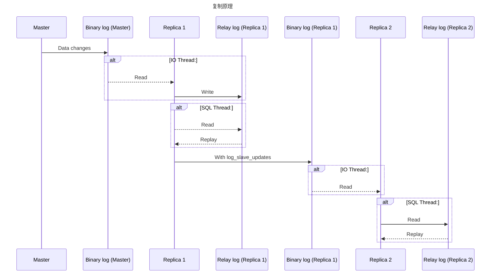
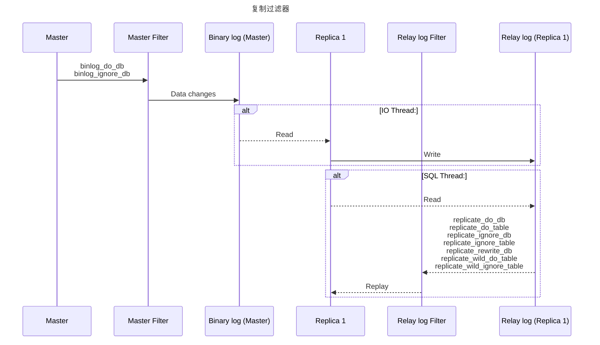
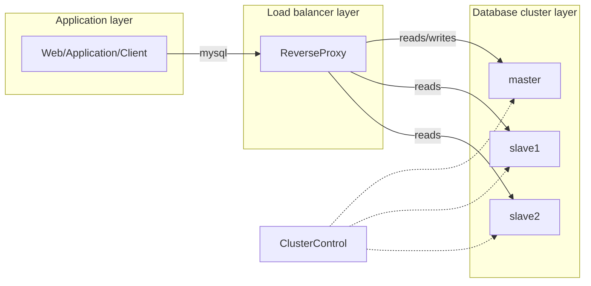

# 复制

解决的问题：

- 分布式数据
- 负载均衡压力
- 对于备份的补充
- 故障切换

## 主从复制



- binlog线程：将master服务器上的数据写入binlog
- io线程：读取master的binlog到replica的relay log（中继日志）
- sql线程：读取中继日志，将数据写入到replica

这种架构实现了获取与重放的解耦 但代价是主库上并行的操作，在从库上会串行执行，所以从库会有一定的数据延迟

### 复制方式

#### 基于语句

这种方式只要把造成数据变化的SQL发送到从库执行即可，实现简单，但有一些限制，如依赖于触发器、当前时间等的语句执行

#### 基于行

重放的是修改后的数据，某些情况下比基于语句高效，同时几乎可以处理所有的复制场景

这种方式的优点在于可以回滚掉更新，缺点就是需要占用较大的空间

#### mixed

MySQL 自己会判断 SQL 语句是否可能引起主备不一致，如果有可能，就用基于行的格式，否则就用基于语句的格式

### 半同步复制与并行复制

- 半同步复制是主库接收到一个写命令会将这个写命令同步给从库，只有当收到至少一个从库的ack确认，才会认为写操作完成 使用`rpl_semi_sync_master_wait_slave_count`参数指定需要收到多少从库的确认才认为写操作完成。`rpl_semi_sync_master_wait_point`参数控制主库执行事务的线程，是在提交事务之前（AFTER_SYNC）等待复制，还是在提交事务之后（AFTER_COMMIT）等待复制
- 并行复制，指的是从库开启多个线程，并行读取 relay log 中不同库的日志，然后并行重放不同库的日志


由于这个特性，所以做主从分离写代码可能需要注意插入的数据，可能不一定能马上查到

为了保证一致性，coordinator 在分发的时候，需要满足以下这两个基本要求：

1. 不能造成更新覆盖。这就要求更新同一行的两个事务，必须被分发到同一个 worker 中
2. 同一个事务不能被拆开，必须放到同一个 worker 中

MySQL 的并行复制策略，由参数 slave-parallel-type 来控制：

- 配置为 DATABASE：根据库名的哈希结果分配 worker，如果主库中的表都放在同一个库中，或者不同库的热点不同，这种策略就会退化成跟单线程差不多
- 配置为 LOGICAL_CLOCK：根据事务所处的状态，来决定是否可以提交给 worker 并行处理

另外一个参数是 binlog-transaction-dependency-tracking，控制的是基于 WRITESET 的并行复制策略：

- COMMIT_ORDER：根据事务所处的状态判断要不要并行
- WRITESET：表示的是对于事务涉及更新的每一行，计算出这一行的 hash 值，组成集合 writeset。如果两个事务没有操作相同的行，也就是说它们的 writeset 没有交集，就可以并行
- WRITESET_SESSION，是在 WRITESET 的基础上多了一个约束，即在主库上同一个线程先后执行的两个事务，在备库执行的时候，要保证相同的先后顺序

### 复制配置

- master配置

```conf
server_id=177  ###服务器id
log-bin=mysql-bin   ###开启日志文件
```

```sh
show master status; # 查看master日志与当前日志位置
```

- slave配置

```conf
server_id=178  ###从服务器server_id
log-bin=mysql-bin  ###日志文件同步方式
binlog_do_db=test   ###同步数据库
```

为了防止自己复制自己 这个server_id 会起标识作用 MySQL会忽略来源于id与本身id相同的事件

```sh
show slave status;
```

- 从服务器执行

```sh
change master to master_host='192.168.182.131',master_user='root',master_password='123',   master_log_file='mysql-bin.000002',master_log_pos=0;
```

```sh
start slave
```

### 复制文件

- mysql-bin.index MySQL依赖这个文件识别二进制日志
- mysql-relay-bin-index 中继日志的索引文件
- master.info 备库所保存的主库信息
- relay-log.info 日志坐标

### 复制过滤



### 复制拓扑

基本原则：

- 每个备库只能有一个主库
- 每个备库都需要有唯一的server_id
- 备库可以作为主库

#### 一主多备


- 简单

#### 主主复制

##### 主动-主动


- 若是对同一份数据 两边写入肯定会出现冲突
- 更多地 这种方式要求两个主库负责不同部分的数据写入
- 总体而言 坏处大于好处

##### 主动-被动

使用被动主库来完成热备、故障转移的功能


##### 加上备库


#### 环形复制

- 失效风险大大提高

为了避免无限复制，在传递数据的时候也要传递数据的所属源服务器ID，这样在进行数据写入时，如果发现这个源ID跟自身ID一样，可以通过ignore server ids过滤掉

#### 分发库

- 在备库较多时降低主库压力


Blackhole存储会接收数据，但不会存储数据


### 容量规划

备库的增加并不能线性增加读操作，同时增加了备库，也会加重主库的写负载

#### 延迟计算

停掉备库一小时的数据同步，看其能在多久的时间追赶上

#### 冗余容量规划

预备一些多余的处理能力 以备负载尖峰

### 复制治理

#### 监控

```sql
SHOW MASTER LOGS; -- 查看二进制记录及其位置
SHOW BINLOG EVENTS IN 'mysql-bin.000134' FROM 950567650; -- 查看指定日志指定偏移量后的内容
```

#### 主从延迟

延迟的监控：

```sql
SHOW SLAVE STATUS; -- Seconds_behind_master：表示当前备库延迟了多少秒
```

另外一种方式是通过在主库每秒更新一个时间戳 在备库上使用当前时间减去这个时间戳来得到延迟了多久

主从延迟的原因：

1. 备库所在机器的性能要比主库所在的机器性能差
2. 备库的压力大
3. 主库大事务执行时间过长导致传递到备库花的时间更多

前两种本质上都是备库的能力跟不上，导致数据积压

#### 主从一致性检测

- pt-table-checksum

#### 重新同步

- pt-table-sync

#### 备库提升为主库

可靠性优先策略：

- 停止对主库写入
- 等备库追上主库
- 将备库设置为其他库的主库
- 开启写入

可用性优先策略，可能出现数据不一致：不等主备数据同步，直接把连接切到备库，并且让备库直接可以读写

两种策略本质上还是CAP的取舍

主备切换的操作有两种方式：

1. 基于位点：通过备库指定要同步的binlog的绝对位置来进行，但可能由于日志重复，会发生错误，此时通过参数 sql_slave_skip_counter 来跳过错误的事务，或者通过 slave_skip_errors 参数跳过指定类型的错误
2. 基于 GTID：GTID 是一个事务在提交的时候生成的，是这个事务的唯一标识，每个数据库实例都会维护自己的一份已提交的 GTID 集合

```
主库算出自己的 GTID 集合与备库的 GTID 集合的差集
判断 主库本地是否包含了这个差集需要的所有 binlog 事务
如果不包含，表示主库已经把备库需要的 binlog 给删掉了，直接返回错误
如果确认全部包含，主库从自己的 binlog 文件里面，找出第一个不在备库的 GTID 集合的事务，发给备库，备库就从这个事务开始复制
```

## 读写分离

主服务器处理写操作以及实时性要求比较高的读操作，而从服务器处理读操作

读写分离提高性能的原因：

- 缓解了锁的争用
- 从服务器只做读，资源利用率更高
- 增加冗余数据，提高可用性

读写分离在主从延迟的情况下，解决过期读的一些方案：

1. 对于必须要拿到最新结果的请求，强制将其发到主库上
2. 主库更新后，读从库之前先 sleep 一下，一旦 sleep 的时间小于主从延迟的时间，还是会过期读
3. 确保主备无延迟后再从从库读取数据，如通过 seconds_behind_master、binlog 的同步位点、GTID 等，但这种方式除非使用半同步复制，否则实际情况很有可能主备一直是处于延迟状态的
4. 写入操作完成之后，获取主库当前 binlog 的位点，从库等待这个位点一定时间，如果等不到，降级查主库

### 实现

常用代理方式实现，代理服务器根据传进来的请求，决定将请求转发到哪台服务器



## 一些复制问题及解决方案

### 主库相关问题

1. **主库异常崩溃导致 binlog 损坏**
   - **问题**：如果主库异常崩溃，可能会导致 binlog 损坏，备库的 IO 线程会中断。
   - **错误信息**：
     - `Last_IO_Error: Got fatal error 1236 from source when reading data from binary log: 'Client requested source to start replication from position > file size'`
   - **解决方案**：
     - 如果备库未同步的 binlog 已经被主库清理，且没有备份，可以通过重搭备库或重新应用备份的 binlog 来恢复。

2. **主库清理了 binlog，备库未同步**
   - **问题**：主库清理 binlog 后，备库未及时同步这些 binlog，导致备库无法继续复制。
   - **错误信息**：
     - `Got fatal error 1236 from master when reading data from binary log: 'Could not find first log file name in binary log index file'`
   - **解决方案**：
     - 如果备库丢失了 binlog，建议重搭备库，或备份清理前的 binlog。

3. **主库使用 Statement 格式的 binlog**
   - **问题**：主库使用 Statement 格式的 binlog，并且执行了不安全的 SQL（例如 `sysdate()`），主备库可能执行结果不同。
   - **解决方案**：将主库的 binlog 格式修改为 Row 格式。

### IO 线程相关问题

1. **连接不上主库**
   - **问题**：备库的 IO 线程无法连接到主库，可能是网络问题、复制账号问题等。
   - **错误信息**：
     - `Last_IO_Error: Error reconnecting to source 'rep@172.16.121.234:3307'. Message: Can't connect to MySQL server`
   - **解决方案**：
     - 检查网络连接、复制账号权限、MySQL 配置等，确保备库能够成功连接到主库。

2. **从错误的位点复制数据**
   - **问题**：备库指定了错误的位点，可能导致复制失败。
   - **错误信息**：
     - `Last_IO_Error: Got fatal error 1236 from master when reading data from binary log: 'bogus data in log event'`
   - **解决方案**：
     - 使用 `mysqlbinlog` 检查 binlog 是否损坏，或者从主库的下一个有效 binlog 位点开始复制。

3. **主库 binlog 缺失**
   - **问题**：主库 binlog 被清理或备库的 `gtid_purged` 设置不正确，导致备库无法获取需要的 binlog。
   - **错误信息**：
     - `Last_IO_Error: Got fatal error 1236 from master when reading data from binary log: 'Cannot replicate because the master purged required binary logs.'`
   - **解决方案**：
     - 重新搭建备库，或者增加主库的 binlog 保留期限。

### SQL 线程相关问题

1. **主备数据不一致**
   - **问题**：主库和备库数据不一致，可能导致 SQL 线程应用 binlog 时出错。
   - **错误信息**：
     - 主键冲突：`Duplicate entry '200' for key 'PRIMARY'`
     - 记录未找到：`Can't find record in 'test1'`
   - **解决方案**：
     - 修复数据不一致：
       - 通过备份或比对数据修复。
       - 设置 `sql_slave_skip_counter` 跳过错误的事务。

2. **备库 relaylog 损坏**
   - **问题**：备库崩溃或文件损坏，导致 relaylog 无法读取，SQL 线程无法启动。
   - **错误信息**：
     - `[ERROR] [MY-013121] [Repl] Slave SQL for channel '': Relay log read failure: Could not parse relay log event entry.`
   - **解决方案**：
     - 清空 relaylog，重新同步主库数据。

3. **GTID 模式与位点复制冲突**
   - **问题**：在启用 GTID 模式下，使用基于位点的复制会导致错误。
   - **错误信息**：
     - `Last_SQL_Error: Error '@@SESSION.GTID_NEXT cannot be set to ANONYMOUS when @@GLOBAL.GTID_MODE = ON.'`
   - **解决方案**：
     - 确保 GTID 模式与复制模式一致，避免混用 GTID 和基于位点的复制。

### 级联复制架构下的问题

1. **server_id 重复导致的问题**
   - **问题**：在级联复制架构中，如果备库和主库或多个备库的 `server_id` 相同，会导致复制事件丢失。
   - **解决方案**：
     - 确保每个 MySQL 实例的 `server_id` 唯一。

2. **Binlog 事件无限循环复制**
   - **问题**：如果没有启用 GTID，并且使用语句模式的 binlog，可能会在双向复制架构中发生事件的无限循环。
   - **解决方案**：
     - 启用 GTID 以避免循环复制问题。

### 其他常见问题

1. **MyISAM 表损坏**
   - **问题**：MyISAM 表在复制过程中可能出现损坏，导致 SQL 线程失败。
   - **解决方案**：
     - 修复或转换表为 InnoDB 引擎，避免数据丢失。

2. **备库 SQL 执行超时**
   - **问题**：备库在执行某些 SQL 时超时，可能是由于负载过高或配置不当。
   - **解决方案**：
     - 增加备库的资源配置或优化 SQL 语句。

3. **主备参数不一致**
   - **问题**：主库和备库的参数不一致可能会导致 SQL 执行失败。
   - **解决方案**：
     - 确保主备库的配置参数一致，如 `innodb_strict_mode`、`sync_binlog` 等。
  
### 备库延迟

1. 大事务或长时间执行的 DDL
     - 原因：当主库执行大事务或长时间的 DDL 操作时，备库接收到 Binlog 后，延迟会逐渐增加。如果主库执行的事务耗时较长，备库的延迟也会随之增加，尤其在使用单线程复制时，延迟可能会高达事务执行时间的两倍。
     - 解决方案：尽量避免大事务和复杂的 DDL 操作，使用更高效的 DDL 工具来执行表结构变更。对于大事务，可以考虑拆分成多个小事务。

2. 表缺少主键和索引
      - 原因：在使用 ROW 格式的 Binlog 时，如果表缺少主键和唯一索引，备库在执行 Binlog 时需要进行全表扫描，这会导致严重的延迟。
      - 解决方案：确保表拥有主键和适当的索引。特别是缺少主键的表，监控系统中往往能观察到较高的读取量与较低的修改量。

3. 备库上的锁竞争
   - 原因：备库上可能存在表锁、行锁或全局锁，导致 SQL 线程在应用 Binlog 时被阻塞。尤其是在进行备份时，可能会获取全局锁，影响复制进度。
   - 解决方案：检查锁情况，找到阻塞源头并解决，避免在备库上执行长时间锁定操作，尤其在进行复制时。
