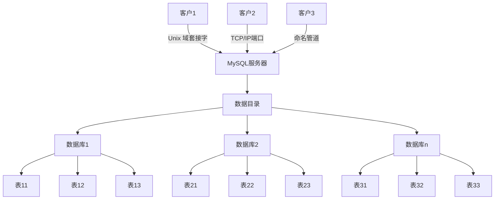

# 管理

## MySQL 组件

- 服务器
  - mysqld 服务器主程序
  - mysql_safe 启动和监控
  - mysql_multi 同一主机管理多台MySQL
- 客户端和util
  - mysql 客户端交互式程序
  - mysqladmin 管理数据库
  - mysqldump 备份或复制
  - mysqlcheck 检查分析优化或者修复表 myisamchk只适用于myisam

## 数据目录

位置：指定`datadir`配置项

### 结构



数据库的表示：文件目录

数据表的表示：

- InnoDB
  - 系统表空间：只有一个.frm文件
  - 独立表空间: .frm文件与索引文件.ibd
- MyISAM
  - .frm 表结构描述
  - .MYD 数据文件
  - .MYI 索引文件
- Memory
  - 只有.frm存储表结构

将`lower_case_table_name`环境变量设置为1 MySQL 在操作表时 会将表名自动转换为小写字母

影响表最大长度的因素：操作系统文件大小 存储引擎内部限制 

视图与触发器：

- 视图
  - .frm 
- 触发器
  - .TRG 与 .TRN

状态与日志文件：

文件类型|默认名|文件内容
-|-|-
进程ID文件|HOSTNAME.pid|服务器进程ID
错误日志|HOSTNAME.err|启动/关闭事件和错误条件
一般查询日志|HOSTNAME.log|连接/断开事件和查询信息
二进制日志|HOSTNAME-bin.nnnnnn|修改数据的语句的二进制表示
二进制日志索引|HOSINAME-bin.index|当前二进制日志文件名的列表
中继日志|HOSTNAME-relay-bin.nnnnnn|从服务器自主服务器接收到的数据修改信息
中继日志索引|HOSTNAME-relay-bin.index|当前中继日志文件名的列表
主服务器信息文件|master.info|用于连接主服务器的参数
中继信息文件|relay-log.info|中继日志处理的状态
慢查询日志|HOSTNAME-slow.log|处理起来比较耗时的语句文本

进程PID文件：写入进程PID 其他应用可以读取mysql的进程ID 从而进行一些操作

### 迁移数据目录

迁移之前需要停止服务器

迁移实体|适用的迁移方法
-|-
整个数据目录|启动选项或符号链接
各个数据库目录|符号链接
各个数据库表|符号链接
InnoDB表空间文件|启动选项
服务器PID文件|启动选项
日志文件|启动选项

## 常规管理

### 用户系统

```sql
SELECT Host, User,authentication_string,plugin FROM mysql.user; -- 查看用户信息
SET PASSWORD FOR root = 'root'; -- 修改密码
```

### 启动与运行

- 以非root用户运行
- 每次都以同一个用户身份运行

```sh
mysqladmin -p -u root shutdown # 关闭
```

### 设置系统变量

```ini
# my.ini
[mysqld]
max_connection=200 # 下划线跟-可以互换
innodb_buffer_pool_size=16M # 单位不填默认为字节
```

### 插件

```ini
# my.ini
[mysqld]
plugin-load=xxx,xxx
```

### 引擎

```sql
SELECT ENGINE, SUPPORT FROM INFORMATION_SCHEMA.ENGINES; -- 查看引擎
```

配置默认引擎：`default_storage_engine` 参数

## 访问控制与安全

## 维护 备份 复制

恢复数据比较安全的做法，是恢复出一个备份，或者找一个从库作为临时库，在这个临时库上执行这些操作，然后再将确认过的临时库的数据，恢复回主库

对于误删行：确保 binlog_format=row 和 binlog_row_image=FULL，这样可以通过 binlog 进行反向重放

对于误删表或者库：要求线上有定期的全量备份和实时备份binlog。 1. 取最近一次的全量备份恢复出一个临时库。 2. 取binlog日志中固定时间点之后的日志。 3. 把这些日志除了误删数据的语句外，全部应用到临时库

事前预防：

1. 上线前，必须经过 SQL 审计
2. sql_safe_updates 参数设置为 on。这样一来，如果我们忘记在 delete 或者 update 语句中写 where 条件，或者 where 条件里面没有包含索引字段的话，这条语句的执行就会报错
3. 搭建延迟复制的备库：固定设置备库延迟复制主库，这样给数据误删找回预留时间
4. 控制好权限，制订操作规范，数据更改上线前要做好误删恢复准备
