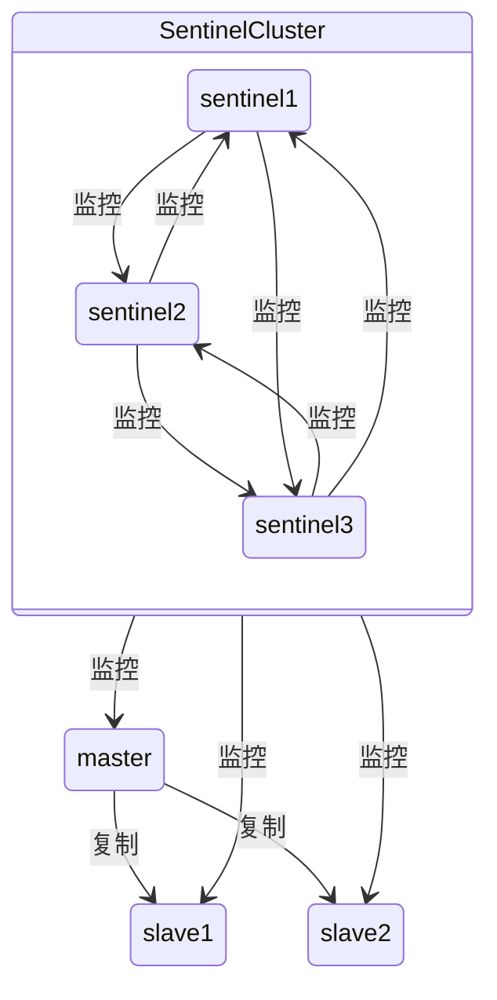
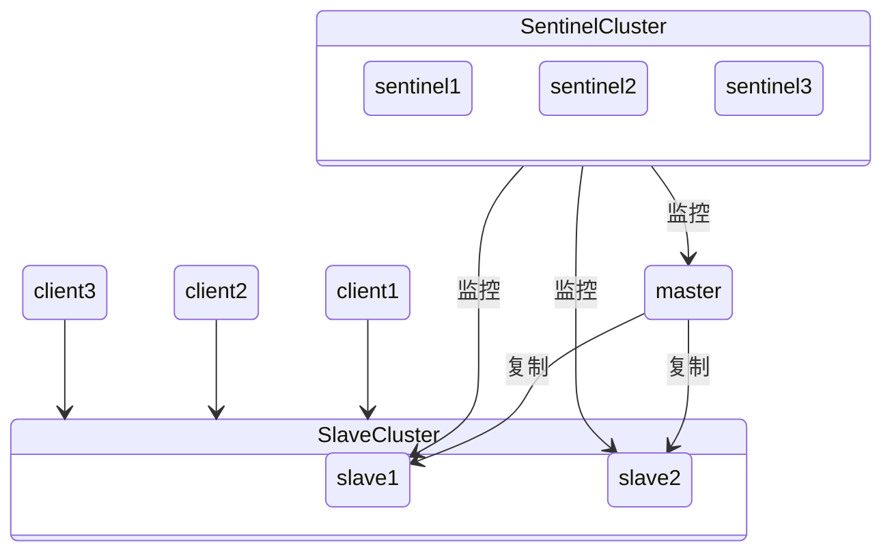
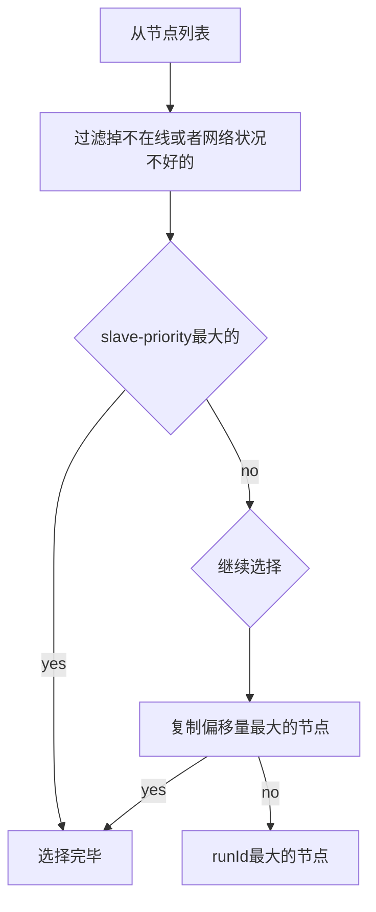
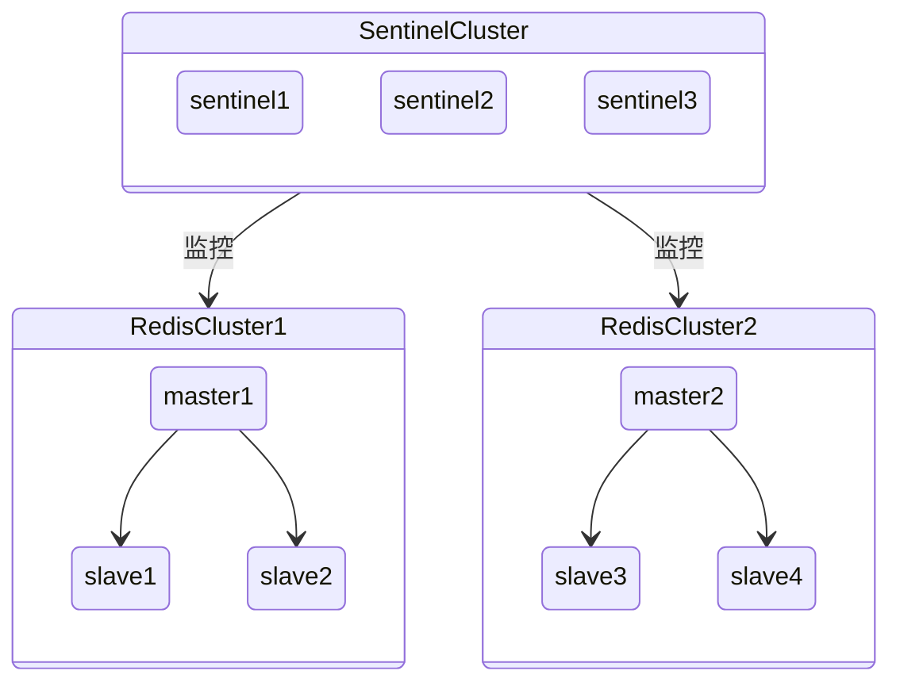

# 哨兵

- 集群监控：负责监控 redis master 和 slave 进程是否正常工作。
- 消息通知：Sentinel节点会将故障转移的结果通知给应用方。
- 故障转移：如果 master node 挂掉了，sentinel会自动选出一个新的redis master node
- 配置中心：客户端在初始化的时候连接的是Sentinel节点集合，从中获取主节点 信息如果故障转移发生了，通知 client 客户端新的 master 地址

哨兵至少需要 3 个实例，来保证自己的健壮性

当大多数Sentinel节点都认为主节点不可达时，它们会选举出一个Sentinel节点来完成自动故障转移的工作，同时会将这个变化实时通知给Redis应用方

哨兵(sentinel) 是一个分布式系统,你可以在一个架构中运行多个哨兵(sentinel) 进程,这些进程使用流言协议(gossip protocols)来接收关于Master是否下线的信息,并使用投票协议(agreement protocols)来决定是否执行自动故障迁移,以及选择哪个Slave作为新的Master



高可用读写分离：



## 原理

三个定时任务：

- 每隔10秒，每个Sentinel节点会向主节点和从节点发送info命令获取最新的拓扑结构
- 每隔2秒，每个Sentinel节点会向Redis数据节点的__sentinel__：hello频道上发送该Sentinel节点对于主节点的判断以及当前Sentinel节点的信息 每个Sentinel节点也会订阅该频道
- 每隔1秒，每个Sentinel节点会向主节点、从节点、其余Sentinel节点
发送一条ping命令做一次心跳检测

如果在 down-after-milliseconds 毫秒内，主从节点都没有通过网络联系上，就可以认为主从节点断连了。如果发生断连的次数超过了 10 次，就说明这个从库的网络状况不好，不适合作为新主库

sdown与odown：

- sdown：主观宕机，某一哨兵发现无法连接master
- odown，一定数量的哨兵发现无法连接master，这个数量由管理员配置

sentinel领导节点选举：通过[raft算法](/软件工程/架构/系统设计/分布式/分布式共识算法.md#Raft)选举出领导节点， 由sentienl领导节点进行故障转移的操作

### 故障转移

选择一个新主节点：



- Sentinel领导者节点会对第一步选出来的从节点执行slaveof no one命
令让其成为主节点
- Sentinel领导者节点会向剩余的从节点发送命令，让它们成为新主节点的从节点
- Sentinel节点集合会将原来的主节点更新为从节点，并保持着对其关注，当其恢复后命令它去复制新的主节点

### 消息发送

哨兵集群的自动发现通过 pub/sub 系统实现的，每个哨兵都会往 `__sentinel__`:hello 这个 channel 里发送一个消息，内容是自己的 host、ip 和 runid 还有对这个 master 的监控配置,这时候所有其他哨兵都可以消费到这个消息，并感知到其他的哨兵的存在

在哨兵内部，sentinel 内部不同的事件会创建不同的 pub/sub 频道来进行消息的同步

```c
// 通过该方法发送消息
void sentinelEvent(int level, char *type, sentinelRedisInstance *ri, const char *fmt, ...);

if (level != LL_DEBUG) {
    channel = createStringObject(type,strlen(type));
    payload = createStringObject(msg,strlen(msg));
    pubsubPublishMessage(channel,payload,0);
    decrRefCount(channel);
    decrRefCount(payload);
}

// 调用
sentinelEvent(LL_WARNING,"+monitor",ri,"%@ quorum %d",ri->quorum);
```

频道名称|含义
-|-
+sdown|哨兵判断主节点主观下线
+odown|哨兵判断主节点客观下线
+new-epoch|当前的纪元被更新，进入新的纪元
+try-failover|达到故障切换的条件，开始故障切换
+failover-state-select-slave|开始要选一个从节点作为主节点
+selected-slave|找到一个合适的从节点作为新的主节点
+failover-end|故障切换成功完成
+switch-master|主节点发生切换，主节点的信息发生替换

## 数据丢失

- 主备切换时，master异步向salve同步的命令丢失导致数据丢失
- 网络异常，导致master暂时失联，当master重新连接上网络时，变成了slave，数据丢失

解决：拒绝客户端的写请求

## 哨兵配置

```config
# sentinel.conf
port 26379
sentinel monitor mymaster 172.17.0.5 6379 2
```

这个配置代表需要监控127.0.0.1：6379这个主节点，2代表判断主节点失败至少需要2个Sentinel节点同意，mymaster是主节点的别名

```sh
# 启动哨兵
redis-sentinel sentinel.conf
```

哨兵的一些配置项：

```properties
# 如果超过了down-after-milliseconds配置的时间且没有有效的回复，则判定节点不可达
sentinel down-after-milliseconds <master-name> <times>
# 用来限制在一次故障转移之后，每次向新的主节点发起复制操作的从节点个数
sentinel parallel-syncs <master-name> <nums>
# slaveof no one一直失败（例如该从节点此时出现故障），当此过程超过failover-timeout时，则故障转移失败
sentinel failover-timeout <master-name> <times>
# 主节点通信密码
sentinel auth-pass <master-name> <password>
# 当一些警告级别的Sentinel事件发生（指重要事件，例如-sdown：客观下线、-odown：主观下线）时，会触发对应路径的脚本
sentinel notification-script <master-name> <script-path>
# 故障转移结束后，会触发对应路径的脚本
sentinel client-reconfig-script <master-name> <script-path>
```

动态调整配置：`sentinel set` 命令

## 监控多个主节点

```properties
sentinel monitor master-business-1 10.10.xx.1 6379 2
sentinel monitor master-business-2 10.16.xx.2 6380 2
```



## 部署

- Sentinel节点不应该部署在一台物理机器上
- 部署至少三个且奇数个的Sentinel节点
- 一套sentinel还是多套sentinel
  - 一套Sentinel，很明显这种方案在一定程度上降低了维护成本 但如果这套Sentinel节点集合出现异常，可能会对多个Redis数据节点造成影响
  - 多套Sentinel会造成资源浪费。但是优点也很明显，每套Redis Sentinel都是彼此隔离的

## 运维

节点下线：

- 主节点下线 使用sentienl failover命令选出一个新主节点 将原来的主节点下线
- 从节点或者sentienl节点下线 保证客户端能感受到从节点的变化 避免发送无效请求

节点上线：

- 添加从节点 添加slaveof配置启动即可
- 添加sentienl节点 添加sentienl monitor配置启动即可

## API

```sh
# 查看所有被监控的主节点状态以及相关的统计信息
sentinel masters
# 查看指定主节点
sentinel master <master name>
# 查看指定主节点的从节点
sentinel slaves <master name>
# 列出指定的主从集群sentinel节点（不包含本节点）
sentinel sentinels <master name>
# 返回指定的主节点地址和端口
sentinel get-master-addr-by-name <master name>
# 对符合<pattern>（通配符风格）主节点的配置进行重置
sentinel reset <pattern>
# 强制对集群进行故障转移
sentinel failover <master name>
# 检测当前可达的Sentinel节点总数是否达到<quorum>的个数
sentinel ckquorum <master name>
# 将Sentinel节点的配置强制刷到磁盘上
sentinel flushconfig
# 取消当前sentinel节点对指定master的监控那个
sentinel remove <master name>
# 监控指定master
sentinel monitor <master name> <ip> <port> <quorum>
# Sentinel节点之间用来交换对主节点是否下线的判断
sentinel is-master-down-by-addr
```

## 客户端连接

1）遍历Sentinel节点集合获取一个可用的Sentinel节点

2）通过sentinel get-master-addr-by-name master-name这个API来获取对应主节点的相关信息

3）验证当前获取的“主节点”是真正的主节点，这样做的是为了防止获取之后主节点又发生了变化

4）保持和Sentinel节点集合的“联系”，时刻获取关于主节点的相关“信息”

Java 客户端：

```java
JedisSentinelPool pool =
    new JedisSentinelPool("mymaster", Set.of("192.168.1.101:26379","192.168.1.101:26380","192.168.1.101:26381"));
Jedis resource = pool.getResource();
System.out.println(resource.ping());
resource.close();
```
