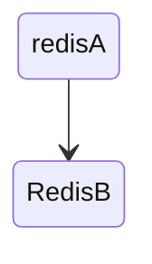
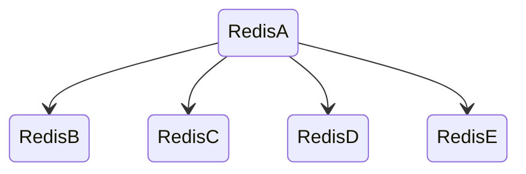
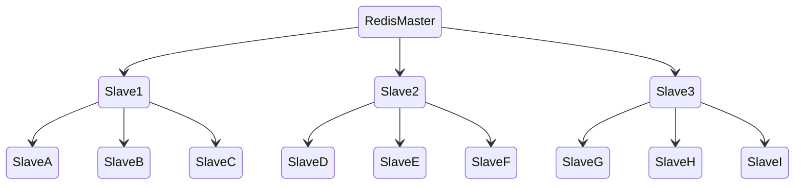
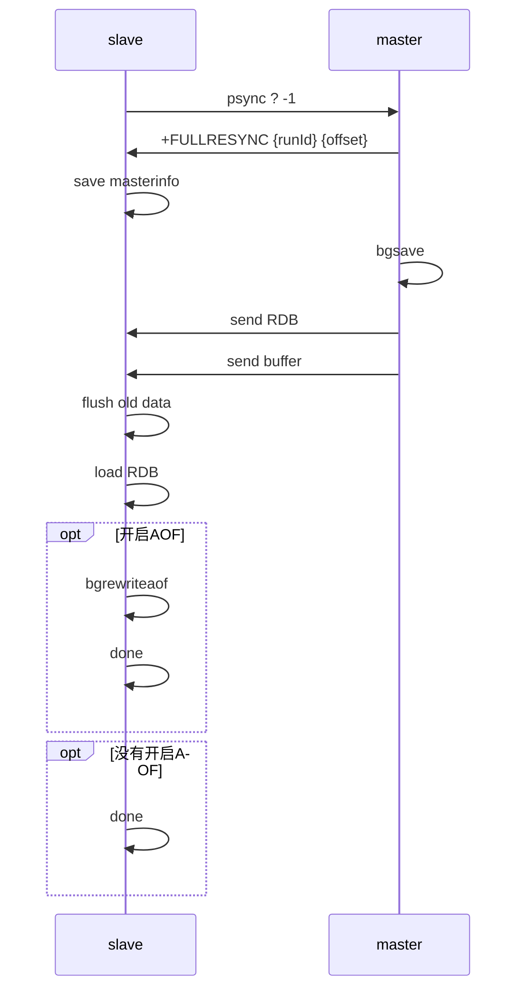
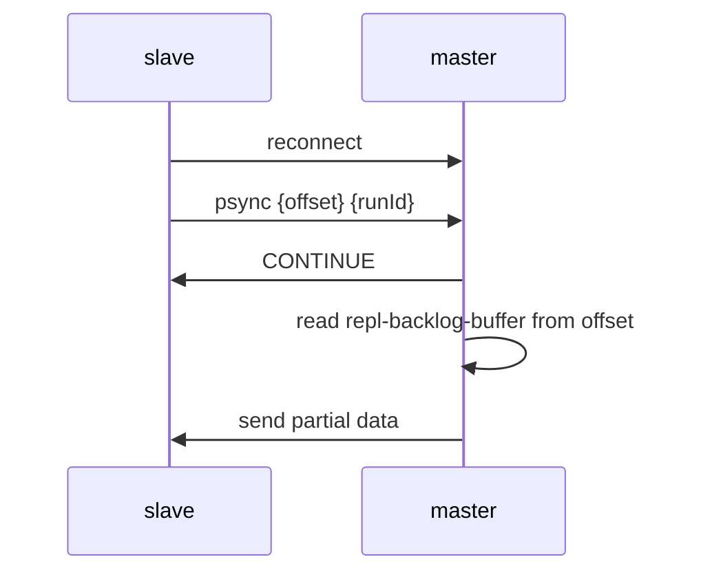
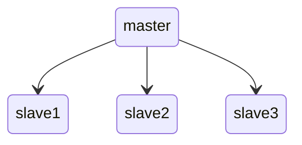
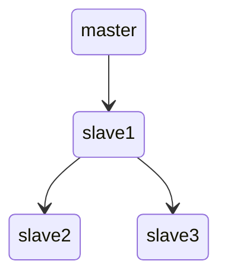
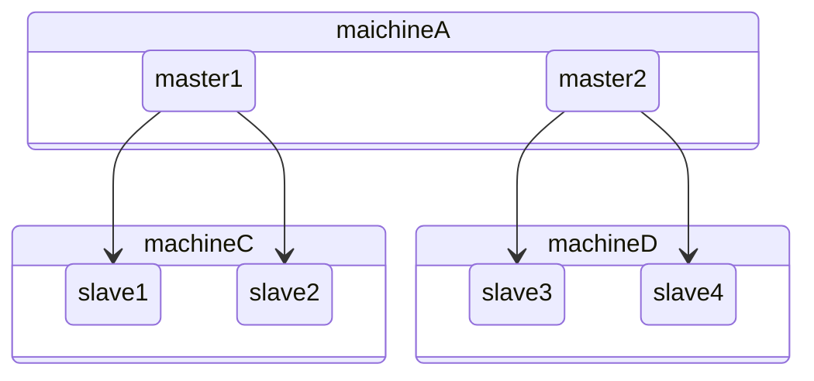

# 复制

- slaveof命令建立复制（5.0之后改为 replicaof）
- slaveof no one命令断开复制

redis的复制功能是支持多个数据库之间的数据同步。一类是主数据库（master）一类是从数据库（slave），主数据库可以进行读写操作，当发生写操作的时候自动将数据同步到从数据库，而从数据库一般是只读的，并接收主数据库同步过来的数据，一个主数据库可以有多个从数据库，而一个从数据库只能有一个主数据库

## 拓扑结构

- 一主一从



用于主节点出现宕机时从节点提供故障转移支持

- 一主多从



对于读占比较大的场景，可以把读命令发送到从节点来分担主节点压力

或者从节点用来执行一些如keys 等比较耗时的命令

**对于写并发量较高的场景，多个从节点会导致主节点写命令的多次发送从而过度消耗网络带宽**

- 主从链



通过引入复制中间层，可以有效降低主节点负载和需要传送给从节点的数据量

## 原理

### 复制过程

1. 执行slaveof后从节点只保存主节点的地址信息便直接返回
2. 从节点会建立一个socket套接字 门用于接受主节点发送的复制命令
3. 连接建立成功后从节点发送ping请求进行首次通信用于检测主从之间网络套接字是否可用以及节点当前是否可接受处理命令
4. 如果主节点设置了requirepass参数，则需要密码验证
5. 主从复制连接正常通信后，主节点会把持有的数据全部发送给从节点
6. 接下来主节点会持续地把写命令发送给从节点，保证主从
数据一致性

### 数据同步

Redis 的复制机制也是使用的[复制状态机](/软件工程/架构/系统设计/分布式/分布式数据.md#复制)这套方法

#### 全量复制

一般用于初次复制场景，会把主节点全部数据一次性发送给从节点



- runId 是每个 Redis 实例启动生成的一个随机id
- offset 代表复制进度

为了保证主从库的数据一致性，主库会在内存中用专门的 replication buffer，记录 RDB 文件生成后收到的所有写操作

#### 增量复制

- psync命令

主从断网重连后，会通过增量复制的方式继续同步，master内部会维护一个 repl-backlog-buffer，把断连期间收到的写操作命令写入到该 buffer 中，主库会记录自己写到的位置，从库则会记录自己已经读到的位置，在增量同步时，会通过 offset，决定要复制哪些增量数据

repl_backlog_buffer 是一个环形缓冲区，所以在缓冲区写满后，主库会继续写入，此时，就会覆盖掉之前写入的操作。如果从库的读取速度比较慢，就有可能导致从库还未读取的操作被主库新写的操作覆盖了，这会导致主从库间的数据不一致，可以通过调整 repl_backlog_size 这个参数来调整缓冲区大小



#### 异步复制

写命令的发送过程是异步完成，也就是说主节点自身处理完写命令后直接返回给客户端，并不等待从节点复制完成

## 问题

读写分离带来的问题：

- 数据延迟 写入master的数据无法马上在slave上读到
- 读到过期数据  Redis在3.2版本从节点读取数据之前会检查键的过期时间来决定是否返回数据
- 从节点故障 需要在客户端维护可用从节点列表，当从节点故障时立刻切换到其他从节点或主节点上

主从配置不一致的问题：

如最大限制内存如果不一致 导致从节点部分数据被淘汰 造成从节点数据与主节点不一致

避免全量复制：

- 从节点启动后会进行一次全量复制 这个无法避免
- 如果主节点重启 会导致运行ID改变 此时从节点也会进行一次全量复制
- 主从节点网络断开 如果连接后复制挤压缓冲区不足 也会触发全量复制

避免复制风暴：

复制风暴指大量从节点对同一主节点或者对同一台机器的多个主节点短时间内发起全量复制的过程

- 单主节点复制风暴

使用主从链代替一主多从来解决这个问题



↓



- 单机器复制风暴

避免将所有主节点放在同一台机器，下面的拓扑如果此时机器A网络挂掉 那么重新启动时 就会导致其他机器的流量全部压向机器A



## 配置

主服务配置(6379)

```
# 设置主服务器密码
requirepass 123
# 或者需要设置master bind address
bind 0.0.0.0
```

从服务器配置(6380)

```
# 设置访问主服务器得我密码
masterauth 123
# 设置主服务器地址端口
slaveof 127.0.0.1 6379
# 新版本
replicaof 127.0.0.1 6379
```

只能对主服务器进行写操作，从服务器只能读操作

一些主从配置项

```
replica-serve-stale-data yes
replica-read-only yes # 从节点的任何修改主节点都无法感知
repl-diskless-sync no

repl-disable-tcp-nodelay #用于控制是否关闭TCP_NODELAY，默认关闭

repl-backlog-size 1mb 
#增量复制

min-replicas-to-write 3
min-replicas-max-lag 10
```
