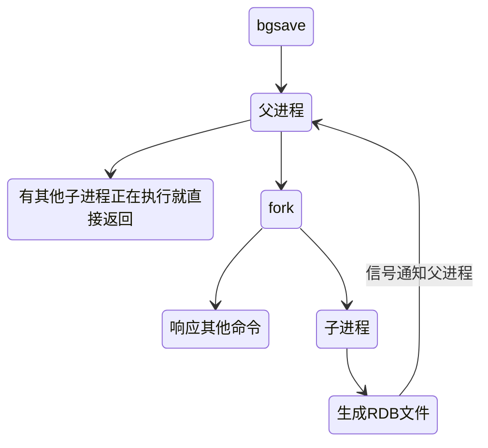
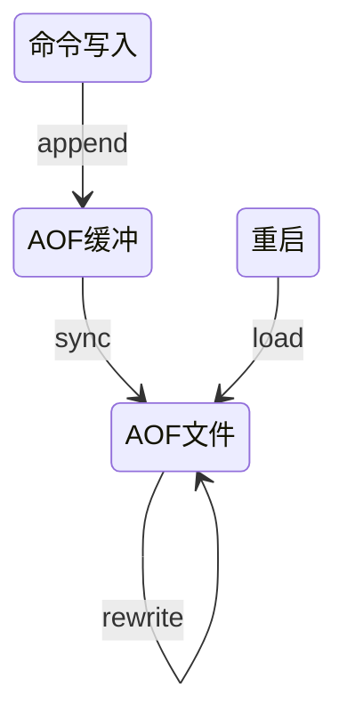
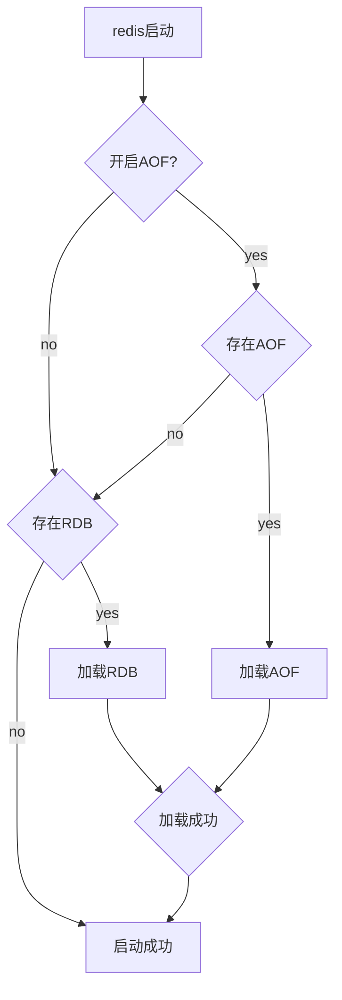
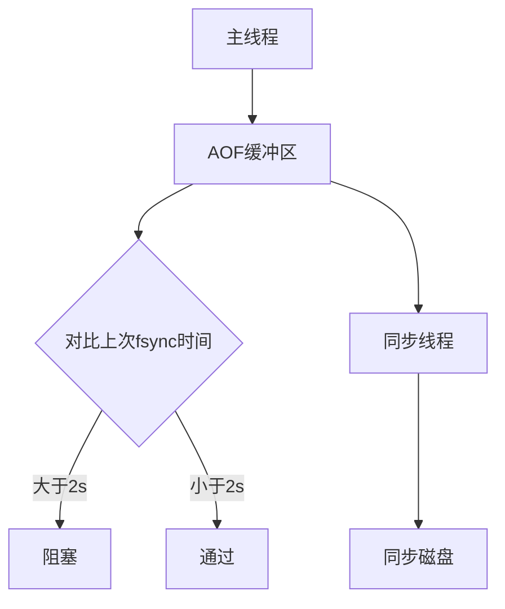

## 持久化

通用持久化方案：

- 快照
- 日志

不要只使用某一持久化机制

要充分利用两种持久化机制的优点并避免它们的缺点

### RDB

将某个时间点的所有数据都存放到硬盘上, 是对 redis 中的数据执行周期性的持久化

一个 RDB 文件主要是由三个部分组成：

- 文件头：这部分内容保存了 Redis 的魔数、RDB 版本、Redis 版本、RDB 文件创建时间、键值对占用的内存大小等信息
- 文件数据部分：这部分保存了 Redis 数据库实际的所有键值对。
- 文件尾：这部分保存了 RDB 文件的结束标识符，以及整个文件的校验值，这个校验值用来在 Redis server 加载 RDB 文件后，检查文件是否被篡改过


`bgsave`命令：使用的fork系统调用创建一个子进程来持久化数据, 由于fork出来的子进程是写时复制，所以这达到了一个性能的平衡



可以在redis-cli执行config set dir{newDir}和config set
dbfilename{newFileName} 来改变持久化文件位置

- 配置文件

> after 60 sec if at least 10000 keys changed save 60 10000

默认开启，保存在dump.rdb

```shell
save 900 1           #在900秒(15分钟)之后，如果至少有1个key发生变化，Redis就会自动触发BGSAVE命令创建快照。

save 300 10          #在300秒(5分钟)之后，如果至少有10个key发生变化，Redis就会自动触发BGSAVE命令创建快照。

save 60 10000        #在60秒(1分钟)之后，如果至少有10000个key发生变化，Redis就会自动触发BGSAVE命令创建快照。
```

**优缺点**

- 是某个时刻的全部数据，非常适合做冷备 全量备份等
- 恢复比较迅速
- **bgsave每次运行都要执行fork操作创建子进程，属于重量级操作**
- **会丢失一定数据**

### AOF

- 以日志的形式保存每次操作
- 对每条写入命令作为日志



为什么使用AOF缓冲：Redis使用单线程响应命令，如果每次写AOF文件命令都直接追加到硬盘，那么性能完全取决于当前硬盘负载
载

```
appendonly yes 开启aof

appendfsync always    每一次操作都进行持久化 （每次写操作都执行fsync 性能极差）
appendfsync everysec  每隔一秒进行一次持久化 (折中的方案)
appendfsync no        让操作系统来决定何时同步 （让操作系统决定何时写到磁盘 数据不安全）
```

Redis 4.0 开始支持 RDB 和 AOF 的混合持久化（默认关闭，可以通过配置项 aof-use-rdb-preamble 开启）。

如果把混合持久化打开，AOF 重写的时候就直接把 RDB 的内容写到 AOF 文件开头。这样做的好处是可以结合 RDB 和 AOF 的优点

**优缺点**

- 更好地保护数据不丢失
- append-only没有磁盘寻址开销
- 适合做灾备
- **aof文件比rdb大**
- **aof对性能有一定的影响**

#### AOF重写

随着AOF文件越来越大，需要定期对AOF文件进行重写，达到压缩的目的

- 手动触发：bgrewriteaof
- 自动触发：根据auto-aof-rewrite-min-size、auto-aof-rewrite-percentage参数确定自动触发时机


执行 BGREWRITEAOF 命令时，Redis 服务器会维护一个 AOF 重写缓冲区，该缓冲区会在子进程创建新AOF文件期间，记录服务器执行的所有写命令。

AOF 重写操作，实际就是遍历所有数据库，把每个键值对以插入操作的形式写入日志文件，即一个 key 只写入一次

当子进程完成创建新AOF文件的工作之后，服务器会将重写缓冲区中的所有内容追加到新AOF文件的末尾，使得新旧两个AOF文件所保存的数据库状态一致

#### 重启恢复流程



如果aof文件损坏 可以尝试使用redis-check-aof --fix进行修复

### 问题定位与优化

fork的问题：

- 重量级操作 如果使用虚拟化技术 fork会比物理机更耗时
- fork虽然是写时复制 但是还是需要复制内存页表

持久化时各类资源的消耗：

- CPU：子进程负责把进程内的数据分批写入文件，这个过程
属于CPU密集操作
- 内存：子进程通过fork操作产生，占用内存大小等同于父进程，理论上需要两倍的内存来完成持久化操作，但Linux有写时复制机制
（copy-on-write）
- 磁盘：写入时硬盘压力很大 避免将redis和其他高硬盘负载的服务部署在一起

AOFfsync策略：



使用everysec这种同步策略 当一个命令写入缓冲区后发现上次同步到磁盘的时间大于2秒 就会阻塞住 直至同步磁盘完成

这意味着使用这种策略至多会丢失2秒的数据