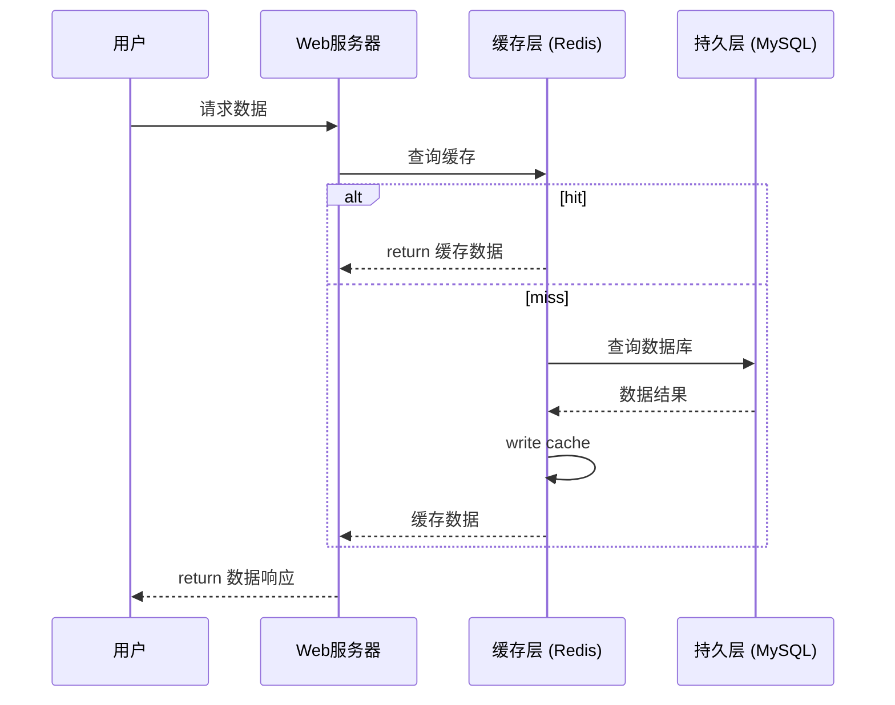
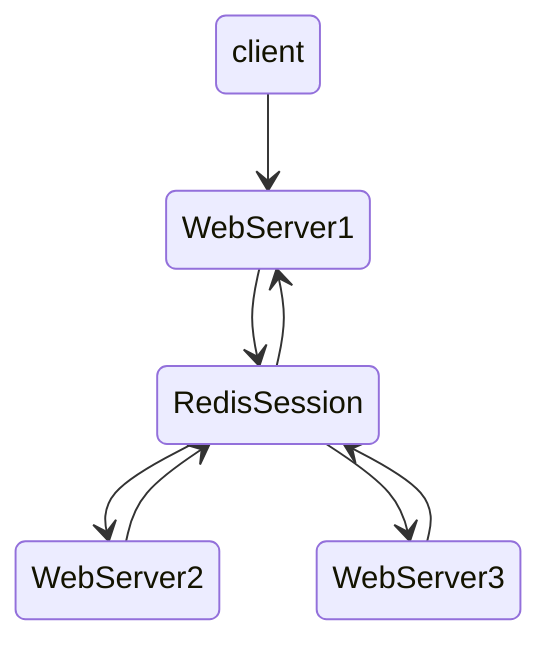
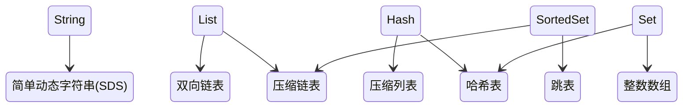

# 数据结构

二进制安全：底层没有类型概念，只有byte数组，所以客户端需要将数据序列化成字节数组

## string

- 字符串、数值、bit位图


应用场景：

- 做简单的KV缓存



设计合理的键名，有利于防止键冲突和项目的可维护性，比较推荐的方式是使用`业务名：对象名：id：[属性]`作为键名

- incr（计数）：抢购，秒杀，详情页，点赞，评论
- session服务器



- 限速 通过对key设置过期时间的方式限制用户请求频率
- 使用位图来处理海量数据

1. 哈希类型 hash
  - 做对象属性读写
2. 列表类型 list
  - 可以做消息队列或者可以来存储列表信息，进行分页查询
3. 集合类型 set
  - 自动去重
  - 推荐系统：数据交集
4. 有序集合类型 sortedset
  - 排序

## GEO

地理信息定位功能

```sh
geoadd locations 116.38 39.55 beijing # 添加成员
geopos locations beijing # 获取
geodist locations beijing tianjin [m|km|mi|ft] # 计算两地距离
georadiusbymember locations beijing 150 km # 获取北京方圆150km内的成员
geohash locations beijing # 将二维经纬度转换为一维字符串
```

关于geohash：

- 字符串越长，表示的位置更精确
- 两个字符串越相似，它们之间的距离越近，Redis利用字符串前缀匹配
算法实现相关的命令
- Redis正是使用有序集合并结合geohash的特性实现了GEO的若干命令

## 内部数据结构

Redis 为了尽量节省内存，不仅在数据结构的设计上下足了功夫，同时也运用了享元设计模式来提升内存效率



名称|查找时间复杂度
-|-
哈希表|0(1)
跳表|O(logN)
双向链表|O(N)
压缩列表|O(N)
整数数组|O(N)

### SDS

和 C 语言中的字符串操作相比，SDS 通过记录字符数组的使用长度和分配空间大小，避免了对字符串的遍历操作，降低了操作开销

同时 SDS 设计了针对不同长度字符串的结构头，是为了能灵活保存不同大小的字符串，从而有效节省内存空间

```c
// __attribute__ ((__packed__)) 告诉编译器取消结构体内存对齐，可以减少内存消耗，但可能会导致访问结构体成员时效率降低
struct __attribute__ ((__packed__)) sdshdr16 {
    uint16_t len; /* used */
    uint16_t alloc; /* excluding the header and null terminator */
    unsigned char flags; /* 3 lsb of type, 5 unused bits */
    char buf[];
};
struct __attribute__ ((__packed__)) sdshdr32 {
    uint32_t len; /* used */
    uint32_t alloc; /* excluding the header and null terminator */
    unsigned char flags; /* 3 lsb of type, 5 unused bits */
    char buf[];
};
```

对于长度不超过 44 字节的字符串，Redis 先申请一块连续的内存空间，把 redisObject 结构体和 SDS 结构体紧凑地放置在一起，避免内存碎片和两次内存分配的开销

```c
robj *createEmbeddedStringObject(const char *ptr, size_t len) {
    robj *o = zmalloc(sizeof(robj)+sizeof(struct sdshdr8)+len+1);
    struct sdshdr8 *sh = (void*)(o+1);
    ...
    o->ptr = sh+1;
    ...

    //... 初始化字符串空间
    return o;
}
```

### 字典

redis 使用了链表来应对哈希冲突

```c
typedef struct dictIterator {
    dict *ht;
    int index;
    dictEntry *entry, *nextEntry;
} dictIterator;
typedef struct dict {
    dictEntry **table;
    dictType *type;
    unsigned long size;
    unsigned long sizemask;
    unsigned long used;
    void *privdata;
} dict;
struct dictEntry {
    void *key;
    union {
        void *val;
        uint64_t u64;
        int64_t s64;
        double d;
    } v;
    struct dictEntry *next;     /* Next entry in the same hash bucket. */
};
```

redis使用了两张哈希表来方便扩容时的rehash操作

当满足以下条件，就会进行rehash

- 刚开始时哈希表长度为0
- 哈希表中的元素数量 / 哈希表长度 > dict_force_resize_ratio(负载因子)

在进行rehash时，为避免给服务器带来过大负担，并不是一次性将所有值rehash到另外一张表，而是通过渐进的方式，每次对字典执行添加、删除、查找或者更新操作时，将哈希表 entry 的转移操作分散在后续的每一次请求中以及定时任务中，而非一次性执行完。每迁移一个 key，结构体 dict 的 used就会 - 1，当这个used为0时，就代表迁移完了

此时新增的 key 都会写到目标ht中，而删改则会先对迁移源表找，没有的话再在新ht中找

### 压缩列表

数组中的每一个元素都对应保存一个数据。和数组不同的是，压缩列表在表头有三个字段 zlbytes、zltail 和 zllen，分别表示列表长度、列表尾的偏移量和列表中的 entry 个数；压缩列表在表尾还有一个 zlend，表示列表结束

针对不同长度的数据，使用不同大小的元数据信息（prevlen 和 encoding）来描述每一个位置的数据，从而提升内存效率

如果我们要查找定位第一个元素和最后一个元素，可以通过表头三个字段的长度直接定位

### 跳表

- O(N) 的空间复杂度，O(logN) 的插入、查询、删除的时间复杂度


查找时，从上层开始查找，找到对应的区间后再到下一层继续查找，类似于二分查找

这种查找数据结构跟红黑树相比：

- 插入非常快，因为不需要在插入后进行旋转
- 实现容易
- 支持无锁操作

完美跳表：所用的存储空间和查询过程，应该和二叉树是非常像的，我们会要求每一层都包含下一层一半的节点，且同一层指针跨越的节点数量是一样的

但随着元素不断增减，很难维护这样的完美跳表

引入随机性：通过 50% 的概率决策，决定是否需要继续将这个插入到更高的一层

## 操作复杂度

- 集合类型对单个数据实现的增删改查操作，复杂度由集合采用的数据结构决定，如 Hash 的增加查找都是O(1)
- 集合类型中的遍历操作，返回集合中的所有数据，这类操作的复杂度一般是 O(N)
- 集合类型对集合中所有元素个数的记录，复杂度为 O(1)，因为这些结构中专门记录了元素的个数统计
- 还有一些特殊情况，压缩列表和双向链表都会记录表头和表尾的偏移量，所以POP PUSH 操作也为 O(1)

