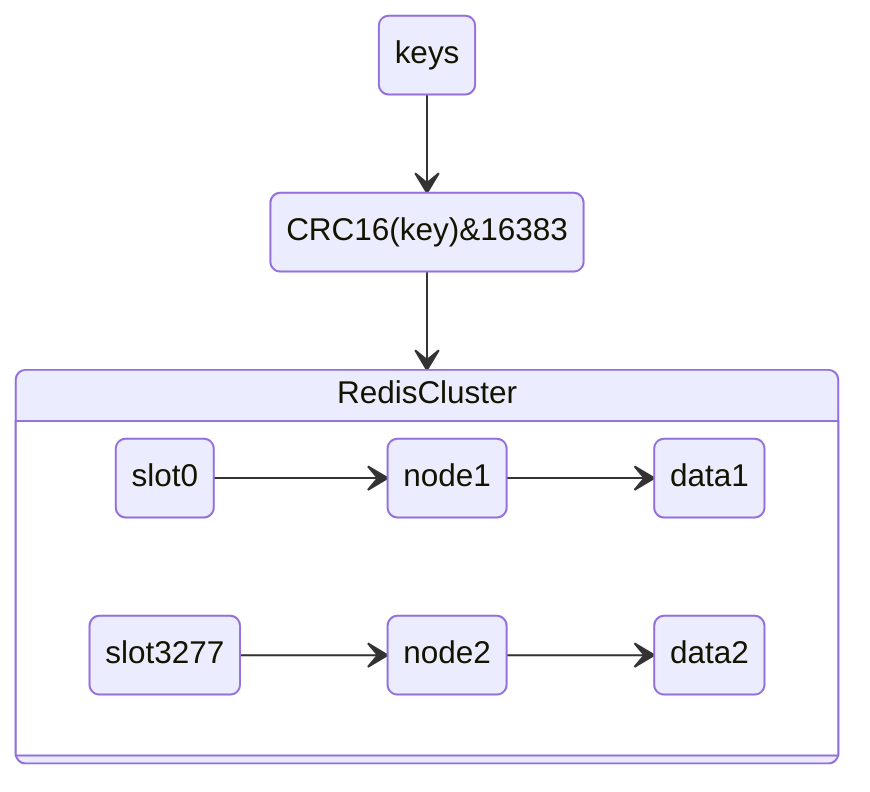
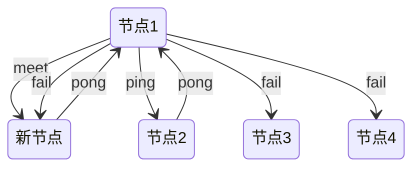
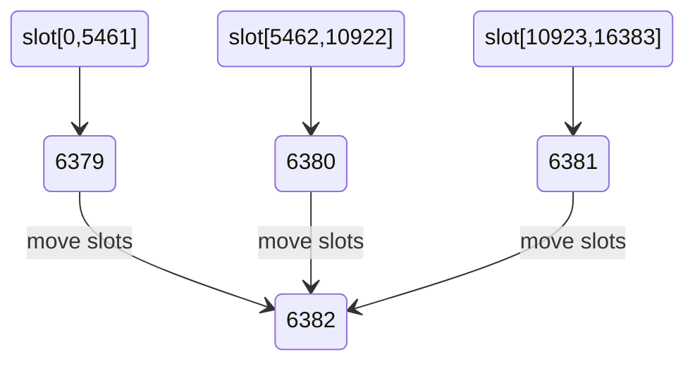
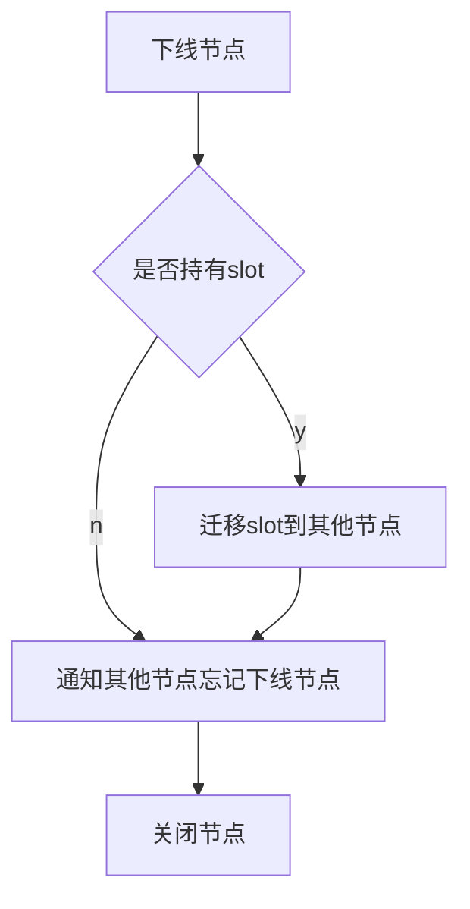
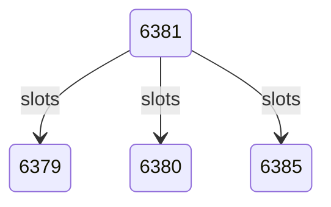
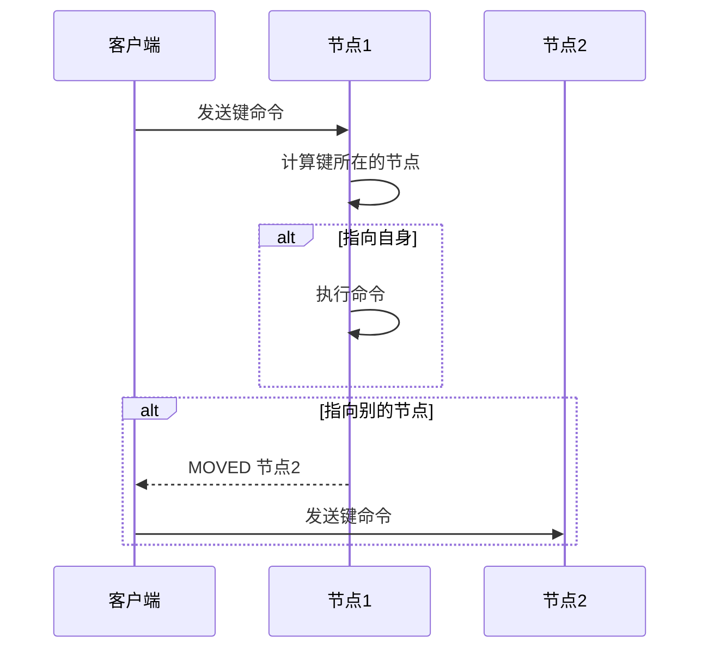

# 集群

- 自动将数据进行分片，每个 master 上放一部分数据
- 提供内置的高可用支持，部分 master 不可用时，还是可以继续工作的

6379：对外服务
16379：节点间通信

数据分布方案：

- 节点取余分区 根据key进行取模 得到其存放的节点ID
- 一致性哈希分区 使用哈希环实现多个虚拟槽点 避免节点数量改变带来的大量键重映射问题
- 虚拟槽分区 定义大量虚拟槽 让物理节点负责一定量的槽

Redis集群使用了虚拟槽分区：

```text
slot 0-3276 --> node1
slot 3277-6553 --> node2
slot 6554-9830 --> node3
slot 9831-13107 --> node4
slot 13108-16383 --> node5
```



使用这种方案带来的特点：

- 解耦数据和节点之间的关系，简化了节点扩容和收缩难度
- 节点自身维护槽的映射关系，不需要客户端或者代理服务维护槽分区元数据
- 支持节点、槽、键之间的映射查询

由于数据分布于不同的节点, 所以集群功能相比单机有如下限制：

- 批量操作支持有限 如mget只能获取在同一个节点上的键
- 事务支持有限 同理只能支持同一个节点上上的事务
- key是数据分区的最小粒度 如一个list 或者hash上的内容都会在同一个节点上
- 集群模式下只能使用一个数据库空间
- 复制结构只支持一层，从节点只能复制主节点，不支持主从链结构

## 集群方案

- 根据业务拆分，不同的业务数据存放到不同的redis
- **官方方案redis-cluster搭建(虚拟槽分区)**
- 客户端分片技术（不推荐），扩容/缩容时，必须手动调整分片程序，出现故障不能自动转移
- 主从复制方式：数据冗余

### AKF

- X：全量，镜像
- Y：业务，功能
- Z：优先级，逻辑再拆分


## 集群搭建

节点准备：

```conf
# 节点端口
port 6379
#  开启集群模式
cluster-enabled yes
#  节点超时时间，单位毫秒
cluster-node-timeout 15000
#  集群内部配置文件
cluster-config-file "nodes-6379.conf"
```

节点握手：

```sh
cluster meet 127.0.0.1 6380
...
```

节点建立握手之后集群还不能正常工作 需要为各个节点分配slot：

```sh
redis-cli -h 127.0.0.1 -p 6379 cluster addslots {0..5461}
...
```

作为一个完整的集群，每个负责处理槽的节点应该具有从节点，保证当它出现故障时可以自动进行故障转移:

使用cluster nodes命令查看集群节点

让其他节点做复制：

```sh
cluster replicate 41f2232cc928fb61c8a201b7d1cc1e57f029752e
...
```

使用redis-cli:

```sh
redis-cli --cluster create 127.0.0.1:6381 127.0.0.1:6382 127.0.0.1:6383 127.0.0.1:6384 127.0.0.1:6380 127.0.0.1:6379 --cl
uster-replicas 1
```

## redis-cluster原理

- 客户端直接访问集群
- 代理访问集群

redis cluster 有固定的 16384 个 hash slot，集群中的每个node平均分配得到一定的slot

使用一致性哈希实现

优点：

- 增加节点，的确可以分担其他节点的压力，不会造成全局洗牌

缺点：

- 新增节点造成一小部分数据不能命中

更倾向于 作为缓存，而不是数据库用

Redis Cluster 方案提供了一种重定向机制，当客户端把一个键值对的操作请求发给一个实例时，如果这个实例上并没有这个键值对映射的哈希槽，那么，这个实例就会给客户端返回下面的 MOVED 命令响应结果，这个结果中就包含了新实例的访问地址

## 节点间的通信

节点彼此不断通信交换信息，一段时间后所有的节点都会知道集群完整的信息

redis 维护集群元数据采用了gossip协议，所有节点都持有一份元数据，不同的节点如果出现了元数据的变更，就不断将元数据发送给其它的节点

但是元数据的更新有延时，可能导致集群中的一些操作会有一些滞后

### gossip协议

- meet：某个节点发送 meet 给新加入的节点，让新节点加入集群中，然后新节点就会开始与其它节点进行通信
- ping：每个节点都会频繁给其它节点发送 ping，其中包含自己的状态还有自己维护的集群元数据，互相通过 ping 交换元数据
- pong：返回 ping 和 meeet，包含自己的状态和其它信息，也用于信息广播和更新
- fail：某个节点判断另一个节点 fail 之后，就发送 fail 给其它节点，通知其它节点说，某个节点宕机了



### 节点选择

节点的定时任务每次会随机找出几个最久没通信的节点，如果找出来的节点最后通信时间大于一定阈值，则会向这些节点发送 ping 消息

## 集群伸缩

数据槽点迁移：

(1) 准备新节点 (2) 加入集群 (3) 迁移slot到新节点






扩容:

- 启动新节点
- 执行redis-cli --cluster add-node 127.0.0.1:6386 127.0.0.1:6379 添加节点
- 执行redis-cli --cluster reshard 127.0.0.1:6379来重新分配槽点

收缩：

...

## 请求路由

请求重定向：



```c
int slot = keyHashSlot((char*)key->ptr, sdslen(key->ptr));
clusterNode *node = getNodeBySlot(slot);
```

当访问的key的CRC16结果不是本节点时，集群节点就会返回一个MOVED错误，并提供实际节点

```sh
127.0.0.1:6379> set hello2 value1
(error) MOVED 7486 127.0.0.1:6380
```

使用redis-cli时 加上-c参数支持自动重定向

ASK重定向：

例如当一个slot数据从源节点迁移到目标节点时，期间可能出现一部分数据在源节点，而另一部分在目标节点 客户端需要自行处理这种情况

ASK重定向说明集群正在进行slot数据迁移，客户端无法知道什么时候迁移完成，因此只能是临时性的重定向，客户端不会更新slots缓存

- 情况一：命令访问 key 所属的 slot 没有对应的集群节点，此时返回当前节点
- 情况二：命令访问 key 所属的 slot 正在做数据迁出或迁入，而且当前命令就是用来执行数据迁移的 MIGRATE 命令，那么返回当前节点
- 情况三：命令访问 key 所属的 slot 正在做数据迁出，此时返回数据迁出的目标节点
- 情况四：命令访问 key 所属的 slot 对应的节点不是当前节点，而是其他节点，此时返回 MOVED

## 故障转移

- 主观下线与客观下线

故障恢复：故障节点变为客观下线后，如果下线节点是持有槽的主节点则需要在它的从节点中选出一个替换它

## 集群运维

集群完整性：

为了保证集群完整性，默认情况下当集群16384个槽任何一个没有指派到节点时整个集群不可用 当持有槽的主节点下线时，从故障发现到自动完成转移期间整个集群是不可用状态 为了避免这种情况 可以设置cluster-require-full-coverage为no

带宽：

集群带宽消耗主要分为：读写命令消耗+Gossip消息消耗

- 在满足业务需要的情况下尽量避免大集群 适度提高
- 设置cluster-node-timeout降低消息发送频率节省带宽
- 避免集中部署 否则机器消耗带宽非常严重

PUB/SUB问题：Pub/Sub功能应该避免在大量节点的集群内使用，否则会严重消耗集群内网络带宽

集群倾斜：

- 数据倾斜 比如有些槽键数量差异大 或者有些节点上的键值很大
- 请求倾斜 如热点key问题

集群读写分离：

- 只读连接 通过readonly命令来指定从节点可以处理读请求
- 读写分离 需要自行开发

手动故障转移：

cluster failover命令

数据迁移（从单机导入集群）：

redis-cli --cluster import命令
