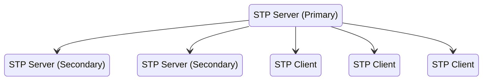
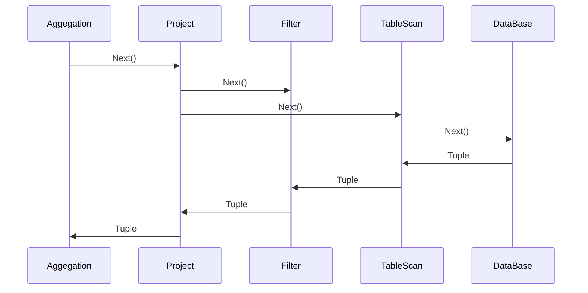

# 分布式数据库

> 服务于写多读少、低延时、海量并发 OLTP 场景的，具备海量数据存储能力和高可靠性的关系型数据库

## [数据分片与复制](/软件工程/架构/系统设计/分布式/分布式数据.md)

- 分片是分布式数据库实现多节点的存储和访问能力的关键
- 通过在多个节点上复制数据副本，来实现数据的高可用性，同时可以保证数据一致性

## 一致性

数据一致性关注的是单对象、单操作在多副本上的一致性，事务一致性则是关注多对象、多操作在单副本上的一致性，分布式数据库的一致性是数据一致性与事务一致性的融合

观察[数据一致性](/软件工程/架构/系统设计/分布式/分布式数据.md#复制延迟)的两个视角：

- 状态一致性是指，数据所处的客观、实际状态所体现的一致性
- 操作一致性是指，外部用户通过协议约定的操作，能够读取到的数据一致性

## [分布式事务](/软件工程/架构/系统设计/分布式/分布式事务.md)

## 架构风格

### PostgreSQL-XC

- 分片、分布式事务、跨节点查询和全局时钟


### NewSQL

- 基于分布式KV存储系统，存储与计算分离，拥有更高的伸缩性


很多产品为了获得更好的计算性能，会尽量将更多计算下压到存储节点执行，更偏向于PostgreSQL-XC风格

## 全局时钟

分布式数据库的很多设计都和时间有关

- 时间源
- 时钟类型
- 授时点

### TrueTime

时间源是 GPS 和原子钟，所以属于多时间源和物理时钟，同时它也采用了多点授时机制，依赖于特定硬件设备

### HLC

每个节点会使用本地时钟作为参照，但不受到时钟回拨的影响，可以保证单调递增。本质上，HLC 还是 Lamport 逻辑时钟的变体，所以对于不同节点上没有调用关系的两个事件，是无法精确判断先后关系的

### TSO


### STP



- STP Server:多个 STP Server 构成 STP Server 组，组内根据协议进行选主，主节点被称为 Primary，对外提供服务
- STP Client：按照固定的时间间隔，从 Primary Server 同步时间

## 可用性

分布式数据库为了提升可用性：

- 基于多数的方法：读写操作都要通过超过半数节点才认为成功
- 读一个写所有：可以从任意一个节点读数据，但写数据要所有节点写成功才认为是成功
- 牺牲一致性：BASE

## OLTP

OLTP 场景下，一般使用行式存储，这是传统数据库的做法：

1. 数据一般以行的形式进行处理与查询，一行数据通常被一起插入、一起查询、一起更新，这样，使用行式存储就能够以最少的磁盘读写代价处理一行业务数据的读写
2. 关系型数据库需要支持事务，一行数据或者多行数据需要能够一起持久化成功或者一起失败，按行存储能够简化读写的 I/O，提升性能

## OLAP

OLAP 场景下，一般使用列式存储，这也是分析型数据库的做法：

1. 分析型数据库一般都是批量写入数据，同一列数据一起批量写入，这一列的数据类型相同，所以具备更高的压缩率，可以加快数据的读写速度
2. OLAP 场景一般需要扫描大量数据行，但是基本是对一列或者多列进行统计分析、聚合等，列式存储可以只读取所需的列，从而避免加载整个行的数据，这大大减少了 I/O 操作，提高了查询效率

## HTAP

为了解决 OLAP 的时效性问题，有两种思路：

1. 以 [KAPPA](/数据技术/数据处理.md#Kappa) 架构为代表的准实时数据计算替代批处理
2. 在 OLTP 内扩展，实现又能 TP 又能 AP，称之为 HTAP

存储设计：

1. 融合性存储 PAX（Partition Attributes Across）方案
2. 在原有行式存储的基础上，新增列式存储，通过数据同步的方式，将行数据同步为列数据进行分析，对于分析请求，每次都要确认本地的数据是否足够新，而后才会执行查询操作

## 分布式查询处理

由于分布式数据库引入了分区，在进行查询时就没那么方便了，执行器要根据 where 条件决定去哪里查，还有 join 也更复杂了，查询符合条件的数据要如何查代价才小，还有查询完成之后的汇总合并

存算分离下的查询优化：

- 谓词下推(Predicate Pushdown)：将查询中的条件（谓词）推送到数据源中，以减少返回的数据量
- 索引分布的影响
  - 分区索引和数据是确保存储在同一物理节点，分区索引的优点就是性能好，分区索引的难点在于分片分裂时如何保持索引与数据的同分布，可以通过引入更小的数据组织单元解决这个问题
  - 分区索引无法实现唯一索引，但使用全局索引不仅会带来更高的通信开销，也要求索引与数据必须在一个事务内更新

存算分离下的 join 处理：

- 大小表关联（复制表）：对于参与 join 的表，如果不在同一个节点上，可以通过将数据量较小的表广播到大表所在的节点上，实现本地关联
- 大表关联：类似于 shuffle 操作，按照特定的 key，将相同的 key 分发到同个节点做本地关联

聚合计算加速：

> 火山模型：查询执行引擎可以优雅地将任意 Operator 组装在一起，而不需要考虑每个 Operator 的具体处理逻辑

```sql
select count(*) from store_sales where ss_item_sk = 1000;
```



火山模型的问题在于每次调用 Next 虚函数有一定开销，同时使用这种抽象的模式也没法充分利用 CPU 的循环展开、SIMD 等特性，有一些优化手段：

1. 运算符融合：简化运算符嵌套关系，从而降低虚函数调用次数
2. 向量化：每次不止取出一个 Tuple，而是一批 Tuple 进行计算，利用 SIMD 的能力提升速度
3. 代码生成：通过编译器将 SQL 编译为简单循环，便于 CPU 能进行循环展开优化
