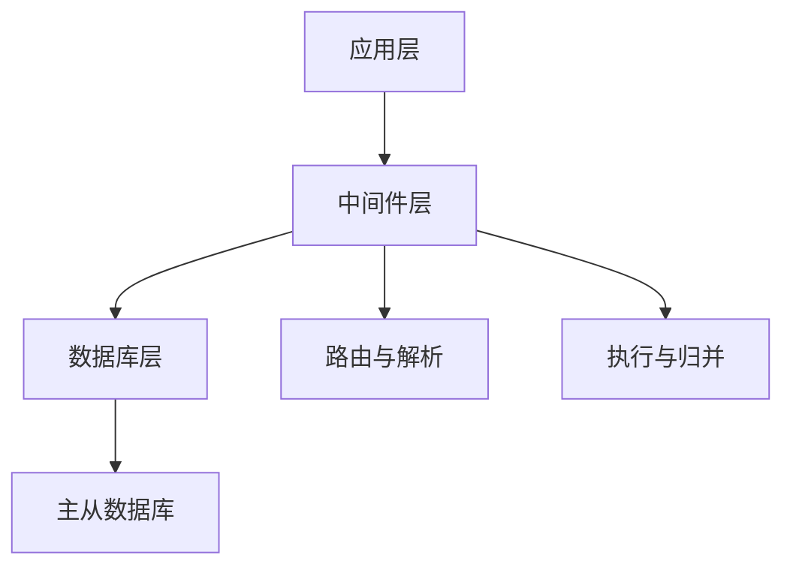

# 分库分表中间件

## **导读**

分库分表中间件（Database Sharding Middleware）是介于应用与数据库之间的一层技术，解决单数据库性能瓶颈和扩展性问题。本文档系统梳理了从概念、架构、核心原理、设计模式、关键功能、分片策略、实现方案、核心组件、优缺点、应用场景、实施要点到演进趋势的完整知识体系，并辅以图表和表格。

---

## **1. 基本概念**

分库分表中间件的核心目标是：

* **水平扩展**：将数据拆分到多个物理数据库/表
* **读写分离**：提升性能与可用性
* **数据路由**：自动根据规则将请求定向到目标节点
* **透明访问**：应用无需感知分库分表复杂性

**核心价值**：应用像操作单库一样操作分布式数据库。

---

## **2. 架构视角**

### **2.1 架构层次**

分库分表中间件的架构通常包括：

* **应用层**：业务逻辑发起SQL请求
* **中间件层**：

  * 路由与解析：拦截、解析SQL，计算目标节点
  * 执行与归并：发送SQL、收集和聚合结果
  * 配置管理：分片策略、数据源配置、读写分离
* **数据库层**：物理存储，支持主从复制和分片

### **2.2 架构模式**

| 模式    | 描述           | 优缺点                    |
| ----- | ------------ | ---------------------- |
| 代理模式  | 中间件作为数据库代理存在 | 对应用透明、支持多语言；网络开销大、运维复杂 |
| 客户端模式 | 集成在应用JDBC驱动中 | 性能高、减少网络开销；对应用有侵入性     |
| 混合模式  | 代理+客户端组合     | 灵活性高，可按服务或模块选择；架构复杂度增加 |

---

## **3. 核心原理**

分库分表中间件通过**SQL拦截 → SQL解析 → 路由计算 → SQL改写 → 执行 → 结果归并**实现对分布式数据库的访问。

**原理深化**：

* **SQL解析器**：复杂SQL解析（关联查询、聚合、子查询）
* **路由引擎**：计算目标节点，支持广播路由和多表路由
* **执行引擎**：管理连接池和事务，优化性能
* **结果归并**：排序、聚合、分页等逻辑合并

---

## **4. 分片策略**

| 策略      | 原理           | 适用场景       | 特点/注意事项   |
| ------- | ------------ | ---------- | --------- |
| 取模（mod） | 分片键值 % 节点数   | 数据均匀分布     | 扩容需迁移数据   |
| 枚举      | 分片键值映射节点     | 分类特征明显     | 简单直观      |
| 范围      | 按连续字段或时间范围分配 | ID/时间等连续字段 | 容易冷热不均    |
| 一致性哈希   | Hash + 虚拟节点  | 节点动态扩容     | 扩容迁移成本低   |
| 混合策略    | 取模+范围或枚举     | 复杂业务场景     | 更灵活，但设计复杂 |

---

## **5. 关键功能**

### **5.1 读写分离**

* 写入主库、读取从库
* 支持轮询、权重、延迟感知等策略
* 主从延迟检测保证数据一致性

### **5.2 分库分表**

* **分库**：按业务模块或数据量拆分
* **分表**：单表拆分到多个物理表
* 支持垂直分库和水平分库

### **5.3 数据路由**

* 基于分片键和算法定位目标节点
* 支持单表、多表关联、聚合查询

---

## **6. 核心组件**

| 组件     | 功能               |
| ------ | ---------------- |
| 配置管理   | 数据源、分片规则、读写分离配置  |
| 路由引擎   | 计算目标节点、支持广播和多表路由 |
| SQL解析器 | 提取表名、分片字段、查询条件   |
| 执行引擎   | 发送SQL、管理连接池、事务优化 |
| 结果归并   | 聚合排序、分组、分页、聚合结果  |

---

## **7. 设计模式与原理**

### **7.1 逻辑/物理映射**

* **逻辑库/表**：应用层看到的数据库和表
* **物理库/表**：实际存储的数据

### **7.2 分片键与算法**

* 分片键决定数据分布
* 分片算法计算节点映射，支持扩容动态调整

### **7.3 跨库操作处理**

* 不确定数据位置：广播查询
* 跨库事务：2PC或柔性事务
* 尽量减少跨库操作，降低复杂性

### **7.4 高可用设计**

* 主从复制 + 故障切换
* 数据节点冗余
* 异常节点剔除与自动恢复

---

## **8. 优缺点分析**

| 类别 | 内容                              |
| -- | ------------------------------- |
| 优点 | 透明性、扩展性、高可用、配置管理简便              |
| 缺点 | 系统复杂性增加、性能开销、跨分片事务复杂、调试困难、运维成本高 |

---

## **9. 应用场景**

* 单表数据量巨大（千万级以上）
* 单库QPS/TPS达到瓶颈
* 业务快速增长
* 需要提升读写性能和可用性
* 需要按业务模块隔离数据

---

## **10. 选型建议**

| 模式    | 优势          | 适用场景               |
| ----- | ----------- | ------------------ |
| 代理模式  | 对应用透明、多语言支持 | 多语言环境、应用改动少、有DBA团队 |
| 客户端模式 | 高性能、减少网络开销  | Java应用、性能敏感、可接受侵入性 |

---

## **11. 实施要点**

### **阶段划分**

1. **准备**：分片键选择、分片规则设计
2. **实施**：数据迁移、SQL改写、性能测试
3. **运维**：监控告警、备份与恢复策略

### **关键建议**

* 分片键选择直接影响性能与扩展性
* 避免频繁跨库事务
* 完善监控、日志、数据迁移策略

---

## **12. 技术演进与趋势**

### **12.1 演进历程**

1. **早期**：应用手写分库分表逻辑，侵入应用
2. **中间件出现**：代理模式中间件（MyCat）降低应用侵入
3. **客户端集成**：JDBC层中间件（ShardingJDBC）提升性能
4. **云原生趋势**：Kubernetes + Operator 管理分片，动态扩缩容

### **12.2 趋势**

* **分布式数据库集成**：与TiDB、CockroachDB等新型分布式数据库协同
* **自动分片与弹性扩容**：动态添加节点，无需停机
* **运维智能化**：自动监控、智能调度、异常自愈
* **多模型支持**：兼容事务型、分析型场景，支持混合工作负载

---

## **关联知识**

- [/软件工程/架构/系统设计/高并发.md](/软件工程/架构/系统设计/高并发.md) - 高并发系统设计中，分库分表是重要的读写策略之一，与缓存、读写分离配合使用能有效提升数据库并发能力
- [/中间件/数据库/数据库优化.md](/中间件/数据库/数据库优化.md) - 数据库优化章节详细介绍了分库分表的原理、实施策略、迁移方案及唯一ID生成等关键技术点
- [/软件工程/架构/系统设计/分布式/分布式系统.md](/软件工程/架构/系统设计/分布式/分布式系统.md) - 分布式系统中的数据访问中间件章节介绍了 Sharding-JDBC、MyCat 等分库分表中间件在分布式架构中的作用

