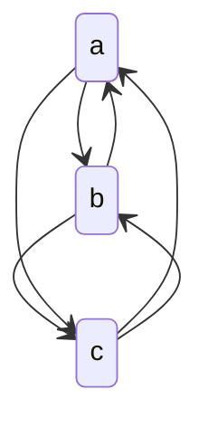
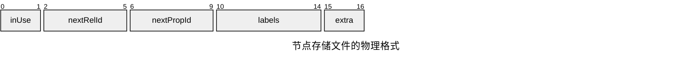
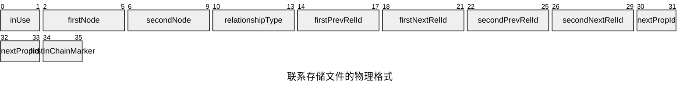

# 图数据库

## 数据建模

- 节点：一般就是领域中的名词，RDBMS 中的实体
- 标签：代表节点或边的通用名词，也可以叫做类型
- 边：也叫做关系，节点之间的连接，边是有方向的
- 属性：节点或关系附带的信息

### 1.实体转节点

从设计的概念模型中找到所需的实体，后将实体转为节点，并为节点指定通用的标签，通用的标签使得关于相同的项的节点能分为一组，简化模型

### 2.关系转边

从设计的概念模型中找出实体之间的关系，并将关系转为边，并为边指定通用的标签，通用的标签使得关于相同的项的边能分为一组，简化模型

### 3.分配属性

在概念模型中，实体与关系自然而然地会拥有许多属性，因此，这些属性可以放入到节点或边中

### 4.反范式化

为了优化性能，可以采取一些反范式的设计，如利用预计算或添加重复的数据，来优化遍历时的性能


## 图的遍历

对于图，需要通过遍历，才能进行查询或者处理

通过指定一个初始点，再通过一系列的筛选

```java
g.V().
  has ('person','first_name','Ted'). // 标签为 person，有 first_name 属性为 Ted 的节点
  out ('friends'). // 有 friends 标签的出边的节点
  values('first_name') // 取出 first_name 属性
```

对于未知的结构，通过递归遍历来描述：

```java
g.V().has('person','first_name','Ted').
  repeat
    out()
  )until(has('person','first_name','Dave')). // 重复直到连接的节点有 Dave
  values(first_name')
```

添加节点或者边，也能遍历来描述

```java
josh = g.addV('person').property('first_name', 'Josh').next()
ted = g.addV('person').property('first_name', 'Ted').next()
hank = g.addV('person').property('first_name', 'Hank').next()

g.addE('friends').from(dave).to(ted)
```

遍历可以得到路径

```java
g.V().has('person', 'first_name', 'Ted').
  until(has('person', 'first_name', 'Denise')).
  repeat(
    both('friends').simplePath()
  ).path()
```

## 性能

### 索引

图数据库也能创建索引，如对节点或边的属性创建索引，就可以快速查询而不用去遍历整张图

### 超级节点

就是图中有异常多相邻边的顶点。

为了找出超级节点，可以通过对每个节点计算度数然后倒序排序得到

```java
g.V().
  project('vertex','degree').
  by(identity())
  by(bothE().count())
  order()
  by(select('degree'),desc).
  limit(10)
```

超级节点会影响遍历时的性能，为了缓解超级节点的影响，可以通过索引或反范式化的方式减少需要遍历的边或者节点数量

## 图分析

### 寻路

用途：

- 测向：地图使用寻路算法来导航
- 优化问题：寻路算法可以优化处理大量相互依赖的实体的各种问题，如计算机网络中的瓶颈和故障点
- 反诈：许多算法使用循环检测，发现与自身相连的实体组，以寻找紧密相连
的子图，以发现潜在的欺诈账户

算法：

- 非加权最短路径算法
- 加权最短路径算法

### 中心性

用途：

- 在计算机网络中寻找最关键的节点
- 发现一个人在组织中的重要性
- 决定数据包的如何路由
- 在图中发现异常节点，以此作为可能欺诈的衡量标准

算法：

- 度数（degree）：指与一个顶点相关联的边的数量，因此度数中心性是基于边数对顶点进行排序的
- 间隙中心性（Betweenness Centrality）是一种衡量图中顶点重要性的方法，表示一个顶点出现在所有节点对之间的最短路径中的次数。换句话说，它反映了一个顶点在网络中作为其他节点之间的“桥梁”或“中介”的作用。间隙中心性较高的顶点通常是连接不同顶点组的关键节点
- 亲密度（closeness）中心性是对从一个顶点到所有其他顶点的最短路径平均长度的度量，表示相对于所有其他顶点，哪些顶点位于最中心的位置。使用亲密度数中心性时，返回值越小，说明该顶点越重要
- 特征向量中心性（Eigenvector Centrality）是一种衡量图中顶点重要性的复杂方法。它不仅根据一个顶点的直接连接数量来判断其重要性，还考虑了相邻顶点的重要性
- PageRank

### 群体检测

来发现相互紧密连接但与图中其他顶点松散连接的顶点组或群体

算法：

- 三角形计数：计算给定节点子集内的三角形数量
- 连通分量：即一个大图

### 机器学习

特征提取：

- 通过最短路径提取一个节点与已知黑样本节点的距离，作为一个预测度量
- 通过三角形计数来确定特定用户的社交性或反社交性
- 通过度数来确定节点的重要性

图 embeding：

- 节点嵌入是指将图中的每个节点映射为一个低维向量。这个向量表示不仅要包含该节点的自身属性，还要反映它在图中与其他节点的关系
- 图嵌入：将整个图结构表示为一个固定长度的向量，而不仅仅是单个节点。这个向量可以包含整个图的全局信息，比如节点的分布、连接模式等特性

## 内部结构

### 图处理

对于非原生的图处理引擎，会使用索引的方式来进行节点间的遍历：

节点|连接的节点
-|-
a|b
a|c
b|c
c|a

索引key|值
-|-
name=Alice|a
name=Bob|b

为了实现快速遍历，原生的图数据库采用一种免索引邻接的方式，每次遍历的成本是 O(1)



### 图存储



一个节点记录的第一个字节是“是否在使用”标志位。它告诉数据库该记录目前是被用于存储节点，还是可回收用于表示一个新的节点(Neo4j的.id文件保持对未使用的记录的跟踪)。接下来的4字节表示关联到该节点的第一个联系，随后4字节表示该节点的第一个属性的ID。标签的5字节指向该节点的标签存储（如果标签很少的话也可以内联到节点中)。最后的字节extra是标志保留位。这样一个标志是用来标识紧密连接节点的，而省下的空间为将来预留。节点记录是相当轻量级的：它真的只是几个指向联系和属性列表的指针。



联系被存储于联系存储文件中，物理文件是neostore.relationshipstore.db。像节点存储一样，联系存储区的记录的大小也是固定的。每个联系记录包含联系的起始节点ID和结束节点ID、联系类型的指针（存储在联系类型存储区)，起始节点和结束节点的上一个联系和下一个联系，以及一个指示当前记录是否位于联系链(relationship chain)最前面。
