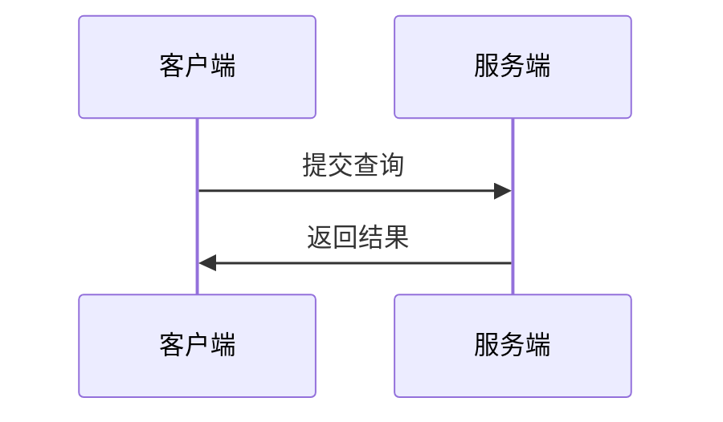

# 数据库

> 数据库是“按照数据结构来组织、存储和管理数据的仓库”。是一个长期存储在计算机内的、有组织的、有共享的、统一管理的数据集合

数据库系统的目标是为了解决文件处理系统的弊端：

1. 数据冗余和不一致
2. 数据访问困难
3. 数据孤立
4. 完整性问题
5. 原子性问题
6. 并发访问异常
7. 安全性问题

## 数据库的4个基本概念

- 数据：描述事物的符号记录
- 数据库
- 数据库管理系统
- 数据库系统

## 数据系统的特点

- 数据结构化
- 数据共享性高、冗余度低且易于扩充
- 数据独立性高
- 数据由数据库管理系统统一管理和控制

## 数据视图

系统开发人员通过几个层次上的抽系来对用户屏蔽复杂性，以简化用户与系统的交互

物理层（实际数据在物理上的存储结构）->逻辑层（数据库中存储什么数据及这些数据间存 在什么关系）->视图层（某种视角看到的数据）

实例是特定时刻存储在数据库中的信息集合，模式是数据库的整体设计。因此，数据库系统通常可以分为几种不同的模式：

* 物理模式：描述数据库在物理上的设计
* 逻辑模式：描述在逻辑层数据库的设计
* 用户模式：数据库用户的视图，是与某一用户有关的数据的逻辑表示

数据模型是描述数据、数据联系、数据语义以及一致性约束等的一套工具，有四类

- 关系模型：用表的集合来表示数据和数据间的联系
- 实体-联系模型：基于对现实世界这样的一种认识，现实世界由一组称为实体的基本对象间的联系构成
- 基于对象的数据模型：类似JAVA等OOP语言的面向对象特性
- 半结构化数据模型：如[XML](/DSL/xml.md)

### 关系模型

关系模型基本概念对应的关系数据库的概念：

- 关系：表
- 元组：行
- 属性：表中的列
- 关系实例：关系中的一个特定实例，也就是所包含的一组特定的行
- 域：属性取值集合
- 空值

#### 码

用元组的属性来区分不同的元组

- 超码（superkey）：一个或多个属性的集合，用来唯一标志一个元组
- 候选码(candidatekey)：在超码的基础上，在任意添加属性，都是超码的超集
- 主码：被数据库设计者选中，用来区分不同元组的候选码
- 外码：参照关系的主码

#### 模式图

#### 关系运算

- 选择 (σ)
- 投影 (π)
- 自然连接 (⋈)
- 笛卡尔积（X）
- 并（∪）

## 形式化关系查询语言

### 关系代数

一种过程化查询语言。它包括 一个运算的集合，这些运算以一个或两个关系为输入， 产生一个新的关系作为结果

运算类型：

- 选择 (σ)：对应SQL中的WHERE子句
- 投影 (π)：对应SQL中SELECT 中选择列（加上DISTINCT关键字），因为投影会去除重复结果
- 并运算：∪
- 集合差运算：$A-B$
- 笛卡尔积运算：两张表进行 `select * from A,B`，通常都要在实际SQL中避免直接使用笛卡尔积，因为它会使“数据爆炸”
- 更名运算：$ρ_x(a1,a2,a3..)(E)$，表示将表达式E命名为x，并且把各项属性值命名为a1，a2...
- 集合交运算：∩
- 自然连接运算：⋈：`select * from A,B wehre a.id = b.id`
- 赋值运算：←（比如temp1 ← R X S）
- 外连接运算
  - 左外连接：⟕，保留左边的值
  - 右外连接：⟖，保留右边的值
  - 全外连接：⟗
- 广义投影：在投影属性的基础上再对属性做运算
- 聚集：min、max、sum...

关系代数中基本的表达式是：

- 数据库中的一个关系
- 一个常数关系，常数关系可以理解为（1，2，,3..）常数集合

## 数据库语言[SQL](/DSL/SQL.md)

使用 DDL 来定义数据模式，使用 DML 来表达数据库的查询与更新

DML 分为过程式与声明式，像SQL就是典型的声明式

## 关系数据库基本概念

- 表：数据库表是一系列二维数组的集合，用来代表和储存数据对象之间的关系
- 数据操纵语言：特点是非过程化（告诉它做说明，而不必告诉它怎么做）
- 数据定义语言
- 应用程序访问数据库，通过提供应用程序接口：如ODBC与JDBC，另外一种方式则是可以提供一个预处理，将DML语言转换成宿主的语言调用

## 文件组织

### 定长记录

### 变长记录

问题：

- 如何描述一条记录，使得单个属性能够轻松读取
- 在块中如何存储变长记录，使得块中的记录可以轻松读取

### 行在文件中的组织方式

- 堆文件组织：一条记录可以放在文件中的任何地方，每个关系使用一个单独的文件
- 顺序文件组织：根据可以被排序的key进行组织，为了维护删除行留下的空行，可以维护一个已删除的位置链表，方便后续插入，随着删删改改，顺序会渐渐错乱，此时需要通过整理的方式对所有行的位置重新调整
- 散列文件组织：对行的某些属性计算一个哈希值，根据此哈希值决定存放位置

一个文件并非只能存一个表，多表聚簇文件组织可以将多个相关联的表在物理上存储到同一个文件组中，这样在查询的时候可以提高效率，同时也能降低空间成本

### 数据字典存储

描述表、索引、用户的数据如何存储，大部分数据库都将这些元数据以表的形式暴露出来，供外部读取操作

必须存储的信息类型：

- 关系名
- 每个关系中的属性名
- 属性的域与长度
- 视图名与视图定义
- 完整性约束

### 数据库缓冲

数据库缓冲设计跟其他的缓存系统很像，要考虑缓存的淘汰策略，但也有一些是常规缓存没有的：

- pinned bock：这种缓存不允许被写回磁盘，比如当这块缓存正在被写入时，此时就不允许写会磁盘
- 块强制写回：类似于操作系统的强制刷盘

## 数据存储和查询

### 存储管理器

负责在数据库中存储的低层数据与应用程序以及向系统提交的查询之间提供接口的部件

- 权限及完整性管理器
- 事务管理器
- 文件管理器
- 缓冲区管理器
- 数据文件
- 数据字典
- 索引

### 查询处理器

- DDL解释器
- DML编译器
- 查询执行引擎

## 查询处理

数据库将 SQL 转为关系代数，并对关系代数附上注释叫做计算原语，执行一个查询的原语操作序列称为查询执行计划(query-execution plan)，查询执行引擎执行查询执行计划并将结果返回给前端，构造具有最小查询执行代价的查询执行计划叫做查询优化

衡量查询的代价：

- 磁盘读写（传送磁盘块数以及搜索磁盘次数）
- CPU时间
- 网络延迟

### 选择运算

#### 使用文件扫描和索引的选择

- 线性搜索：扫描每一个文件块，对所有记录都进行测试，看它们是否满足选择条件
- (主索引，码属性等值比较)：这种搜索可以直接使用两个索引比较，无需扫描文件块
- (主索引，非码属性等值比较)：可以利用主索引检索到多条记录，但由于文件里的记录是有序的，代价还能接受
- (辅助索引，等值比较)：这种查询的代价取决于辅助索引是否是唯一的，如果辅助索引能查询到很多记录，则效率很差

#### 涉及比较的选择

- 主索引比较
- 辅助索引比较

#### 复杂选择的实现

- 合取（并集）
- 析取（交集）
- 取反
- 利用一个索引的合取选择
- 使用组合索引的合取选择
- 通过标志符的交实现合取选择
- 通过标志符的并实现合取选择

### 排序

数据库对不能全部放在内存中的关系会进行外排序，最常用的就是外部排序归并算法，利用外部文件多路归并拉实现

### 连接运算实现

- 嵌套循环连接：对于两个没有索引的关系，是一个 m * n 复杂度级别磁盘搜索
- 块嵌套循环连接：通过将外层循环的数据装入缓存来降低磁盘搜索次数
- 索引嵌套循环连接：若在内层循环的连接属性上有索引，则可以用索引查找替代文件扫描，如果内层外层循环都有索引，则将记录较少的关系作为外层效果比较好
- 归并连接：如果两个连接的表的属性顺序是相同的，则可以通过归并的方式两两合并得到连接结果
- 散列连接：通过判断散列值是否相同来连接

所以为了效率，在选择外层循环的表（驱动表）的时候，一般是选择小表

由于内存缓冲总是有限的，块嵌套循环的驱动表能放入内存缓冲的数量也是有限的，由于内存缓冲的淘汰策略大部分都是LRU，可能就会导致内存缓冲的数据不断被淘汰，以载入块嵌套的缓冲，而这些被淘汰的数据可能都是热数据，这就很影响性能

### 其他运算实现

- 去重：通过排序或者散列来实现，去除蛋复的代价相对较大，所以需要显式指明
- 投影：需要做的就是去除重复元组
- 集合运算：一种实现方式是在内存中将一个关系建立散列表，提升对比速度
- 外连接：在连接的基础上，要考虑某一个集合没有值的情况，并将没值的情况写入结果集
- 聚合运算：也可以通过排序与散列来实现，可以边遍历记录，边计算结果

### 表达式计算

- 物化：计算的中间结果写入磁盘，这种计算的代价还要考虑写磁盘的代价
- 流水线：多个运算组合成一个操作的流水线，一个记录经过操作完成之后，马上就可以传送到下一个操作，相比物化，这种不仅可以减少写临时磁盘的代价，而且流水线还能让用户更早看到结果，流水线的实现：
  - 消费者驱动：各个操作节点都有一个迭代器，不断获取下一条记录，下一条记录都是来自于上一个操作节点
  - 生产者驱动：从源头输入数据，同时维护一个缓存区域用来存放中间结果，数据直接在各个操作节点之间单向流动

## 查询优化原理

一个给定的查询，通常会有许多种可能的执行策略，查询优化就是从这许多策略中找出最搞笑的查询执行计划的过程

产生逻辑一致的表达式 -> 产生不同的查询计划 -> 评估查询计划，选择代价最小的

### 关系表达式的转换

如果两个关系表达式在每一个有效数据库实例中都会产生相同的元组集，则称它们是等价的

#### 等价规则

如集合的结合律：$$(E1\cup E2) \cup E3 = E1\cup (E2 \cup E3)$$

#### 连接的次序

巧妙编排连接中关系的顺序可以有效减少临时结果大小

一个小关系连接大关系比大关系连接小关系查的更快

#### 等价表达式的枚举

为了查询得到所有等价表达式，通过递归将子表达式进行等价替换来得到所有等价的表达式，在枚举这些表达式的过程中，可以根据代价来对一些表达式进行剪枝

### 表达式结果集统计大小的估计

为了计算查询的代价，要通过一些统计信息来进行，这个估计并不十分精确，这些统计数据大部分都是通过随机抽样来生成的，还有些数据库不会自动更新统计数据，而是让 DBA 手动运行命令的方式来进行生成

整体来说，这一部分就是要通过计算概率的方式，来计算出执行的代价

- 目录信息：根据表的记录数、每条记录的大小等信息
- 选择运算结果大小的估计：选择的数据占总体数据的量
- 连接运算结果大小的估计：两张表进行连接，最简单的形式就是笛卡尔积，数量是两张表相乘，其他的则要根据连接的属性来进行估算

### 执行计划选择

- 基于代价的连接顺序选择：多个关系连接的最优方式，可以看作是一个动态规划问题，找到这些关系的最优连接方式
- 等价规则的基于代价的优化器：为了在众多的查询计划找到最优的计划，要做到：如何用较少的空间表达查询计划、如何检测相同的表达式、如何使用动态规划高效找出最优计划、通过贪心 + 剪枝的方式找到最优...
- 启发式优化：这种优化方式尽早执行运算，比如选择运算不一定可以降低执行代价，但有时投影运算可以大大减小关系，通过配合基于代价的优化，来达到一个不错的效果
- 嵌套子查询的优化：对于每个元组，都会执行一次子查询，代价很大，一种优化方式是将其转成连接，但是很多嵌套子查询没有转连接的通用算法，还是要在使用上，避免使用子查询

### 物化视图

通过冗余，其内容已计算并存储的识图，这种物理视图的读取代价比逻辑视图低

#### 视图维护

手工代码维护：真正的数据修改之后，再额外去修改物化视图的数据

增量视图维护：这种就是根据视图的查询语句，计算每次更新与物理视图会产生什么差异，再由系统去修改视图的数据，如：

- count：删除数据-1，插入数据+1
- ...

#### 查询优化和物化视图

物化视图可以被用来优化一些查询，假设要查询 a join b join c

现有 物化视图 v = a join b，通过 v join c 可以有效降低临时结果，降低查询代价

反过来也是 如果物化视图查询代价过高，可以把它拆分成原始查询

### 其他优化

- top-K优化：取出前 k 个最大的数据。一种方式是通过流水线，可以源源不断产生数据，另外一种方式则是估计出前 K大的值是什么，然后遍历直至找到
- 连接简化：某些查询下，连接是没有意义的，可以优化掉，一般是定义视图，视图又连接其他关系，导致重复
- 多查询优化和共享式扫描：同时提交的查询语句，可以有共用的表达式，那就可以缓存表达式，提升效率
- 参数化查询优化：在选取最优查询计划时，还要考虑条件的参数值，不同的参数值执行代价可能不一样

## 数据库体系结构

- 两层体系结构：客户端直接与数据进行交互
- 三层体系结构：客户端通过一个服务端与数据进行交互

### 集中式系统

运行在单台计算机系统上，不与其他计算机系统交互

粗粒度并行的机器只有几个核心，一般一个查询只会跑在一个核心上

细粒度并行的机器则有大量处理器，将并行执行用户提交的查询

### CS系统

### 服务器系统体系结构

### 并行系统

通过增加并行度在更短的时间内运行一个给定的任务称为加速比(speedup)。通过增加并行度来处理更大的任务称为扩展比(scaleup)

## 并行数据库

并行系统设计需注意到的可用性问题：

- 硬件发生故障时的恢复性
- 数据和模式支持在线变更

### IO 并行

将关系划分到多张磁盘上来缩减从磁盘上对关系进行检索所需的时间，是一种数据分区

划分技术：

- 轮转分区
- 散列分区
- 范围分区

除了轮转分区，其他两种方式都有可能产生数据倾斜，为了规避倾斜，通常有两种方式：

1. 事先进行统计，根据数据的分布规划分区
2. 一致性哈希

### 查询间并行

> 不同查询或事务彼此并行执行

这种并行需要考虑不同节点之间的数据一致性问题

### 查询内并行

> 单个查询在多个处理器和磁盘上并行执行

- 操作内并行：并行地执行每个运算来提升速度，像是并行归并排序、根据属性分区后并行join
- 操作间并行：并行地执行一个查询表达式中的多个不同的运算来提升速度，如流水线并行，不需要等待结果全部计算完毕，就可以把中间结果源源不断发射给下游，还有就是互不依赖的运算也可以独立并行

并行需要考虑以下代价：

1. 启动运算的代价
2. 数据倾斜导致计算不均衡
3. 数据的并发竞争
4. 各个节点计算完成之后统一汇总的代价

并行使得查询优化更复杂：代价模型更复杂、考虑倾斜、并发竞争...

## 分布式数据库

> 服务于写多读少、低延时、海量并发 OLTP 场景的，具备海量数据存储能力和高可靠性的关系型数据库

### 一致性

观察数据一致性的两个视角：

- 状态一致性是指，数据所处的客观、实际状态所体现的一致性
- 操作一致性是指，外部用户通过协议约定的操作，能够读取到的数据一致性

### 架构风格

#### PostgreSQL-XC

- 分片、分布式事务、跨节点查询和全局时钟

#### NewSQL

- 基于分布式KV存储系统，存储与计算分离，拥有更高的伸缩性

很多产品为了获得更好的计算性能，会尽量将更多计算下压到存储节点执行，更偏向于PostgreSQL-XC风格

### 全局时钟

- 时间源
- 时钟类型
- 授时点

#### TrueTime

时间源是 GPS 和原子钟，所以属于多时间源和物理时钟，同时它也采用了多点授时机制，依赖于特定硬件设备

#### HLC

每个节点会使用本地时钟作为参照，但不受到时钟回拨的影响，可以保证单调递增。本质上，HLC 还是 Lamport 逻辑时钟的变体，所以对于不同节点上没有调用关系的两个事件，是无法精确判断先后关系的

#### TSO

#### STP

### 可用性

分布式数据库为了提升可用性：

- 基于多数的方法：读写操作都要通过超过半数节点才认为成功
- 读一个写所有：可以从任意一个节点读数据，但写数据要所有节点写成功才认为是成功
- 牺牲一致性：BASE

### 分布式查询处理

由于分布式数据库引入了分区，在进行查询时就没那么方便了，执行器要根据where条件决定去哪里查，还有join也封复杂了，查询符合条件的数据要如何查代价才小，还有查询完成之后的汇总合并

## 数据仓库

一个将从多个数据源中收集来的信息以统一模式存储在单个站点上的仓储

- 怎么从数据源收集数据
- 使用什么schema
- 怎么做数据转换与清理
- 数据更新如何通知数据仓库
- 存储哪些数据

数据仓库典型的数据模式大都是为数据分析而设计，如一张事实表，多张维度表的，维度表又有维度表的雪花型模式

列存储在数据仓库中用的比较多，主要还是因为数据分析更多地是在相同的属性上进行分析

## 特种数据库

- 面向对象数据库
- 半结构化数据库

## 数据库系统的历史

- 1950s-1960s：磁带存储
- 1960s-1970s：硬盘
- 1980s：关系数据库取代网状数据库
- 1990s：互联网与数据库
- 2000s：数据分析与数据库

## NoSQL

充分利用各种不同NoSQL数据库的特性来助推业务

- MongoDB 的文档特性
- Redis 的快速寻址特性
- ...
