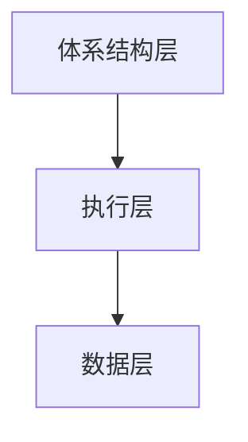
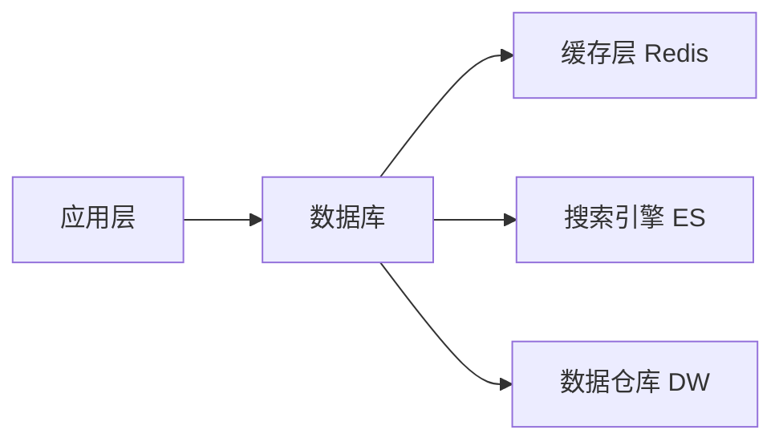
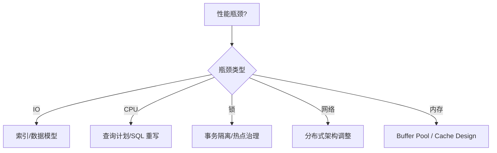

# 数据库优化

## 概述（Overview）

数据库优化是一门 **系统工程**，其目标并非“让 SQL 跑得更快”，而是通过对 **数据模型、执行机制、资源分配、并发控制、访问模式** 等多维度进行系统性治理，从而在成本与收益平衡下获得 **稳定、可预测、可扩展** 的数据服务能力。

数据库优化不是某种技巧，而是一套贯穿 **测量—诊断—设计—执行—治理** 的工程体系。
它适用于所有数据库系统，包括：

* 行存数据库（MySQL/PostgreSQL/Oracle/SQL Server）
* 列存数据库（ClickHouse/BigQuery/Redshift）
* 分布式数据库（TiDB/CockroachDB）
* NoSQL 数据库（MongoDB/Redis/Cassandra）

---

## 本质（Essence）

数据库优化的本质可以归纳为三条核心原理：

### 关注瓶颈结构而不是语法细节

所有数据库性能问题最终都落入以下五类瓶颈之一：

| 瓶颈类型 | 底层本质                        |
| ---- | --------------------------- |
| CPU  | 运算密度、表达式计算、排序、聚合、解释器开销      |
| 内存   | Buffer Pool 命中率、内存不足导致的磁盘回落 |
| IO   | 随机读写放大、索引结构、数据分布            |
| 锁    | 并发冲突导致的等待与阻塞                |
| 网络   | 分布式拓扑、跨节点读写、协议开销            |

### 关注数据模型结构，而不是 SQL 表象

性能问题 80% 由以下结构性因素导致，而不是语句写法：

* 数据行长是否合理
* 索引设计是否匹配访问路径
* 表的基数（Cardinality）
* 热点数据分布（Skew）
* 数据是否该拆分或聚合
* 是否存在跨节点 JOIN、远程访问

### 优化是一种资源管理与成本管理

**优化成本 > 性能收益 → 停止优化。**

优化行为必须服从：

* 延迟目标（Latency SLO）
* 吞吐目标（QPS/事务数）
* 稳定性目标（抖动上限）
* 成本目标（资源、运维、复杂度）

---

## 模型（Model）

数据库优化可抽象为一个通用 **六域模型（Six-Domain Model）**：

六大模型定义如下：

| 模型     | 所描述的本质                       |
| ------ | ---------------------------- |
| 查询模型   | 数据访问模式：点查、范围、聚合、JOIN、扫描      |
| 存储模型   | 行存/列存/LSM/B+Tree 的底层物理组织     |
| 索引模型   | 访问路径决策、选择性、覆盖性               |
| 并发控制模型 | 锁/多版本、事务隔离、冲突与等待             |
| 执行计划模型 | 查询计划生成规则、代价模型、算子组合           |
| 资源管理模型 | BufferPool、IO 策略、CPU、内存、网络分布 |

数据库优化 = 让六大模型共同协作，为特定 workload 达到最优解。

---

## 能力体系（Capability System）

数据库优化的能力体系可以抽象为七大类：

### 性能测量能力（Observability）

核心：没有测量就没有优化。

包括：

* 执行计划解析（Explain/Trace）
* 指标采集（Performance Schema/pg_stat/...）
* 慢查询系统（Slow Log）
* 基础资源指标（CPU/IO/锁/等待事件）

### 访问路径设计能力（Access Path Design）

涉及：

* 索引选择性分析
* 多列索引排序与覆盖策略
* 查询改写（Rewrite）
* 自适应索引与自动优化器（现代数据库趋势）

### 数据建模能力（Data Modeling）

包括：

* 范式化 vs 反范式化
* 垂直拆分 & 水平拆分
* 分区与分片
* 热点隔离（Hotspot Isolation）

### 存储结构治理能力（Storage Governance）

包括：

* 表字段设计（宽行/窄行）
* 数据类型优化
* 行格式、压缩、TTL
* LSM/B+Tree 结构特性理解（对 MySQL、TiDB、MongoDB 都通用）

### 并发控制能力（Concurrency Control）

包括：

* 锁冲突分析
* 事务隔离级别选择
* 写入放大理解
* 多版本读取（MVCC）的成本模型

### 资源调优能力（Resource Tuning）

包括：

* Buffer pool / Memory
* IO 调度策略
* CPU 调度
* 网络拓扑（在分布式数据库中尤为关键）

### 分布式治理能力（Distributed System Tuning）

包括：

* 分片路由策略
* 分布式事务成本模型
* 跨节点 JOIN/聚合问题
* 扩容与迁移的无损方案

---

## 架构模型（Architecture Model）

数据库优化可以归纳为 **三层架构模型**：

### 体系结构层（Architecture Layer）

决定数据库整体能力边界，包括：

* 存储引擎（B+Tree/LSM/列存）
* 分布式拓扑（单节点/主从/Shared-Nothing）
* 事务模型（MVCC/锁/两阶段提交）

### 执行层（Execution Layer）

决定 SQL 如何执行：

* 查询优化器（Cost-based Optimizer）
* 算子（Hash Join、Nested Loop、Sort…）
* 查询计划缓存

### 数据层（Data Layer）

决定数据如何落盘与查询：

* 表结构
* 索引
* 文件结构（Segment/Page）
* 缓存与 IO 模型

优化应按层推进（先架构，再执行，再数据），而不是直接改 SQL。

---

## 类型体系（Taxonomy）

优化可以被分类为以下类型：

### 按专业领域分类

* 查询优化（Query Optimization）
* 存储优化（Storage Optimization）
* 索引优化（Index Optimization）
* 事务优化（Transaction Optimization）
* 分布式优化（Distributed Optimization）
* 资源优化（Resource Optimization）

### 按操作对象分类

* SQL 优化
* 表结构优化
* 数据模型优化
* 执行计划优化
* 缓存优化
* 架构拓扑优化

### 按成本收益分类

（从低成本高收益 到 高成本低收益）

| 层级   | 类型          | 描述                |
| ---- | ----------- | ----------------- |
| 最高收益 | SQL 改写、索引优化 | 几乎不需要额外成本即可显著提升性能 |
| 中等收益 | 表结构与数据模型优化  | 影响面较大但收益可持续       |
| 较高成本 | 架构调整/拆库拆表   | 系统复杂度显著提升         |
| 极高成本 | 分布式重构       | 仅在单机能力耗尽时采用       |

---

## 边界与生态（Boundary & Ecosystem）

### 优化的边界

数据库优化不能解决：

* 错误的业务模型
* 不合理的数据增长策略
* 无穷扩容需求（必须通过缓存/消息/数据生命周期管理协同）

### 与其他组件的生态关系

数据库优化必须与：

* 应用 Side（访问模式、连接池）
* 缓存系统（Redis/Local Cache）
* 消息系统（Kafka/RabbitMQ）
* 数据仓库系统

协同设计。

---

## 治理体系（Governance System）

一个成熟的数据系统必须拥有完备的治理体系。

### 指标治理

* QPS、延迟、P99
* IO、锁等待、资源消耗
* 滚动窗口监控

### 慢查询治理

* 慢查询日志收集与聚合
* 自动归档与分析（pt-query-digest/自建分析平台）
* 计划稳定性（Plan Stability）

### 容量治理

* 表数据量预测
* 数据生命周期管理（冷热分层）
* 自动扩容决策

### 架构治理

* 分库分表策略管理
* 分区治理
* Schema 管理（Schema Registry）

---

## 演进趋势（Evolution）

数据库优化正在从“手工”走向“自动化”：

### 自动化方向

* 自动索引（Auto Index）
* 自动查询重写（Auto Rewrite）
* 自适应执行计划（Adaptive Query Plan）
* 负载自适应调度（Workload Aware）

### 架构方向

* 由单机 → 云原生分布式数据库（Serverless）
* 从自建规则 → 成本模型驱动优化器（CBO）
* 从人工调参 → 自动资源优化（Auto-Tuning）

### 数据形态方向

* OLTP 与 OLAP 融合（HTAP）
* 行列混存结构
* 计算下推与存储计算一体化

---

## 选型方法论（Selection Framework）

### Workload 驱动 vs 技术驱动

选型必须基于访问模式：

| 访问模式       | 推荐模型    | 原因    |
| ---------- | ------- | ----- |
| 大量点查       | 索引优化、行存 | 高选择性  |
| 大范围扫描      | 列存、分区   | 扫描效率高 |
| 高写入吞吐      | LSM     | 写入放大小 |
| 分析查询       | 列存/OLAP | 按列计算  |
| 跨节点 JOIN 多 | 分布式数据库  | 计算推下  |

### 决策树（简化版）

---

## 总结（Conclusion）

数据库优化是一门 **以原理为中心、以结构为核心、以测量为前提、以成本为约束** 的工程体系。
从本质上看，数据库性能取决于：

1. **访问路径是否最优**（索引与执行计划）
2. **数据模型是否合理**（拆分、分布、字段设计）
3. **系统资源是否匹配负载**（CPU/IO/内存/网络）
4. **架构决策是否正确**（单机 vs 分布式）
5. **治理体系是否完善**（监控、慢查询、容量管理）

最终目标不是"最快"，而是 **稳定、可预测、可扩展、成本可控**。

## 关联内容（自动生成）

- [/中间件/数据库/数据库.md](/中间件/数据库/数据库.md) 数据库系统的基本概念与查询处理，涵盖了存储管理器、查询处理器以及查询优化原理，与数据库优化的架构模型和执行层优化密切相关
- [/中间件/数据库/索引.md](/中间件/数据库/索引.md) 详述了各种索引结构（B+树、哈希、LSM树等）及MySQL索引优化策略，直接关联数据库优化中索引设计与访问路径优化
- [/中间件/数据库/mysql/查询优化.md](/中间件/数据库/mysql/查询优化.md) 涵盖了查询优化的具体策略、执行流程和性能瓶颈分析，是数据库优化中查询优化类型的实践指导
- [/中间件/数据库/分布式数据库.md](/中间件/数据库/分布式数据库.md) 讨论了分布式数据库的一致性、架构风格、全局时钟和查询处理，与数据库优化中分布式治理能力密切相关
- [/中间件/数据库/分库分表中间件.md](/中间件/数据库/分库分表中间件.md) 涉及分库分表中间件的架构与实现，是数据库优化中架构治理和分布式优化的重要组成部分
- [/中间件/数据库/PostgreSQL.md](/中间件/数据库/PostgreSQL.md) 介绍了PostgreSQL的特性与优化方法，是数据库优化在特定数据库系统中的具体体现
- [/中间件/数据库/ElasticSearch.md](/中间件/数据库/ElasticSearch.md) 包含了ES的性能优化与聚合优化，提供了搜索引擎类型的数据库优化参考
- [/软件工程/性能工程/性能优化.md](/软件工程/性能工程/性能优化.md) 从系统性角度讨论性能优化方法论，与数据库优化的性能测量能力与治理体系相呼应
- [/软件工程/架构/系统设计/缓存.md](/软件工程/架构/系统设计/缓存.md) 缓存与数据库优化协同设计，共同构成数据访问性能优化的完整体系
- [/操作系统/linux/Linux性能优化.md](/操作系统/linux/Linux性能优化.md) 数据库运行在操作系统之上，其IO、内存、CPU性能优化与数据库优化的资源管理模型密切相关
- [/数据技术/数据存储.md](/数据技术/数据存储.md) 涵盖了不同存储系统的特点与优化策略，扩展了数据库优化的视野到更广泛的数据存储领域
- [/软件工程/架构/系统设计/高并发.md](/软件工程/架构/系统设计/高并发.md) 高并发系统设计中的数据库优化是实现高并发能力的关键环节
- [/软件工程/架构/系统设计/扩展性.md](/软件工程/架构/系统设计/扩展性.md) 数据库优化是系统扩展性实现的重要基础，特别是分片与分布式架构优化
- [/编程语言/JAVA/高级/JDBC.md](/编程语言/JAVA/高级/JDBC.md) JDBC与数据库交互的优化，是数据库优化在应用侧的体现，涉及连接池和资源管理
