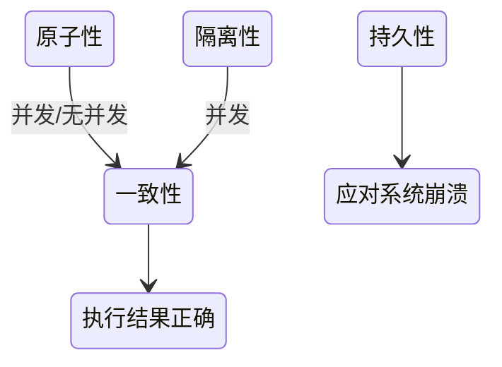

# 事务

> 构成单一逻辑工作单元的操作集合称为事务，可以通过commit提交一个事务，也可以使用rollback回滚


事务状态流转：

- 活动的
- 部分提交的
- 失败的
- 终止的
- 提交的


## ACID

- 原子性(Atomicity)：不可分割的最小操作单位，要么同时成功，要么同时失败

这点相较于并发编程的原子性有所不同：如果一个线程执行一个原子操作，这意味着另一个线程无法看到该操作的一半结果。与并发编程原子性较为相似概念的是ACID的隔离性

- 一致性(Consistency)：事务操作前后，数据总量不变

一致性的这种概念取决于应用程序对不变量的观念，应用程序负责正确定义它的事务，并保持一致性。如果你的应用程序非要写入脏数据，那么数据库也无能为力

- 隔离性(Isolation)：多个事务之间相互独立

隔离性最强的实现手段就是可序列化，但这种方式对性能极差。如Oracle中有一个名为“可序列化”的隔离级别，但实际上它实现了一种叫做快照隔离（snapshot isolation） 的功能，这是一种比可序列化更弱的保证。

- 持久性(Durability)：当事务提交或回滚后，数据会持久化的保存数据

完美的持久性是不存在的 ：如果所有硬盘和所有备份同时被销毁，那显然没有任何数据库能救得了你，最好抱着怀疑的态度接受任何理论上的“保证”。

只有满足一致性，事务执行结果才是正确的。事务串行执行，就能确保隔离性，此时只要满足原子性，就能满足一致性，在并发执行的情况下，要满足原子性和隔离性，才能满足一致性。

满足持久性的原因是为应对系统崩溃的情况，本质上满足持久性最终的目的也是为了满足一致性

AID是因 C是果

事务性质关系及作用：



为了应对系统崩溃，事务采取了事务日志，也就是追加的方式记录所有操作，这样在系统崩溃后也可以根据这些日志进行恢复。

### 实现原子性和持久性

原子性保证了事务的多个操作要么都生效要么都不生效，不会存在中间状态

但事实上磁盘写入总需要个过程，需要个额外的机制来保证出现下列情况后能进行恢复：

1. 未提交事务，写入后崩溃
2. 已提交事务，写入前崩溃

数据库通过修改数据前写入日志的情况来达到崩溃后能恢复的目的，称之为提交日志

同时为了实现事务功能 通过undo log来记录数据的修改的情况，以便随时回滚

### 实现隔离性

## 并发一致性问题

并发环境下，事务的隔离性很难保证

解决并发一致性问题的方法是通过并发控制来保证隔离性。并发控制可以通过封锁来实现

### 丢失修改

两个事务修改同一个数据，后修改的事务覆盖之前事务的修改


丢失修改有几种解决方案：

- 原子写：通常通过在读取对象时，获取其上的排它锁来实现。以便更新完成之前没有其他事务可以读取它
- 显式锁定：通过加锁只允许一个事务
- 原子操作和锁是通过强制读取-修改-写入序列按顺序发生,另一种方法是允许它们并行执行，如果事务管理器检测到丢失更新，则中止事务并强制它们重试其读取-修改-写入序列
- CAS操作

### 脏读

一个事务修改了数据，随后回滚了，但是这个数据在回滚之前被另外一个事务读到了


### 脏写

一个事务修改了数据 另外一个事务也修改了同一份数据 随后前一个事务回滚 这样后一个事务的修改就丢失了

### 不可重复读

一个事务读取数据后，这个数据被另外的事务修改了，先前的事务再读一次，发现两次读取的数据不一致


### 幻读

一个事务读取某个范围的数据，另外一个事务在这个范围上修改了数据，从而导致先前的事务两次读取数据不一致


### 不可重复读与幻读

不可重复读的重点是修改比如多次读取一条记录发现其中某些列的值被修改，幻读的重点在于新增或者删除比如多次读取一条记录发现记录增多或减少了。

## 事务隔离性级别

不同的级别吞吐量及资源利用率、等待时间等都不同 其中串行化是最差的 读未提交是最好的

从上往下，隔离级别递减

- 可串行化 SERIALIZABLE
  - 强制事务串行执行，这样多个事务互不干扰，不会出现并发一致性问题 实际使用中会导致大量超时和锁争用

每个事务都必须小而快，只要有一个缓慢的事务，就会拖慢所有事务处理。如果需要在单线程执行的事务中访问，系统就会变得非常慢

- 可重复读 REPEATABLE-READ
  - 保证在同一个事务中多次读取同一数据的结果是一样的
- 已提交读 READ-COMMITTED
  - 一个事务只能读取已经提交的事务所做的修改

数据库通过使用行锁（row-level lock） 来防止脏写。但想要防止脏读使用读锁就8太行了

- 未提交读 READ-UNCOMMITTED
  - 事务中的修改，即使没有提交，对其它事务也是可见的

隔离级别             | 脏读 | 不可重复读 | 幻读 | 加锁读
---------------- | -- | ----- | -- | ---
READ-UNCOMMITTED | √  | √     | √  | ×
READ-COMMITTED   | ×  | √     | √  | ×
REPEATABLE-READ  | ×  | ×     | √  | ×
SERIALIZABLE     | ×  | ×     | ×  | √


无论是脏读 幻读 不可重复读，原因都是因为隔离性被破坏 实现上面各种隔离级别都是使用读锁 写锁 或者范围锁相互配合来实现的

MVCC是一种读取优化策略，它的“无锁”是特指读取时不需要加锁。MVCC的基本思路是对数据库的任何修改都不会直接覆盖之前的数据，而是产生一个新版副本与老版本共存，以此达到读取时可以完全不加锁的目的

## 隔离性级别的实现

> 并发控制机制

- 锁
- 时间戳
- 多版本和快照隔离

## 并发控制

### 封锁

#### 封锁粒度

锁定的数据量越少，发生锁争用的可能就越小，系统的并发程度就越高
封锁粒度越小，系统开销就越大

#### 封锁类型

##### 读写锁

- 共享锁：简写为S锁，可读不可写
- 排它锁：简写为X锁，可读可写

加了排它锁的数据，就只能允许加锁的事务进行读写
加了共享锁的数据，允许其他事务对其再加共享锁进行读，但不允许再加排它锁

##### 意向锁

意向锁在读写锁的基础上，增加了IX（表的排它锁）与IS（表的共享锁）

- 当一个事务要对数据加S锁之前，就必须获得IS锁或者IX锁
- 当一个事务要对数据加X锁之前，必须获得IX锁

#### 封锁协议

##### 三级封锁协议

- 一级封锁协议

事务 T 要修改数据 A 时必须加 X 锁，直到 T 结束才释放锁


- 二级封锁协议

在一级的基础上，要求读取数据 A 时必须加 S 锁，读取完马上释放 S 锁


- 三级封锁协议

在二级的基础上，要求读取数据 A 时必须加 S 锁，直到事务结束了才能释放 S 锁


##### 两阶段封锁协议

加锁和解锁分为两个阶段进行

- 增长阶段：可以获得锁，不能释放锁
- 缩减阶段：可以释放锁，不能获得锁

MySQL 的 InnoDB 存储引擎采用两段锁协议，会根据隔离级别在需要的时候自动加锁，并且所有的锁都是在同一时刻被释放，这被称为隐式锁定

- 封锁的实现

- 基于图的协议

## 死锁

此处可以参考操作系统中的[死锁处理](/操作系统/死锁.md#处理死锁的策略)

### 死锁预防

- 对加锁请求进行排序
- 有可能导致死锁时，对部分事务回滚 从而打破死锁环

### 锁超时

### 死锁检测与恢复

- 等待图
- 恢复
  - 选择牺牲者
  - 回滚
  - 饿死

### 多粒度

### 基于时间戳的协议

- 时间戳
- 时间戳排序协议
- Thomas写规则

### 基于有效性检查的协议

### 多版本机制

#### 多版本并发控制

MVCC（Multi-Version Concurrency Control） 利用了多版本的思想，写操作更新最新的版本快照，而读操作去读旧版本快照，没有互斥关系

##### undo日志

MVCC 的多版本指的是多个版本的快照，快照存储在 Undo 日志中

```sql
INSERT INTO t(id, x) VALUES(1, "a");
UPDATE t SET x="b" WHERE id=1;
UPDATE t SET x="c" WHERE id=1;
```

上面的三条sql对应于三个事务


##### ReadView

MVCC 维护了一个 ReadView 结构，主要包含了当前系统未提交的事务列表


### 多版本时间戳排序

### 多版本两阶封锁

### 快照隔离

### 插入操作、删除操作与谓词读

### 实践中的弱一致性级别

### 索引结构中的并发

### 单对象多对象事务

新型文档数据库也提供了原子性和隔离性的实现，比如通过编程语言的原子操作或者CAS操作来实现，

