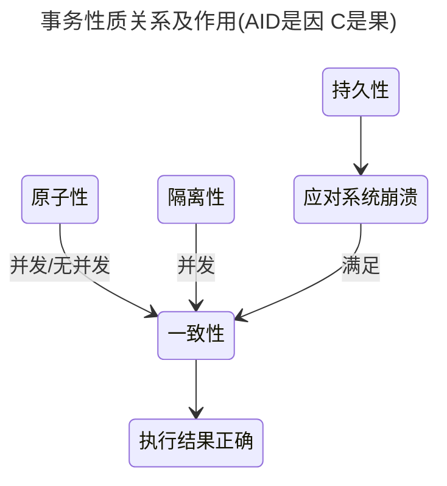
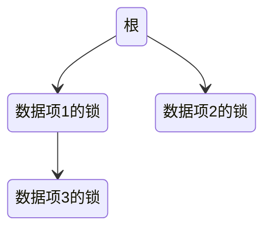
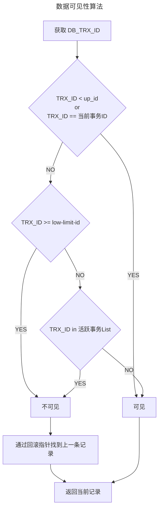

# 事务

> 构成单一逻辑工作单元的操作集合称为事务，可以通过commit提交一个事务，也可以使用rollback回滚

## ACID

- 原子性(Atomicity)：不可分割的最小操作单位，要么同时成功，要么同时失败

这点相较于并发编程的原子性有所不同：如果一个线程执行一个原子操作，这意味着另一个线程无法看到该操作的一半结果。与并发编程原子性较为相似概念的是ACID的隔离性

- 一致性(Consistency)：事务操作前后，数据总量不变

一致性的这种概念取决于应用程序对不变量的观念，应用程序负责正确定义它的事务，并保持一致性。如果你的应用程序非要写入脏数据，那么数据库也无能为力

- 隔离性(Isolation)：多个事务之间相互独立

隔离性最强的实现手段就是可序列化，但这种方式对性能极差。如Oracle中有一个名为“可序列化”的隔离级别，但实际上它实现了一种叫做快照隔离（snapshot isolation） 的功能，这是一种比可序列化更弱的保证。

- 持久性(Durability)：当事务提交或回滚后，数据会持久化的保存数据

完美的持久性是不存在的 ：如果所有硬盘和所有备份同时被销毁，那显然没有任何数据库能救得了你，最好抱着怀疑的态度接受任何理论上的“保证”。

只有满足一致性，事务执行结果才是正确的。事务串行执行，就能确保隔离性，此时只要满足原子性，就能满足一致性，在并发执行的情况下，要满足原子性和隔离性，才能满足一致性。

满足持久性的原因是为应对系统崩溃的情况，本质上满足持久性最终的目的也是为了满足一致性

为了应对系统崩溃，事务采取了事务日志，也就是追加的方式记录所有操作，这样在系统崩溃后也可以根据这些日志进行恢复。

### 实现原子性和持久性

原子性保证了事务的多个操作要么都生效要么都不生效，不会存在中间状态

但事实上磁盘写入总需要个过程，需要个额外的机制来保证出现下列情况后能进行恢复：

1. 未提交事务，写入后崩溃
2. 已提交事务，写入前崩溃

数据库通过修改数据前写入日志的情况来达到崩溃后能恢复的目的，称之为提交日志

同时为了实现事务功能 通过undo log来记录数据的修改的情况，以便随时回滚

为了精确定义事务成功的含义，需要建立抽象事务模型：

- 活动的
- 部分提交的
- 失败的
- 终止的
- 提交的

对于异常终止的事务，数据库系统可以选择重启或者杀死事务，只有是硬件错误或者不是由事务本身导致的错误重启事务才有意义

### 实现隔离性

事务串行执行就不会有隔离性问题，但跟操作系统需要多道程序执行一样，数据库让事务并行可以有效提升吞吐量与降低延迟

为了判断一系列事务是否可串行化，需要对调度构造依赖图，进行是否有环检测

可恢复调度：对于事务 T1 与 T2，如果 T2 读取了 T1 修改的数据项，则 T1 要先于 T2 提交

无级联调度：对于事务 T1，T2，T3，如果 T2 依赖 T1 的修改，T3 依赖 T2 的修改，那么 T1 的回滚不能影响到 T2，T3，也就是 T3 首先提交，然后是 T2，然后是 T1

## 并发一致性问题

并发环境下，事务的隔离性很难保证

解决并发一致性问题的方法是通过并发控制来保证隔离性。并发控制可以通过封锁来实现

### 丢失修改

两个事务修改同一个数据，后修改的事务覆盖之前事务的修改

丢失修改有几种解决方案：

- 原子写：通常通过在读取对象时，获取其上的排它锁来实现。以便更新完成之前没有其他事务可以读取它
- 显式锁定：通过加锁只允许一个事务
- 原子操作和锁是通过强制读取-修改-写入序列按顺序发生,另一种方法是允许它们并行执行，如果事务管理器检测到丢失更新，则中止事务并强制它们重试其读取-修改-写入序列
- CAS操作

### 脏读

一个事务修改了数据，随后回滚了，但是这个数据在回滚之前被另外一个事务读到了

### 脏写

一个事务修改了数据 另外一个事务也修改了同一份数据 随后前一个事务回滚 这样后一个事务的修改就丢失了

### 不可重复读

一个事务读取数据后，这个数据被另外的事务修改了，先前的事务再读一次，发现两次读取的数据不一致

### 幻读

一个事务读取某个范围的数据，另外一个事务在这个范围上修改了数据，从而导致先前的事务两次读取数据不一致

### 不可重复读与幻读

不可重复读的重点是修改比如多次读取一条记录发现其中某些列的值被修改，幻读的重点在于新增或者删除比如多次读取一条记录发现记录增多或减少了。

## 事务隔离性级别

不同的级别吞吐量及资源利用率、等待时间等都不同 其中串行化是最差的 读未提交是最好的

从上往下，隔离级别递减

- 可串行化 SERIALIZABLE
  - 强制事务串行执行，这样多个事务互不干扰，不会出现并发一致性问题 实际使用中会导致大量超时和锁争用

每个事务都必须小而快，只要有一个缓慢的事务，就会拖慢所有事务处理。如果需要在单线程执行的事务中访问，系统就会变得非常慢

- 可重复读 REPEATABLE-READ
  - 保证在同一个事务中多次读取同一数据的结果是一样的
- 已提交读 READ-COMMITTED
  - 一个事务只能读取已经提交的事务所做的修改

数据库通过使用行锁（row-level lock） 来防止脏写。但想要防止脏读使用读锁就不太行了，大多数数据库都选择维护新旧两个值，事务提交之前读取的都是旧值，只有提交了才能读到新值

- 未提交读 READ-UNCOMMITTED
  - 事务中的修改，即使没有提交，对其它事务也是可见的

隔离级别             | 脏读 | 不可重复读 | 幻读 | 加锁读
---------------- | -- | ----- | -- | ---
READ-UNCOMMITTED | √  | √     | √  | ×
READ-COMMITTED   | ×  | √     | √  | ×
REPEATABLE-READ  | ×  | ×     | √  | ×
SERIALIZABLE     | ×  | ×     | ×  | √

在 MySQL 中可重复读是默认，可不一定是常用的。乐观锁必不可少。降低隔离级别可以提升性能，如果应用层对短暂的不一致无感，也是可以接受的

无论是脏读 幻读 不可重复读，原因都是因为隔离性被破坏 实现上面各种隔离级别都是使用读锁 写锁 或者范围锁相互配合来实现的

MVCC是一种读取优化策略，它的“无锁”是特指读取时不需要加锁。MVCC的基本思路是对数据库的任何修改都不会直接覆盖之前的数据，而是产生一个新版副本与老版本共存，以此达到读取时可以完全不加锁的目的

## 并发控制

### 锁

为了避免事务一直获取不到锁饿死，在进行锁授予的时候应该是公平的，先来先得

#### 锁粒度

锁定的数据量越少，发生锁争用的可能就越小，系统的并发程度就越高
封锁粒度越小，系统开销就越大

#### 锁类型

##### 读写锁

- 共享锁：简写为S锁，可读不可写
- 排它锁：简写为X锁，可读可写

加了排它锁的数据，就只能允许加锁的事务进行读写
加了共享锁的数据，允许其他事务对其再加共享锁进行读，但不允许再加排它锁

##### 意向锁

意向锁在读写锁的基础上，增加了IX（表的排它锁）与IS（表的共享锁）

- 当一个事务要对数据加S锁之前，就必须获得IS锁或者IX锁
- 当一个事务要对数据加X锁之前，必须获得IX锁

#### 死锁

此处可以参考操作系统中的[死锁处理](/操作系统/死锁.md#处理死锁的策略)

##### 死锁预防

- 对加锁请求进行排序，使得获取相同的锁的顺序是一致的
- 有可能导致死锁时，对部分事务回滚 从而打破死锁环
- 锁超时，事务至多等待一段给定的时间。若在此期间内未授予该事务锁，则称该事务超时

##### 死锁检测与恢复

通过等待图来描述锁之间的关系，如果发现有环，那就是出现死锁了

要从死锁中恢复的手段需要考虑的：

1. 选择牺牲的事务：这点基于代价考量，牺牲哪个事务付出的代价最小
2. 回滚：选择好要牺牲的事务，要决定回滚多远，是全部回滚，还是回滚到产生死锁之前的状态
3. 避免饿死：为了避免同一个事务总是被选中牺牲，常用的方案是一个事务被回滚次数的越多，那下次被选中的概率越小

#### 封锁协议

规定事务何时对数据项们进行加锁、解锁

##### 三级封锁协议

- 一级封锁协议

事务 T 要修改数据 A 时必须加 X 锁，直到 T 结束才释放锁

- 二级封锁协议

在一级的基础上，要求读取数据 A 时必须加 S 锁，读取完马上释放 S 锁

- 三级封锁协议

在二级的基础上，要求读取数据 A 时必须加 S 锁，直到事务结束了才能释放 S 锁

##### 树形封锁协议

通过将数据项描述为树的节点，想要获取数据项的锁，那就必须先获取到该数据项父节点的锁，使用这种协议不会产生死锁

##### 两阶段封锁协议

加锁和解锁分为两个阶段进行

- 增长阶段：可以获得锁，不能释放锁
- 缩减阶段：可以释放锁，不能获得锁

锁升级只能发生在增长阶段，而锁降级只能发生在缩减阶段

严格两阶段封锁协议：要求所有排它锁在事务提交之后可以释放

强两阶段封锁协议：事务提交之前不得释放任何锁

MySQL 的 InnoDB 存储引擎采用两段锁协议，会根据隔离级别在需要的时候自动加锁，并且所有的锁都是在同一时刻被释放，这被称为隐式锁定

锁的类型：

- 读写锁
- 谓词锁：锁住满足某些条件的数据
- 索引区间锁：使用起始索引跟结束索引代表这区间数据都被锁住了

实现：

锁管理器通过一个锁表来表示数据项被哪些事务的什么锁锁着，加锁与解锁就代表着增加与删除一个链表项

##### 多粒度封锁协议

通过将数据项划分为各个层次的锁，如表锁、行锁等来，粗粒度的锁覆盖细粒度的锁，增强了并发性

### 基于时间戳的协议

为每个事务分配一个唯一的时间戳，时间戳决定了事务的执行顺序

当一个事务执行读写操作时，它会检查所有已经对该数据项进行读写操作的事务的时间戳，如果有任何一个操作的时间戳晚于该事务的时间戳，则该事务必须等待

时间戳排序协议保证冲突可串行化，而且可以保证无死锁，因为事务不需要等待

Thomas 写规则：时间戳排序协议的修改，并发程度比时间戳排序协议高，通过删除事务发出的过时的写操作来使用视图可串行性

### 基于有效性检查的协议

要求每个事务在其生命周期中按两个或三个阶段执行：

1. 读阶段：读取数据存入内存，所有的写操作都是在内存里
2. 有效性检查阶段：判断操作的数据不会与其他事务产生冲突，这点是根据事务的时间戳以及操作的数据集合来判断的，只要这两个没有重叠，那就是不会冲突
3. 写阶段：通过有效性检查，写操作可以被写入到数据库当中了

### 可串行化的快照隔离

在事务提交时，检测是否违背了串行化，若违背了，终止事务重新执行

### 多版本并发控制

MVCC（Multi-Version Concurrency Control） 利用了多版本的思想，写操作更新最新的版本快照，而读操作去读旧版本快照，没有互斥关系，避免了加锁操作

多版本时间戳排序: 通过为每个事务分配唯一的时间戳，以及维护每个事务的读集和写集，来确保事务隔离和一致性

多版本两阶封锁: 每个事务的写操作需要获取一个排他锁，而读操作只需要获取一个共享锁

#### 存储方式

1. Append-Only 方式，对数据每次更新记录日志，每次需要当前数据就从头跑一遍，随着历史版本增多，会导致查询速度变慢
2. Delta 方式：增量版本 + 全量版本
3. Time-Travle 方式：历史版本全量且独立存储

#### MySQL 实现

每个事务都拥有一个系统版本号，每次开始新的事务，版本号就会递增

1. SELECT时 满足以下两个条件的行才会被返回
	1. 行的版本号小于等于当前版本号
	2. 删除版本号为空或者大于当前版本号
2. UPDATE、DELETE、INSERT时 写入新版本号，更新数据都是先读后写的，而这个读，只能读当前的值

简单来说：InnoDB 的行数据有多个版本，每个数据版本有自己的 row trx_id，每个事务或者语句有自己的一致性视图。普通查询语句是一致性读，一致性读会根据 row trx_id 和一致性视图确定数据版本的可见性

##### 版本链

为了实现 MVCC，InnoDB 引擎给每一行都加了一些额外的字段：

- DB_TRX_ID 最后一次修改该记录的事务ID
- DB_ROLL_PTR 通过这个字段把每一行的历史版本串连在一起
- DB_ROW_ID 隐式自增ID（没有主键时 innodb 根据这个生成聚簇索引）
- 创建版本号
- 删除版本号

MVCC 的多版本指的是多个版本的快照，快照存储在 Undo 日志中

##### ReadView

MVCC 维护了一个 ReadView 结构，保存了当前事务开启时所有活跃（还没有提交）的事务列表。当事务内部要读取数据的时候，Read View 就被用来控制这个事务应该读取哪个版本的数据

- 当前读 ：读取记录最新版本 读取时会加锁，加锁的 select for update 执行的是当前读
- 快照读：不会加锁 读取的是历史版本，普通的 select 执行的是快照读

在已提交读隔离级别下，每一次查询语句都会重新生成一个 Read View。这意味着在事务执行过程中，Read View 是在不断变动的

而在可重复读隔离级别下，数据库会在事务开始的时候生成一个 Read View。这意味着整个 Read View 在事务执行过程中都是稳定不变的

小于低水位的部分一定是当前事务开始前就提交了的部分，大于等于高水位的则一定是还未提交的事务，我们一定不可见

对于未提交的事物数组部分：

- 如果在视图数组中，说明当前事务开始时，这些事务仍在活跃，所以应该是不可见的
- 如果不在数组中，说明在仍活跃着的事务范围内，但其中有一些事务虽然不是开始最早的，但是结束的却比活跃数组中的事务早，以至于当前事务开始时，这些事务已经结束，所以就应该是可见的

#### 分布式环境下需要考虑的

1. 何保证产生单调递增事务 ID
2. 如何提供全局快照。每个事务要把自己的状态发送给一个集中点，由它维护一个全局事务列表，并向所有事务提供快照

在 PGXC 风格的分布式数据库都有一个集中点，叫做全局事务管理器

有些 NewSQL 风格的分布式数据库则是直接提供一个更高的隔离级别或者压根不提供隔离实现，当然提高隔离级别也意味着并行能力的下降

### 快照隔离

快照隔离在事务开始执行时给它数据库的一份“快照” 。然后，事务在该快照上操作，和其他并发事务完全隔离开，在事务提交时再解决与其他事务的冲突：

1. 先提交者获胜：事务在提交时探测是否有其他事务也在写相同的数据，如果有，则放弃
2. 先更新者获胜：事务在更新时先获取锁，如果获取不到锁，则放弃

但这种方式没法解决两个事务互相读取对方修改的数据，但是不进行更新的情况，为了解决这个问题，还是需要引入读锁

### 插入操作、删除操作与谓词读

删除：

- 在两阶段封锁协议下，一数据项可以删除之前，在该数据项上必须请求加排他锁
- 在时间戳排序协议下，如果有其他事务在删除之后读写数据，删除操作都要被拒绝

插入：

- 在两阶段封锁协议下，插入的数据要加排它锁
- 在时间错排序协议下，插入的数据的时间戳要设为当前的时间戳

谓词读：

对于 where a = 'xxx' 这种形式的语句，也需要进行上锁，否则会出现幻读：

- 索引封锁协议：不直接锁数据，而是锁索引
- 谓词锁：关系上的插入和删除操作都要检查是否游足谓词。若满足，则存在锁冲突，插入和删除操作要等待直到谓词锁被释放

### 实践中的弱一致性级别

1. 二级一致性：共享锁可以在任何时候释放，并且锁可以在任何时间获得，而排他锁只有在事务提交或中止后才能释放
2. 游标稳定性：对游标指向的当前记录加共享锁，对更改的数据加排它锁直至事务提交
3. 版本号乐观锁

### 索引结构中的并发

索引是争用的热点，如何解决索引访问与更新的冲突：

1. 蟹行协议：从上往下加共享锁，不断缩小锁粒度，直至找到需要的节点
2. next-key lock

### 单对象多对象事务

新型文档数据库也提供了原子性和隔离性的实现，比如通过编程语言的原子操作或者CAS操作来实现，

## 恢复系统

恢复机制负责将数据库恢复到故障发生前的一致的状态

故障分类：

- 事务故障：即软件错误，如事务的SQL有bug
- 系统崩溃：硬件故障或者整个数据库都崩溃了
- 磁盘故障：部分磁盘块损坏等

恢复过程要保证对磁盘的写要么完全成功，要么没有任何改变。同时对于事务的读，每个事务都有自己的一个缓冲区，用来提升性能，像是 MySQL 的 Buffer Pool，缓冲区到磁盘有两种操作：input与output，对应于缓冲区从磁盘读数据、写数据

### 恢复与原子性

为了达到写入的原子性的目标，数据库采用 WAL 机制，即先写日志，后再更新数据来实现

日志记录了数据库中所有的更新活动，一般有这么几个字段：

- 事务标识：执行更新操作的事务
- 数据项标识：一般是数据在磁盘上的位置
- 旧值
- 新值

undo 日志将修改的数据项设置为旧值

redo 日志将修改的数据项设置为新值

如果一个数据项被一个事务修改了，那么在该事务提交或中止前不允许其他事务修改该数据项，这可以通过排它锁来实现，也可以在快照隔离性中在事务提交时进行验证，看有没有与其他事务冲突

当事务提交，在日志中就有一个 commit 记录，这样即使发生崩溃，数据库在启动崩溃恢复时，如果发现一个事务没有 commit 日志，就可以读取之前的 undo 日志记录撤销更新

为了避免每次崩溃恢复要扫描大量日志，通过标记一个检查点，检查点之前的更新确保已经写入到磁盘，这样可以减少扫描的日志记录数量

### 恢复算法

#### 正常时的事务回滚

1. 从后往前扫描日志直至到这个事务起始记录
2. 对于每条日志记录，恢复成旧值，同时记录一条撤销操作的记录，最后写入一个 abort 标识记录

#### 崩溃后的恢复

重做阶段：以最后一个检查点开始正向地扫描日志来重放所有事务的更新，这个阶段会把没有提交成功也没有回滚成功的事务们添加到一个列表 undo-list 中

撤销阶段：从尾端开始反向扫描日志来执行回滚 undo-list 中的所有事务

以上考虑的是数据库崩溃的情况，如果考虑磁盘整个挂掉的情况，就需要定时对整个数据做备份，一旦发生磁盘故障，就可以通过备份的数据 + 日志记录的方式来进行恢复，备份的过程开销较大，其要暂停所有事务的执行，后将缓冲区的数据全部刷到磁盘

### 缓冲区管理

每次写日志都写磁盘的代价有点高，可以先记录日志到缓冲区，再统一刷到磁盘，为了避免缓冲区中的日志丢失，需要保证事务提交前，与该事务有关的日志都要写到磁盘

大多数数据库采用了非强制策略来管理对数据更新，即即使事务提交，所更新的数据也不一定马上写入磁盘，而是将多个更新聚合在一起，一起写入磁盘提升性能，由于日志机制的存在，所以不用担心丢失数据的风险，在进行数据写入时，需要采取封锁机制，避免其他事务读写该数据，一般数据库都会使用一个类似 ring buffer 的区域拉进行上述的缓冲管理，缓冲中修改的数据，但还没写到磁盘的数据称为脏块，脏块写到磁盘乎就不脏了，此时如果缓冲不足，不脏的块就可以淘汰掉

由于操作系统自己还管理着[虚拟内存](/操作系统/内存管理.md#虚拟内存)，这就意味着数据库以为写到内存的数据，实际上有可能会被写到swap中，除非数据库自己管理内存，不过这点在现代操作系统中是不可能的

### ARIES

ARIES 是一种经典的恢复算法：

1. 使用日志序列号LSN来标识日志记录，LSN存储在数据库页中，代表哪些操作已经做过
2. 物理逻辑redo
3. 使用脏页表最大限度减少恢复时不必要的redo
4. 模糊检查点

1.分析阶段：在分析阶段，ARIES算法通过日志文件中的信息，确定了在系统崩溃之前处于活动状态的事务，以及这些事务在哪个时刻提交或中止。在这个阶段，ARIES算法还会生成一个恢复数据结构，用于记录恢复的过程中需要用到的信息。

2.重做阶段：在重做阶段，ARIES算法会根据日志文件中的信息，重做所有在系统崩溃之前已经提交但数据还没落盘的事务的操作。这样可以保证数据库的一致性。在这个阶段，ARIES算法会将所有已提交事务的操作重做一遍，并且将重做的结果记录在恢复数据结构中。

3.撤销阶段：在撤销阶段，ARIES算法会撤销所有在系统崩溃之前处于活动状态的事务的操作，并将撤销的结果记录在恢复数据结构中。在这个阶段，ARIES算法会根据日志文件中的信息，找到所有处于活动状态的事务，并将这些事务的操作全部撤销。
