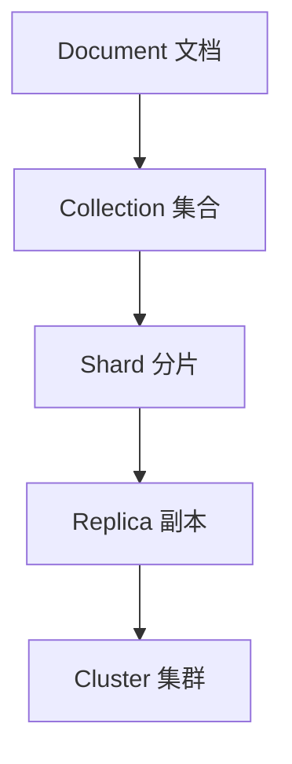
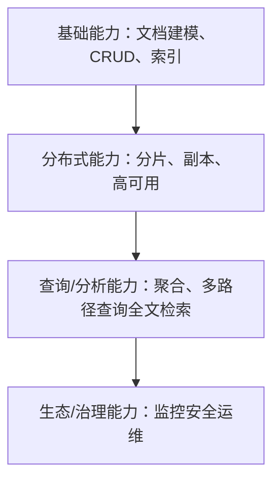
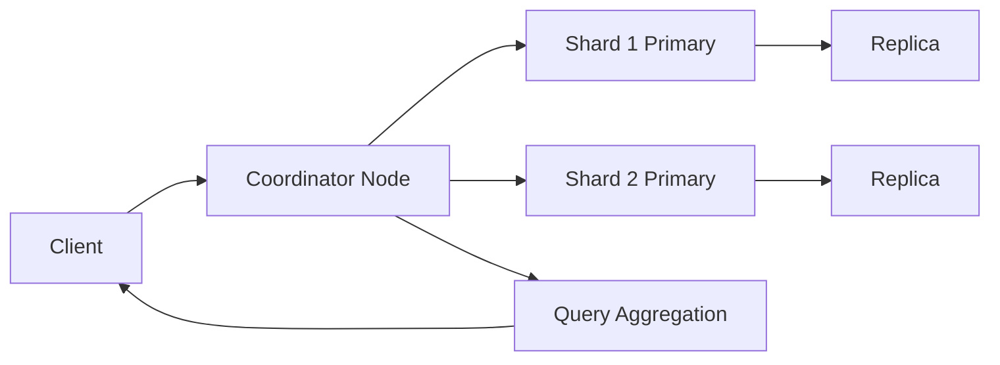

# 文档型数据库

### 概述（Overview）

文档型数据库（Document-Oriented Database）是现代数据密集型系统中的关键存储范式，其核心思想是：
**以文档（Document）作为数据组织的基本抽象单元，以灵活 Schema、天然嵌套结构和分布式架构支撑快速变化且复杂的数据模型。**

文档数据库典型代表包括 MongoDB、Couchbase，以及以“索引型文档存储”为核心的 ElasticSearch。它们共同体现了一种现代数据库哲学：
**弱化关系、强化结构表达能力、拥抱分布式，适配互联网规模的系统复杂性与演进性。**

---

## 本质（Essence）

文档型数据库的本质可归纳为以下五个思想层支撑的核心原理：

#### 文档模型 = 面向对象数据表达的数据库化实现

文档是一种高表达力的数据单元：

* 支持嵌套、数组、对象结构
* 表达能力强于行列模式
* 映射现代程序语言对象结构几乎零阻抗

> 本质：**用结构化 JSON 近似的格式表达真实世界中的实体，而非用二维表强行拆分。**

#### 动态 Schema = 数据模型的演进友好性

业务结构持续变化，固定 Schema 反而成为系统摩擦。
文档数据库使用“约束弱化 + 验证增强”的策略提供：

* 灵活 Schema（Schema-less）
* Schema 版本管理
* 运行时验证而非建模时强制

> 本质：**数据库不再是强结构的笛卡尔积，而是演进体系的一部分。**

#### 分布式优先 = 面向规模与可靠性的系统哲学

文档型数据库天生为分布式：

* 以分片（Sharding）实现存储水平扩展
* 以副本（Replica）实现高可用
* 以协调节点实现请求路由与聚合

> 本质：**数据模型 + 分布式架构，是文档数据库的双核心。**

#### 查询由索引主导 = 通过索引结构定义系统性能边界

文档结构灵活，但只有索引才能支撑确定性的查询行为。
本质是为半结构化数据构建可搜索、可定位的路径（path）。

#### 写优先或读优先不同侧重 = MongoDB 与 ElasticSearch 的分野

* MongoDB：面向 OLTP + 分布式 + 高灵活性
* ElasticSearch：面向全文检索 + 分布式索引 + NRT（近实时）

> 本质统一：**文档是持久化单位，索引是访问加速结构。**

---

## 模型（Model）

文档数据库的核心模型可以抽象为 **“文档 → 集合 → 分片 → 副本 → 集群”** 的层次结构。

#### 文档模型（Document Model）

* 多层嵌套、非规范化结构
* 结构即语义，语义即对象
* 非关系模型 → 用结构代替关联

#### 索引模型（Index Model）

* B-Tree 索引：点查、范围查
* 倒排索引：全文检索、向量索引
* 复合索引：结构数据的高效组合查询

> 在文档数据库中，索引比 Schema 更重要。

#### 一致性模型（Consistency Model）

不同产品遵循不同一致性策略：

* MongoDB：可配置一致性、主写从读
* ElasticSearch：最终一致性 + NRT
* Couchbase：KV 引擎强一致 + 查询最终一致

一致性是成本与性能的折中，不是目标。

#### 事务模型（Transaction Model）

事务能力是文档数据库的演进方向而非起点：

| 数据库       | 事务能力          | 哲学定位          |
| --------- | ------------- | ------------- |
| MongoDB   | 支持跨文档事务（现代版本） | 向关系型靠拢        |
| ES        | 不支持传统事务       | 搜索优先，不追求严格一致性 |
| Couchbase | 局部事务支持        | 混合型           |

---

## 能力体系（Capability System）

文档型数据库可从能力视角构成以下四层能力金字塔：

#### 基础能力

* 文档序列化/反序列化
* 动态/半动态 Schema
* 多种索引结构
* 查询语言（Find/Query DSL/Aggregation Pipeline）

#### 分布式能力

* 分片（水平扩展）
* 副本集/复制集（高可用）
* 路由节点/协调节点（请求调度）
* 集群容错、数据再平衡

#### 查询与分析能力

* 点查、范围查、组合查询
* 聚合分析（Pipeline / Aggregation）
* 全文检索（倒排索引）
* 实时查询/近实时查询
* 新趋势：向量检索 / 语义检索

#### 生态与治理能力

* 安全（认证、授权、加密）
* 性能监控（Metrics, Profiler）
* 数据备份、冷热数据管理
* Schema 版本治理
* DevOps / Cloud Native 部署

---

## 架构模型（Architecture Model）

文档数据库架构由以下三个核心维度组成：
**存储架构、索引架构、分布式架构。**

### 存储架构

* 文档存储引擎（WiredTiger/LSM Tree 等）
* 写放大、压缩、刷盘策略
* 写优先或读优化的差异（如 ES 的段合并）

### 索引架构

* B+Tree 索引：事务型查询
* 倒排索引：搜索型查询
* 混合索引：字段 + 文本
* 向量索引：AI 原生 Retrieval

### 分布式架构

关键能力：

* 分片路由
* 副本同步
* 选主与故障转移
* 再平衡与 shard split/merge
* 写路由：主优先 or 多主
* 查询路由：聚合 + 汇总

---

## 类型体系（Taxonomy）

文档型数据库可按照**核心访问模式 + 架构设计目标**进行分类。

#### 通用型文档数据库（General Purpose）

代表：MongoDB、Couchbase
核心目标：

* 复杂结构建模
* 高性能在线业务（OLTP）
* 分布式事务
* 多模型融合（Document + KV + Graph）

#### 搜索型文档数据库（Search-Oriented）

代表：ElasticSearch, OpenSearch
核心目标：

* 全文检索
* 大规模倒排索引
* 日志、监控、观测性
* NRT（Near Real Time）写后可见性

#### 内存型文档数据库（In-Memory）

代表：Redis JSON 模块
核心目标：

* 低延迟、毫秒级读写
* 小规模结构化文档
* 场景导向，如实时服务

#### 嵌入式文档数据库

代表：LiteDB, Realm
核心目标：

* 嵌入本地应用
* 零运维
* 轻量级数据持久化

---

## 边界与生态（Boundary & Ecosystem）

#### 适用边界

适用于：

* 数据结构复杂、经常变更
* 需要对象到数据库低摩擦映射
* 需要分布式扩展
* 读写模式有明显热点或模式固定

不适合：

* 强一致性、复杂事务逻辑
* 多表 JOIN 复杂分析（需数据仓库/OLAP）
* 核心金融账务、订单对账类严格一致的数据系统

#### 生态

围绕文档数据库形成完整生态链：

* ORM/ODM：Mongoose、Spring Data MongoDB 等
* 流处理：Kafka, Flink
* 数据湖/仓：Iceberg, Delta Lake
* 搜索分析：ELK
* 云服务：Atlas、OpenSearch Service、Couchbase Capella

---

## 治理体系（Governance System）

文档数据库治理主要含：

#### Schema 治理

* Schema Registry
* 文档版本化
* 演进规则（Forward & Backward Compatibility）

#### 性能治理

* 索引管理
* 分片规划
* 热点监控
* Query Profiler

#### 安全治理

* RBAC
* 数据加密
* TLS、审计日志

#### 数据治理

* 备份与恢复
* TTL、冷热分层
* 合规性（GDPR, HIPAA）

---

## 演进趋势（Evolution）

文档型数据库未来演进方向非常清晰：

#### 多模型融合化

文档 + KV + 搜索 + 图 + 时序 → 单一数据库实现多个模型。

#### 分布式与云原生化

* Operator 管理
* 自动扩缩容
* 云托管服务（DBaaS）

#### AI 原生化

* 内置向量索引
* 语义搜索
* LLM + 文档数据库的检索增强生成

#### 分析与事务融合

HTAP（Hybrid Transactional/Analytical Processing）成为趋势，MongoDB/ES 均增强聚合能力。

---

## 选型方法论（Selection Framework）

以下为文档数据库选型的通用决策框架：

| 关键维度    | 决策要点                    |
| ------- | ----------------------- |
| 数据结构复杂度 | 是否需要嵌套/半结构化表达           |
| 查询模式    | 点查？范围查？全文检索？聚合？         |
| 一致性需求   | 强一致？最终一致？               |
| 扩展性     | 是否需要水平扩展超过单机能力          |
| 写/读模式   | 写密集型 → MongoDB；搜索型 → ES |
| 事务需求    | 是否需要跨文档事务               |
| 运维成本    | 云托管 vs 自建集群             |

---

## 总结（Conclusion）

文档型数据库是一类 **以文档为核心抽象、以分布式架构为底座、以索引为性能边界** 的现代数据库体系。
其哲学本质不是“非关系”，而是：

**通过更自然的数据表达与更工程化的分布式架构，实现高演进性、高扩展性、高表达力的数据系统。**

掌握文档数据库的关键不是 API，而是理解其底层思想：

* 文档模型表达真实世界
* 索引结构决定系统性能
* 分布式架构决定系统规模
* 治理体系决定系统寿命

## 关联内容（自动生成）

- [/中间件/数据库/ElasticSearch.md](/中间件/数据库/ElasticSearch.md) ElasticSearch作为搜索型文档数据库，体现了文档数据库在全文检索与分析领域的应用
- [/中间件/数据库/数据库优化.md](/中间件/数据库/数据库优化.md) 文档型数据库的性能优化需要考虑索引模型、查询模式与分布式架构的关联影响
- [/中间件/数据库/分布式数据库.md](/中间件/数据库/分布式数据库.md) 文档数据库的分布式架构与一致性模型是其扩展性与可用性的基础
- [/中间件/数据库/数据库.md](/中间件/数据库/数据库.md) 文档型数据库是现代数据库系统的一个重要分支，与其基本概念与查询处理机制相关
- [/中间件/数据库/索引.md](/中间件/数据库/索引.md) 文档数据库的性能很大程度上依赖其索引结构与访问路径优化
- [/数据技术/数据存储.md](/数据技术/数据存储.md) 文档型数据库代表了一种特定的数据存储范式，与不同存储系统的特点与优化策略相关
- [/软件工程/架构/系统设计/高并发.md](/软件工程/架构/系统设计/高并发.md) 文档数据库的分布式架构与高并发系统设计密切相关，支撑大规模数据访问
- [/软件工程/架构/系统设计/扩展性.md](/软件工程/架构/系统设计/扩展性.md) 文档数据库的分片与副本机制是实现系统扩展性的重要手段
- [/中间件/数据库/PostgreSQL.md](/中间件/数据库/PostgreSQL.md) 传统关系型数据库与文档型数据库在数据模型、存储结构与扩展性方面具有对比价值
