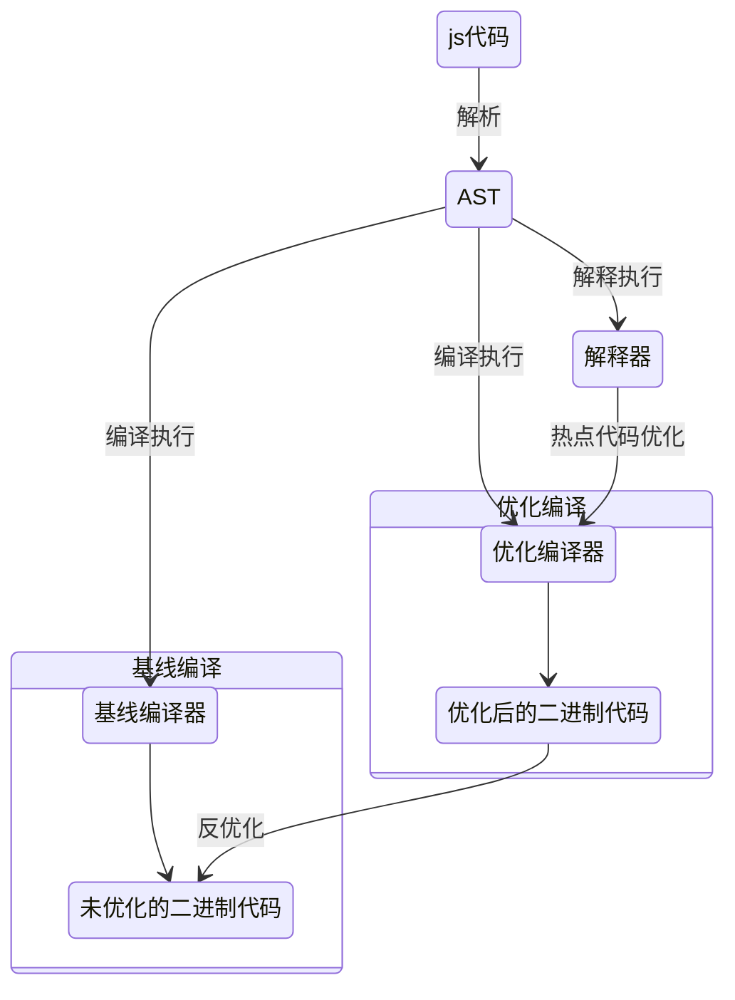

# V8

- JavaScript 虚拟机

## 对象内存布局


- element属性：数字属性，会按照数字的值排序存储
- properties属性：常规属性，会按照存入的顺序进行存储
- 对象内属性：有两种策略。快属性策略：属性比较少时，直接存放在对象内。慢属性策略：属性超过10个，多出来的属性将被存储到properties属性中。


## [原型链](/编程语言/JavaScript/面向对象.md#原型链)

## 作用域链

在 V8 启动后，会创建全局作用域。启动后进入正常的事件循环，当解析到顶层的代码后，会把相应的全局变量加入全局作用域，而在执行函数调用时，会创建出一个本地作用域。在进行变量查找时，遵循的是本地作用域 -> 全局作用域 这条路线进行查找的。

## 运行时

- 宿主环境：浏览器中的渲染进程 或 nodejs 进程，宿主环境为 V8 提供了运行 js 所需的组件
  - 数据存储空间
    - 栈空间：管理函数调用
    - 堆空间：树形的存储结构，用来存储对象类型的离散的数据
  - 全局执行上下文：保存在堆中，用来实现全局作用域
  - 事件循环系统：一个基于消息队列的 take and execute 模型

### 事件循环

```c
// libuv 事件循环
int uv_run(uv_loop_t* loop, uv_run_mode mode) {
  ...

  while (r != 0 && loop->stop_flag == 0) {
    can_sleep =
        uv__queue_empty(&loop->pending_queue) &&
        uv__queue_empty(&loop->idle_handles);

    uv__run_pending(loop);
    uv__run_idle(loop);
    uv__run_prepare(loop);
    
    ...
  }
}
```

### [宏任务微任务](/中间件/浏览器/浏览器.md#宏任务微任务)

宏任务队列由宿主环境管理，微任务队列由V8管理

```cpp
class V8_EXPORT_PRIVATE MicrotaskQueue final : public v8::MicrotaskQueue {...}
```

只有V8的微任务队列执行完了，才会执行下一个宏任务

## 延迟解析

解析器在解析的过程中，如果遇到函数声明，那么会跳过函数内部的代码，并不会为其生成 AST 和字节码，而仅仅生成顶层代码的 AST 和字节码，称之为延迟解析。

由于闭包允许在函数内部定义函数，而内部函数可以访问外部函数所定义的变量。所以预解析启当解析顶层代码的时候，遇到了一个函数，那么预解析器并不会直接跳过该函数，而是对该函数做一次快速的预解析。

预解析除了会快速地检查一下语法错误外，另一件重要的事就是检查函数内部是否引用了外部变量，如果引用了外部的变量，预解析器会将栈中的变量复制到堆中，在下次执行到该函数的时候，直接使用堆中的引用

## 字节码



V8 的解释器是基于寄存器的虚拟机


累加器是一个非常特殊的寄存器，用来保存中间的结果

## 优化

### 隐藏类优化

V8 对每个对象做如下两点假设：

- 对象创建好了之后就不会添加新的属性
- 对象创建好了之后也不会删除属性

在以上假设的基础上，V8 会为每个对象创建一个隐藏类，对象的隐藏类中记录了该对象一些基础的布局信息，包括：对象中所包含的所有的属性；每个属性相对于对象的偏移量

当访问对象的某个属性中，就从记录的布局信息中，查找属性对应的偏移量并进行内存操作。这样就不必经历一系列的查找过程

当给一个对象添加新的属性，或者删除属性时，V8 要为新改变的对象重新构建新的隐藏类，这是一笔开销

### 内联缓存优化

V8 执行函数的过程中，会观察函数中一些调用点 (CallSite) 上的关键的中间数据，然后将这些数据缓存起来，当下次再次执行该函数的时候，V8 就可以直接利用这些中间数据，节省了再次获取这些数据的过程

每个函数都会有一个反馈向量 (FeedBack Vector)，反馈向量中的每一行的内容就是函数中每一行字节码所使用到的隐藏类地址及属性偏移量

slot|type|state|map|offset
-|-|-|-|-
0|LOAD|MONO|3425...|8
1|STORE|MONO|3425...|12
2|LOAD|POLY|`[3425...,3425...]`|`[8,12]`

由于字节码对一个变量做操作，并不一定是确定的类型，所以map与offset可能为多项，超过4个隐藏类，就会使用哈希表来进行存储，否则使用线性结构
