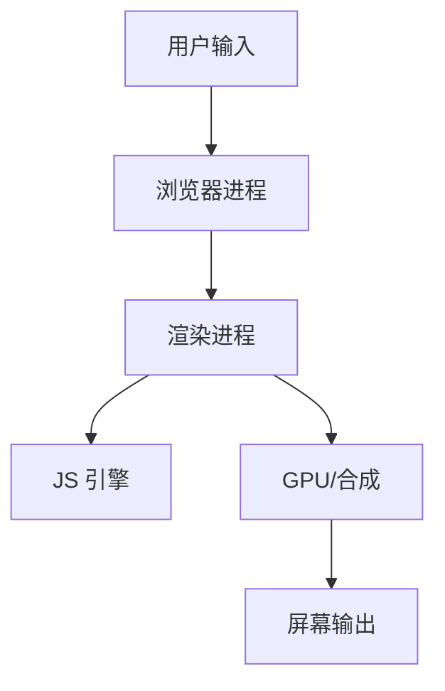
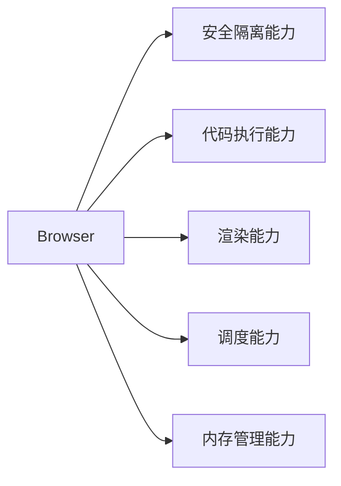
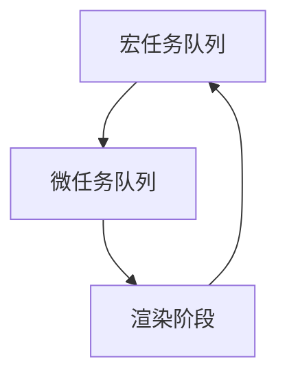

# 浏览器

## 概述（Overview）

从架构演进视角看，浏览器经历了：

* 单进程应用
* 多进程隔离系统
* 面向服务的内部操作系统（Browser OS / Browser SOA）

其核心目标始终围绕三个长期不变的约束展开：

* **安全性（Security）**
* **稳定性（Stability）**
* **性能与交互体验（Performance & UX）**

本文从**第一性原理与体系结构层面**，系统性抽象浏览器的运行机制、能力模型与演进逻辑。

---

## 本质（Essence）

### 浏览器的本质定义

> **浏览器是一个面向不可信代码的、安全隔离的、事件驱动的、可视化计算平台。**

其本质由四个不可分割的约束共同塑造：

| 约束维度 | 核心问题                |
| ---- | ------------------- |
| 安全   | 如何执行来自不可信来源的代码      |
| 并发   | 如何同时处理用户交互、渲染、网络、脚本 |
| 性能   | 如何在毫秒级响应中完成复杂计算     |
| 可视化  | 如何将抽象状态映射为图形输出      |

---

## 模型（Model）

### 浏览器整体认知模型

浏览器可被抽象为 **“多引擎协同 + 事件循环驱动 + 分层渲染流水线”** 的系统：

核心思想：

* **控制平面**：浏览器进程（调度 / 安全 / 资源管理）
* **执行平面**：渲染进程 + JS 引擎
* **表现平面**：GPU 合成与显示

---

## 能力体系（Capability System）

### 浏览器核心能力树

#### 关键能力抽象

| 能力    | 本质                  |
| ----- | ------------------- |
| 安全隔离  | 不可信代码的最小权限执行        |
| 渲染流水线 | 状态 → 几何 → 像素 的确定性转换 |
| 调度系统  | 有限主线程上的公平与优先级       |
| 内存管理  | 自动回收 + 停顿控制         |
| 并发抽象  | “看似并行”的单线程语义        |

---

## 架构模型（Architecture Model）

### 进程架构演进哲学

| 阶段     | 核心问题  | 架构思想   |
| ------ | ----- | ------ |
| 单进程    | 崩溃即全崩 | 简单但脆弱  |
| 多进程    | 隔离与稳定 | 空间换安全  |
| 内部 SOA | 资源浪费  | 服务化、复用 |

#### 架构原则

* **站点隔离优先于资源复用**
* **失败必须被限制在最小边界**
* **进程 ≠ 线程，而是安全与调度边界**

---

## 类型体系（Taxonomy）

### 浏览器内部系统分类

| 子系统  | 类型                           |
| ---- | ---------------------------- |
| 执行系统 | JavaScript 引擎（解释 + JIT）      |
| 渲染系统 | DOM / CSSOM / Layout / Paint |
| 调度系统 | 事件循环 / 任务队列                  |
| 内存系统 | 栈 / 堆 / GC                   |
| 图形系统 | 图层 / 合成 / GPU                |

---

## 渲染体系的第一性原理

### 渲染的本质

> **渲染是一个从“声明式状态”到“像素输出”的确定性流水线。**

### 抽象渲染流水线

### 不可变原则

* 布局 = 几何计算
* 绘制 = 像素指令生成
* 合成 = 位图组合

#### 性能本质规律

> **凡是跨越 Layout / Paint 的变更，必然昂贵。**

---

## 调度与事件循环模型（Scheduling Model）

### 单线程的哲学

JavaScript 的单线程不是限制，而是：

* 消除数据竞争
* 简化心智模型
* 强化事件驱动

### 抽象事件循环模型

#### 调度不变量

* 一个宏任务 → 清空所有微任务
* 微任务是**宏任务内部的强一致性补偿机制**
* 渲染发生在宏任务之间

---

## 内存管理与执行系统（Runtime System）

### 内存的本质分层

| 层级  | 管理策略      |
| --- | --------- |
| 栈   | 确定性、自动回收  |
| 新生代 | 快速分配、复制   |
| 老生代 | 增量标记、并发回收 |

#### 核心哲学

> **GC 不是消除停顿，而是管理停顿。**

---

## 虚拟 DOM 的抽象价值

### 虚拟 DOM 的本质

> **虚拟 DOM 是“视图的中间表示（IR）”，而非性能魔法。**

其价值不在于快，而在于：

* 批量变更
* 跨平台抽象
* 调度与中断能力（Fiber）

#### 抽象层级关系

---

## 边界与生态（Boundary & Ecosystem）

### 浏览器的系统边界

| 边界     | 描述        |
| ------ | --------- |
| OS 边界  | 沙箱、权限、进程  |
| GPU 边界 | 图形加速      |
| 网络边界   | 安全协议、同源   |
| 语言边界   | JS / WASM |

---

## 治理体系（Governance System）

浏览器治理的核心目标：

* **不可阻塞 UI**
* **不可突破安全边界**
* **不可失控资源使用**

对应机制：

| 治理维度 | 手段        |
| ---- | --------- |
| CPU  | 调度、分片     |
| 内存   | GC、限制     |
| 时间   | 帧预算（16ms） |
| 权限   | 同源策略      |

---

## 演进趋势（Evolution）

### 不变的演进方向

* 更强的隔离（Site Isolation）
* 更精细的调度（Scheduler API）
* 更低层的能力开放（WebGPU / WASM）
* 浏览器 ≈ Web OS

---

## 选型方法论（Selection Framework）

### 技术决策核心问题

> **是否跨越渲染流水线的边界？**

| 场景   | 优先策略          |
| ---- | ------------- |
| 动画   | 合成属性          |
| 计算   | Worker / WASM |
| 状态更新 | 批量、调度         |
| 跨端   | 中间表示          |

---

## 总结（Conclusion）

浏览器的真正复杂性不在 API，而在其背后的**系统级约束平衡**：

* 单线程语义 vs 并发现实
* 安全隔离 vs 性能极限
* 即时响应 vs 可控计算

理解浏览器，最终不是学习“怎么用”，而是理解：

> **一个在不可信环境中，构建确定性体验的计算系统，是如何可能的。**

这正是浏览器架构长期稳定、不随框架变化而动摇的**第一性原理所在**。

## 关联内容（自动生成）

- [/中间件/浏览器/V8.md](/中间件/浏览器/V8.md) V8引擎作为浏览器的核心JavaScript执行引擎，与浏览器的执行系统和性能优化密切相关
- [/编程语言/JavaScript/JavaScript.md](/编程语言/JavaScript/JavaScript.md) JavaScript作为浏览器中主要的脚本语言，其执行机制与浏览器的事件循环和渲染机制紧密关联
- [/计算机网络/网络安全/Web安全.md](/计算机网络/网络安全/Web安全.md) 浏览器安全机制与Web安全的同源策略、CSP等安全协议密切相关
- [/软件工程/架构/Web前端/Web前端.md](/软件工程/架构/Web前端/Web前端.md) Web前端技术直接运行在浏览器环境中，与浏览器的能力体系和渲染机制密切相关
