# kafka

Kafka 是一个分布式的基于发布/订阅模式的消息队列（Message Queue），主要应用于大数据实时处理领域

## 特点

- 多生产者 多消费者
- 基于磁盘的数据存储
- 伸缩性
  -  broker可以不断扩展
- 高性能

## 使用场景

- 活动跟踪
  - 生产者产生事件 消费者读取事件进行统计
- 传递消息
- 度量指标 日志记录
  - 收集系统度量指标和日志
- 日志系统
- 流处理
- 事件源
- 消息队列

## 搭建

- 操作系统选用 Linux，可以充分利用 epoll 、零拷贝提升 IO 性能
- 存储选用磁盘，可以被 Kafka 顺序 IO 充分利用
- 磁盘容量规划需要计算一下每天处理多少数据，每条数据多大，数据保留多久，在此基础上预留一定额外空间
- 根据集群节点数，网络带宽，最大只能让 Kafka 使用 70 %的带宽

## 配置

broker 配置

- broker.id
  - 在集群中唯一
  - 需要多少个broker
    - 需要多少磁盘空间保留数据
    - 集群处理请求的能力
- port
- zookeeper.connect
- log.dirs
  - 消息保存在磁盘上的位置
- num.recovery.threads.per.data.dir
  - 使用指定的线程池来处理日志
- auto.create.topics.enable
  - 自动创建主题
    - 当一个生产者开始往主题写入消息时
    - 当一个消费者开始读取
    - 客户端向主题发送元数据请求

主题配置

- num.partitions
  - 默认分区数量
- log.retention.ms
  - 数据保留多久
- log.retention.bytes
  - 主题保留的数据大小
- log.segment.bytes
  - 一个日志片段的最大大小
- log.segment.ms
  - 日志片段的最长打开时间
- message.max.bytes
  - 消息最大大小

## 架构


- Partition ：为了实现扩展性，一个非常大的 topic 可以分布到多个 broker（即服务器）上，
一个 topic  可以分为多个 partition，每个 partition 是一个有序的队列；
- Replica： ：副本，为保证集群中的某个节点发生故障时，该节点上的 partition 数据不丢失，且 kafka 仍然能够继续工作，kafka 提供了副本机制，一个 topic 的每个分区都有若干个副本，
一个 leader 和若干个 follower。
- leader ：每个分区多个副本的“主”，生产者发送数据的对象，以及消费者消费数据的对
象都是 leader。
  - 生产者和消费者只与 leader 副本交互,当 leader 副本发生故障时会从 follower 中选举出一个 leader,但是 follower 中如果有和 leader 同步程度达不到要求的参加不了 leader 的竞选
- follower ：每个分区多个副本中的“从”，实时从 leader 中同步数据，保持和 leader 数据
的同步。leader 发生故障时，某个 follower 会成为新的 follower。

Kafka 中消息是以 topic 进行分类的，生产者生产消息，消费者消费消息，都是面向 topic的

每个 partition 对应于一个 log 文件，该 log 文件中存储的就是 producer 生产的数据

消费者组中的每个消费者，都会实时记录自己消费到了哪个 offset，以便出错恢复时，从上次的位置继续消费

### 主题和分区

- 消息通过主题分类
- 主题被分为若干个分区 通过分区来实现数据冗余和伸缩性


消息和批次
  - 消息是kafka的数据单元
  - 批次是一组消息

对于消息 kafka会保留一段时间或者达到一定大小的字节数 旧的消息会被删除

模式
  - schema 使用额外的结构定义消息内容

### 日志

消息日志文件（.log）、位移索引文件（.index）、时间戳索引文件（.timeindex）、已中止（Aborted）事务的索引文件（.txnindex）

- .index：K：4字节的相对偏移量，V：4字节的消息物理位置。Kafka 使用了 8 字节的整数表达消息偏移量，但由于每个索引文件额外保存了一个基础偏移量，所以绝对偏移量 = 基础偏移量 + 相对偏移量得到，可以节省不少存储空间
- .timeindex：K：8字节的时间戳，V：4字节的相对偏移量

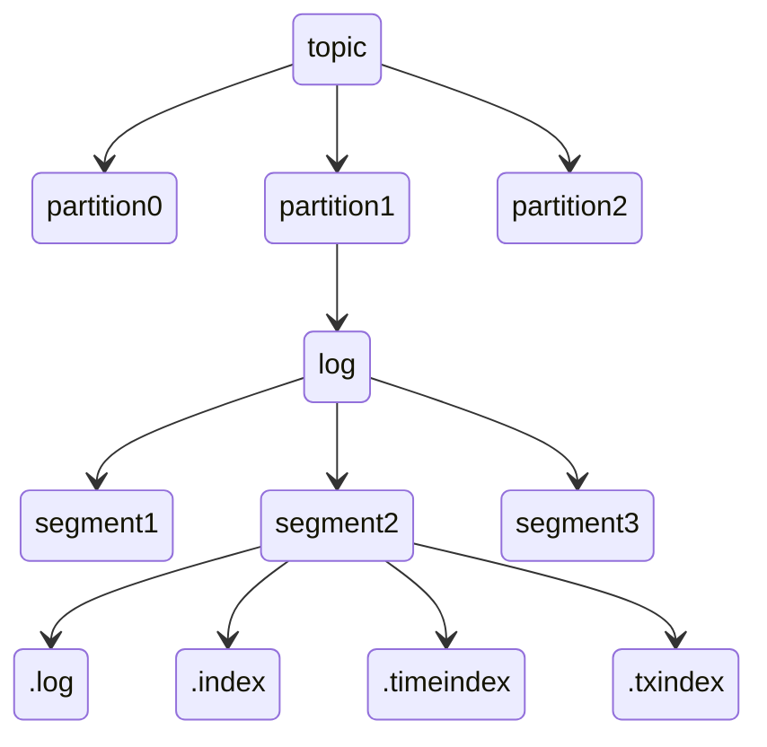

一个非空的日志段 segment 在超过一段时候后，即使还没有写满，也会强制滚动（roll，也就是新建）日志段

#### 日志段写入

Producer 生产的数据会被不断追加到 log 文件的末端，在对该文件进行读写时，Kafka 会充分利用 PageCache 来加速读写，每条数据都有自己的 offset

Kafka 在写入消息时，会根据这批写入的最大 offset 、时间戳等来判断要不要追加索引

#### 日志段读取


#### 恢复

在启动 broker 时，kafka 会遍历所有日志段。为了从磁盘读取索引数据，对于某一个 segement，恢复操作会从 log 文件重建索引，清除掉之前的索引文件。并删除掉日志文件跟索引文件末尾无效的数据

#### 高水位管理

Kafka 使用高水位（HW, Hight WaterMark）来标识分区下的哪些消息是可以被消费者消费以及进行副本间的同步

```java
public final class LogOffsetMetadata {
    ...

    public final long messageOffset; // 消息位移值
    public final long segmentBaseOffset; // 位移值在日志段的上的位置
    public final int relativePositionInSegment; // 位移值所在日志段的物理磁盘位置

    ...
}
```

消费者只能看到高水位之下的消息


#### 日志段管理

```java
public class LogSegments {
  /* the segments of the log with key being LogSegment base offset and value being a LogSegment */
  private final ConcurrentNavigableMap<Long, LogSegment> segments = new ConcurrentSkipListMap<>();
}
```

在写入数据时，Kafka 就是是对最后一个日志段执行的写入操作

```scala
segments.activeSegment.append(lastOffset, largestTimestamp, shallowOffsetOfMaxTimestamp, records)
```

在读取数据时，则是根据起始偏移量、读取多少数据，不断地日志段中读取数据

```scala
while (fetchDataInfo == null && segmentOpt.isPresent) {
  ...
  fetchDataInfo = segment.read(startOffset, maxLength, maxPosition, minOneMessage)
  if (fetchDataInfo != null) {
    ...
  } else segmentOpt = segments.higherSegment(baseOffset)
}
```

#### 索引文件

```java
public abstract class AbstractIndex implements Closeable {
    ...
    private final long baseOffset; // 对应日志段对象的起始位移值，如 00000000000000000123.index 123就是起始位移值
    private final int maxIndexSize; // 控制索引文件的最大长度
    private final boolean writable;

    private volatile File file;

    // Length of the index file
    private volatile long length;

    private volatile MappedByteBuffer mmap; // 内存映射磁盘读写

    /**
     * The maximum number of entries this index can hold
     */
    private volatile int maxEntries;
    /** The number of entries in this index */
    private volatile int entries;
    ...
}
```

Kafka 对 offset 的查找是基于[二分查找](/算法与数据结构/查找.md#二分查找)实现的：

首先通过index文件查找offset所在的大概范围，然后再在这个范围内进行顺序查找，为了使用更少的内存空间，Kafka 采用的是稀疏不连续的索引

其会根据第一条消息的偏移量以及所需读取的大小或者最大能读取的大小，去读取数据

Kafka 利用 mmap，将更大的磁盘文件映射到了一个虚拟内存空间，也就是最近读写的数据更有可能在内存中，对于什么读写的冷数据如果进行访问，会触发[缺页中断](/操作系统/内存管理.md#分页)，所以 Kafka 的二分查找会优先查找热区，即最近操作的那部分数据，找到的话就不用去查冷区的数据，以此提升性能


优化之后：由于大部分查询集中在索引项尾部，所以把后半部分设置为热区，永远保存在缓存中，如果查询目标偏移量在热区索引项范围，直接查热区，避免页中断

### 主题删除

主题删除过程中，首先会通过复制状态机机制，向 Controller 发送通知，调整主题的所有副本状态，然后移除 zk、controller 关于该主题的所有元数据，最后执行物理磁盘文件的删除操作

### 副本状态机

副本的 7 种状态：

- NewReplica：副本被创建之后所处的状态
- OnlineReplica：副本正常提供服务时所处的状态
- OfflineReplica：副本服务下线时所处的状态
- ReplicaDeletionStarted：副本被删除时所处的状态
- ReplicaDeletionSuccessful：副本被成功删除后所处的状态
- ReplicaDeletionIneligible：开启副本删除，但副本暂时无法被删除时所处的状态
- NonExistentReplica：副本从副本状态机被移除前所处的状态

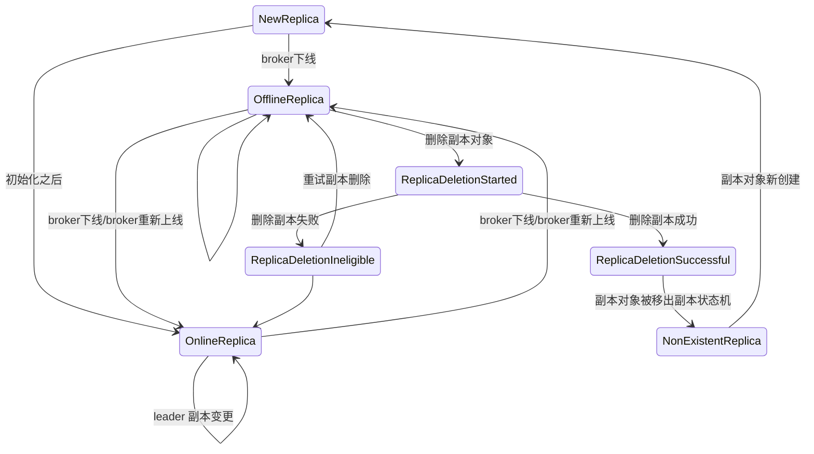

当 Controller 接受到状态变更请求时，首先就是判断操作是否有效，无效需要记录一条失败日志，有效则执行对应的操作、变更相关的元数据

### 分区状态机

- NewPartition：分区被创建后被设置成这个状态，表明它是一个全新的分区对象。处于这个状态的分区，被 Kafka 认为是“未初始化”，因此，不能选举 Leader
- OnlinePartition：分区正式提供服务时所处的状态
- OfflinePartition：分区下线后所处的状态
- NonExistentPartition：分区被删除，并且从分区状态机移除后所处的状态

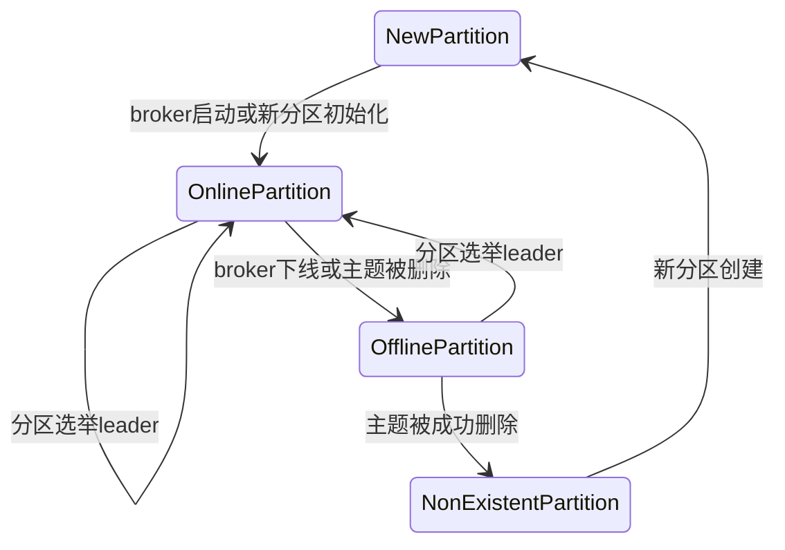

Leader 选举策略：当由于某种原因，Leader 下线了，需要根据不同情况来选举 Leader

```scala
// 离线分区Leader选举策略
final case class OfflinePartitionLeaderElectionStrategy(allowUnclean: Boolean) extends PartitionLeaderElectionStrategy
// 分区副本重分配Leader选举策略  
final case object ReassignPartitionLeaderElectionStrategy extends PartitionLeaderElectionStrategy
// 分区Preferred副本Leader选举策略
final case object PreferredReplicaPartitionLeaderElectionStrategy extends PartitionLeaderElectionStrategy
// Broker Controlled关闭时Leader选举策略
final case object ControlledShutdownPartitionLeaderElectionStrategy extends PartitionLeaderElectionStrategy
```

这几个策略几乎都是选择当前副本有序集合中的、首个处于 ISR 集合中的存活副本作为新的 Leader

当要变更分区状态，就由 Controller 发送相关消息给 broker 们，再由 broker 来执行对每个分区的元数据变更

### zk的作用

主要为 Kafka 提供元数据的管理的功能

- Broker 注册 ：在 Zookeeper 上会有一个专门用来进行 Broker 服务器列表记录的节点
- Topic 注册：分区信息及与 Broker 的对应关系也都是由 Zookeeper 在维护

## 复制

- leader 副本
  - 所有生产者请求和消费者请求都会经过这个副本。各个 leader 副本可以分布在不同的 Broker 上, 这样便能提供比较好的并发能力（负载均衡）
- follower 副本
  - 从 leader 那里复制消息，保持与 leader 一致的状态。foller 副本极大地提高了消息存储的安全性, 提高了容灾能力，不过也相应的增加了所需要的存储空间

### 副本管理

follower 会启动一个线程，不断执行以下操作：

- 有必要时，对当前的 follower 副本做截断操作（因为可能发生 leader 切换）
- 向 leader 发起副本读取请求，接受到数据并进行处理

除了副本同步直接操作分区对象，生产者向 Leader 副本写入消息、消费者组写入组信息、事务管理器写入事务信息（包括事务标记、事务元数据等）这三种操作会通过 ReplaceManager 向副本写入数据

而消费者的读取请求，也会通过 ReplaceManager 来确定读取范围，再从底层的日志读取消息构建结果并返回

### 分区与副本机制

ISR：中的副本都是与 leader 同步的副本

为了描述一个副本是否与 leader 副本同步，replica.lag.time.max.ms 用来描述这个最大延迟，如果 follower 副本与 leader 副本的复制延迟超过这个时间，则认为不同步。副本管理还会根据接收到的请求，决定是否将当前副本提升为 leader 副本

Leader epoch：可以用来确定最新的分区副本，由两部分数据组成。一个是Epoch,一个单调增加的版本号。每当副本领导权发生变更时，都会增加该版本号

## 请求处理

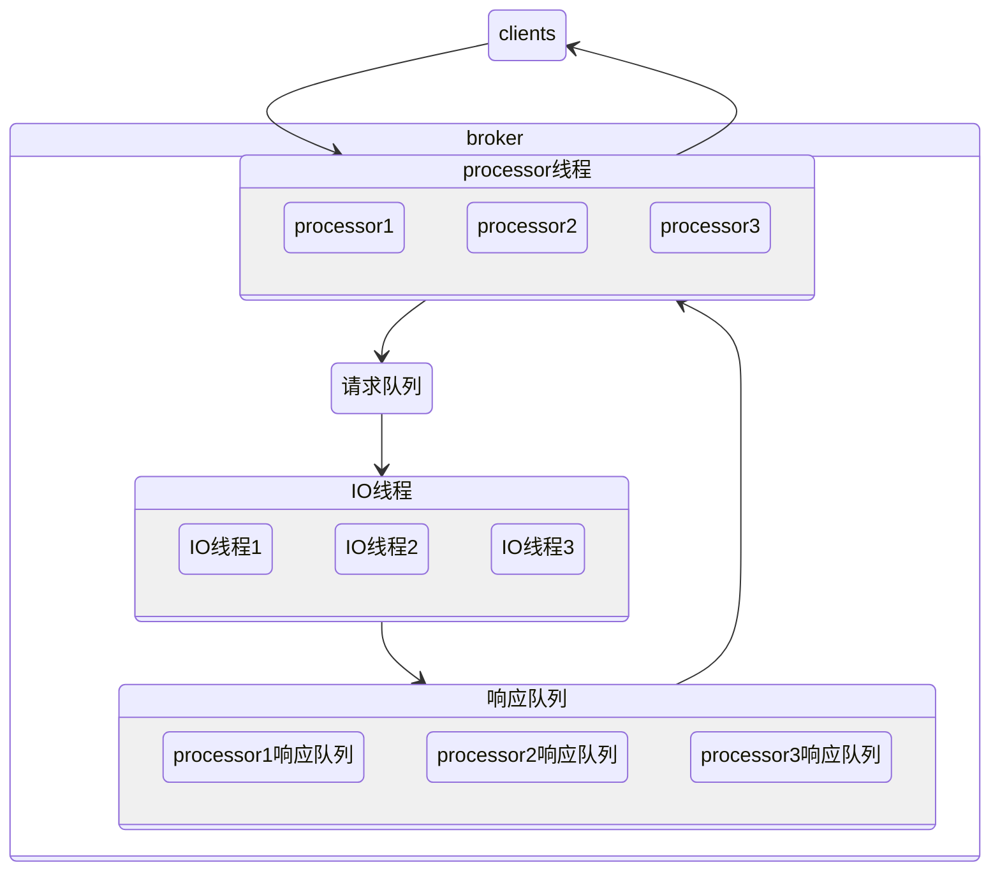

生产请求：

在消息被写入分区的首领之后，broker 开始检查 acks 配置参数——如果 acks 被设为 0 或 1 ，那么 broker 立即返回响应；如果 acks 被设为 all ，那么请求会被保存在一个叫作炼狱的缓冲区里，直到首领发现所有跟随者副本都复制了消息，响应才会被返回给客户端

获取请求：

broker 将按照客户端指定的数量上限从分区里读取消息，再把消息返回给客户端。Kafka 使用零复制技术向客户端发送消息(直接从文件系统缓存复制到网卡)，如果应用程序是从文件读出数据后再通过网络发送出去的场景，并且这个过程中不需要对这些数据进行处理，这种场景可以使用[零拷贝](/操作系统/输入输出.md#零拷贝)

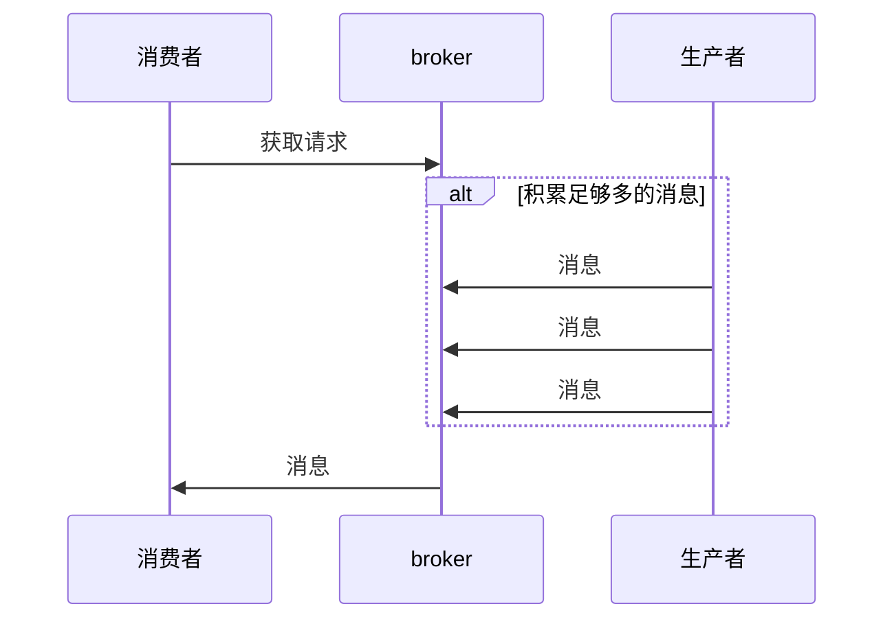

### 监控指标

Kakfa 在 RequestChannel 内保存了一些关于请求的指标：

- RequestsPerSec：每秒处理的 Request 数，用来评估 Broker 的繁忙状态。
- RequestQueueTimeMs：计算 Request 在 Request 队列中的平均等候时间，单位是毫秒
- LocalTimeMs：计算 Request 实际被处理的时间。
- RemoteTimeMs：等待其他 Broker 完成指定逻辑的时间。
- TotalTimeMs：计算 Request 被处理的完整流程时间

## 可靠数据传递

kafka 的保证：

- 分区消息的顺序
- 只有当消息被写入分区的所有同步副本时（但不一定要写入磁盘），它才被认为是“已提交”的
- 只要还有一个副本是活跃的，那么已经提交的消息就不会丢失
- 消费者只能读取已提交的消息

副本的同步保证：

- 与 Zookeeper 之间有一个活跃的会话，也就是说，它在过去的 6s（可配置）内向Zookeeper 发送过心跳
- 过去的 10s 内（可配置）从首领那里获取过消息
- 过去的 10s 内从首领那里获取过最新的消息

### broker

复制系数：

主题级别 replication.factor broker级别  default.replication.factor

如果复制系数为 N，那么在 N-1 个 broker 失效的情况下，仍然能够从主题读取数据或向主题写入数据，同时 它们也会占用N倍的磁盘空间、

不完全首领选举：

如果把 unclean.leader.election.enable 设为 true ，就是允许不同步的副本成为首领 就要承担丢失数据和出现数据不一致的风险

最少同步副本：

min.insync.replicas 如果要确保已提交的数据被写入不止一个副本，就需要把最少同步副本数量设置为大一点

### 生产者

发送确认：

acks：0  能够通过网络把消息发送出去，那么就认为消息已成功写入

1 ：意味着首领在收到消息并把它写入到分区数据文件（不一定同步到磁盘上）时
会返回确认或错误响应

all： 首领在返回确认或错误响应之前，会等待所有同步副本都收到消息

重试参数：

对于一些错误 可以通过重试来解决 如： LEADER_NOT_AVAILABLE

### 消费者

显式提交偏移量：

- 处理完事件再提交
- 批量提交
- 重试
- 维护状态
- 避免对消息处理时间过程 否则会造成无法及时发送心跳
- 仅一次传递
  - 暂时支持不了 使用幂等性写入来实现

## 数据管道

需要考虑的问题：

- 及时性
- 可靠性
  - 至少一次传递 仅一次传递
- 吞吐量要求
  - 高
  - 动态调整
- 数据格式与转换问题
- 安全性
  - 传输安全
  - 权限安全
- 故障处理
- 数据管道与上下游的耦合

### Connect

启动 connect:

```sh
./bin/connect-distributed.sh ./config/connect-distributed.properties
```

文件数据源:

```
POST localhost:8083/connectors
{"name":"load-kafka-config", "config":{"connector.class":"FileStreamSource","file":"config/server.properties","topic":"kafka-config-topic"}}
```

传递文件数据源到主题上

**深入**

- 连接器
- 任务
- worker进程
- 转换器
- 偏移量管理

## 集群镜像

使用场景：

- 区域集群 中心集群
- 数据冗余
- 云迁移

### 集群成员关系

每个集群都有一个broker 充当集群控制器

broker通过创建临时节点把自己的 ID 注册到 Zookeeper

- 控制器：一个特殊的broker 通过在zk创建临时节点进行选举。控制器负责在节点加入或离开集群时进行分区首领选举，控制器使用epoch 来避免“脑裂”。当临时节点被释放或者内容发生更新，监听临时节点的其他 broker 就会收到通知，进行新一轮的选举。2.8 之后，Kafka 移除了对 zk 的依赖，使用 QuorumController 来实现元数据的管理

```scala
// 集群元数据
class ControllerContext {
  val stats = new ControllerStats // Controller统计信息类 
  var offlinePartitionCount = 0   // 离线分区计数器
  val shuttingDownBrokerIds = mutable.Set.empty[Int]  // 关闭中Broker的Id列表
  private val liveBrokers = mutable.Set.empty[Broker] // 当前运行中Broker对象列表
  private val liveBrokerEpochs = mutable.Map.empty[Int, Long]   // 运行中Broker Epoch列表
  var epoch: Int = KafkaController.InitialControllerEpoch   // Controller当前Epoch值
  var epochZkVersion: Int = KafkaController.InitialControllerEpochZkVersion  // Controller对应ZooKeeper节点的Epoch值
  val allTopics = mutable.Set.empty[String]  // 集群主题列表
  val partitionAssignments = mutable.Map.empty[String, mutable.Map[Int, ReplicaAssignment]]  // 主题分区的副本列表
  val partitionLeadershipInfo = mutable.Map.empty[TopicPartition, LeaderIsrAndControllerEpoch]  // 主题分区的Leader/ISR副本信息
  val partitionsBeingReassigned = mutable.Set.empty[TopicPartition]  // 正处于副本重分配过程的主题分区列表
  val partitionStates = mutable.Map.empty[TopicPartition, PartitionState] // 主题分区状态列表 
  val replicaStates = mutable.Map.empty[PartitionAndReplica, ReplicaState]  // 主题分区的副本状态列表
  val replicasOnOfflineDirs = mutable.Map.empty[Int, Set[TopicPartition]]  // 不可用磁盘路径上的副本列表
  val topicsToBeDeleted = mutable.Set.empty[String]  // 待删除主题列表
  val topicsWithDeletionStarted = mutable.Set.empty[String]  // 已开启删除的主题列表
  val topicsIneligibleForDeletion = mutable.Set.empty[String]  // 暂时无法执行删除的主题列表
  ......
}
```

Controller 是用来管理整个集群的，它会向其他 broker 发送三类请求：

1. LeaderAndIsrRequest：告诉 Broker 相关主题各个分区的 Leader 副本位于哪台 Broker 上、ISR 中的副本都在哪些 Broker
2. StopReplicaRequest：告知指定 Broker 停止它上面的副本对象，这个请求主要的使用场景是分区副本迁移和删除主题
3. UpdateMetadataRequest：更新 Broker 上的元数据缓存

### 多集群架构

跨数据中心通信：

- 高延迟
- 带宽有限
- 高成本

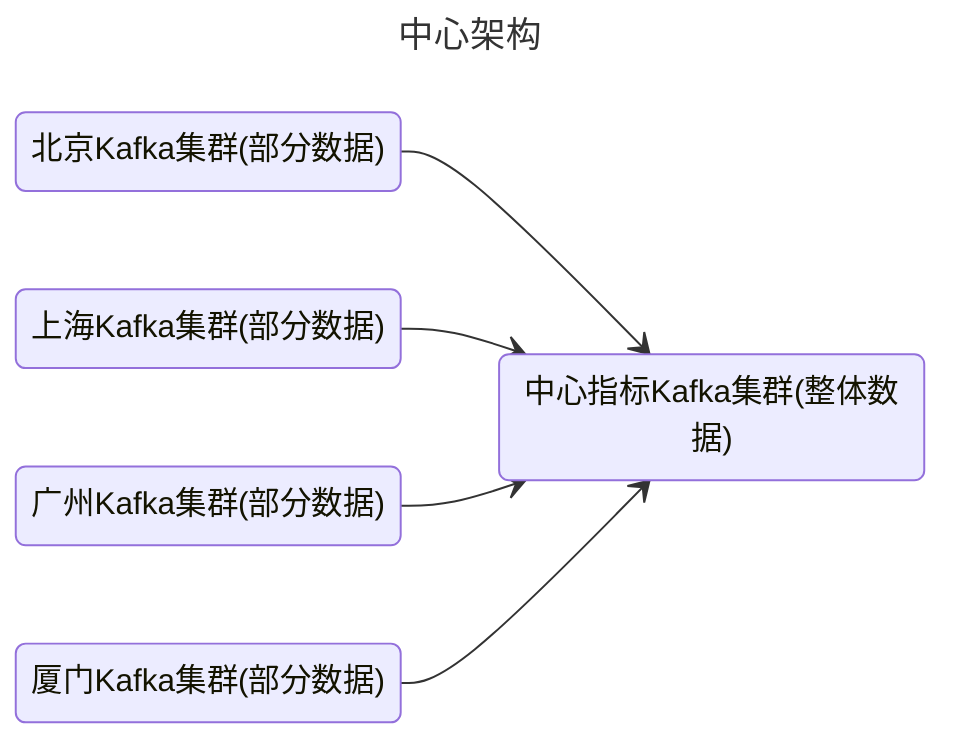

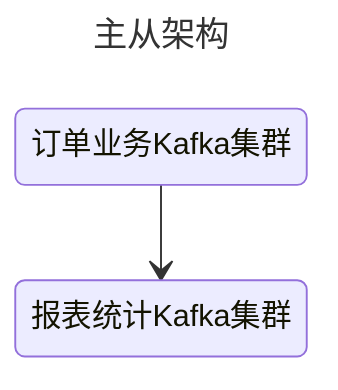

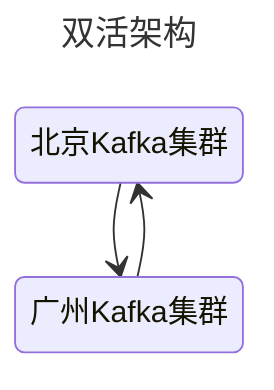

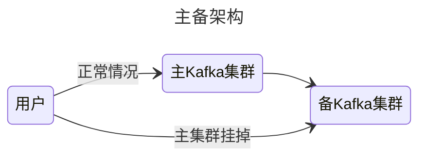

### MirrorMaker

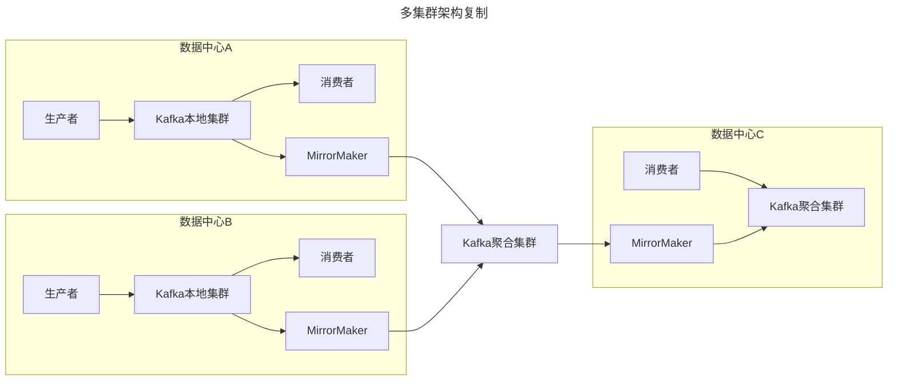

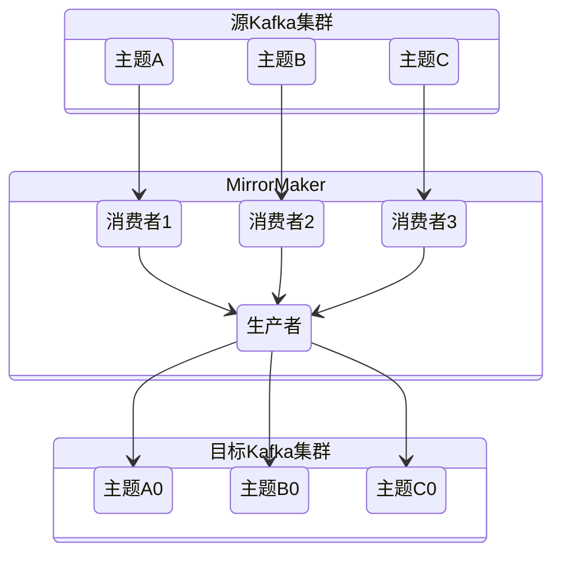

如果有可能，尽量让 MirrorMaker 运行在目标数据中心里

## 监控

所有度量指标都可以通过 Java Management Extensions（JMX）接口来访问

### broker

非同步分区数量：

- 如果集群里多个 broker 的非同步分区数量一直保持不变，那说明集群中的某个 broker 已经离线了
- 如果非同步分区的数量是波动的，或者虽然数量稳定但并没有 broker 离线，说明集群出现了性能问题

关键指标：

- BytesIn/BytesOut：Broker 端每秒入站和出站字节数
- NetworkProcessorAvgIdlePercent：网络线程池线程平均的空闲比例
- RequestHandlerAvgIdlePercent：I/O 线程池线程平均的空闲比例
- UnderReplicatedPartitions：未充分备份的分区数
- ISRShrink/ISRExpand：ISR 收缩和扩容的频次指标
- ActiveControllerCount：当前处于激活状态的控制器的数量

其他监控：

- 进程是否启动，端口是否建立，端口能否对外提供服务
- broker 端日志，服务器日志 server.log，控制器日志 controller.log 以及主题分区状态变更日志 state-change.log
- broker 端关键线程的运行状态
  - Log Compaction 线程
  - 副本拉取消息的线程，通常以 ReplicaFetcherThread 开头

集群问题：

- 不均衡的负载
- 资源过度消耗

主机问题：

- 硬件
- 进程冲突
- 配置问题

### 客户端

- 关注网络RTT
- 关键线程
  - 生产者 kafka-producer-network-thread
  - 消费者 kafka-coordinator-heartbeat-thread

指标：

- 生产者 request-latency，消息生产请求的延时
- 消费者 lag和lead
- 消费者组 一个是 join rate，另一个是 sync rate。它们说明了 Rebalance 的频繁程度

## 优化

### 操作系统层优化

- 文件系统挂载优化：禁用 atime（access time）更新以减少文件系统写操作数，提高性能。
- 文件系统选择：推荐使用ext4或XFS，特别是XFS对于生产服务器具有高性能和高伸缩性。
- Swap空间设置：设置较小的swappiness值，防止Linux的OOM Killer随意终止进程。
- 重要系统参数调整：ulimit -n 和 vm.max_map_count的适当调整，确保不出现文件打开过多或内存映射过小的错误。
- 页缓存大小：重要性关乎Kafka，至少要足够容纳一个日志段的大小，以减少磁盘I/O操作。

### [JVM调优](/编程语言/JAVA/JVM/自动内存管理/调优.md#调优)

### Broker端调优

- 参数值设置：合理设置Broker端参数以匹配生产环境，保持客户端和Broker端版本一致。
- 版本一致性：保持版本一致以获得性能收益，如Zero Copy功能。

### 应用层调优

- 对象实例管理：避免频繁创建和及时关闭Producer和Consumer对象实例，充分利用多线程改善性能。

### 性能指标调优

- 调优吞吐量：增加num.replica.fetchers、调整缓冲区、压缩算法配置以减少网络I/O、避免设置acks=all和开启重试。
- 调优延时：在Producer端设置linger.ms=0、不启用压缩、避免设置acks=all，在Consumer端保持fetch.min.bytes=1。

## Kafka Streams 架构

拓扑结构：

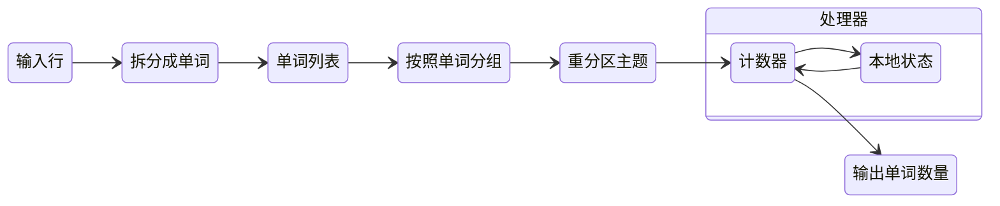

对拓扑结构伸缩：

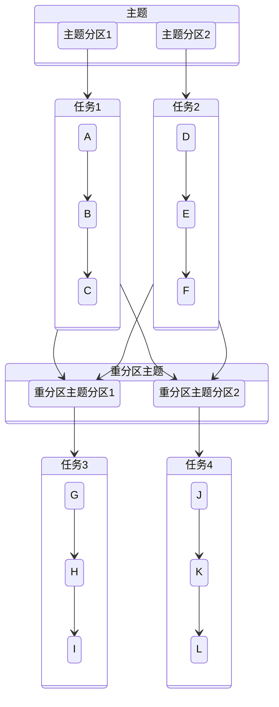
