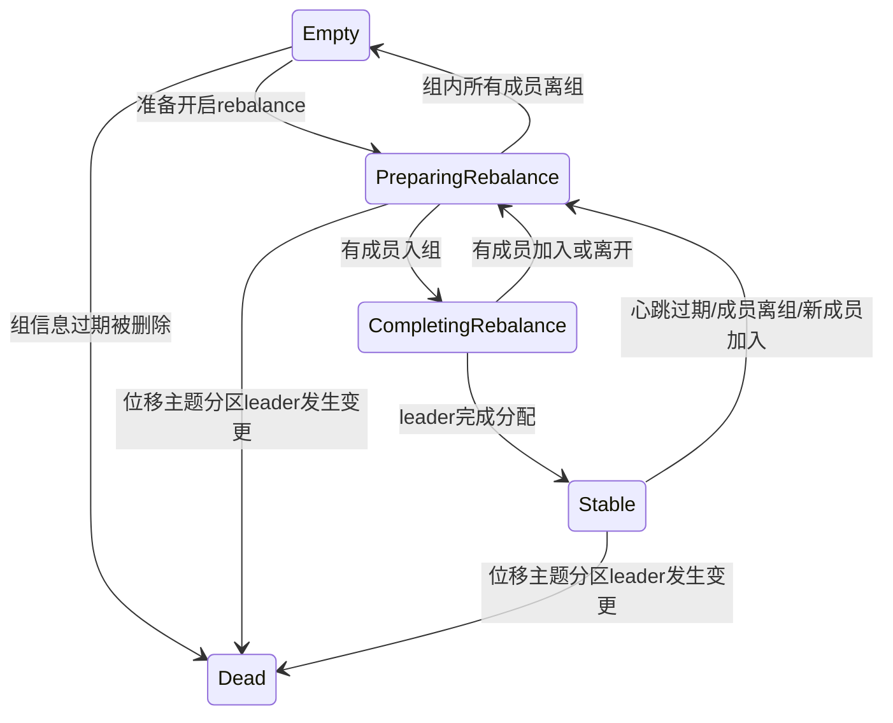
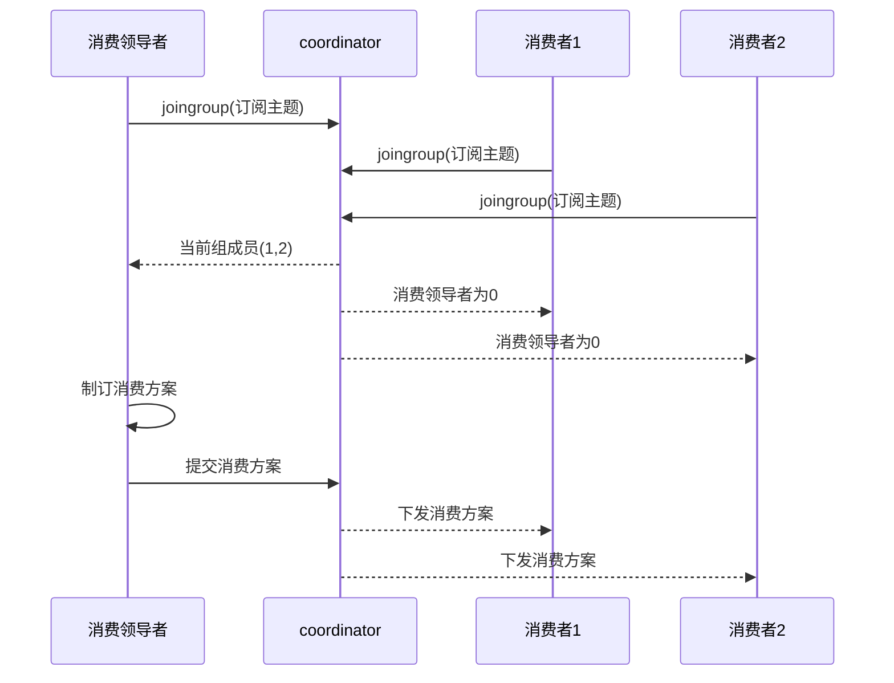

# 消费者


分区的所有权从一个消费者转移到另一个消费者，这样的行为被称为再均衡

消费者通过向被指派为群组协调器的 broker（不同的群组可以有不同的协调器）发送心跳来维持它们和群组的从属关系以及它们对分区的所有权关系

```java
Properties props = new Properties();
//kafka 集群，broker-list
props.put("bootstrap.servers", "172.24.211.140:9092");
props.put("group.id", "consumer1");
props.put("key.deserializer",
        "org.apache.kafka.common.serialization.StringDeserializer");
props.put("value.deserializer",
        "org.apache.kafka.common.serialization.StringDeserializer");
KafkaConsumer<String, String> consumer = new KafkaConsumer<String,
                        String>(props);
consumer.subscribe(List.of("test"));
while(true){
    ConsumerRecords<String, String> records = consumer.poll(Duration.ofMillis(1000));
    for (ConsumerRecord<String, String> record : records) {
        System.err.println(record);
    }
}
```

消费方式:

采用 pull（拉）模式从 broker 中读取数据

相较于服务器 push 模式，pull模式使消费者可以根据自己的情况来决定消费的速率，另一方面，pull模式每次也可以批量拉取数据，提高服务器吞吐量，而pull模式一旦有消息产生，就会立马推送，这意味着网络开销会比pull模式高一些。

但pull模式也有一些缺陷，如果没有消息的话，客户端就会在那里空转等待，所以Kafka为消费者的poll方法指定了一个时间参数，避免空转浪费CPU资源

## 配置

- fetch.min.bytes
  - 指定了消费者从服务器获取记录的最小字节数
- fetch.max.wait.ms
  - 指定 broker 的等待时间
- max.partition.fetch.bytes
   - 指定了服务器从每个分区里返回给消费者的最大字节数
- session.timeout.ms
  - 指定了消费者在被认为死亡之前可以与服务器断开连接的时间
- heartbeat.interval.ms 控制发送心跳请求频率的参数
- auto.offset.reset
  - 指定了消费者在读取一个没有偏移量的分区或者偏移量无效的情况下（因消费者长时间失效，包含偏移量的记录已经过时并被删除）该作何处理
  - earliest 当分区下有已提交的offset时，从提交的offset开始消费；无提交的offset时，从头开始消费
  - latest 当分区下有已提交的offset时，从提交的offset开始消费；无提交的offset时，消费新产生的该分区下的数据
  - none 当该topic下所有分区中存在未提交的offset时，抛出异常
- enable.auto.commit
  - 指定了消费者是否自动提交偏移量
- partition.assignment.strategy 决定哪些分区应该被分配给哪个消费者
  - range:该策略会把主题的若干个连续的分区分配给消费者
  - 轮询：该策略把主题的所有分区逐个分配给消费者
- client.id
- max.poll.records 控制单次调用 call() 方法能够返回的记录数量
- max.poll.interval.ms 用于指定consumer两次poll的最大时间间隔（默认5分钟），如果超过了该间隔consumer client会主动向coordinator发起LeaveGroup请求，触发rebalance
-  receive.buffer.bytes 和 send.buffer.bytes
   -  读写数据时用到的 TCP 缓冲区也可以设置大小

## 偏移量

每一个消费者组都会对有进行消费的主题分区的偏移量进行记录，这也就意味着消费者可以手动设置这个偏移量从头消费数据。

更新分区当前偏移量的操作叫作**提交**

Kafka 0.9 版本之前，consumer 默认将 offset 保存在 Zookeeper 中，从 0.9 版本开始，consumer 默认将 offset 保存在 Kafka 一个内置的 topic 中，该 topic为__consumer_offsets。

__consumer_offsets的key为主题、分区号、消费组，随着不断提交偏移量，这个主题的消息会越来越多，所以会有一个线程定时对这个主题 compact，因为只需要保留一个最新的偏移量即可

**自动提交：**

- 如果 enable.auto.commit 被设为 true ，那么每过 5s，消费者会自动把从 poll() 方法接收到的最大偏移量提交上去

**手动提交：**

把 auto.commit.offset 设为 false ，使用 commitSync()

异步提交 commitAsync() , 但该方法在发生错误时不会进行重试

消费者提交偏移量，都是向 coordinator 所在的 broker 提交，coordinator 专门为 消费组服务，负责执行再平衡以及提供位移管理和组成员管理等

要确定 coordinator，首先确定由位移主题的哪个分区来保存该消费组的数据：partitionId=Math.abs(groupId.hashCode() % offsetsTopicPartitionCount)。接下来找出该分区 leader 副本所在的 broker，该 broker 即为对应的 coordinator

**再均衡监听：**

订阅的时候传入 ConsumerRebalanceListener 实现相关接口

**从特定偏移量开始处理：**`seekToBeginning(..)`

**读取特定偏移量：**`seek(..)`

### Kafka 消费异常没有手动提交导致的问题

假设本次偏移量消费到28 抛出异常 没有手动提交偏移量

该消费者下次迭代也会从29开始消费 为解决这个问题 所以只能新起消费者来替代此消费者

### CommitFailedException

- 当消费时长超过 max.poll.interval.ms 时，会抛出这个异常
- 设置相同 group.id 值的消费者组程序和独立消费者程序，也会出现这个异常

### 重设偏移量

- Earliest:把位移调整到当前最早位移处。
- Latest:把位移调整到当前最新位移处。
- Current:把位移调整到当前最新提交位移处。
- Specified-Offset:把位移调整成指定位移。
- Shift-By-N：把位移调整到当前位移+N处。
- DateTime:把位移调整到大于给定时间的最小位移处。
- Duration:把位移调整到距离当前时间指定间隔的位移处。

## 再平衡

如果未能及时发送心跳或者消费时间过长，消费者都会被认为已经死了，此时消费者数量会发生变化

当消费者数量、订阅的主题数或者分区数发生变更时，就会触发消费组的再平衡操作，即重新分配消费者与分区的映射关系，再平衡期间，所有消费都会停止，消费者越多这个过程越慢，停止消费的时间就越长

0.11 之后的版本推出了 StickyAssignor，即有粘性的分区分配策略，使用这个策略会尽可能地保留之前的分配方案，尽量实现分区分配的最小变动

消费者组状态机：

- Empty：组内没有任何成员，但消费者组可能存在已提交的位移数据，而且这些位移尚未过期。
- Dead：同样是组内没有任何成员，但组的元数据信息已经在协调者端被移除。协调者组件保存着当前向它注册过的所有组信息，所谓的元数据信息就类似于这个注册信息
- PreparingRebalance：消费者组准备开启重平衡，此时所有成员都要重新请求加入消费者组。
- CompletingRebalance：消费者组下所有成员已经加入，各个成员正在等待分配方案。该状态在老一点的版本中被称为AwaitingSync,它和CompletingRebalance.是等价的。
- Stable：消费者组的稳定状态。该状态表明重平衡已经完成，组内各成员能够正常消费数据了。





## 退出

其他线程调用`consumer.wakeup()` 会使consumer在poll抛出异常 然后进行close即可

## 没有群组的消费者

调用assign为其设置消费的分区

## 消费进度监控

```
(start)----lead-----(consume offset)---------lag--------(end)--->
```

- lag：最新一条数据与当前消费到的数据的偏移量差值，越大代表积压越严重
- lead：指消费者最新消费消息的位移与分区当前第一条消息位移的差值，越小代表越有丢数据的风险

