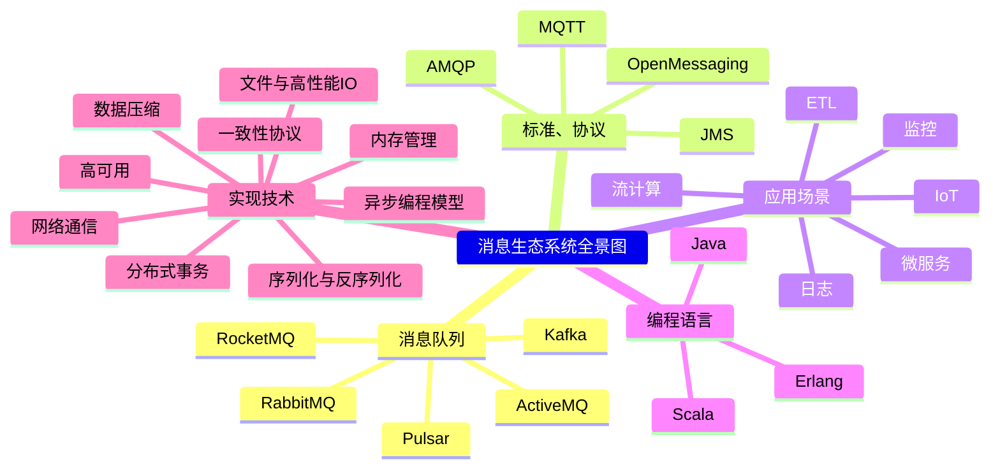
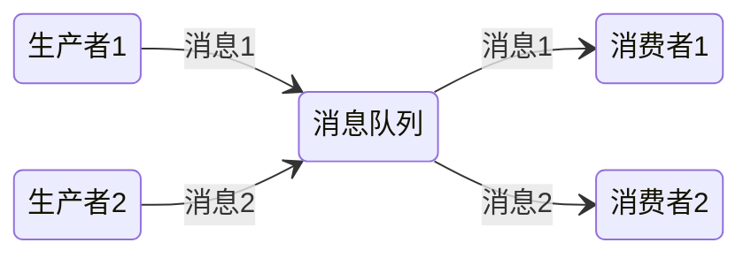
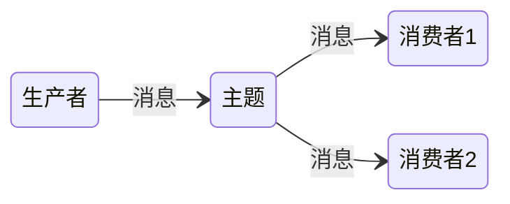
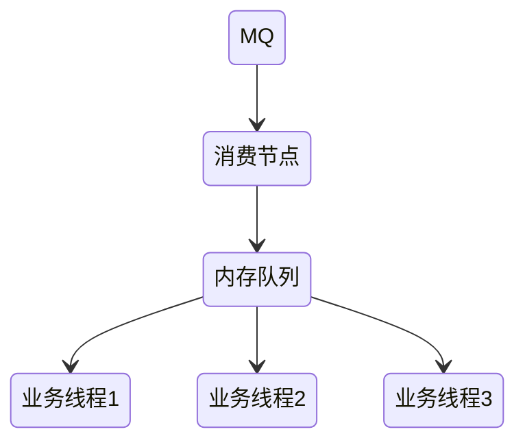
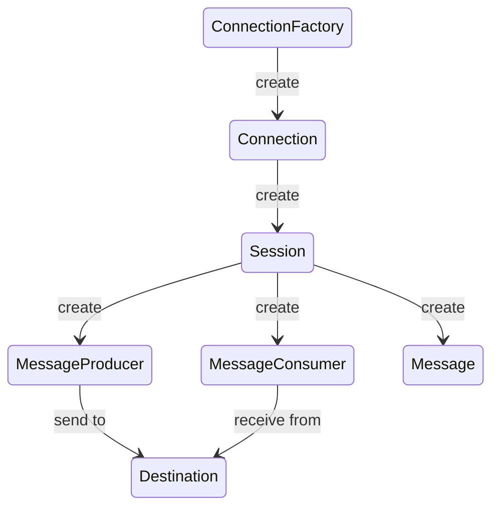
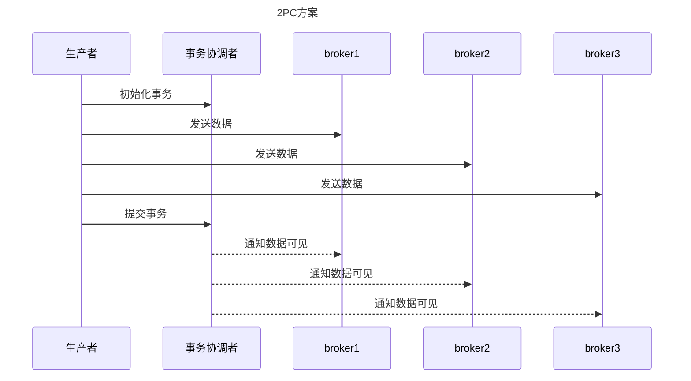
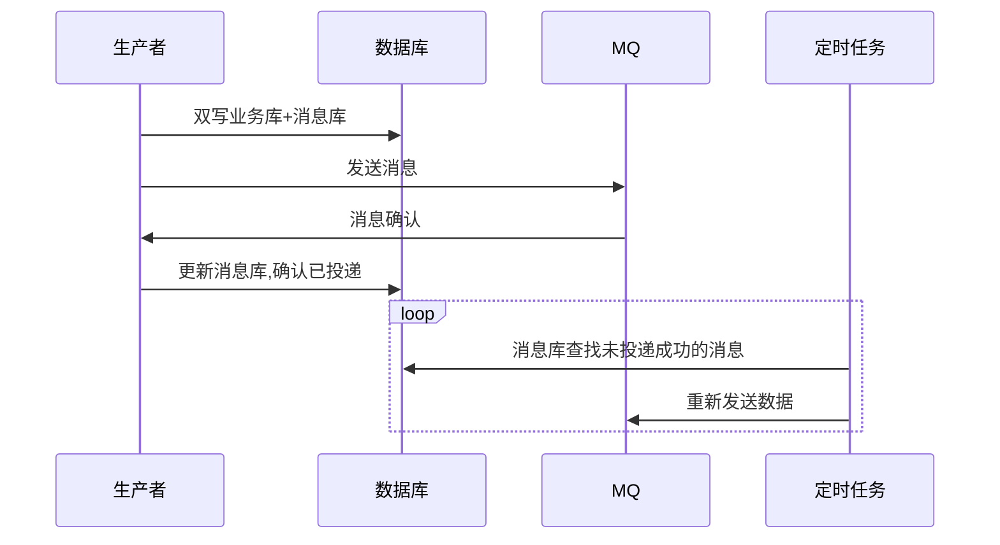

# 消息队列

- 现代的消息队列，本质上就是分布式的流数据存储系统（消息系统）

生产者与消费者之间的连接：

- 生产者直接到消费者
- 使用消息代理缓存

## 使用场景

- 异步处理
  - 发送者发送消息之后无需等待，可以直接返回
- 流量削峰
  - 高并发的情况下，将请求发送到消息队列，服务器按照处理能力对请求进行处理
- 应用解耦
  - 如果模块之间不直接进行调用，模块之间耦合度就会很低

## 消息模型

### 点对点

只能被一个消费者消费一次

RabbitMQ默认就是这种点对点模型，只有在中间加了一层[Exchange](/中间件/消息队列/rabbitMQ.md#订阅模型-Fanout)才能实现发布订阅模型

### 发布订阅

消息生产者向频道发送一个消息之后，多个消费者可以从该频道订阅到这条消息并消费

## 消息队列功能

- 顺序消息：从生产者和消费者的视角来看，生产者按顺序写入的消息，消费者能按顺序读取
- 延时消息 / 定时消息：生产者发送消息时，可以设置这条消息在多久后能被消费到，当时间到了后，消息就会被消费到
- 事务消息：指发送一批消息，要么同时成功，要么同时失败
- 消息重试：生产者重试是指当消息发送失败后，可以设置重试逻辑，比如重试几次、多久后重试、重试间隔多少。消费者重试是指当消费的消息处理失败后，会自动重试消费消息
- 消息回溯：允许消息被多次消费，即某条消息消费成功后，这条消息不会被删除
- 广播消费：指一条消息能不能被很多个消费者消费到
- 死信队列：指当某条消息无法处理成功时，则把这条消息写入到死信队列，将这条消息保存起来，从而可以处理后续的消息的功能
- 优先级队列：指可以给在一个分区或队列中的消息设置权重，权重大的消息能够被优先消费到
- 消息过滤：可以给每条消息打上标签，在消费的时候可以根据标签信息去消费消息
- 消息过期 / 删除（TTL）：消息会在一定时间或者超过一定大小后会被删除
- 消息轨迹：是指记录一条消息从生产端发送、服务端保存、消费端消费的全生命周期的流程信息
- 消息查询：指能够根据某些信息查询到消息队列中的信息
- 消息压缩：是指生产端发送消息的时候，是否支持将消息进行压缩，以节省物理资源
- 多租户：是指同一个集群是否有逻辑隔离，比如一个物理集群能否创建两个同名的主题
- 消息持久化
- 消息流控：能否对写入集群的消息进行限制

## 可靠性

MQTT 协议中，给出了三种传递消息时能够提供的服务质量标准：

- At most once: 至多一次。消息在传递时，最多会被送达一次，可能会丢消息
- At least once: 至少一次。消息在传递时，至少会被送达一次，可能会有重复消息
- Exactly once：恰好一次。

At least once + 幂等消费 = Exactly once

### 发送端的可靠性

通过本地消息表实现

### 接收端的可靠性

#### 保证消费幂等性

- 利用数据库唯一约束
- 前置条件：如版本号判定
- 记录操作先前是否被执行过

#### 保证消息具有唯一编号

## 消息堆积

### 生产端

如果代码发送消息的性能上不去，需要优先检查一下，是不是发消息之前的业务逻辑耗时太多导致的

同时需要注意的另一点就是单线程同步发送消息性能都会有一个上限，如果1ms发送一条 那么每秒也才只能发送1000条，不仅需要引入多线程处理，同时也可以选择批量发送

### 消费端

> 设计系统的时候，一定要保证消费端的消费性能要高于生产端的发送性能，这样的系统才能健康的持续运行

如果消费端出现问题，可能就会造成队列的消息堆积

此时，处理方案只需要恢复消费端的处理能力即可

但是如果消息队列即将被写满，就必须将快要满的这个队列的消息分发到其他消息队列，临时加派消费者加快处理这些消息，像Kafka一个分区可以由一个消费者来消费，临时应急可以把消费者加到跟分区数一样多的数量

但最重要的还是要排查解决这个异常情况，究竟是因为生产端异常发送了大量消息，还是因为消费端出了异常消费缓慢或者消费被阻塞了

一种错误的解决消费慢的方式（节点宕机部分数据就没了）：

另外一种方式就是[背压机制](/软件工程/架构模式/响应式架构.md#背压)，当消费能力跟不上时，可以限制生产者的生产来避免积压大量消息

### 积压监控

定义一种特殊的消息，启动一个监控程序将这个消息定时地循环写入到消息队列中，消息的内容可以是生成消息的时间戳并且也会作为队列的消费者消费数据。业务处理程序消费到这个消息时直接丢弃掉，而监控程序在消费到这个消息时就可以和这个消息的生成时间做比较来判断消息的积压程度

另外一种方式就是利用消息中间件本身提供的API，比如Kafka的lag

#### 单队列并行消费

前有 10 条消息，对应的编号是 0-9，当前的消费位置是 5。同时来了三个消费者来拉消息，把编号为 5、6、7 的消息分别给三个消费者，每人一条。过了一段时间，三个消费成功的响应都回来了，这时候就可以把消费位置更新为 8 了，这样就实现并行消费，如果迟迟收不到某条消息的确认响应，则可以将该消息放到死信队列稍后重试，避免当前队列被某些消息卡主

这种方式只适合对消息的先后顺序没有要求的场景

## 消息失效

消息失效导致的大量消息丢失，只能写程序慢慢将丢失的那些消息补回来

## 消息中间件带来的好处

- 解耦
- 异步
- 横向扩展
- 安全可靠
- 顺序保证

> 中间件是一种独立的系统软件或服务程序，分布式应用软件借助这种软件在不同的技术之间共享资源。 中间件位于客户机/ 服务器的操作系统之上，管理计算机资源和网络通讯。

> 消息中间件是指一种在需要进行网络通信的系统进行通道的建立，数据或文件发送的中间件。消息中间件的一个重要作用是可以跨平台操作，为不同操作系统上的应用软件集成提供便利。

## 协议

### JMS

> Java消息服务（Java Message Service，JMS）应用程序接口是一个Java平台中关于面向消息中间件（MOM）的API，用于在两个应用程序之间，或分布式系统中发送消息，进行异步通信。 Java消息服务是一个与具体平台无关的API，绝大多数MOM提供商都对JMS提供支持。

- 队列模型
- 主题模型

#### JMS编码接口之间的关系

### AMQP

> 高级消息队列协议即Advanced Message Queuing Protocol（AMQP）是一个用于统一面向消息中间件实现的一套标准协议，其设计目标是对于消息的排序、路由（包括点对点和订阅-发布）、保持可靠性、保证安全性。

### MQTT

> 消息队列遥测传输（英语：Message Queuing Telemetry Transport），专门为物联网设备设计的一套标准的通信协议

物联网场景的设备一般是海量的，这需要MQTT消息集群支持前置负载均衡，后备集群节点支持水平扩容来支撑，一般都是用云厂商的商业服务

### 对比

对比项 | JMS | AMQP| MQTT
-|-|-|-
定义 | Java api | Wire Protocol | 自定义协议
跨语言 | 否 | 是 | 是
Model | 点对点、发布订阅 | direct exchange 、fanout exchange、topic change、headers exchange、system exchange 后四种和JMS的发布订阅大差别，仅是在路由机制上做了更详细的划分 | 发布订阅，通过 Topic 表示主题
消息类型 | TextMessage、MapMessage、BytesMessage、StreamMessage、ObjectMessage、Message(只有消息头和属性) | 二进制数据 | 二进制数据

## 消息队列设计

从几个方面考虑：

- 可伸缩性
  - 也就是能根据系统负载动态增减节点
- 持久化
  - 持久化的开销
- 高可用
  - 主节点的选举，主从之间的数据复制
- 消息可靠性保证

### 性能与可靠性

1. 网络带宽与延迟：消息队列本质上还是一个I/O密集型系统，内部没有太多复杂的计算逻辑，因此网络无论对生产者、服务端还是消费者来说都比较重要，网络一抖动，全链路的吞吐量可能就会受影响。
2. 生产者的发送模式：选择 发送即忘/异步/同步 不同的发送模式，会直接影响Producer的性能和可靠性。
3. 服务端的物理硬件：特别是磁盘和内存，会直接关系到Broker的存储和消费性能。
4. 消费者的Rebalance：在再平衡期间，整个消费会暂停，因此如何最大程度降低再平衡的影响，对消费者端来说比较重要
5. 数据一致性协议：等级越强的一致性吞吐量越低，延迟越高

### 存储

元数据的存储：使用第三方组件或通过分布式算法实现，二者是运维复杂度与开发复杂度的平衡

消息数据的存储：

- 一个分区一个文件或一个主题一个文件，前者在同时有多个分区写数据时性能低，后者在读取定位时性能低
- 消息分段：一个文件可以分为多个数据段，以方便根据消息 ID 快速定位消息，若数据段以消息区间为key，就可以很方便地进行二分查找，或者也可以额外维护一个索引文件，记录消息 ID 与实际物理位置的映射
- 消息存储格式：一般包含通用信息和业务信息两部分。通用信息主要包括时间戳、CRC、消息头、消息体、偏移量、长度、大小等信息，业务信息主要跟业务相关，包含事务、幂等、系统标记、数据来源、数据目标等信息
- 消息数据清理机制：当前主流的做法都是消费确认后进行标记，当一个段的数据都被确认消费过，就可以删除数据段文件了

写性能：

- 缓存写 + 批量写 + 顺序写

写可靠性：

- 同步刷盘
- WAL
- 多副本备份

读性能：

- 提升文件缓存在 PageCache 的命中率
- 预读数据，利用局部性原理
- 零拷贝

### 客户端

客户端基础功能：

- 连接管理：一般是懒加载连接来提高资源利用率
- 心跳检测：TCP的KeepAlive机制或应用层的心跳包
- 错误处理：定义可恢复错误和不可恢复错误。完整的错误码的定义和枚举。错误后重试的代码实现方式是否合理高效。哪些情况需要停止客户端，向上抛错。打印日志时，是否包含了完整的内容
- 重试机制：需要根据不同的业务支持不同的重试次数、退避时间

#### 生产者

生产相关功能：

- 客户端寻址：如何确定一条消息发往哪台节点，一种是客户端定时向集群同步元数据，根据元数据确定发哪台，另外一种则是可以随便发，节点收到之后再内部转发到数据所处的节点，第二种方式在于多转发了一层，效率更低
- 生产分区分配策略：如何确定一条消息应该落在哪个分区，一种是轮询，一种是按key哈希，哈希的好处在于可以保证同一分区内的顺序性，问题就是会造成数据倾斜
- 批量发送：实现思路一般是在客户端内存中维护一个队列，数据写入的时候，先将其写到这个内存队列，然后通过某个策略从内存队列读取数据，发送到服务端
- 发送方式：步发送主要解决数据发送的即时性和顺序性，异步发送主要考虑性能，还有一种叫做发送即忘的方式，指消息发送后不关心请求返回的结果，立即发送下一条。这种方式因为不用关心发送结果，发送性能会提升很多，但有可能导致丢数据

集群管控操作：集群管控操作一般是用来完成资源的创建、查询、修改、删除等集群管理动作

生产事务：

#### 消费者

消费模型：

- Pull 模型：客户端通过不断轮询的方式向服务端拉取数据，好处是客户端根据自身的处理速度去拉取数据，不会对客户端和服务端造成额外的风险和负载压力。缺点是可能会出现大量无效返回的 Pull 调用，另外消费及时性不够，为了减少无效调用的资源浪费，比较合适的方案是客户端告诉服务端：最多需要多少数据、最少需要多少数据、未达到最小数据时可以等多久等信息。然后服务端首先判断是否有足够的数据，有的话就立即返回，否则就根据客户端设置的等待时长 hold 住请求直至条件满足
- Push 模型：除了由维护长连接由服务端进行推送的真push之外，还有一种伪push，就是通过对客户端的封装，引入一个中间层，中间层向服务端pull数据，再由中间层向客户端push数据。Push 模型需要先分配分区和消费者的关系，客户端就需要感知分区分配、分区均衡等操作，从而在客户端就需要实现比较重的逻辑
- Pop 模型：为了解决 Push 模型的再平衡过久的问题，这种模型将再平衡的逻辑放置了在服务端，客户端不再关心分区的实际分布情况

分区消费模式：

- 独占消费：一个分区在同一个时间只能被一个消费者消费，好处是可以保证分区维度的消费是有序的。缺点是当数据出现倾斜、单个消费者出现性能问题或 hang 住时，会导致有些分区堆积严重
- 共享消费：单个分区的数据可以同时被多个消费者消费，好处是可以避免单个消费者的性能和稳定性问题导致分区的数据堆积。缺点是无法保证数据的顺序消费
- 广播消费：内核广播消费模型在 Broker 内核中实现消息投递，允许一消息同时传递给多消费者。使用分组广播消费则是不同分组内的消费者都可以消费到全量的数据。指定分区消费是让每个消费者记录自己的消费偏移量，实现所有消费者都能消费同一条数据
- 灾备消费：当某一消费者出现问题的时候，灾备消费者加入工作，继续保持独占顺序消费

消费分组：用来组织消费者、分区、消费进度关系的逻辑概念，需要有消费分组来记录消息消费到哪了

协调者：消费者启动后需要向协调者请求，由协调者来分配消费者与分区的关系

消费分区分配策略：

- 各个分区的数据能均匀地分配给每个消费者，保证所有消费者的负载最大概率是均衡的，该原则最为常用，轮询的策略可以保证这点
- 在每次重新分配的时候，尽量减少分区和消费者之间的关系变动，这样有助于加快重新分配的速度，并且保持数据处理的连续性，降低处理切换成本，一致性哈希达成这种粘性分配
- 可以允许灵活地根据业务特性制定分配关系，比如根据机房就近访问最近的分区、某个 Topic 的奇数分区分配给第一个消费者等等

消费确认：确认后删除数据或确认后保存消费进度

消费失败处理：

- 从服务端拉取数据失败：根据可重试错误和不可重试错误的分类，进行重复消费或者向上抛错
- 本地业务数据处理失败：如果是偶尔失败，那么在业务层做好重试处理逻辑，配合手动提交消费进度的操作即可解决，如果失败达到一定阈值，则需要将失败数据送入到死信队列中
- 提交位点信息失败：处理方法通常是一直重试，重复提交，如果持续失败就向上抛错

### [可观测性](/软件工程/架构/系统设计/可观测性.md)

#### 关键指标

- 主题数量、分区数量、节点数量等集群维度的信息，这类信息的影响在于数量。如果某些资源数量过大，有可能影响集群的稳定
- 主题数量、分区数量、节点数量等集群维度的信息，这类信息的影响在于数量。如果某些资源数量过大，有可能影响集群的稳定
- 主题维度的吞吐量、消息条数、生产和消费耗时数据
- 消费速度、未消费的消息数量
- 架构特有的相关指标，比如 Kafka 的 Controller 和协调器、Pulsar 的 Ledger、RabbitMQ 的 Exchange 相关的指标

## 消息可靠投递方案

### 检测消息丢失

- 利用消息队列的有序性来验证是否有消息丢失

对每条消息使用连续的递增序列化，在消费者端如果发现序号缺失，就代表消息丢失了

需要考虑像Kafka这种多分区架构，序号至在分区内有序，同时如果有多个生产者并发生产消息，序号也只能在单个生产者内保持有序

### 生产者弄丢数据

可能由于网络原因，数据没有到MQ，就在半路没了

对于异步发送可以使用`confirm`机制，`confirm`机制当MQ接收到消息后，会给生产者回传一个ack，如果MQ没能处理这个消息，会回传nack

而同步发送只需要在发送代码里做好异常捕获，当发送失败后就能很好在本地重试

### MQ弄丢数据

只要开启数据持久化，消息丢失的可能性很小

同时需要深入理解MQ的配置参数，配好参数能降低丢数据的风险

### 消费端弄丢数据

使用消息确认机制，处理完消息手动ack

## 选型

- 对比维度：可靠性(rabbit rocket)、(堆积能力、吞吐量)(kafka)、可扩展性（伸缩性）

## 发展趋势

消息处理（低延迟） -> 流处理（高吞吐） -> 消息流一体

单体 -> 分布式 -> 云原生

## 云原生

### 存算分离

存算分离架构是目前实现弹性消息队列集群的主要技术方案

对于消息队列存算分离的场景，分布式存储服务是存储层比较合适的选择。它具备分布式存储能力和较高的读写性能，一旦引入存储层，消息队列本身就不用有副本的概念了，数据可靠性由存储层来保证，计算层要做的就是接收请求，根据请求转发到存储层去读写数据，由于是无状态的，所以计算层可以不断扩展，以提升整个集群的提升对外服务能力

### 分层存储

为了降低存储成本，消息队列可以采取冷热数据分离的方式，将一部分数据存储到远端诸如对象存储的服务上。业界主流消息队列的分层思路，主要有生产时实时写入到远端和异步攒一批数据上传到远端两种方式。从性能的角度，生产主要关注的是实时写入远程还是异步上传文件到远程，消费需要关注的是从远程读取数据的方式，以及预读算法的设计。同时也要关注资源的隔离，避免远端存取导致的资源占用性能问题以及远端不可用时的读写功能降级

