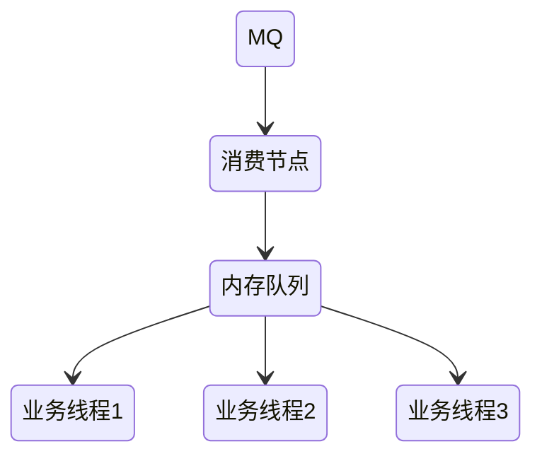

# 消息队列

- 现代的消息队列，本质上就是分布式的流数据存储系统（消息系统）

生产者与消费者之间的连接：

- 生产者直接到消费者
- 使用消息代理缓存

## 使用场景

- 异步处理
  - 发送者发送消息之后无需等待，可以直接返回
- 流量削峰
  - 高并发的情况下，将请求发送到消息队列，服务器按照处理能力对请求进行处理
- 应用解耦
  - 如果模块之间不直接进行调用，模块之间耦合度就会很低

## 消息模型

### 点对点

只能被一个消费者消费一次

RabbitMQ默认就是这种点对点模型，只有在中间加了一层[Exchange](/中间件/消息队列/rabbitMQ.md#订阅模型-Fanout)才能实现发布订阅模型

### 发布订阅

消息生产者向频道发送一个消息之后，多个消费者可以从该频道订阅到这条消息并消费

## 可靠性

MQTT 协议中，给出了三种传递消息时能够提供的服务质量标准：

- At most once: 至多一次。消息在传递时，最多会被送达一次，可能会丢消息
- At least once: 至少一次。消息在传递时，至少会被送达一次，可能会有重复消息
- Exactly once：恰好一次。

At least once + 幂等消费 = Exactly once

### 发送端的可靠性

通过本地消息表实现

### 接收端的可靠性

#### 保证消费幂等性

- 利用数据库唯一约束
- 前置条件：如版本号判定
- 记录操作先前是否被执行过

#### 保证消息具有唯一编号

## 消息堆积

### 生产端

如果代码发送消息的性能上不去，需要优先检查一下，是不是发消息之前的业务逻辑耗时太多导致的

同时需要注意的另一点就是单线程同步发送消息性能都会有一个上限，如果1ms发送一条 那么每秒也才只能发送1000条，不仅需要引入多线程处理，同时也可以选择批量发送

### 消费端

> 设计系统的时候，一定要保证消费端的消费性能要高于生产端的发送性能，这样的系统才能健康的持续运行

如果消费端出现问题，可能就会造成队列的消息堆积

此时，处理方案只需要恢复消费端的处理能力即可

但是如果消息队列即将被写满，就必须将快要满的这个队列的消息分发到其他消息队列，临时加派消费者加快处理这些消息，像Kafka一个分区可以由一个消费者来消费，临时应级可以把消费者加到跟分区数一样多的数量

但最重要的还是要排查解决这个异常情况，究竟是因为生产端异常发送了大量消息，还是因为消费端出了异常消费缓慢或者消费被阻塞了

一种错误的解决消费慢的方式（节点宕机部分数据就没了）：

另外一种方式就是[背压机制](/软件工程/架构模式/响应式架构.md#背压)，当消费能力跟不上时，可以限制生产者的生产来避免积压大量消息

#### 单队列并行消费

前有 10 条消息，对应的编号是 0-9，当前的消费位置是 5。同时来了三个消费者来拉消息，把编号为 5、6、7 的消息分别给三个消费者，每人一条。过了一段时间，三个消费成功的响应都回来了，这时候就可以把消费位置更新为 8 了，这样就实现并行消费，如果迟迟收不到某条消息的确认响应，则可以将该消息放到死信队列稍后重试，避免当前队列被某些消息卡主

这种方式只适合对消息的先后顺序没有要求的场景

## 消息失效

消息失效导致的大量消息丢失，只能写程序慢慢将丢失的那些消息补回来

## 消息中间件带来的好处

- 解耦
- 异步
- 横向扩展
- 安全可靠
- 顺序保证

> 中间件是一种独立的系统软件或服务程序，分布式应用软件借助这种软件在不同的技术之间共享资源。 中间件位于客户机/ 服务器的操作系统之上，管理计算机资源和网络通讯。

> 消息中间件是指一种在需要进行网络通信的系统进行通道的建立，数据或文件发送的中间件。消息中间件的一个重要作用是可以跨平台操作，为不同操作系统上的应用软件集成提供便利。

## JMS

> Java消息服务（Java Message Service，JMS）应用程序接口是一个Java平台中关于面向消息中间件（MOM）的API，用于在两个应用程序之间，或分布式系统中发送消息，进行异步通信。 Java消息服务是一个与具体平台无关的API，绝大多数MOM提供商都对JMS提供支持。

- 队列模型
- 主题模型

### JMS编码接口之间的关系

## AMQP

> 高级消息队列协议即Advanced Message Queuing Protocol（AMQP）是一个用于统一面向消息中间件实现的一套标准协议，其设计目标是对于消息的排序、路由（包括点对点和订阅-发布）、保持可靠性、保证安全性。

## 对比

## 消息队列设计

从几个方面考虑：

- 可伸缩性
  - 也就是能根据系统负载动态增减节点
- 持久化
  - 持久化的开销
- 高可用
  - 主节点的选举，主从之间的数据复制
- 消息可靠性保证

## 消息可靠投递方案

### 检测消息丢失

- 利用消息队列的有序性来验证是否有消息丢失

对每条消息使用连续的递增序列化，在消费者端如果发现序号缺失，就代表消息丢失了

需要考虑像Kafka这种多分区架构，序号至在分区内有序，同时如果有多个生产者并发生产消息，序号也只能在单个生产者内保持有序

### 生产者弄丢数据

可能由于网络原因，数据没有到MQ，就在半路没了

对于异步发送可以使用`confirm`机制，`confirm`机制当MQ接收到消息后，会给生产者回传一个ack，如果MQ没能处理这个消息，会回传nack

而同步发送只需要在发送代码里做好异常捕获，当发送失败后就能很好在本地重试

### MQ弄丢数据

只要开启数据持久化，消息丢失的可能性很小

同时需要深入理解MQ的配置参数，配好参数能降低丢数据的风险

### 消费端弄丢数据

使用消息确认机制，处理完消息手动ack

## 选型

- 对比维度：可靠性(rabbit rocket)、(堆积能力、吞吐量)(kafka)、可扩展性（伸缩性）
