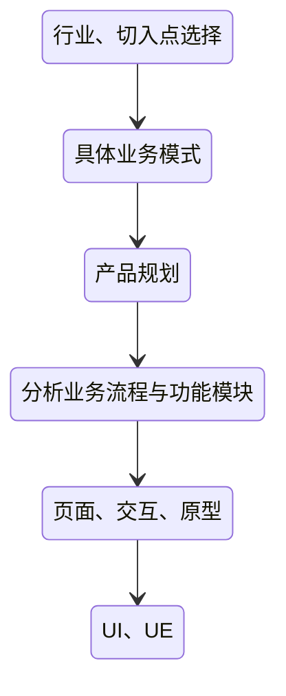
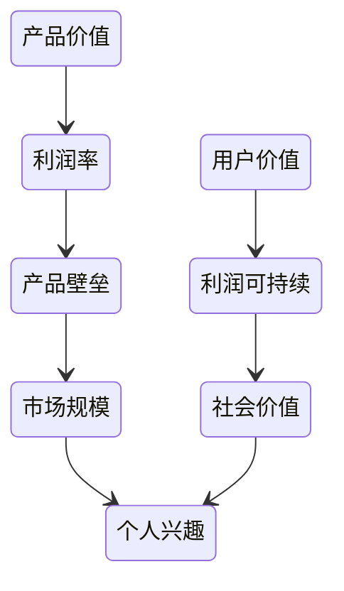

# 2B产品

## 产品本质

|     | 针对痛点            | 需求               | 欲望        |
| --- | --------------- | ---------------- | --------- |
| C端  | ***自然人*** 自身的需求 | 自然人 ***直接*** 的需求 | ***人欲***  |
| B端  | ***组织*** 的需求    | 自然人 ***间接*** 的需求 | ***组织欲*** |

解决组织的直接需求（效率提升、节省成本、资源整合）、组织内自然人的间接需求来源于组织的直接需求

产品分类：

+ 企业内部工作协同（定制化功能较多）
  + 每次部署边际成本较高
  + 偏向传统软件
+ 对外标准产品（定制化功能极少）
  + 与C端产品最为相似
  + 市场推广常用 ”B端销售 + C端线上“ 结合方式
+ 中后台产品（定制比例很高）
  + 没有真正意义上的使用者，偏向传统软件
  + 需要 ”公司业务知识 + 技术知识 + 公司IT系统现状 + 公司发展规划“ 都了解

## 产品差异

对比项 | 2B | 2C
-|-|-
目标用户|理性、注重效率、角色多样（决策者、管理者、员工）|感性、注重体验、角色单一
使用场景|固定时间、工作场景|碎片化、生活场景
产品思维|简化工作、提升效率|运营获取更多流量变现
业务功能|多扁平功能，功能间没有主次之分|一个核心功能为主，解决一个痛点需求
使用复杂度|工具型，业务场景多且复杂，生命周期长|玩具型，展现给用户面的逻辑简单，生命周期短
切换成本|高，部署周期长，更新困难，需要培训|低，同质化
运营程度|重运维，高稳定性需求|重运营，重视拉新促活，需要用户数量持续增长
商业模式|服务，按功能模块、使用人数、需求、后期维护付费|流量，羊毛出在羊身上

## 工作差异

产品本质造成产品差异造成工作差异：

- 业务模式取决于产品所属的分类
- 产品设计上，需求会变更的很快，原型演示，需要梳理确认多方干系人的诉求。流程复杂，初期流程做好人工介入的准备
- 技术上，由于业务逻辑复杂，所以需要预留更多的时间
- 产品准备上线，需要准备好操作手册及用户培训，准备验收材料、商务流程
- 营销上，使用频率取决于工作流程，线下销售+线上推广
- 技术支持上，很容易就能得到问题反馈，甚至客户会直接给出解决方案，不要被客户带偏

## 产品设计各环节

## 产品经理能力

通过行业分析、市场分析、竞品分析、数据分析、用户调研等工具，收集客观信息，对客观信息进行分析拆解加工形成结论，根据结论指导产品的设计

+ 基础素质  
  - 学习能力
  - 沟通能力
  - 抗压能力
  - 逻辑思维能力
  - 心态和情商
+ 专业知识  
  - 技术知识
  - 行业知识
  - 软件工程知识
+ 产品专业技能
  - 用户调研、竞品分析
  - 需求预处理
  - 产品设计
+ 组织影响力  
  - 知识记录、传承
  - 人才培养
  - 方法论建设
+ 综合角色能力  
  - 项目经理
  - 交互设计师
  - 售前工程师
  - 商务流程知识
  - 销售、市场人员
  - 运维人员
  - 客服

### 4+1 专业工具

+ 四个工具
  - 市场分析：需求侧规模
  - 竞品分析：供给侧能力、饱和度
  - 用户研究：收集用户具体特征
  - 数据分析：产品数据表现持续迭代改进（此处定义不包含行业数据）
+ 一个知识
  - 业务知识：所处行业对应的业务专业知识

### 2B产品竞品分析

+ 市场营销和战略管理方面的竞品分析是指对 **现有的或潜在的竞争产品** 的 **优势和劣势** 进行评估

  - 主观性的横向分析
  - 比较多个产品的整体架构、功能、商业模式、产品策略等多维度
  - 获得目的性的结论
  
+ 竞品分析包含的内容

  - 做的怎么样？ 用户数量、业绩表现
  - 为什么这么做？ 目标设定、决策依据
  - 怎么做到的？ 内部资源、外部环境
  - 下一步做什么？ 战略规划
  
+ 竞品分析在产品生命周期的应用

  - 概念 分析目标：行业选择、商业模式
  - 产品定义 分析目标：投资决策、需求分析、确定功能列表
  - 设计开发 分析目标：功能、交互设计参考
  - 运营 分析目标：制定竞争策略

+ 2B竞品分析难点

  - 信息获取困难
  - 产品标准化程度低
  - 分析产品需要行业知识

## 产品大周期

1. 传统乱序 —— 行业规则、线下、利益格局、地域差异
2. 线上定制 —— 固守、IT弱势、定制为主、行业了解
3. 效率提升 —— 行业专家、单点改进、细节优化、量变到质变
4. 模式创新 —— 倒逼行业、IT话语权、占领行业
5. 行业革命 —— 技术、环境变化、颠覆、新平衡

## 产品价值

寻找客户：

- 根据公司目标，匹配客户目标，寻找客户，适合对已有积累的业务做增长
- 客户的目标就是公司的目标，寻找客户，适合做创新业务

## 项目管理

+ B端项目推进流程
  
  - 项目分析 —— 接不接
    
    * 目标： 宏观分析项目范围、是否接受任务判断
    * 参与人员： PMO、各个环节负责人
    * 工作内容： 需求分析（粗）、系统\资源现状分析（粗）、风险分析、目标分析
  
  - 项目可行性论证 —— 能不能干
  
    * 目标： 可行性论证、最佳方案论证
    * 参与人员： PMO、各个环节负责人
    * 工作内容： 确定目标、论证计划、干系人沟通、信息收集和分析、方案列举、方案确认
  
  - 项目方案设计 —— 怎么干
    
    * 目标： 详细需求、方案梳理、商务工作（排期、报价）
    * 参与人员： PMO、各个环节成员为主（负责人把控）
    * 工作内容： 需求分析（细）、系统\资源现状分析（细）、实施方案和计划、商务报价
  
  - 推进和监控 —— 好好干
  
    * 目标： 项目实施推进、项目监控
    * 参与人员： PMO、各个环节成员为主（负责人把控）
    * 工作内容： 任务细化和分工、常规监控、特殊问题处理、上线前后管理
  
  - 项目收尾 —— 以后咋干
  
    * 目标： 项目交付、商务对接
    * 参与人员： PMO、各个环节负责人
    * 工作内容： 配合商务流程、资料沉淀、团队建设
    
+ 信息收集： 每个环节，思考遍历一遍

  - 范围： 确定、变化、未知
  - 进度： 计划、变更、Buffer
  - 成本： 预算、收益、Buffer
  - 质量： 工作质量、必要质量
  - 资源： 可以、变动、质量
  - 沟通： 必要告知、反馈
  - 风险： 其他所有7个方面、预估、应对
  - 干系人： 期望管理、满意度管理、决策影响、教育

