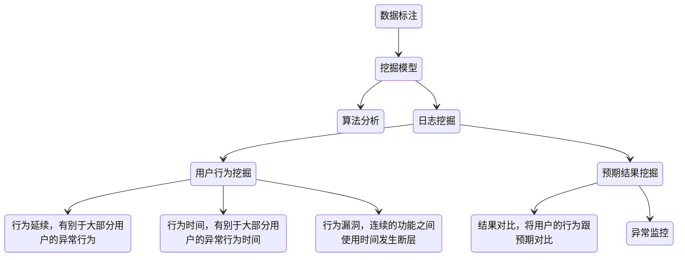
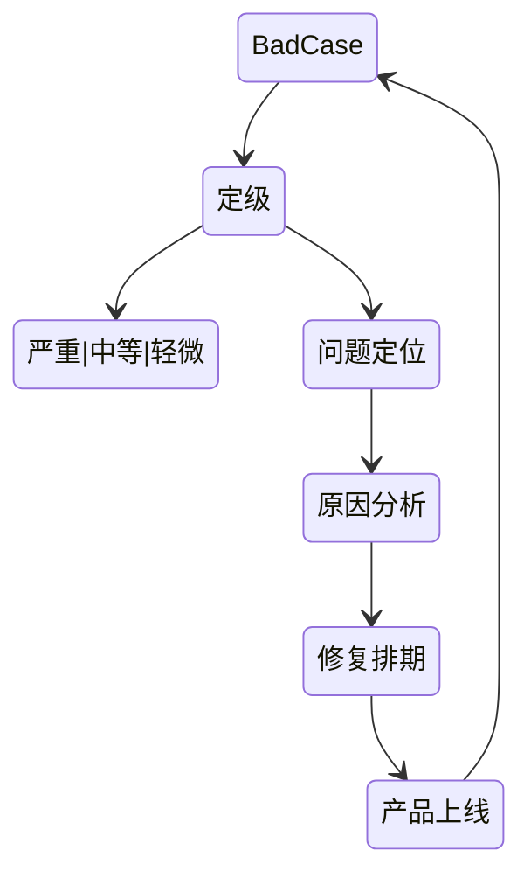

# 产品

## 产品评测

### 竞品评测

评测的目的：改善我们的产品

评测的范围：战略 定位 用户 功能 交互

评测的结论：我们要做的

基础描述：

- 行业描述
  - 行业背景
  - 领域定位
  - 市占分析
- 产品描述
  - 用户定位
  - 商业模式
  - 发展现状
- 评测描述
  - 评测环境 版本 方式

产品分析：

- 产品定位
- 产品框架
  - 功能框架 模块分类
- 产品对比
- 战略分析
  - 商业模式 成长打法
- 特色功能
- 盈利对比
  - 盈利模式 盈利能力
- 核心用户
- 产品壁垒
  - 能力 技术
- 扩散对比

SWOT分析：

### badcase 挖掘

- 不符合用户心理预期的产品输出结果
- 难以发现

挖掘方法：

### 舆情分析

发生期 -> 发展期 -> 巅峰期 -> 余震期

#### 技术支持

关键词：产品相关、公司相关、品牌相关、关键人物

舆情抓取：新闻资讯、社交媒体、传统媒体、公司留言、工商投诉

舆情报告：舆情数据、发展预测、事件分析

### 用户研究

用户属性决定了用户需求

从用户的需求可以细化出用户的场景

以场景需求为基础，建立核心功能

用核心功能服务核心用户

#### 用户细分

核心用户：

- 较高留存粘性
- 付费用户
- 病毒源头用户

用户结构、用户画像

针对用户行为分析、分层精细化运营

#### 用户行为

- 探索性行为：谨慎
- 习惯性行为：让用户用得更舒服

行为分析：热点分析、漏斗分析、多维度分析

路径分析：留存分析、路径优化
