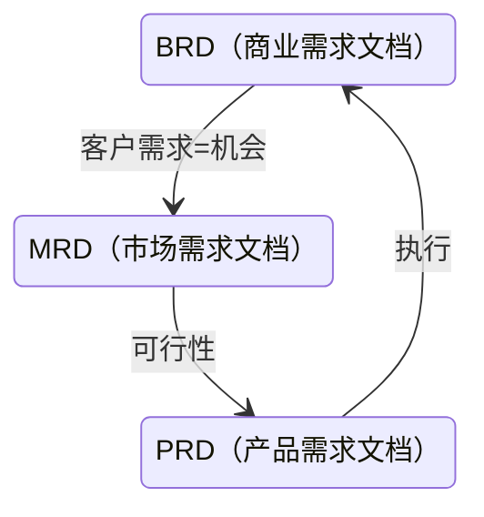

# 产品

## 产品评测

### 竞品评测

评测的目的：改善我们的产品

评测的范围：战略 定位 用户 功能 交互

评测的结论：我们要做的

基础描述：

- 行业描述
  - 行业背景
  - 领域定位
  - 市占分析
- 产品描述
  - 用户定位
  - 商业模式
  - 发展现状
- 评测描述
  - 评测环境 版本 方式

产品分析：

- 产品定位
- 产品框架
  - 功能框架 模块分类
- 产品对比
- 战略分析
  - 商业模式 成长打法
- 特色功能
- 盈利对比
  - 盈利模式 盈利能力
- 核心用户
- 产品壁垒
  - 能力 技术
- 扩散对比

SWOT分析：

### badcase 挖掘

- 不符合用户心理预期的产品输出结果
- 难以发现

挖掘方法：

### 舆情分析

发生期 -> 发展期 -> 巅峰期 -> 余震期

#### 技术支持

关键词：产品相关、公司相关、品牌相关、关键人物

舆情抓取：新闻资讯、社交媒体、传统媒体、公司留言、工商投诉

舆情报告：舆情数据、发展预测、事件分析

### 用户研究

用户属性决定了用户需求

从用户的需求可以细化出用户的场景

以场景需求为基础，建立核心功能

用核心功能服务核心用户

#### 用户细分

核心用户：

- 较高留存粘性
- 付费用户
- 病毒源头用户

用户结构、用户画像

针对用户行为分析、分层精细化运营

#### 用户行为

- 探索性行为：谨慎
- 习惯性行为：让用户用得更舒服

行为分析：热点分析、漏斗分析、多维度分析

路径分析：留存分析、路径优化

## PRD

不做高保真、不重复、不写废话

- 以文档的形式准确传达需求
- 用来约束产品经理以及研发
- 验收产品质量
- 记录产品迭代

### 工具

- 文档软件
- 原型软件

### 要素

#### 命名、编号

`XX产品V1PRD_V2`

#### 版本历史、目录

版本号 | 修订人 | 修改日期 | 修订描述
-|-|-|-
|||
|||

#### 引言

- 产品背景（研发、市场趋势、发展前景）
- 预期读者
- 产品规划

#### 需求概述

- 业务流程（功能模块图、流程图）
- 用户角色及用户描述
- 功能清单（功能模块、主要功能点、优先级）
- 运行环境
- 产品规划（关键里程碑、可能的风险）

#### 功能性需求说明

- 简要说明
- 场景描述
- 业务规则
- 原型图
- 前置条件：需求依赖的前提
- 后置条件：操作后的后续处理

#### 非功能描述

- 性能需求
- 运营需求
