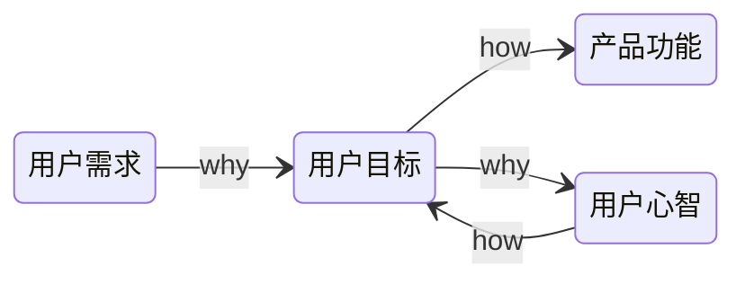

# 产品创新

- 产品经理不是岗位，而是角色

## 四轮MVP框架

## 探索研究

### 用户分析

1. 接触用户，梳理用户故事
2. 了解有哪几种用户，他们之间的关系是什么，梳理用户生态
   1. 颗粒度：用户们应该被细分到哪个层度
   2. 边界：所有和产品有关系的人是否都要纳入我们日常的用户生态图
   3. 优先级：在用户生态图中的用户，也是有重要、有次要的
3. 用户画像：基本信息 + 是与产品领域相关的用户特点信息 + 用户故事
4. 用户旅程：思考用户在解决相应问题的时候，都会碰到什么状况，做什么事，有什么感受和情绪，重点是关注用户的言行举止

### 竞品分析

- 两个产品的目标用户是同一群人或者组织，那这两个产品在某种程度上都会形成竞争关系
- 认知太过局限时，不知道还有更多的选择，也就很难设计出漂亮的解决方案

### 创意过滤

- 产品概念筛选

内部因素：能力、意愿 

自己和团队的能力、有没有足够的钱、有没有相应的资源，做的事情是否符合自己或公司的使命、愿景、价值观

外部因素：价值、成本

是不是一条足够宽阔的赛道，微观行业环境上需要考虑有哪些玩家，要考虑产业链的上下游、潜在的进入者、未来的替代者

## 原型设计

常见的错误：

- 不听
- 照做

### Y模型

- 用户需求：这是起点，是表象，是表面的需求，是用户的观点和行为
- 用户目标：需求背后的目标和动机，是用户言行的原因，在思考用户目标时也要综合考虑公司、产品的目标
- 产品功能：是解决方案，是技术人员能看懂的描述
- 用户心智：是人性与价值观，需求的最深层体现

### 原型制作

- 不用写代码，低成本验证

不轻易做真实产品功能不仅是为了节省资源，同时还是因为上线容易下线难，上线后的应用如果关停掉肯定会引发使用者不满，不关又会浪费资源

#### 人肉

设计一个看上去功能齐全的产品，但实际上用户接受的是人工服务

#### 众筹

做出一些图文视频材料，告诉潜在用户，将要做的是什么产品，用户会用各种行动来告诉你是否认可产品，一般还会花钱

#### 撒谎

假装已经做出了一项新产品或新服务，来试探有没有用户感兴趣。如果不行再进行辟谣

#### 动物标本

做一个高保真的静态原型，看起来和真的一模一样，可以让用户“装模作样”地用一下，但并不具备真正的功能

#### 利用竞品

借用竞争对手已经发布的产品，通过简单的重新包装，装作自己的产品，来测试某些假设

#### 低配

开发一个功能有限的低配版本，来试探用户的反应

### 设计冲刺

- 比较适合“现有产品碰到大瓶颈”，或“打算启动一个新产品”的情况

搭建舞台

1. 识别挑战:从大问题入手
2. 组建团队:确定一名决策者、一名引导者以及多样化的队员
3. 确定时间、地点:定出五天连续工作日,找到合适的会议室

星期一:拆包,把已知的一切摊上桌面

4. 从结果出发:设定一个长期目标
5. 绘制地图:列出冲刺问题
6. 请教专家:请教团队成员和其他专家
7. 选择目标:为本次冲刺选了一个目标

星期二:写写画画,每个人都贡献点子

8. 重组和改进:回顾已有的点子和灵感
9. 草拟方案:在纸上画出详细方案

星期三:决策日

10. 做出决策:毋须集体讨论,选出最佳方案
11. 决斗:胜者生存
12. 原型分镜脚本:制定建模计划

星期四:完成原型产品
13. 装模作样:营造假象,替代真实产品
14. 制作原型:选对工具,各个击破

星期五:交卷、检测

15. 小型数据:五位用户,可见一斑
16. 采访:提对问题
17. 学习:找到不足,计划未来
18. 起飞:出发前的最后一次助推

## 产品开发

### 产品服务系统

- 实体导向：以实体为主，包含有少量服务。它的服务目的是让用户可以顺利地使用产品实体，是与实体紧密相关
- 使用导向：给你的不是所有权，而是长期独占的使用权（Lease），或者是某种条件下，一段时间的使用权（Renting/Sharing），甚至是共享的使用权（Pooling） 云服务器是一种典型
- 结果导向：以服务为主，使用实体只是为了达成结果需要用的一个过程或者一个媒介而已，各种外包就是

#### 用户模式

从实体到服务的转变是 供应者与用户的关系往往终止在销售达成的一刻 到 供应者与用户的关系在销售达成的一刻才开始

越是重要的用户，就越要用服务比例高的产品服务系统来完成交付

#### 增长模式

不同的卖法，增长的方式不同。实体更容易标准化，而服务的极致体验是个性化

随着产品供给的极大丰富，没有被开发的用户已经越来越少了，所以我们更要思考如何在已有用户身上做文章，精细化运营

#### 财务模式

实体比例越来越低，会造成的必然结果是短期收入减少，资产投入增加，利润减少，但预期利润增加

偏服务的产品服务系统，不确定性更高，更需要有长远的眼光

### 评价标准

#### 静态维度

- 有用：解决问题
- 好用：主要目的是让交互顺畅、视觉舒服
- 爱用：情感共鸣、价值观的认可

#### 动态维度

- 个体价值：提供功能、提供价值的产品内核，外加优雅的体验、包装
- 个体粘性：增加用户的迁移成本，粘性也是要提供价值
- 群体粘性：绑架一群用户，让用户因为别人再用而不得不用
- 生态系统：用户因为产品而成长以及产品催生出了新的物种，用户与产品共生

项目产品化 -> 产品平台化 -> 平台生态化

- 产品化，靠的是总结提炼，把服务某个用户的能力，泛化到服务一类用户身上
  - 用户的所有需求都由我们自己来满足，要持续做供给，不断满足层出不穷的用户需求
- 平台化，产品开始自运营，随着供给者的上限打破，自然能满足更多需求，产品的天花板也就提升了很多
- 生态化，平台掌握着用户的需求、供给，这些人都是平台的共生者，只有共生者越多，平台才能做的足够大

一个系统，经过长时间的演化，其中的各种用户角色的权力、责任、利益结构都达到了相对平衡的状态。我们应该尽量通过创造增量来提升某种用户的价值，而不是通过重新分配利益来实现，即为了系统全局的收益，在必要时需要牺牲掉一部分用户的利益

### 起步

用户使用产品的逻辑是依次经历四个模块：发现、启程、习惯、精通，但做产品的顺序应该是：习惯、启程、发现、精通

#### 习惯

先打造出某个对用户有价值的闭环，用户来了，获得价值了，下一次还愿意来

#### 启程

产品的验证对象扩展开以后，做给相对的“新手用户”的，最常见的就是各种产品里的“新手上路”模块

#### 发现

发掘出用户在何时、何地会对产品产生第一印象，会通过什么渠道第一次接触产品

#### 精通

产品运营了一段时间之后，就会有相当数量的用户对产品了如指掌，这时候才有必要给他们打造“精通”系统，让他们不断地收到新的刺激

## 分销推广

### 生命周期

产品往哪里走，是由产品团队和用户共同决定的

- 验证期：围绕既定的核心用户，把重要的需求场景满足得越来越好
- 爆发期：遵循试错和小步快跑的策略，尝试各种拉新渠道，最后收敛到少数渠道投入重点资源
- 平台期：获客成本越来越高，满足已有用户的更多需求
- 衰退期：榨取产品最后的利润、将用户导入到新的产品、将已有的资源剥离出来给新产品

### 指标

- 指标要在执行开始前制订，而不是过程中根据“做的情况”调整，事前想要要考察什么
- 太虚了很难考核，太实又很容易作弊

虚荣指标，通常是对公司有价值的，而成功指标，是对用户有价值的

真正的成功指标，是可以反映出用户“非受迫、无诱导的成功行为”的

### 效率

提升做的效率：

- 降低复制成本、标准化、数字化、智能化
- 通过提供基础设施，让别人给你打工

提升推广的效率：

- 消除限制传播的时空因素
- 数字化，不用实体分发

## 成功复制

## 人才复制

业务需求决定了核心团队是否应该有一个产品合伙人，若产品在整个系统中只起到辅助的作用，也就是相对没那么重要，也就不必聘请高级的产品经理负责

产品经理的划分：

- 按能力：需求把握、方案设计、推动能力、决策能力、业务 / 技术理解以及领导力
- 按结果：能负责多大的事情来划分，模块功能 -> 独立完整产品 -> 新业务 -> 下一代产品

进攻型：需要在开放的市场里做调研、选择机会、制定策略，用最低的成本完成验证和冷启动

防守型：常见于大公司里，往往负责某个成熟业务的某一部分

## 需求采集

每一种需求采集方法，都各有利弊，各有适用场景

### 直接采集与间接采集

需求的提出者是不是有需求的人，需求是原始的还是加工过的 代表需求是直接还是间接的

一手需求更准确，二手需求经过梳理的，获取信息的效率更高

### 说和做

区分用户说的“观点”和“事实”，要习惯性地追问支撑用户这个观点背后的事实

### 定性与定量

定性研究通常是对少量样本的深入研究，可以找出问题的原因；定量研究是对大量样本的研究，可以发现现象、验证事实，属于群体研究

定性研究可能会存在的问题是“以偏概全”，定量会“以表代本”（表面的表，本质的本），只能用来发现表面的现象，却无法从中知道背后的深层次原因

### 是否在真实使用的场景

真实场景里的采集，优势显然是更真实可靠，贴合用户的真正场景；在特殊准备的场景下，有些关键因素可能会被忽略

### 是否和产品发生交互

用户想象中的自己是否需要，和真的用过以后的自己是否需要，是完全不同的

## 功能分类

- 基础功能：做的不好会引发用户不满，做的好是理所应当的
- 亮点功能：不做并不会有什么问题，做了用户就会大为惊喜
- 期望功能：少了用户有点不爽，但还不是无法接受；多了用户会觉得不错，但也不是欣喜若狂
- 无差别功能：做不做，用户对产品的感受是没有变化的
- 反向功能：做的越多用户越讨厌

## 产品矩阵

- 价值假设：问题是否存在？解决方案是否存在？问题与解决方案是否匹配？
- 增长假设：能否规模化？天花板高不高？与市场是否匹配？
- 长青假设：定位是否可持续？资源是否可积累？定位与资源是否匹配？

从价值到长青，是从单一产品到多套产品，即产品矩阵，矩阵中的任何一个产品是否能利用已有的资源，为公司未来积累资源，要有合理的生命周期管理。每一个产品，都要在该进入的时候进入，该退出的时候退出，即开始做产品的梯队建设

