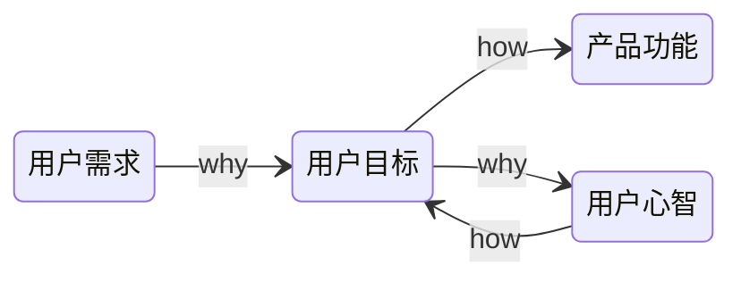

# 产品创新

- 产品经理不是岗位，而是角色

## 四轮MVP框架

## 探索研究

### 用户分析

1. 接触用户，梳理用户故事
2. 了解有哪几种用户，他们之间的关系是什么，梳理用户生态
   1. 颗粒度：用户们应该被细分到哪个层度
   2. 边界：所有和产品有关系的人是否都要纳入我们日常的用户生态图
   3. 优先级：在用户生态图中的用户，也是有重要、有次要的
3. 用户画像：基本信息 + 是与产品领域相关的用户特点信息 + 用户故事
4. 用户旅程：思考用户在解决相应问题的时候，都会碰到什么状况，做什么事，有什么感受和情绪，重点是关注用户的言行举止

### 竞品分析

- 两个产品的目标用户是同一群人或者组织，那这两个产品在某种程度上都会形成竞争关系
- 认知太过局限时，不知道还有更多的选择，也就很难设计出漂亮的解决方案

### 创意过滤

- 产品概念筛选

内部因素：能力、意愿 

自己和团队的能力、有没有足够的钱、有没有相应的资源，做的事情是否符合自己或公司的使命、愿景、价值观

外部因素：价值、成本

是不是一条足够宽阔的赛道，微观行业环境上需要考虑有哪些玩家，要考虑产业链的上下游、潜在的进入者、未来的替代者

## 原型设计

常见的错误：

- 不听
- 照做

### Y模型

- 用户需求：这是起点，是表象，是表面的需求，是用户的观点和行为
- 用户目标：需求背后的目标和动机，是用户言行的原因，在思考用户目标时也要综合考虑公司、产品的目标
- 产品功能：是解决方案，是技术人员能看懂的描述
- 用户心智：是人性与价值观，需求的最深层体现

### 原型制作

- 不用写代码，低成本验证

不轻易做真实产品功能不仅是为了节省资源，同时还是因为上线容易下线难，上线后的应用如果关停掉肯定会引发使用者不满，不关又会浪费资源

#### 人肉

设计一个看上去功能齐全的产品，但实际上用户接受的是人工服务

#### 众筹

做出一些图文视频材料，告诉潜在用户，将要做的是什么产品，用户会用各种行动来告诉你是否认可产品，一般还会花钱

#### 撒谎

假装已经做出了一项新产品或新服务，来试探有没有用户感兴趣。如果不行再进行辟谣

#### 动物标本

做一个高保真的静态原型，看起来和真的一模一样，可以让用户“装模作样”地用一下，但并不具备真正的功能

#### 利用竞品

借用竞争对手已经发布的产品，通过简单的重新包装，装作自己的产品，来测试某些假设

#### 低配

开发一个功能有限的低配版本，来试探用户的反应

### 设计冲刺

- 比较适合“现有产品碰到大瓶颈”，或“打算启动一个新产品”的情况

搭建舞台

1. 识别挑战:从大问题入手
2. 组建团队:确定一名决策者、一名引导者以及多样化的队员
3. 确定时间、地点:定出五天连续工作日,找到合适的会议室

星期一:拆包,把已知的一切摊上桌面

4. 从结果出发:设定一个长期目标
5. 绘制地图:列出冲刺问题
6. 请教专家:请教团队成员和其他专家
7. 选择目标:为本次冲刺选了一个目标

星期二:写写画画,每个人都贡献点子

8. 重组和改进:回顾已有的点子和灵感
9. 草拟方案:在纸上画出详细方案

星期三:决策日

10. 做出决策:毋须集体讨论,选出最佳方案
11. 决斗:胜者生存
12. 原型分镜脚本:制定建模计划

星期四:完成原型产品
13. 装模作样:营造假象,替代真实产品
14. 制作原型:选对工具,各个击破

星期五:交卷、检测

15. 小型数据:五位用户,可见一斑
16. 采访:提对问题
17. 学习:找到不足,计划未来
18. 起飞:出发前的最后一次助推

