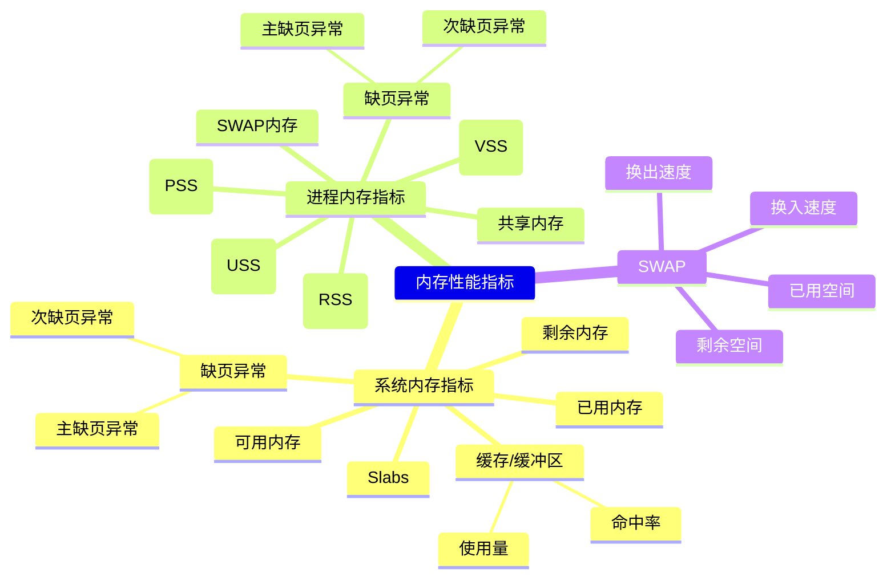
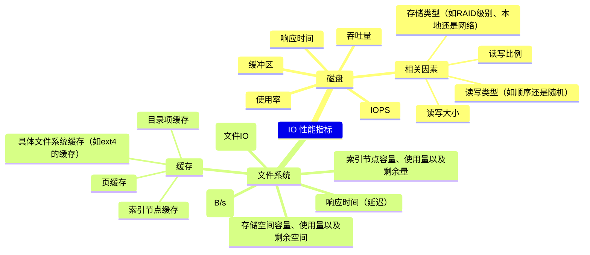

# Linux性能优化

## CPU

系统层面的一些优化手段：

- CPU 绑定：把进程绑定到一个或者多个 CPU 上，可以提高 CPU 缓存的命中率，减少跨 CPU 调度带来的上下文切换问题
- CPU 独占：跟 CPU 绑定类似，进一步将 CPU 分组，并通过 CPU 亲和性机制为其分配进程。这样，这些 CPU 就由指定的进程独占，换句话说，不允许其他进程再来使用这些 CPU
- 优先级调整：使用 nice 调整进程的优先级，正值调低优先级，负值调高优先级。，适当降低非核心应用的优先级，增高核心应用的优先级，可以确保核心应用得到优先处理
- 为进程设置资源限制：使用 Linux cgroups 来设置进程的 CPU 使用上限，可以防止由于某个应用自身的问题，而耗尽系统资源
- NUMA（Non-Uniform Memory Access）优化：支持 NUMA 的处理器会被划分为多个 node，每个 node 都有自己的本地内存空间。NUMA 优化，其实就是让 CPU 尽可能只访问本地内存
- 中断负载均衡：无论是软中断还是硬中断，它们的中断处理程序都可能会耗费大量的 CPU。开启 irqbalance 服务或者配置 smp_affinity，就可以把中断处理过程自动负载均衡到多个 CPU 上。

### 平均负载

平均负载是指单位时间内，系统处于可运行状态和不可中断状态的平均进程数，也就是平均活跃进程数，和 CPU 使用率并没有直接关系

在只有 2 个 CPU 的系统上，平均负载为 2 代表所有的 CPU 都刚好被完全占用，大量 IO 会导致平均负载变高，但 CPU 使用率却不一定高

top 命令展示的三个值，分别为 1 分钟、5 分钟、15 分钟内的平均负载

### 上下文切换

vmstat 可以查看系统整体上下文切换情况：

- cs（context switch）是每秒上下文切换的次数
- in（interrupt）则是每秒中断的次数
- r（Running or Runnable）是就绪队列的长度，也就是正在运行和等待 CPU 的进程数
- b（Blocked）则是处于不可中断睡眠状态的进程数

pidstat 则可以查看单个进程的上下文切换情况，cswch ，表示每秒自愿上下文切换（voluntary context switches）的次数，另一个则是 nvcswch ，表示每秒非自愿上下文切换（non voluntary context switches）的次数

- 自愿上下文切换：是指进程无法获取所需资源，导致的上下文切换。比如说， I/O、内存等系统资源不足时，就会发生自愿上下文切换。
- 非自愿上下文切换：是指进程由于时间片已到等原因，被系统强制调度，进而发生的上下文切换，大量进程都在争抢 CPU 时，就容易发生非自愿上下文切换

中断处理也需要上下文切换，可以通过 `/proc/interrupts` 查看中断最多的类型

### CPU使用率

通过 top 可以查看 CPU 在不同场景下的运行时间：

- user（通常缩写为 us），代表用户态 CPU 时间。注它不包括下面的 nice 时间，但包括了 guest 时间
- nice（通常缩写为 ni），代表低优先级用户态 CPU 时间，也就是进程的 nice 值被调整为 1-19 之间时的 CPU 时间，nice 可取值范围是 -20 到 19，数值越大，优先级反而越低
- system（通常缩写为 sys），代表内核态 CPU 时间
- idle（通常缩写为 id），代表空闲时间。它不包括等待 I/O 的时间（iowait）
- iowait（通常缩写为 wa），代表等待 I/O 的 CPU 时间，iowait 升高并不能证明等待I/O的进程数量增多了，也不能证明等待I/O的总时间增加了，还需检查I/O量有没有明显增加，avserv/avwait/avque等指标有没有明显增大
- irq（通常缩写为 hi），代表处理硬中断的 CPU 时间
- softirq（通常缩写为 si），代表处理软中断的 CPU 时间
- steal（通常缩写为 st），代表当系统运行在虚拟机中的时候，被其他虚拟机占用的 CPU 时间
- guest（通常缩写为 guest），代表通过虚拟化运行其他操作系统的时间，也就是运行虚拟机的 CPU 时间
- guest_nice（通常缩写为 gnice），代表以低优先级运行虚拟机的时间

为了在具体进程找到占用 CPU 时钟最多的函数或者指令，可以通过 perf top 查看函数名或函数地址

### 软中断

Linux 将中断处理过程分成了两个阶段，也就是上半部和下半部：

- 上半部用来快速处理中断，它在中断禁止模式下运行，主要处理跟硬件紧密相关的或时间敏感的工作
- 下半部用来延迟处理上半部未完成的工作，通常以内核线程的方式运行

> 网卡接收到数据包后，会通过硬件中断的方式通知内核有新的数据到了
> 对上半部来说，既然是快速处理，其实就是要把网卡的数据读到内存中，然后更新一下硬件寄存器的状态（表示数据已经读好了），最后再发送一个软中断信号，通知下半部做进一步的处理
> 下半部被软中断信号唤醒后，需要从内存中找到网络数据，再按照网络协议栈，对数据进行逐层解析和处理，直到把它送给应用程序

上半部会打断 CPU 正在执行的任务，然后立即执行中断处理程序。而下半部以内核线程的方式执行，并且每个 CPU 都对应一个软中断内核线程，名字为 “ksoftirqd/CPU 编号”

- /proc/softirqs 提供了软中断的运行情况
- /proc/interrupts 提供了硬中断的运行情况

当软中断事件的频率过高时，内核线程也会因为 CPU 使用率过高而导致软中断处理不及时，进而引发网络收发延迟、调度缓慢等性能问题

## 内存

通过 free 可以查看整体内存使用情况：

- total 是总内存大小
- used 是已使用内存的大小，包含了共享内存
- free 是未使用内存的大小
- shared 是共享内存的大小
- buff/cache 是缓存和缓冲区的大小
- available 是新进程可用内存的大小，不仅包含未使用内存，还包括了可回收的缓存

通过 top 查看具体进程的内存情况：

- VIRT 是进程虚拟内存的大小，只要是进程申请过的内存，即便还没有真正分配物理内存，也会计算在内
- RES 是常驻内存的大小，也就是进程实际使用的物理内存大小，但不包括 Swap 和共享内存
- SHR 是共享内存的大小，比如与其他进程共同使用的共享内存、加载的动态链接库以及程序的代码段等
- %MEM 是进程使用物理内存占系统总内存的百分比

系统层面的优化手段：

- 最好禁止 Swap。如果必须开启 Swap，降低 swappiness 的值，减少内存回收时 Swap 的使用倾向
- 减少内存的动态分配。比如，可以使用内存池、大页（HugePage）等
- 尽量使用缓存和缓冲区来访问数据。比如，可以使用堆栈明确声明内存空间，来存储需要缓存的数据；或者用 Redis 这类的外部缓存组件，优化数据的访问
- 使用 cgroups 等方式限制进程的内存使用情况。这样，可以确保系统内存不会被异常进程耗尽
- 通过 /proc/pid/oom_adj ，调整核心应用的 oom_score。这样，可以保证即使内存紧张，核心应用也不会被 OOM 杀死

### 分配与回收

malloc()

对小块内存（小于 128K），C 标准库使用 brk() 来分配，也就是通过移动堆顶的位置来分配内存。这些内存释放后并不会立刻归还系统，而是被缓存起来，这样就可以重复使用，brk() 方式的缓存，可以减少缺页异常的发生，提高内存访问效率

而大块内存（大于 128K），则直接使用内存映射 mmap() 来分配，也就是在文件映射段找一块空闲内存分配出去

当进程通过 malloc() 申请内存后，内存并不会立即分配，而是在首次访问时，才通过缺页异常陷入内核中分配内存

### buff/cache

buff 是对磁盘读写数据的缓存，而 cache 是对文件读写数据的缓存

在读写普通文件时，会经过文件系统，由文件系统负责与磁盘交互；而读写磁盘或者分区时，就会跳过文件系统，也就是所谓的裸I/O

### swap

swap 是一种虚拟内存交换到磁盘的机制

有一个专门的内核线程用来定期回收内存，也就是 kswapd0

kswapd0 定义了三个内存阈值：页最小阈值（pages_min）、页低阈值（pages_low）和页高阈值（pages_high）

- 剩余内存小于页最小阈值，说明进程可用内存都耗尽了，只有内核才可以分配内存
- 剩余内存落在页最小阈值和页低阈值中间，说明内存压力比较大，剩余内存不多了。这时 kswapd0 会执行内存回收，直到剩余内存大于高阈值为止
- 剩余内存落在页低阈值和页高阈值中间，说明内存有一定压力，但还可以满足新内存请求
- 剩余内存大于页高阈值，说明剩余内存比较多，没有内存压力

NUMA 下，多个处理器被划分到不同 Node 上，且每个 Node 都拥有自己的本地内存空间，每个 Node 会有自己的 swap

Linux 提供了一个 /proc/sys/vm/swappiness 选项，用来调整使用 Swap 的积极程度：swappiness 的范围是 0-100，数值越大，越积极使用 Swap，也就是更倾向于回收匿名页；数值越小，越消极使用 Swap，也就是更倾向于回收文件页

- 对文件页的回收，是直接回收缓存，或者把脏页写回磁盘后再回收
- 对匿名页的回收，是通过 Swap 机制，把它们写入磁盘后再释放内存

## IO

一些优化手段：

- 应用层
  - 追加写代替随机写
  - 缓存 I/O
  - 自建应用程序内部缓存
  - mmap代替read/write
  - 合并写请求： 在同步写场景中，尽量将写请求合并，可用fsync()替代O_SYNC，提高效率。
  - 使用cgroups的I/O子系统
  - ionice调整I/O调度优先级： 在使用CFQ调度器时，使用ionice提高核心应用的I/O优先级
- 文件系统层
  - 选择适合负载场景的文件系统：如 xfs 支持更大的磁盘分区和文件数量，但无法收缩
  - 优化文件系统配置选项： 在选定文件系统后，进一步优化其配置选项，包括文件系统特性（如 ext_attr、dir_index）、日志模式（如 journal、ordered、writeback）、挂载选项（如 noatime）
  - 优化文件系统缓存： 如优化 pdflush 脏页的刷新频率（dirty_expire_centisecs 和 dirty_writeback_centisecs）、脏页的限额（dirty_background_ratio 和 dirty_ratio），以及内核回收目录项缓存和索引节点缓存的倾向（vfs_cache_pressure）
  - 使用内存文件系统 tmpfs
- 磁盘层
  - 使用性能更好的磁盘
  - 使用RAID
  - 选择适合的I/O调度算法： SSD和虚拟机中的磁盘通常使用 noop 调度算法，而数据库应用更适合使用 deadline 算法
  - 进行磁盘级别的隔离： 为I/O压力重的应用配置单独的磁盘，提高性能。
  - 增大磁盘的预读数据： 在顺序读较多的场景中，增大磁盘的预读数据，可以通过调整内核选项或使用 blockdev 工具设置来实现。
  - 优化内核块设备I/O选项： 调整内核块设备I/O的选项，例如调整磁盘队列的长度，适当增大队列长度可以提升磁盘的吞吐量，但可能导致I/O延迟增大。
  - 注意硬件错误： 硬件错误可能导致磁盘性能急剧下降

### 容量

Linux 通过 inode 记录文件的元数据

可以通过 df -i 查看 inode 所占用的空间

### 缓存

内核使用 Slab 机制，管理目录项和 inode 的缓存，可以通过 /proc/slabinfo 查看这个缓存

### IO栈

由上到下分为三个层次，分别是：

- 文件系统层，包括虚拟文件系统和其他各种文件系统的具体实现。它为上层的应用程序，提供标准的文件访问接口对下会通过通用块层，来存储和管理磁盘数据
- 通用块层，包括块设备 I/O 队列和 I/O 调度器。它会对文件系统的 I/O 请求进行排队，再通过重新排序和请求合并，然后才要发送给下一级的设备层
  - NONE 调度算法：不使用任何 I/O 调度器，对文件系统和应用程序的 I/O 其实不做任何处理，常用在虚拟机中
  - NOOP：是一个先入先出的队列，只做一些最基本的请求合并，常用于 SSD 磁盘
  - CFQ：完全公平调度器，为每个进程维护了一个 I/O 调度队列，并按照时间片来均匀分布每个进程的 I/O 请求
  - DeadLine：别为读、写请求创建了不同的 I/O 队列，可以提高机械磁盘的吞吐量，并确保达到最终期限（deadline）的请求被优先处理，多用在 I/O 压力比较重的场景，比如数据库
- 设备层，包括存储设备和相应的驱动程序，负责最终物理设备的 I/O 操作

### 磁盘性能指标

- 使用率，是指磁盘处理 I/O 的时间百分比。过高的使用率（比如超过 80%），通常意味着磁盘 I/O 存在性能瓶颈
- 饱和度，是指磁盘处理 I/O 的繁忙程度。过高的饱和度，意味着磁盘存在严重的性能瓶颈。当饱和度为 100% 时，磁盘无法接受新的 I/O 请求
- IOPS（Input/Output Per Second），是指每秒的 I/O 请求数
- 吞吐量，是指每秒的 I/O 请求大小
- 响应时间，是指 I/O 请求从发出到收到响应的间隔时间

在数据库、大量小文件等这类随机读写比较多的场景中，IOPS 更能反映系统的整体性能；而在多媒体等顺序读写较多的场景中，吞吐量才更能反映系统的整体性能

## 网络

**网络包的接收流程**：当一个网络帧到达网卡后，网卡会通过 DMA 方式，把这个网络包放到收包队列中，通过硬中断告诉中断处理程序已经收到了网络包，接着，网卡中断处理程序会为网络帧分配内核数据结构（sk_buff），并将其拷贝到 sk_buff 缓冲区中；然后再通过软中断，通知内核收到了新的网络帧，内核协议栈从缓冲区中取出网络帧，并通过网络协议栈，从下到上逐层处理这个网络帧

**网络包发送流程**：内核协议栈处理过的网络包被放到发包队列后，会有软中断通知驱动程序发包队列中有新的网络帧需要发送。驱动程序通过 DMA ，从发包队列中读出网络帧，并通过物理网卡把它发送出去

### 性能指标

通过 ifconfig 可以看到网卡网络收发的字节数、包数、错误数以及丢包情况：

- errors 表示发生错误的数据包数，比如校验错误、帧同步错误等
- dropped 表示丢弃的数据包数，即数据包已经收到了 Ring Buffer，但因为内存不足等原因丢包
- overruns 表示超限数据包数，即网络 I/O 速度过快，导致 Ring Buffer 中的数据包来不及处理（队列满）而导致的丢包
- carrier 表示发生 carrirer 错误的数据包数，比如双工模式不匹配、物理电缆出现问题等
- collisions 表示碰撞数据包数

netstat 可以看到套接字的接收队列（Recv-Q）和发送队列（Send-Q）

当套接字处于连接状态（Established）时，Recv-Q 表示套接字缓冲还没有被应用程序取走的字节数（即接收队列长度）。而 Send-Q 表示还没有被远端主机确认的字节数（即发送队列长度）。

当套接字处于监听状态（Listening）时，Recv-Q 表示全连接队列的长度。而 Send-Q 表示全连接队列的最大长度。全连接是指服务器收到了客户端的 ACK，完成了 TCP 三次握手，然后就会把这个连接挪到全连接队列中，半连接是指还没有完成 TCP 三次握手的连接

`netstat -s` 可以查看协议栈各层的统计信息

### 工作模型

主进程 + 多个 worker 子进程：主进程执行 bind() + listen() 后，创建多个子进程；然后在每个子进程中，都通过 accept() 或 epoll_wait() ，来处理相同的套接字

监听到相同端口的多进程模型：所有的进程都监听相同的接口，并且开启 SO_REUSEPORT 选项，由内核负责将请求负载均衡到这些监听进程中去