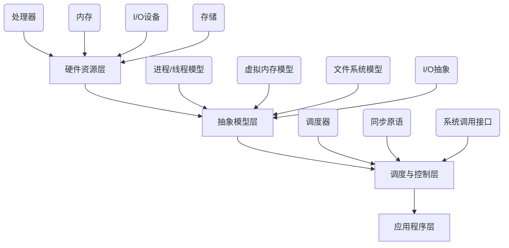
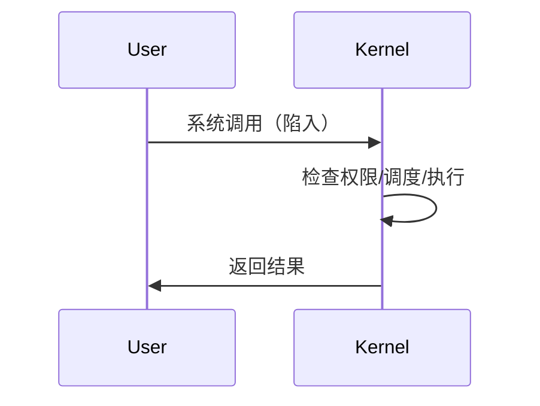
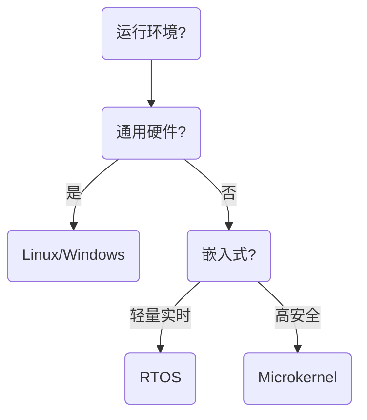

# 操作系统

## 概述（Overview）

操作系统是计算机系统的基础性软件，是连接"硬件世界"与"应用世界"的核心媒介。它对下统一管理异构硬件，对上提供稳定一致的抽象接口，使复杂硬件体系具备"可控性、可共享性、可扩展性"。

操作系统的使命本质是：
**通过抽象、隔离与调度，将混乱无序的物理资源组织成可控的计算环境。**

## 本质（Essence）

操作系统的本质可总结为三句话：

1. **抽象物理资源（统一接口）**
   将处理器、内存、磁盘、网络等异构硬件抽象为稳定模型：进程、线程、地址空间、文件、设备对象等。

2. **隔离与保护（安全边界）**
   在不可信或互相竞争的程序之间建立隔离，保证独立性与稳定性。

3. **调度和管理（资源利用率最大化）**
   在时间和空间维度上分配资源，实现公平性、高效性、响应性。

一句话本质：
**操作系统 = 抽象 + 隔离 + 调度。**

## 核心模型（Core Model）

操作系统以"资源—抽象—调度"三层为逻辑结构：

核心抽象模型包括：

* **进程模型**：执行上下文 + 独立地址空间
* **线程模型**：轻量级调度单位
* **虚拟内存模型**：地址映射 + 存储层级
* **文件系统模型**：统一命名空间 + 逻辑存储抽象
* **I/O 模型**：设备独立性 + 驱动与中断体系
* **系统调用模型**：用户态与内核态的边界通道

## 能力体系（Capability System）

从系统工程角度，操作系统的能力可归纳为四大支柱。

### 资源抽象能力

| 资源类型 | 抽象模型       | 目标                |
| ---- | ---------- | ----------------- |
| CPU  | 进程/线程/调度实体 | 屏蔽硬件指令流水线与核心结构    |
| 内存   | 虚拟内存、页表    | 打破物理地址限制，提供隔离     |
| 存储   | 文件、目录、VFS  | 隐藏硬件差异，构建统一文件命名空间 |
| I/O  | 设备对象、驱动层   | 屏蔽设备复杂性           |

### 调度与管理能力

* CPU 调度
  公平性、优先级、抢占、多核负载均衡
* 内存调度
  分页、置换、缓存策略
* I/O 调度
  队列优化、IO 优先级
* 进程管理
  创建、销毁、同步、通信

### 安全隔离能力

* 用户态 vs 内核态
* 进程隔离（地址空间）
* 文件访问权限模型
* 内核保护机制
* 中断和异常处理隔离

### 异步事件能力

* 中断处理
* 异常处理
* 系统调用陷入
* 信号机制
* 设备回调与事件驱动模型

本质：
**异步事件=操作系统打破同步计算模型的关键能力。**

## 架构模型（Architecture Model）

从架构哲学看，内核设计遵循"性能—可扩展性—安全性"三者的权衡。

### 单体内核（Monolithic Kernel）

**特征：**

* 所有核心功能都在内核态
* 高性能、低切换成本
* 更难维护，稳定性风险高

典型：Linux

### 微内核（Microkernel）

**特征：**

* 内核仅保留最小功能（调度、中断、IPC）
* 其他如文件系统、驱动等作为用户态服务
* 高可靠性，更易扩展
* 但存在更多上下文切换开销

典型：Minix、QNX、Fuchsia Zircon

### 混合内核（Hybrid）

**介于两者之间，实用主义选择。**

典型：Windows NT、XNU(macOS)

## 分类体系（Taxonomy）

从不同维度对操作系统分类：

### 按用途

| 类型        | 描述                    |
| --------- | --------------------- |
| 通用操作系统    | Linux、Windows、macOS   |
| 移动操作系统    | Android、iOS           |
| 嵌入式 OS    | RTOS、VxWorks、FreeRTOS |
| 分布式/云操作系统 | Kubernetes（集群级 OS）    |

### 按调度模型

* 分时系统
* 批处理系统
* 实时系统（硬实时/软实时）

### 按内核结构

* 单体内核
* 微内核
* 混合内核

## 边界与生态（Boundary & Ecosystem）

操作系统作为生态中心，有两个关键边界：

### 内部边界：用户态 ↔ 内核态

边界目的：

* 保护硬件
* 对用户态提供受控能力
* 防止恶意或错误程序破坏系统

### 外部边界：OS ↔ 硬件

通过：

* 中断描述符表（IDT）
* 页表/MMU
* 设备驱动模型
* DMA、I/O 控制器
* 时钟源

## 治理体系（Governance System）

从工程与维护角度，操作系统的治理包括：

* **资源治理**：限制、配额、控制组（cgroup）
* **安全治理**：ACL、沙箱、SELinux、权限模型
* **可靠性治理**：日志、检查点、错误恢复
* **性能治理**：调度策略、优先级、IO 调优
* **更新治理**：内核补丁、驱动管理

内核本质是一个"可靠性优先"的工程体系。

## 演进趋势（Evolution）

现代操作系统正在向三个方向演化：

### 抽象化进一步提升

* Serverless runtime
* 虚拟化 → 容器 → WebAssembly → Unikernel

### 内核更加模块化与安全

* eBPF
* 沙箱化驱动
* 微内核与用户态驱动卷土重来

### 云操作系统时代

* Kubernetes 成为"分布式操作系统内核"
* 节点 OS 与集群 OS 分层演进

## 选型方法论（Selection Framework）

根据目标系统特性，从三个维度决策：

| 关键指标   | 问题              | 推荐                        |
| ------ | --------------- | ------------------------- |
| 性能     | 是否追求低延迟和极致资源利用？ | Monolithic(Linux)         |
| 可靠性与安全 | 是否需要高隔离、关键任务系统？ | Microkernel / RTOS        |
| 生态与兼容  | 是否需要庞大生态与驱动支持？  | Linux / Windows / Android |
| 资源限制   | 是否运行在小型嵌入式？     | RTOS / FreeRTOS           |

简化决策树：

## 总结（Conclusion）

操作系统不是简单的"软件集合"，而是一个支撑整个计算世界的 **抽象机器**。
其核心价值在于：

* **把混乱硬件变成可控系统**
* **提供稳定抽象与保护边界**
* **实现资源高效共享与调度**
* **构建计算生态的基础层**

理解操作系统，就是理解现代计算世界的基石。

## 关联内容（自动生成）

- [/操作系统/操作系统设计.md](/操作系统/操作系统设计.md) 操作系统设计原理与OS架构模型、能力体系密切相关，深入阐述了OS设计的核心思想
- [/操作系统/进程与线程.md](/操作系统/进程与线程.md) 进程与线程模型是操作系统核心抽象模型的重要组成部分，与文档中提到的进程/线程模型直接相关
- [/操作系统/内存管理.md](/操作系统/内存管理.md) 虚拟内存管理机制是操作系统核心功能之一，与文档中虚拟内存模型和调度管理能力紧密相连
- [/操作系统/文件管理.md](/操作系统/文件管理.md) 文件系统模型是操作系统提供的重要抽象之一，与文档中提到的文件系统模型及统一命名空间概念相关
- [/操作系统/输入输出.md](/操作系统/输入输出.md) I/O模型和设备管理是操作系统的重要能力，与文档中I/O抽象和设备对象概念密切相关
- [/操作系统/安全.md](/操作系统/安全.md) 操作系统安全机制与隔离保护能力密切相关，涉及用户态/内核态隔离、访问控制等安全边界构建
- [/操作系统/虚拟化.md](/操作系统/虚拟化.md) 虚拟化技术与操作系统内核架构和资源抽象能力相关，体现了现代操作系统的发展趋势
- [/操作系统/linux/Linux.md](/操作系统/linux/Linux.md) Linux作为单体内核的典型实例，与文档中提到的内核架构模型和Linux系统相关
- [/操作系统/linux/内核.md](/操作系统/linux/内核.md) Linux内核实现细节展示了现代操作系统内核架构，与文档中内核架构模型和系统调用接口相关
- [/操作系统/死锁.md](/操作系统/死锁.md) 死锁是操作系统资源管理中需解决的重要问题，与文档中的资源调度和管理能力紧密关联
- [/操作系统/多处理机系统.md](/操作系统/多处理机系统.md) 多处理机系统涉及CPU调度和资源管理的高级概念，与文档中调度与管理能力及架构模型相关
- [/计算机系统/计算机系统.md](/计算机系统/计算机系统.md) 计算机系统概述与操作系统作为硬件和应用之间桥梁的角色密切相关，阐述了整体系统架构
