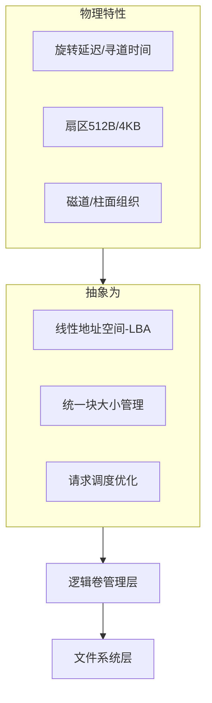
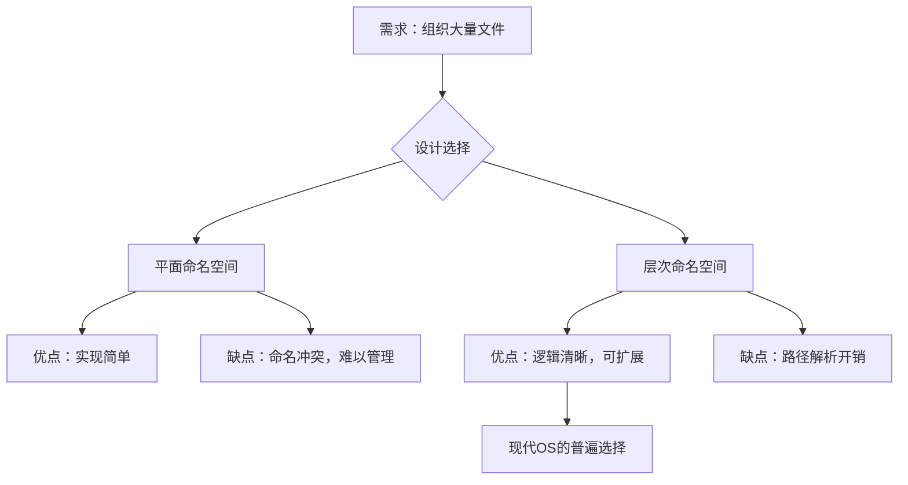
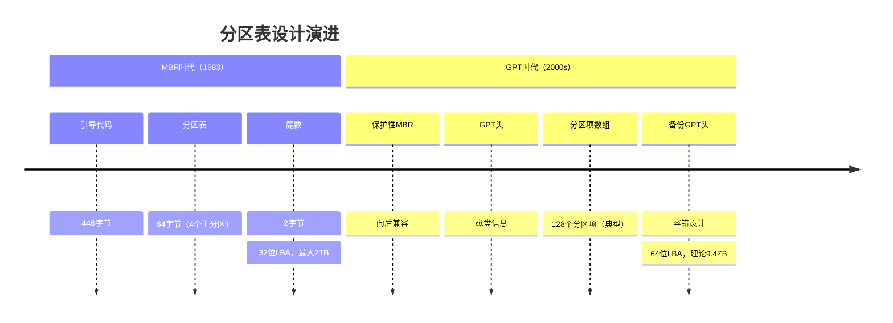
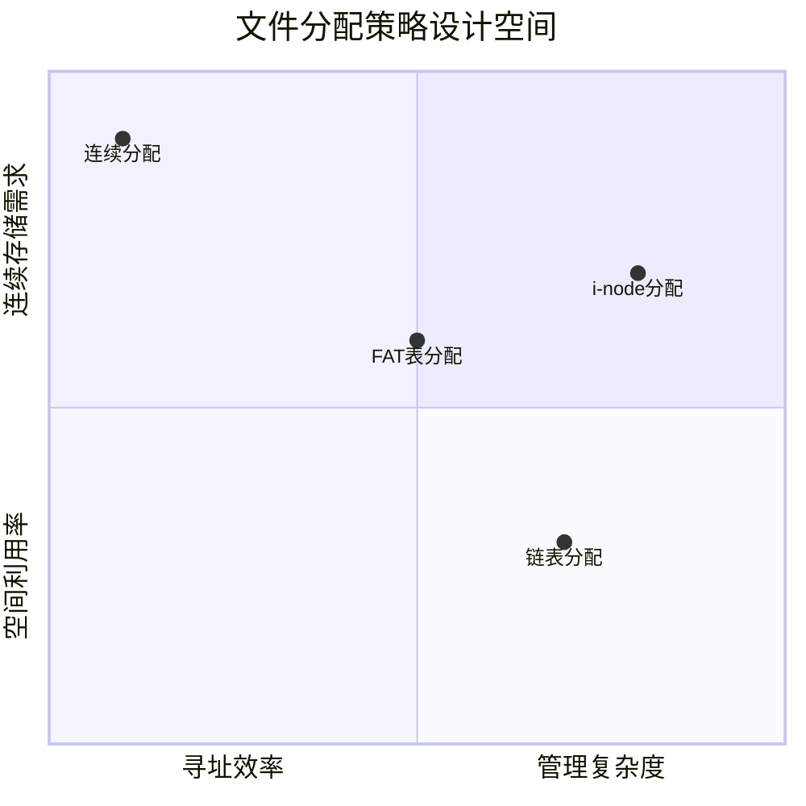

# 文件系统

## 一、文件系统的本质目标与核心挑战

### 1.1 持久化存储的三大基本需求
任何现代计算系统都需要满足以下三个核心需求，这些需求驱动了文件系统的演进：

1. **海量信息存储能力** - 超越内存容量的物理限制
2. **进程无关持久性** - 信息在创建者进程终止后依然存在
3. **并发安全访问** - 多个进程可同时读取，写入需要有序管理

这些看似简单的需求，实则构成了计算机科学中**数据持久化**的根本问题，其解决方案体现了工程中的经典权衡。

### 1.2 文件系统要解决的核心矛盾

```
┌─────────────────────────────────────────────────────────────┐
│                    文件系统的核心矛盾                         │
├─────────────────────────────────────────────────────────────┤
│                                                             │
│  磁盘的物理特性             vs             应用层的逻辑需求     │
│                                                             │
│  • 块设备（512B/4KB块）        • 可变长字节流                    │
│  • 毫秒级随机访问延迟          • 直观的命名与组织                │
│  • 易失性（掉电数据风险）      • 原子性与一致性保障              │
│  • 有限带宽                   • 高性能并发访问                 │
│                                                             │
└─────────────────────────────────────────────────────────────┘
```

## 二、硬件抽象层：从物理介质到逻辑块设备

### 2.1 磁盘的抽象模型演变



关键设计思想：**屏蔽硬件差异，提供统一接口**。无论底层是HDD、SSD还是NVMe，文件系统看到的是统一的块设备接口。

### 2.2 硬件接口的设计哲学演进
虽然具体接口标准（IDE→SATA→NVMe）会过时，但其演进体现了以下不变原则：

| 演进方向 | 设计哲学 | 解决的问题 |
|---------|---------|-----------|
| 并行→串行 | **简化布线，提升频率** | 同步时钟瓶颈、信号干扰 |
| 协议分层化 | **关注点分离** | 命令、传输、物理层解耦 |
| 队列深度增加 | **并发优化** | 提高SSD并行性利用率 |
| 主机内存缓冲 | **减少拷贝** | DMA与零拷贝优化 |

**核心原则**：硬件接口演进的本质是**在物理限制与性能需求间寻找最优平衡点**。

## 三、文件抽象：构建用户友好的存储模型

### 3.1 文件的四层抽象模型

```
应用视角：   命名空间中的对象，有语义含义
            ↓
API视角：    支持open/read/write/seek操作的句柄
            ↓
OS内核视角：   inode + 数据块的集合（元数据+数据）
            ↓
磁盘视角：     分散的块集合，通过元数据链接
```

### 3.2 文件命名的设计哲学

文件系统通过**命名机制**解决"如何找到数据"的问题：


**设计权衡**：
- **短名 vs 长名**：固定长度便于查找，可变长度更灵活
- **扁平命名 vs 层次命名**：简单性 vs 组织性
- **扩展名约定 vs 元数据标签**：隐含类型 vs 显式属性

### 3.3 文件访问模式的设计影响

不同访问模式要求不同的底层实现策略：

| 访问模式 | 典型应用 | 优化策略 | 分配方案倾向 |
|---------|---------|---------|------------|
| 顺序读写 | 日志、流媒体 | 预读、连续分配 | 连续分配 |
| 随机访问 | 数据库、VM | 缓存、索引优化 | 索引分配 |
| 追加写入 | 日志文件 | 日志结构、原子追加 | LFS、日志 |
| 小文件密集 | 源码、配置文件 | 打包、特殊inode布局 | 块内分配 |

## 四、目录系统：层次化命名空间的组织智慧

### 4.1 目录的本质：特殊的文件

设计洞察：目录实际上是**从名称到inode的映射表**。这种设计体现了UNIX哲学中的"一切皆文件"思想。

### 4.2 从单层到层次：可扩展性的必然选择



**关键设计决策**：采用树形结构而非网状结构，因为：
1. **简单性**：每个文件有唯一路径
2. **高效性**：路径解析可优化
3. **直观性**：符合人类思维习惯

### 4.3 硬链接与符号链接：两种不同的"别名"哲学

| 维度 | 硬链接 | 符号链接 |
|-----|-------|---------|
| **本质** | 同一inode的多个目录项 | 包含目标路径的特殊文件 |
| **存储成本** | 低（仅目录项） | 中（文件+路径数据） |
| **跨文件系统** | 不支持 | 支持 |
| **目标删除影响** | 引用计数减1 | 链接悬空 |
| **设计哲学** | **实体共享** | **名称引用** |

**深层原理**：硬链接反映了**基于引用计数的资源管理**模式，符号链接反映了**间接寻址和延迟绑定**思想。

## 五、文件系统布局：磁盘上的结构化智慧

### 5.1 分区的历史演进：从MBR到GPT



**设计哲学演进**：
- **MBR**：简单够用，但扩展性差（固定位置、有限分区）
- **GPT**：自描述、可扩展、容错性强（多处备份、CRC校验）

### 5.2 文件系统元数据的经典三元组

```
Superblock（文件系统信息）
    ↓
Inode Table（文件元数据）
    ↓
Data Blocks（用户数据）
    ↓
Bitmap（空间管理）
```

**设计洞察**：这种分离存储的设计体现了**元数据与数据分离**的原则：
1. **元数据集中管理**：便于快速查找和一致性维护
2. **数据分散存储**：提高并发性和空间利用率
3. **位图优化管理**：O(1)复杂度的空间分配

## 六、文件存储的实现策略：经典设计空间探索

### 6.1 四大分配策略的比较哲学



#### 连续分配：简单性的代价
- **设计哲学**：用空间换时间
- **适用场景**：CD/DVD、一次性写入介质
- **根本局限**：**外部碎片问题**，体现了内存管理中的经典问题

#### 链表分配：灵活性的开销
- **设计哲学**：用时间换空间
- **核心问题**：随机访问需要遍历链表
- **优化思想**：**空间局部性原理**的违背

#### FAT表：内存换速度的权衡
- **设计思想**：**将磁盘上的链表索引放入内存**
- 优势：随机访问优化
- 代价：内存占用随磁盘增大线性增长
- **历史意义**：个人计算机时代的实用主义设计

#### i-node设计：现代OS的优雅方案
```c
// i-node的抽象表示（设计思想）
struct inode_design {
    metadata_t   attributes;     // 所有权、时间戳、权限等
    blockptr_t   direct[12];     // 直接指针：覆盖典型小文件
    blockptr_t   indirect;       // 一级间接：中等文件
    blockptr_t   double_indirect;// 二级间接：大文件
    blockptr_t   triple_indirect;// 三级间接：极大文件
};
```

**设计哲学亮点**：
1. **多级索引的智慧**：适应不同大小文件，避免过度开销
2. **局部性优化**：大多数文件可通过直接指针访问
3. **可扩展性**：支持从KB到TB级别的文件

### 6.2 现代演进：Extents与写时复制

| 传统块映射 | Extents（范围） | 写时复制（CoW） |
|-----------|----------------|----------------|
| 块到块映射 | 连续块范围映射 | 修改时复制新版本 |
| 大文件映射表大 | 减少元数据大小 | 自然支持快照 |
| 更新时覆盖 | 更适合大文件 | 崩溃一致性天然保障 |

**趋势**：从**离散块管理**转向**连续范围管理**，减少元数据开销。

## 七、高级文件系统特性：可靠性与性能的工程平衡

### 7.1 日志文件系统：崩溃一致性的工程解

**问题本质**：文件系统操作的非原子性与电力故障的不可预测性之间的矛盾。

**解决方案演进**：
```
┌─────────────────────────────────────────────────────┐
│           一致性保障方案的演进                         │
├──────────────┬──────────────┬──────────────────────┤
│  FSCK时代     │  日志时代     │  写时复制时代          │
├──────────────┼──────────────┼──────────────────────┤
│ 事后修复      │ 事前预防      │ 根本避免              │
│ 扫描全盘      │ 只重放日志    │ 永不覆写              │
│ 修复时间长    │ 恢复速度快    │ 瞬间恢复              │
│ 可能数据丢失  │ 数据安全      │ 支持快照              │
└──────────────┴──────────────┴──────────────────────┘
```

#### 日志的三种模式体现不同权衡：

| 日志模式 | 写入顺序 | 性能影响 | 数据安全性 |
|---------|---------|---------|-----------|
| Writeback | 数据→日志→提交 | 最佳 | 元数据安全，数据可能丢失 |
| Ordered | 数据→日志提交→元数据 | 平衡 | 保证数据在元数据前写入 |
| Journal | 数据+元数据→日志→提交 | 最低 | 完全安全，双重写入 |

**设计哲学**：通过**冗余写入（日志）** 换取**崩溃原子性**，体现了"没有银弹"的工程现实。

### 7.2 日志结构文件系统（LFS）：面向SSD的重新思考

**核心洞察**：传统文件系统针对机械硬盘优化，而SSD具有：
1. 随机写入性能接近顺序写入
2. 擦除前需先擦除整个块
3. 写放大问题

**LFS的设计哲学转变**：
- **从"就地更新"到"仅追加写入"**
- **从"随机写入"到"顺序化所有写入"**
- **从"即时清理"到"后台压缩"**

```
传统FS：更新inode和数据块 → 随机写入
    ↓
LFS：写入新数据+新inode → 顺序写入
    ↓
    更新检查点指针 → 原子切换
```

**现代启示**：LFS的思想在SSD的FTL（闪存转换层）、现代日志文件系统、以及LSM树（LevelDB/RocksDB）中都有体现。

### 7.3 虚拟文件系统（VFS）：抽象之美

VFS体现了**面向接口编程**和**适配器模式**的经典应用：

```python
# VFS的抽象接口示意（设计思想）
class VFSInterface:
    def lookup(self, path): pass      # 查找inode
    def create(self, path, mode): pass # 创建文件
    def read(self, inode, offset, size): pass
    def write(self, inode, offset, data): pass
    
# 具体文件系统实现
class Ext4FileSystem(VFSInterface):
    def lookup(self, path):
        # 实现ext4特定的查找逻辑
        return ext4_inode
    
class NTFSFileSystem(VFSInterface):
    def lookup(self, path):
        # 实现NTFS特定的查找逻辑
        return ntfs_inode
```

**设计价值**：
1. **统一抽象**：用户/进程看到一致的文件API
2. **可扩展性**：新文件系统只需实现接口
3. **透明性**：挂载机制使多个FS无缝协作

## 八、文件系统性能优化：时间与空间的永恒舞蹈

### 8.1 缓存策略的多层次哲学

```
┌─────────────────────────────────────────────────────┐
│                存储层次结构与缓存策略                   │
├──────────────┬──────────────┬──────────────────────┤
│    CPU寄存器   │    <1ns      │  编译器管理            │
├──────────────┼──────────────┼──────────────────────┤
│   CPU缓存     │   1-10ns     │  硬件预取，LRU         │
├──────────────┼──────────────┼──────────────────────┤
│   主内存       │   100ns      │  页面缓存，主动释放     │
├──────────────┼──────────────┼──────────────────────┤
│   SSD/NVMe   │   10-100μs    │  操作系统I/O调度       │
├──────────────┼──────────────┼──────────────────────┤
│   机械硬盘     │   1-10ms     │  电梯算法，预读        │
└──────────────┴──────────────┴──────────────────────┘
```

**核心优化原则**：
1. **局部性原理**：时间局部性（最近访问的很可能再访问）和空间局部性（附近的数据很可能被访问）
2. **预取策略**：根据访问模式预测未来需求
3. **写回延迟**：批量写入提高吞吐量，但需要权衡数据安全

### 8.2 磁盘调度算法：机械限制下的智慧

不同算法体现了不同场景下的优化目标：

| 调度算法 | 核心思想 | 优化目标 | 适用场景 |
|---------|---------|---------|---------|
| FCFS（先来先服务） | 简单公平 | 公平性 | 负载轻 |
| SSTF（最短寻道时间） | 贪心优化 | 平均寻道时间 | 通用 |
| SCAN（电梯算法） | 单向扫描 | 公平性与吞吐量平衡 | 中等负载 |
| C-SCAN（循环扫描） | 单向循环 | 响应时间均匀 | 高负载 |
| LOOK/C-LOOK | 动态范围 | 减少无用移动 | 现代系统 |

**哲学启示**：调度算法的演进体现了**从简单到复杂，再到针对特定负载优化**的工程思维。

### 8.3 现代趋势：从通用到专用

```
传统优化：      针对机械硬盘的旋转和寻道优化
    ↓
SSD时代：        考虑并行性、磨损均衡、写放大
    ↓
NVMe时代：       利用多队列、低延迟、高带宽
    ↓
存储类内存：      模糊内存与存储界限，需要新抽象
```

## 九、现代文件系统设计趋势

### 9.1 从本地到分布式：扩展性的必然路径

分布式文件系统面临的**新挑战与解决方案**：

| 挑战 | 解决方案 | 设计哲学 |
|-----|---------|---------|
| 元数据扩展性 | 分离元数据服务器 | 关注点分离 |
| 数据可靠性 | 多副本/纠删码 | 空间换可靠性 |
| 一致性模型 | 最终一致性为主 | 可用性优先 |
| 全局命名空间 | 虚拟文件系统扩展 | 透明性优先 |

### 9.2 从被动存储到主动数据管理

现代文件系统的新角色：
1. **数据感知**：理解数据类型（冷/热，重要/不重要）
2. **策略驱动**：自动分层、压缩、去重
3. **服务化**：通过API提供存储服务，不仅仅是块设备

### 9.3 设计原则总结：文件系统的永恒真理

1. **分层抽象原则**：每层只解决特定问题，下层对上层透明
2. **时空权衡原则**：性能与空间、延迟与吞吐的永恒权衡
3. **局部性原理**：时间和空间局部性是优化的根本依据
4. **可靠性优先原则**：数据正确性永远高于性能
5. **渐进式演进**：向下兼容，渐进改进，而非革命性破坏

## 十、结语：文件系统设计的哲学反思

文件系统的演进史，是一部**在物理限制与用户需求间寻找平衡**的历史。它教会我们：

1. **好的抽象可以屏蔽复杂性**：文件抽象让我们忘记磁盘的物理细节
2. **没有完美的解决方案，只有合适的权衡**：每种设计都在特定场景下最优
3. **简单性具有永恒价值**：最优雅的设计往往是最简单的
4. **向后兼容是工程现实**：成功的系统必须尊重历史包袱

## 关联内容（自动生成）

- [/操作系统/操作系统.md](/操作系统/操作系统.md) 操作系统的基本概念与整体架构，与文件系统作为OS核心组件的地位密切相关
- [/操作系统/linux/Linux.md](/操作系统/linux/Linux.md) Linux系统中的文件系统实现与管理，包含ext系列文件系统的具体实现
- [/操作系统/linux/内核.md](/操作系统/linux/内核.md) Linux内核中的虚拟文件系统（VFS）实现，与本文中VFS抽象概念直接相关
- [/操作系统/内存管理.md](/操作系统/内存管理.md) 内存管理与文件系统缓存、页面缓存等机制的协同工作原理
- [/操作系统/输入输出.md](/操作系统/输入输出.md) I/O系统与文件系统的交互，包括磁盘调度算法与文件访问性能优化
- [/中间件/数据库/数据库.md](/中间件/数据库/数据库.md) 数据库系统与文件系统的关系，数据库如何利用文件系统进行数据持久化
- [/中间件/数据库/数据库系统/事务管理/事务.md](/中间件/数据库/数据库系统/事务管理/事务.md) 事务的持久性概念与文件系统持久化机制的关联
- [/数据技术/数据存储.md](/数据技术/数据存储.md) 更广泛的数据存储概念，与文件系统存储原理形成对比和补充
- [/计算机网络/云计算.md](/计算机网络/云计算.md) 云环境下的存储虚拟化与分布式文件系统概念
- [/操作系统/虚拟化.md](/操作系统/虚拟化.md) 虚拟化环境中的文件系统与存储管理，包括虚拟磁盘概念
