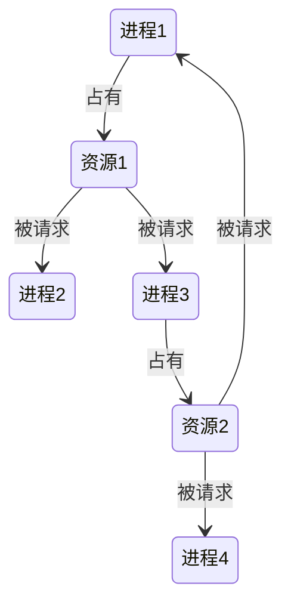

# 死锁

> 死锁是指两个或两个以上的进程在执行过程中，由于竞争资源或者由于彼此通信而造成的一种阻塞的现象，若无外力作用，它们都将无法推进下去。此时称系统处于死锁状态或系统产生了死锁，这些永远在互相等待的进程称为死锁进程。

- 静态顺序死锁
- 动态顺序死锁
- 资源死锁

## 资源

排他性使用的对象

- 可抢占资源
- 不可抢占起源

1）请求资源 2）使用资源 3）释放资源

### 资源获取

可能产生死锁的编码

```c
void fa(){
    down(r1);
    down(r2);
    up(r1);
    up(r2);
}

void fb(){
    down(r2);
    down(r1);
    up(r1);
    up(r2);
}
```

## 死锁简介

> 集合中的每一个进程都在等待只能由本集合中的其他进程才能引发的事件，那么该组进程是死锁的

资源死锁的条件：

- 互斥：每个资源要么已经分配给了一个进程，要么就是可用的
- 占有和等待：已经得到了某个资源的进程可以再请求新的资源
- 不可抢占：已经分配给一个进程的资源不能强制性地被抢占，它只能被占有它的进程显式地释放
- 环路等待：有两个或者两个以上的进程组成一条环路，该环路中的每个进程都在等待下一个进程所占有的资源

### 死锁建模



如果产生环路，则代表产生死锁

## 处理死锁的策略

- 忽略问题
- 检测并恢复
- 仔细分配资源
- 破坏引起死锁的四个必要条件

### 鸵鸟策略

解决死锁问题的代价很高，因此鸵鸟策略这种不采取任何措施的方案会获得更高的性能

### 死锁检测

#### 每种类型一个资源的死锁检测


方框代表资源，圆圈表示进程，资源指向进程表示该资源已经分配给该进程，进程指向资源表示进程请求获取该资源，这样当一个图中出现了环，就代表出现了死锁

可以通过检测有向图环路的算法，进行深度优先搜索，对访问过的节点进行标记，如果发现重复的节点，则代表出现了死锁

#### 每种类型多个资源的死锁检测


- E 向量：资源总量
- A 向量：资源剩余量
- C 矩阵：每个进程所拥有的资源数量，每一行都代表一个进程拥有资源的数量
- R 矩阵：每个进程请求的资源数量

进程 P1 和 P2 所请求的资源都得不到满足，只有进程 P3 可以，让 P3 执行，之后释放 P3 拥有的资源，此时 A = (2 2 2 0)。P2 可以执行，执行后释放 P2 拥有的资源，A = (4 2 2 1) 。P1 也可以执行。所有进程都可以顺利执行，没有死锁

### 死锁恢复

- 利用抢占恢复：将资源强制从某个进程拿出来 分配给其他进程
- 利用回滚恢复：重启到某个检查点，将资源分配给某个死锁进程
- 杀死进程恢复：杀死重启一个死锁里的进程以打破死锁，数据库事务就是通过这种方式

## 死锁避免

在程序运行时避免发生死锁

### 安全状态和不安全状态


第二列 Has 表示已拥有的资源数，第三列 Max 表示总共需要的资源数，Free 表示还有可以使用的资源数
从图 a 开始出发，先让 B 拥有所需的所有资源（图 b），运行结束后释放 B，此时 Free 变为 5（图 c）；接着以同样的方式运行 C 和 A，使得所有进程都能成功运行，因此可以称图 a 所示的状态时安全的
从安全状态出发，系统能保证所有进程都能完成

### 单个资源的银行家算法

判断对请求的满足是否会进入不安全状态，如果是，就拒绝请求；否则予以分配

### 多个资源的银行家算法


左边的图表示已经分配的资源，右边的图表示还需要分配的资源。最右边的 E、P 以及 A 分别表示：总资源、已分配资源以及可用资源，注意这三个为向量，而不是具体数值，例如 A=(1020)，表示 4 个资源分别还剩下 1/0/2/0。

检查一个状态是否安全的算法如下：

- 查找右边的矩阵是否存在一行小于等于向量 A。如果不存在这样的行，那么系统将会发生死锁，状态是不安全的。
- 假若找到这样一行，将该进程标记为终止，并将其已分配资源加到 A 中。
- 重复以上两步，直到所有进程都标记为终止，则状态时安全的。
- 如果一个状态不是安全的，需要拒绝进入这个状态。

### 策略

- 定时锁：获取锁时不陷入无限等待，从而能平缓重新启动计算，而非直接关闭整个进程
- 利用 JDK 的[线程转储](/编程语言/JAVA/JVM/自动内存管理/内存结构.md#分析线程执行情况)之类的工具分析死锁情况

## 死锁预防

在程序运行之前避免发生死锁

- 破坏互斥条件 使资源可以同时被多个进程共享
- 破坏占有和等待条件 规定进程在开始执行前请求所需要的资源
- 破坏不可抢占条件 一个进程使用某个资源时，这个资源可以被其他需要的进程抢夺
- 破坏环路等待 给资源进行编号，规定资源的获取顺序

条件    | 处理方式
----- | ----------
互斥    | 一切都使用假脱机技术
占有和等待 | 在开始就请求全部资源
不可抢占  | 抢占资源
环路等待  | 对资源按序编号

## 其他问题

### 两阶段加锁

通过对所有锁都使用相同的获取顺序，并执行统一的加锁策略来避免死锁

### 通信死锁

进程间协同同步造成相互之间的互相等待，引入超时机制可以解决

### 活锁

由于跟其他线程冲突，线程不断重复某个操作

引入随机回退可以有效地避免这个问题

### 响应性慢

资源不平衡造成的某些线程计算资源一直得不到满足

### 饥饿

无法获取到需要的资源
