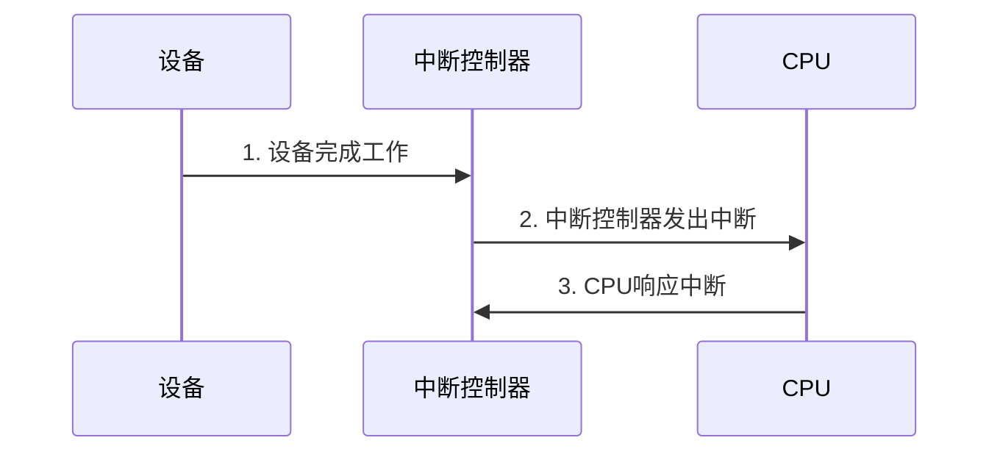
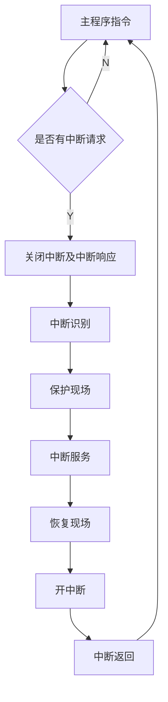

# 输入/输出

外部设备、接口部件、总线以及相应的管理软件统称为计算机的输入/输出系统，简称I/O系统

操作系统IO接口对于所有设备都应该是相同的，即设备无关性

## 基本功能

- 完成计算机内部二进制信息与外部多种信息形式间的交流
- 保证CPU能够正确选择输入输出设备并实现对其控制，传输大量数据、 避免数据出错
- 利用数据缓冲、选择合适的数据传送方式等，实现主机与外设间速度的匹配

## 特点

- 异步性：外围设备相对于处理机通常是异步工作的
- 实时性：当外围设备与处理机交互时，由于设备的类型不同，它们的工作步调是不同的，处理机必须按照不同设备所要求传送方式和传输速率不失时机地为设备提供服务，这就要求实时性控制
- 与设备无关性：各种外部设备必须根据其特点和要求选择一种标准接口和处理机进行连接，它们之间的差别必须由设备本身的控制器通过硬件和软件来填补；这样，处理机本身无须了解外设的具体细节，可以采用统一的硬件和软件对其管理

## 交换数据的过程

输入过程：

- CPU把一个地址值放在地址总线上，这一步将选择某一输入设备
- CPU等候输入设备的数据成为有效
- CPU从数据总线读入数据，并放在一个相应的寄存器中

输出过程：

- CPU把一个地址值放在地址总线上，选择输出设备
- CPU把数据放在数据总线上
- 输出设备认为数据有效，从而把数据取走

## 性能

按照主要完成的工作可以分为以下二类：

- 存储I/O
- 通信I/O

I/O系统的性能对CPU的性能有很大的影响，若两者的性能不匹配，I/O系统就有可能成为整个系统的瓶颈

### 评价参数

- 连接特性：哪些I/O设备可以和计算机系统相连接
- I/O系统的容量：I/O系统可以容纳的I/O设备数
- 响应时间：从用户输入命令开始，到得到结果所花费的时间，单位s
- 吞吐率：单位时间完成的I/O操作次数，单位IOP

## I/O 硬件管理

### I/O设备

- 块设备：以块为单位进行读写
- 字符设备：以字符为单位发送或接收字符流

### 设备控制器

IO设备由机械部件与电子部件构成 电子部件称为**设备控制器**或者**适配器**

**控制器的任务**： 将串行的比特流转换为字节块，并完成纠错工作

### 无条件IO

在程序的适当位置直接安排I/O指令，当程序执行到这些I/O指令时，CPU默认外设始终是准备就绪的（I/O总是准备好接收CPU的输出数据，或总是准备好向CPU输入数据），无需检查I/O的状态，就进行数据的传输；

硬件接口电路和软件控制程序都比较简单。输入时，必须确保CPU执行I/O指令读取数据时，外设已将数据准备好；输出时，必须确保外部设备的数据锁存器为空，即外设已将上次的数据取走，等待接收新的数据，否则会导致数据传送出错，但一般的外设难以满足这种要求

### 内存映射IO

控制器使用寄存器或者一块操作系统可以操作的RAM进行通信

给控制寄存器分配一个IO端口，所有IO端口形成IO端口空间吗，可以通过一条特殊的指令来来对控制寄存器进行读取或写入

```asm
IN REG, PORT ; CPU从指定IO端口读取数据到REG寄存器
OUT PORT, REG ; CPU写入数据
```

另外一种方式是将IO设备寄存器映射到内存上，对内存的读写都会通过总线信号映射到IO设备的寄存器。内存映射IO优点：

- 无需使用特殊指令读取IO设备寄存器，映射后能直接通过访问内存你的指令读写
- 不需要特殊保护机制阻止用户进程进行IO操作，操作系统只需要避免把映射的那块内存暴露在用户地址空间就能避免用户进程进行IO操作
- 可以应用于内存的指令也能应用于控制寄存器

缺点：

- 不能使用高速缓存，对IO映射内存做缓存的后果是灾难性的

计算机如何确定一个内存地址对应的是内存还是IO设备寄存器？现代的计算机大都包含高速内存总线，对内存的读写可以通过专用总线来进行，而对IO设备的读写则可以通过通用总线。

第二种设计是通过一个内存总线探查设备，该设备会对IO设备访问放行。

第三种设计则是对内存地址进行过滤，规定一个区域的地址为IO内存映射。

### 中断



**中断：** 是指CPU在正常运行程序时，由于内部/外部事件（或由程序）引起CPU中断正在运行的程序，而转到为中断事件服务的程序中去，服务完毕，再返回执行原程序的这一过程。中断具有 **随机性**

当设备发起一个中断信号，这个信号会被中断控制器芯片检测到。如果有设备同时发起中断，此时该设备中断不会被处理，不被处理的设备会不断发起信号，直至得到CPU的服务。

中断控制器在放置一个数字信号表明需要处理哪个设备，这个数字信号被称为**中断向量**，中断向量是一个服务过程的程序地址，CPU需要保存相关好相关信息，如PC，然后跳转到指定地址指向相应的服务过程。

中断的作用：

- 实现主机与外设之间的并行工作
- 故障处理
- 实时处理

由于现代CPU都会采用流水线技术，所以中断后一些指令执行了一部分，怎么确保这个状态是明确的


- **精确中断**：机器停留在一个明确状态的中断

  - 程序计数器保留在一个已知的地方
  - 所指向的指令之前的所有指令已执行完毕
  - 所执行的指令之后的所有指令都还未执行
  - 所指向的指令的执行状态是已知的

- **不精确中断**

#### 中断的类型

- 内部中断
  - 软件中断
  - 异常
    - 故障(Fault)
    - 陷阱(Trap)
    - 终止(Abort)
- 外部中断
  - 可屏蔽中断INTR：由外设通过中断请求线向处理器申请而产生的中断，处理器可以用指令来屏蔽（禁止），即不响应它的中断请求
  - 不可屏蔽中断NMI：由系统内部硬件引发的中断，优先级高于外部硬件中断，且不受中断允许标志位的影响，所以是不可屏蔽中断

#### 中断的基本功能

- 中断请求信号保持与清除


- 中断源识别

**中断号：** 是系统分配给每个中断源的代号，以便识别和处理。中断号在中断处理过程中起到很重要的作用。

- 中断控制

**中断触发方式：** 是指外设以什么逻辑信号去申请中断，即边沿触发和电平触发两种方式

**中断排队方式：** 当系统有多个中断源时，就可能出现同时有几个中断源都申请中断，而处理器在一个时刻只能响应并处理一个中断请求；为此，要进行中断排队。处理器按“优先级高的先服务”的原则提供服务

当CPU正在处理某个中断时，会出现优先级更高的中断源申请中断；为了使更紧急的、级别更高的中断源及时得到服务，需要暂时打断（挂起）当前正在执行的中断服务程序，去处理级别更高的中断请求，处理完成后再返回被打断了的中断服务程序继续执行

但级别相同或级别低的中断源不能打断级别高的中断服务，这就是所谓的中断嵌套

可屏蔽中断可以进行中断嵌套。NMI不可以进行中断嵌套

- 中断屏蔽

处理器用指令来控制中断屏蔽触发器的状态，从而控制是否接受某个特殊外设的中断请求

处理器内部也有一个中断允许触发器，只有当其为“1”（即开中断），CPU才能响应外部中断

- 中断优先级

指CPU响应和处理中断请求的先后次序

硬件响应优先序：未被屏蔽的几个中断源同时提出申请时，CPU选择服务对象的顺序由硬件电路实现，用户不能修改

软件服务优先序：在各中断服务程序开头，用软件设置自己的中断屏蔽字，以此改变实际服务顺序

- 中断的处理

当CPU收到外设的中断请求后，如果当前一条指令已执行完，且允许中断，CPU进入中断响应周期，发出中断应答信号完成一个中断响应周期

读取中断源的中断号，完成中断申请与中断响应的握手过程



## IO软件原理

### IO软件的目标

- 设备独立性：面向接口编程
- 统一命名：设备的命名映射为一个简单的字符串或数字，不依赖于设备
- 错误处理：低层能处理的问题，就不要交给高层
- 同步与异步：大多数物理IO是异步的，只是read系统调用后，进程被挂起直至数据到达，如果IO是同步的，用户程序编写器就会很容易
- 缓冲：数据通常不能直接从源传输到目的地，所以需要缓冲区

### 程序控制IO

让CPU做全部工作 程序控制IO伪代码:

```c
copy_from_user(buffer,p,count);
for(i = 0;i<count;i++){ // 循环写操作
    while (*p_regs != READY){ // 检查IO设备是否就绪
        *p_regd = p[i]; // 向IO设备写入数据
    }
}
return_to_user();
```

这是一种早期计算机采用的输入/输出方式，数据在计算机和外设之间的传送全部靠计算机程序控制；计算机执行I/O指令时，先获取外设状态，并根据外设的状态决定下一步操作


何时对何设备进行输入输出操作完全受CPU控制，外围设备与CPU处于异步工作关系，数据的输入/输出都要经过CPU

**优点：** 计算机和外设之间能够同步，控制简单，硬件简单。

**缺点：** 要占用CPU的大量时间用来查询外设的状态。

**设备状态字寄存器**：用来标志设备的工作状态，以便接口对外部设备进行监视

### 中断驱动IO

程序控制IO浪费的地方在于如果IO设备不就绪，CPU的时间就浪费在无谓的循环的上面了。

中断驱动IO改进的地方在于当IO设备就绪，由IO设备主动产生一个中断，CPU在中断之前可以去调度其他进程，CPU接到外设的通知后暂停现行的工作，转入中断服务程序，和外设交换数据，等中断程序处理完毕后，再返回到被中断的原程序中继续以前被暂停的工作

**优点：** 节约CPU时间，实时性好。

**缺点：** 控制电路相对复杂，服务开销较大（现场和断点的保护）。

**应用场合：** 实时性要求高，且数据传输量又不大的场合。

### 使用DMA的IO

是一种完全由硬件执行的I/O交换方式，让DMA控制数据传输，而不必打扰CPU。本质上还是程序控制IO，只不过使用了DMA后CPU可以每次写入一整个缓冲区的数据，加入一个中间层 从CPU-设备 变成 CPU - DMA - 设备


- 突发模式：DMA直接让设备获得总线发起一连串传送，然后再释放总线
  - 如果传送时间较长 有可能阻塞CPU或者其他设备
- 飞越模式： 让设备控制器将数据直接写到主存

当外设准备好后，通知DMA控制器，DMA控制器从CPU接管总线，并完成外设和内存之间的大量数据传输；传输完成后DMA控制器将总线控制权交还给CPU，整个数据交换的过程不需要CPU参与

**设备控制器内部缓存区存在的原因**

- 校验数据
- 总线可能忙

**优点：** 既有中断的优点，同时又降低了服务开销。

**缺点：** 控制电路更加复杂。

**应用场合：** 高速、大批量数据传输。

#### DMA控制器的两种工作状态

- 被动态（受控器）：未取得总线控制权，受CPU的控制
- 主动态（主控器）：接管并取得总线控制权，取代CPU而成为系统的主控者。

#### 传输步骤

申请阶段：一个设备接口试图通过总线直接向另一个设备发送数据(一般是大批量的数据)，它会先向CPU发送DMA请求信号

响应阶段：CPU收到DMA请求信号后，在当前的总线周期结束后，会按DMA信号的优先级和提出DMA请求的先后顺序响应DMA信号

数据传送阶段：CPU对某个设备接口响应DMA请求时，会让出总线控制权；于是在DMA控制器的管理下，外设和存储器直接进行数据交换，而不需CPU干预

传送结束阶段：数据传送完毕后，设备接口会向CPU发送DMA结束信号，交还总线控制权

#### 操作类型

数据传送：把源地址的数据传输到目的地址去（存储器或I/O）

数据校验：不进行数据传输，只对数据块内部的每个字节进行某种校验；这种数据校验一般安排在读数据块之后，以便校验所读的数据是否有效

数据检索：不进行数据传输，只是在指定的内存区域内查找某个关键字节或某几个数据位是否存在

#### 操作方式

- 单字节传输模式
- 块传输模式
- 请求参数模式
- 级联传输模式

### 零拷贝

对IO设备的读写，不将IO设备的数据先复制到内核空间，然后再复制到用户空间，以此获得更高的读写性能

这就是由 DMA 所完成的

#### 用户态直接IO

硬件上的数据直接拷贝至了用户空间，不经过内核空间


#### mmap+write

实现内核缓冲区与应用程序内存的共享，省去了将数据从内核读缓冲区（read buffer）拷贝到用户缓冲区（user buffer）的过程，然而内核读缓冲区（read buffer）仍需将数据到内核写缓冲区（socket buffer）


主要的用处是提高 I/O 性能，特别是针对大文件。对于小文件，内存映射文件反而会导致碎片空间的浪费

#### sendfile

```c
#include ssize_t sendfile(int out_fd, int in_fd, off_t *offset, size_t count);
```

简化通过网络在两个通道之间进行的数据传输过程。sendfile 系统调用的引入，不仅减少了 CPU 拷贝的次数，还减少了上下文切换的次数


sendfile 存在的问题是用户程序不能对数据进行修改

#### sendfile+ DMA gather copy

将内核空间（kernel space）的读缓冲区（read buffer）中对应的数据描述信息（内存地址、地址偏移量）记录到相应的网络缓冲区（ socket  buffer）中，由 DMA 根据内存地址、地址偏移量将数据批量地从读缓冲区（read buffer）拷贝到网卡设备中


同样也不能对数据进行修改

#### splice

```c
splice(fd_in, off_in, fd_out, off_out, len, flags);
```

跟sendfile很像


#### 写时复制

当多个进程共享同一块数据时，如果其中一个进程需要对这份数据进行修改，那么就需要将其拷贝到自己的进程地址空间中

#### 缓冲区共享

每个进程都维护着一个缓冲区池，这个缓冲区池能被同时映射到用户空间（user space）和内核态（kernel space），内核和用户共享这个缓冲区池，这样就避免了一系列的拷贝操作


### 通道和I/O处理机

在复杂的计算机系统中，外围设备的台数一般比较多，设备的种类、工作方式和工作速度的差别很大，为了把对外围设备的管理工作从CPU中分离出来，采用通道或I/O处理机方式

通道是能够专门执行I/O指令的处理机，它可以实现对外围设备的统一管理，以及外设与主存之间的数据传输

I/O处理机是通道方式的进一步发展，它的结构更接近于一般处理机。

## IO软件层次


### 中断处理程序

> 在响应一个特定中断的时候，内核会执行一个函数，该函数叫中断处理程序

隐藏中断的最好方式是将会引起中断的操作阻塞起来。但中断处理需要花费相当多的CPU指令。

### 设备驱动程序

> 每个链接到计算机上的IO设备都需要某些设备特定代码进行控制，称之为**设备驱动程序**

USB设备驱动通过堆栈式来达到不同的设备基于同样的技术效果。为了访问设备的硬件，大多数操作系统都要求驱动程序运行在内核中，这也是系统崩溃的一个源头之一。

**可重入性**：驱动必须意识到第一次调用完成之前第二次调用会到来

### 与设备无关的IO软件

- 设备驱动程序的统一接口

对于每种设备类型类型，操作系统定义一组驱动程序必须支持的函数，设备名可以使用设备类型+次版本号来编码，同样，对文件系统的保护规则也适用于设备。

- 缓冲


双缓冲：使用两个缓冲区交替使用，当一个满了之后直接复制到用户空间，另外一个接替上

环形缓冲：通过两个前后指针不断往前走实现一个逻辑上无限的缓冲区

- 错误报告

对于编程错误，如向一个输入设备发出了一个输出请求，操作系统直接返回错误码即可。

但对于实际的IO错误，应由驱动程序决定做什么，驱动程序解决不了，再向高层传递。但错误抛到高层，操作系统实际上除了返回一个错误码并失败外，并不存在其他多少事情可以做。

- 分配与释放专用设备

对于只允许有限数量进程使用的设备，操作系统必须对设备的使用请求进行检查，可以将得不到设备的进程调用失败掉。另外一种方式可以对得到设备的进程调用进行阻塞，而不是让其失败。

- 提供与设备无关的块大小

上层软件屏蔽掉不同设备的的块大小不一致

### 用户空间的IO软件

部分IO操作在用户空间完成，这是通过库过程来实现，也有通过假脱机的方式及守护进程的方式实现。

假脱机：IO设备通过一个文件来代表IO处理，用户进程直接处理这个文件来实现IO。

守护进程：用户进程通过将文件放置于某个目录下的，该目录称为假脱机目录，只有一个允许访问IO设备的进程，来读取这些文件进行操作，这个进程就是守护进程。


## 时钟

### 时钟硬件

可编程时钟：石英晶体每次震荡会将递减计数器，计数器到0时会触发一个中断，软件可以自定义这个计数器来实现对时钟的编程。


- 一次完成模式：中断发生后等待软件显式启动
- 方波模式：中断一次之后，又重新开始循环

### 时钟软件

- 维护日时间

通过时钟来维护现在的时间，为了防止32位内存溢出，可以使用64位计数器，但代价过高。也可使用以秒为单位。

- 防止进程超时运行

时钟的每次中断就将时间片-1，当时间片为0，就得重新调度程序。

- 对CPU使用情况进行记账

每次滴答对进程表项的某个域+1来实现记录进程运行时间。

- 处理alarm系统调用

进程可以请求操作系统在一定的时间间隔后向它报警。

一个物理时钟为了模拟出多个时钟，可以通过维护一张表，每次时间发生更新就查找是否达到表中所需要的时刻，如果达到了，就进行触发。然后继续重复这个步骤。

- 为系统各部分提供监视定时器

检测死机之类的问题。如果操作系统可以定时清除计数器，当某个时刻计数器超过某个阈值，就可以确定已经死机了，此时软件介入处理。

- 完成信息收集

### 软定时器

IO有两种方式：中断和轮询。

现代CPU的中断开销是很大的，但轮询的响应时间又会比较高。

所以为了达到一个取舍，可以使用一个软定时器定时中断来进行IO。

## 外设

### 输入软件

#### 键盘软件

- 原始模式：向用户提供原始的ASCII码序列
- 加工模式：由键盘驱动处理全部行内编辑，将编辑结果存储在缓冲区回车后写入

#### 鼠标软件

鼠标发送的消息包含：$\Delta$x $\Delta$y 按钮 ，通常为3字节

鼠标单击与双击则是由GUI来进行区分的

### 输出软件

- 文本窗口

为了控制终端进行文字输出，程序使用了一种被称为“转义序列”的东西来控制终端。

- X窗口系统
- 图形用户界面
- 位图
- 字体
- 触摸屏

## 瘦客户机

## 电源管理

有两种方法减少电量消耗：

1. 关闭不用的某些计算机硬件
2. 使应用程序耗能更低

### 硬件问题

- 操作系统问题

  - 显示器
  - 硬盘
  - CPU
  - 内存
  - 无线通信
  - 热量管理
  - 电源管理
  - 驱动程序接口

- 应用程序问题

## 网络IO

