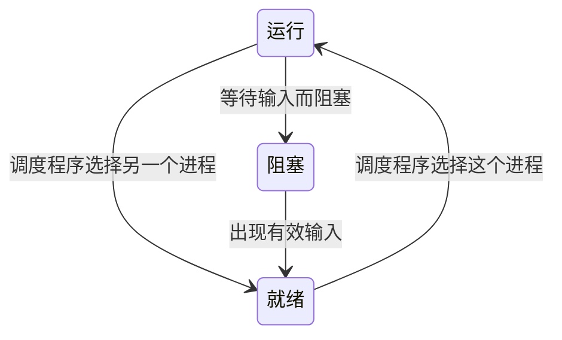

# 进程与线程

## 进程

进程是资源分配的基本单位，在某一个瞬间，一个物理CPU核心只能运行一个进程。

### 进程模型

计算机上所有可运行的软件，通常包括操作系统，被组织成若干**顺序进程**，称为**进程**


程序与进程的关系：模板与实例

### 进程的创建

导致进程创建的4种主要事件：

- 系统初始化
- 系统调用
- 用户请求创建
- 批处理作业初始化

**守护进程**：停留在后台的线程

写时复制：UNIX中fork出来的子进程的内存是父进程的一个拷贝，为了避免不必要的开销，操作系统通过让二者共用一份物理内存，当内存发生变化时，才进行复制。

### 进程的终止

终止的条件：

- 正常退出（自愿）
- 出错退出（自愿）
- 严重错误（非自愿）
- 被其他进程杀死（非自愿）

### 进程的层次结构

UNIX中，进程创建一个新进程后，该进程称为其的父进程，它与它的所有后代组成一个**进程组**。 但在Windows中，进程之间没有层次关系，除了父进程在创建子进程时，会获得其的句柄，除此之外，没有任何联系。

### 进程的状态

- 运行态（正在占用CPU）
- 就绪态（可运行，但还没有运行）
- 阻塞态（正在等待外部事件，如IO读取）



这些状态很像线程

**调度程序**：负责切换进程的执行

### 进程的实现

为实现进程模型，操作系统维护一张表：**进程表**，每个进程维护如下的一些字段

进程管理      | 存储管理  | 文件管理
--------- | ----- | -----
寄存器       | 正文段指针 | 根目录
程序计数器     | 数据段指针 | 工作目录
程序状态字     | 堆栈段指针 | 文件描述符
堆栈指针      |       | 用户ID
进程状态      |       | 组ID
优先级       |       |
调度参数      |       |
进程ID      |       |
父进程       |       |
进程组       |       |
信号        |       |
进程开始时间    |       |
使用的CPU时间  |       |
子进程的CPU时间 |       |
下次定时器时间   |       |

操作系统通过进程表每个进程的状态，当中断发生（IO发送数据），一个称为**中断向量**的位置：中断服务程序的入口地，就会执行一段中断程序，中断完成后回来继续该进程:

1. 硬件压入堆栈程序计数器等。
2. 硬件从中断向量装人新的程序计数器。
3. 汇编语言过程保存寄存器值。
4. 汇编语言过程设置新的堆栈。
5. C中断服务例程运行(典型地读和缓冲输入)。
6. 调度程序决定下一个将运行的进程。
7. C过程返回至汇编代码。
8. 汇编语言过程开始运行新的当前进程。

### 多道程序设计模型

CPU利用率 = 1-P^n

n称为**多道程序设计的道数** P为CPU空转的概率

## 线程

线程是独立调度的基本单位


### 线程的使用

使用线程的理由：

- 更好描述程序的行为
- 线程比进程更轻量
- IO密集型时提高性能

如果不使用多线程，在程序中手动维护多个多个工作的状态，是一种称为**有限状态机**的技术，这种方式其实知识一种以更加困难的方式来模拟线程以及堆栈

> 每个计算机都有一个被保存的状态，存在一个会发生且使得相关状态发生改变的事件集合

### 经典的线程模型

**每个线程都有自己的栈**：每个线程会调用不同的过程，所以需要维护自己的栈

每个进程中的内容  | 每个线程中的内容
--------- | --------
地址空间      | 程序计数器
全局变量      | 寄存器
打开文件      | 栈
子进程       | 状态
即将发生的定时器  |
信号与信号处理程序 |
账户信息      |

一些常见的线程调用：

- join
- yeild
- exit
- sleep

线程给程序设计带来了更多的复杂性，父子进程之间线程是否可共享？

### POSIX线程

一种线程标准，定义的线程包叫做**pthread**

### 在用户空间中实现线程

#### 优点

- 快
- 可以定制自己的调度算法

#### 局限性

- 如何实现阻塞系统调用
- 只能使用协调式线程调度，也就是由线程自身让出时间片，而非由调度程序强制调度

### 在内核中实现线程

创建代价很大，所以需要考虑线程的回收复用

### 混合实现

部分线程由内核实现，这些线程会给用户级线程多路复用

### 调度程序激活机制

_上行调用_

### 弹出线程

一个消息的到达导致系统创建一个处理该消息的线程

### 使单线程代码多线程化

- 全局变量的问题：多线程导致变量被重复写，从而导致部分线程写入的信息丢失
- 不可重入：某些库会有线程安全问题
- 线程的最大栈应该是多少：像在[JVM中每个线程栈的大小](/编程语言/JAVA/JVM/运行参数.md#-X参数)都是写死在参数里，不像单线程应用栈不够加就够了，内核只有知道线程的存在时，才能给线程加栈的容量

## 进程与线程的区别

- 线程不拥有资源，线程只能访问隶属进程的资源
- 在同一进程中，线程的切换不会引起进程切换，从一个进程中的线程切换到另一个进程中的线程时，会引起进程切换
- 创建进程的开销比创建线程大
  - 如创建撤销进程需要分配或回收资源，如内存空间、I/O 设备
  - 进行进程切换时，涉及当前执行进程 CPU 环境的保存及新调度进程 CPU 环境的设置，而线程切换时只需保存和设置少量寄存器内容

## 进程间通信

- 进程之间传递信息
- 进程之间的活动不会出现交叉
- 进程之间运行的顺序

### 竞争条件

> 两个或多个进程读写某些共享数据，得到的结果取决于进程运行的精确时序

### 临界区

> 通过**互斥**来组织多个进程同时读写共享数据 把对共享内存进行访问的程序片段称为临界区

- 任何两个进程不能同时处于临界区
- 不对CPU的速度和数量做假设
- 临界区外运行的进程不能阻塞其他进程
- 不能使进程无限等待进入临界区


### 同步与互斥

- 同步：多个进程因为合作产生的直接制约关系，使得进程有一定的先后执行关系。
- 互斥：多个进程在同一时刻只有一个进程能进入临界区

### 忙等待的互斥

- 屏蔽中断：进程进入临界区后屏蔽所有中断，这样系统就无法切换到其他进程了
- 锁变量：使用一个标志位代表临界区当前是否被某个进程占有
- 严格轮换法： 连续测试一个变量直到某个值出现为止，称为**忙等待**，其实就是一个[自旋锁](/编程语言/JAVA/JAVA并发编程/JAVA并发编程.md#自旋锁与自适应自旋)
- TSL 指令 调用enter() -> 忙等待，直到获得锁 -> 进入临界区 -> 调用leave()
- Peterson解法：在用户级实现TSL指令

### 睡眠与唤醒

从**生产者-消费者问题**中发现消费者与生产者之间需要一系列的睡眠-唤醒操作

### 信号量

信号量（Semaphore）是一个整型变量，可以对其进行原子操作，并且可以用来实现同步。

- down：如果信号量大于 0 ，执行 -1 操作；如果信号量等于 0，进程睡眠，等待信号量大于 0
- up ：对信号量执行 +1 操作，唤醒睡眠的进程让其完成 down 操作

#### 互斥量

信号量的一个简化版本，值只能取0或者1

- 快速用户区互斥量futex：混合使用用户态自旋锁以及内核等待队列，类似[锁升级](/编程语言/JAVA/JVM/自动内存管理/内存结构.md#对象内存布局)
- pthread中的互斥量 **条件变量**

### 管程

一个管程由过程、变量、数据结构等组合成的一个集合，是一种编程语言概念

```pascal
monitor ProducerConsumer
    integer i;
    condition c;

    procedure insert();
    begin
        // ...
    end;

    procedure remove();
    begin
        // ...
    end;
end monitor;
```

管程的原语确定：在一个时刻只能有一个进程使用管程，管程被JAVA中的[synchronized](/编程语言/JAVA/JAVA并发编程/基础概念.md#synchronized)所实现了

进程可以在任何时候通过管程间接获取数据，但是不能直接获取数据

### 消息传递

```c
send(目的,&msg);
receive(源,&msg);
```

用消息传递解决生产者-消费者问题 **消息传递接口**

这种接口是建立在计算机网络、互斥量、同步等上的一个高级接口

### 屏障

当一个进程到达屏障时，就会被阻拦，直到所有进程都到达屏障为止，[CyclicBarrier](/编程语言/JAVA/JAVA并发编程/并发工具类.md#CyclicBarrier（栅栏）)


### 避免锁：读-复制-更新（RCU）

最快所的就是没有锁

要么读取旧版本，要么读取新版本

## 调度

**调度程序使用调度算法完成调度**

进程的行为分为IO活动与CPU计算，也就是IO密集型和计算密集型


何时进行调度：

- 运行一个新进程后
- 一个进程退出后
- 一个进程阻塞后
- IO中断

### 调度算法

调度算法分为两种：

- **非抢占式**：直到一个进程阻塞或者主动释放CPU
- **抢占式**：运行一段时间，后调度程序进行调度挑选下一个运行的进程

在对响应时间有要求的情况下，抢占式是很有必要，这能保证计算资源不会一直被某个进程占着

#### 目标

- 所有系统中
  - 公平：给每个进程公平的CPU份额
  - 策略强制执行：保证规定的策略被执行
  - 平衡：保持系统的所有部分都忙碌
- 批处理系统中
  - 吞吐量：每小时最大作业数
  - 周转时间：从提交到终止间的最小时间
  - CPU利用率：保持CPU始终忙碌
- 交互式系统中
  - 响应时间：快速响应请求
  - 均衡性：满足用户的期望
- 实时系统中
  - 满足截止时间：避免丢失数据
  - 可预测性：在多媒体系统中避免品质降低

#### 批处理系统

在该系统中，调度算法目标是保证吞吐量和周转时间

- 先来先服务 first-come first-serverd（FCFS）


有个问题就是对段任务不够公平，时间片会大量被长任务进程所占用

- 短作业优先 shortest job first（SJF）


可能导致长任务一直得到不到执行，产生饥饿

- 最短剩余时间优先 shortest remaining time next（SRTN）

和 SJF 差不多，但是放回队列的时候按照作业剩余时间排序，优先调度剩余完成时间最短的任务


#### 交互式系统

在该系统中调度算法的目标是快速地进行响应

- 时间片轮转

每次调度时，把 CPU 时间分配给队首进程，该进程可以执行一个时间片。当时间片用完时，由计时器发出时钟中断，调度程序便停止该进程的执行，并将它送往就绪队列的末尾，同时继续把 CPU 时间分配给队首的进程，该算法效率与时间片大小有关，时间片过于小，会造成进程切换频繁，过大实时性无法得到保证

- 优先级调度

为每个进程分配一个优先级，按优先级进行调度
为了防止低优先级的进程永远等不到调度，可以随着时间的推移增加等待进程的优先级

- 多级反馈队列

它设置了多个队列，每个队列时间片大小都不同，例如 1,2,4,8,..。进程在第一个队列没执行完，就会被移到下一个队列，在这种情况下，就能有效避免一个进程需要执行连续多个时间片而造成的切换频繁问题


- 最短进程优先：利用历史的进程调度数据判断进程可能的执行时间，从而让预测最短的进程优先执行
- 公平分享保证调度：若是多用户系统，则保证每个用户CPU计算能力的1/n
- 彩票调度：每次需要调度时，随机挑选进程进行调度，但是每个进程被选中的概率是根据优先级计算出来的，优先级越高，越有可能被挑中

#### 实时系统

- **硬实时**：必须满足一定的截止时间
- **软实时**：可以容忍一定的超时

静态的调度算法在系统运行之前就已确定好如何调度，结果肯定是可预测的

动态的调度算法则运行时完成

### 策略和机制

使用[策略模式](/软件工程/设计模式/行为模式.md#策略模式)分离调度机制与调度策略

### 线程调度

- 用户级调度：操作系统调度选择进程后，内部线程如何调度则由进程决定
- 内核级调度：由内核直接调度线程，这种方式问题在于线程切换成本比在用户级高

## 经典进程同步问题

### 哲学家就餐问题

五个哲学家围着一张圆桌，每个哲学家面前放着食物。哲学家的生活有两种交替活动：吃饭以及思考。当一个哲学家吃饭时，需要先拿起自己左右两边的两根筷子，并且一次只能拿起一根筷子


一种解法是哲学家发现与其他人冲突时，放弃操作，等待随机的一段时间，这种方式很有效，在[以太网](/计算机网络/链路层.md#以太网)中有二进制指数回退，在[raft协议](/软件工程/架构/系统设计/分布式/分布式共识算法.md#Raft)中有随机的竞选超时时间

### 读者-写者问题

允许多个进程同时对数据进行读操作，但是不允许读和写以及写和写操作同时发生 这一般需要两把锁来完成，也就是通过[读写锁](/编程语言/JAVA/JAVA并发编程/并发工具类.md#ReentrantReadWriteLock)

## 进程通信

- 进程同步：控制多个进程按一定顺序执行；
- 进程通信：进程间传输信息

为了能够达到进程同步的目的，需要让进程进行通信

### 管道

- 只支持半双工
- 只支持父子进程或者兄弟进程


### FIFO(命名管道)


有名管道以磁盘文件的方式存在，可以实现本机任意两个进程通信

### 消息队列

- 消息队列可以独立于读写进程存在，从而避免了 FIFO 中同步管道的打开和关闭时可能产生的困难
- 避免了 FIFO 的同步阻塞问题，不需要进程自己提供同步方法
- 读进程可以根据消息类型有选择地接收消息，而不像 FIFO 那样只能默认地接收

### 信号量

用于为多个进程提供共享对象的访问

### 共享存储

多个进程可以使用一个给定的存储区进行通信

可以使用文件或者内存

### 套接字

用于不同机器之间的进程通信