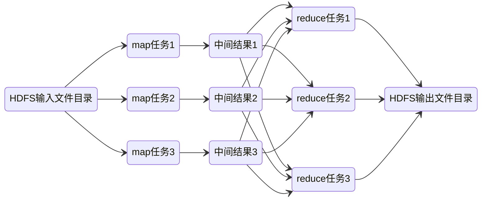

# Hadoop

Hadoop是一个由Apache基金会所开发的分布式系统基础架构

Hadoop通常是指一个更广泛的概念——Hadoop生态圈.

三大发行版本：

1. Apaache：基础版本
2. CDH
3. CDP

高可靠 高扩展 高效 高容错

## 发展历史

Lucene -> Nutch -> Haddop

## 组成


### HDFS

1. NameNode（nn）：存储文件的元数据，如文件名，文件目录结构，文件属性（生成时间、副本数、文件权限），以及每个文件的块列表和块所在的DataNode等，负责执行有关 文件系统命名空间 的操作，例如打开，关闭、重命名文件和目录等
2. DataNode(dn)：在本地文件系统存储文件块数据，以及块数据的校验和，负责提供来自文件系统客户端的读写请求，执行块的创建，删除等操作
3. Secondary NameNode(2nn)：每隔一段时间对NameNode元数据备份


HDFS将文件分成一系列块，通过多副本分布在不同节点的方式来进行容错


HDFS的高可用设计：

1. 数据存储故障容错：每块DataNode的数据都有校验和，如果读取时发现校验和对应不上，就到其他 DataNode 上读取备份数据
2. 磁盘故障容错：如果 DataNode 监测到本机的某块磁盘损坏，则通知 NameNode 将对应的数据块复制到其他服务器上
3. DataNode 故障容错：如果 NameNode 发现已经无法与某台 DataNode 联系，则必须将这台失联的 DataNode 的数据进行复制
4. NameNode 高可用：利用 Zookeeper 进行选举，主从热备

### YARN


1. ResourceManager: 在独立的机器上以后台进程的形式运行，负责给用户提交的所有应用程序分配资源, 根据规则制定分配策略，调度集群资源
2. NodeManager：每个具体节点的管理者。主要负责该节点内所有容器的生命周期的管理，监视资源和跟踪节点健康
3. ApplicationMaster：负责协调来自 ResourceManager 的资源，并通过 NodeManager 监视容器内资源的使用情况，同时还负责任务的监控与容错
4. Container：YARN 中的资源抽象，它封装了某个节点上内存、CPU、磁盘、网络等资源，YARN 会为每个任务分配一个 Container


### MapReduce

分任务 计算任务 汇总任务



输出的结果：

- 搜索索引
- 键值对

这些map与reduce任务进程都是由一个master进程来控制

容错：

1. 首先避免将任务分发到失效的进程上去，当某个任务进程中途崩溃，由于任务是无状态的，所以可以安全重试
2. 周期性的把 master 相关的状态信息保存到磁盘中，形成一个个检查点。如果 master 任务失败了，我们就从最近的一个检查点恢复当时的执行状态，全部重新执行，这是一种比较简单的设计

shuffle：上面输出中间结果，输入中间结果的地方，也就是将不同服务器上map出来的相关数据合并到一起进行下一步的reduce计算

作业启动和运行机制：

1. 大数据应用进程：启动 MapReduce 程序的主入口，主要是指定 Map 和 Reduce 类、输入输出文件路径等，并提交作业给 Hadoop 集群
2. JobTracker 进程：根据要处理的输入数据量命令 TaskTracker 进程启动相应数量的 Map 和 Reduce 进程任务，并管理整个作业生命周期的任务调度和监控
3. TaskTracker 进程：负责启动和管理 Map 进程以及 Reduce 进程，通常和 HDFS 的 DataNode 进程启动在同一个服务器


## 安装

<https://github.com/big-data-europe/docker-hadoop>

测试集群：

```sh
adoop fs -mkdir /test # 创建文件夹
```
